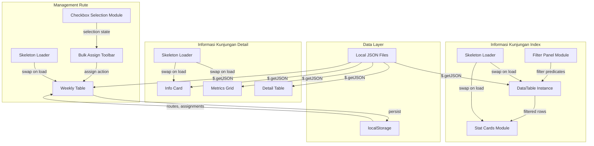

# Design Document: Kunjungan UI Enhancements

## Overview

This design covers three UI enhancement areas for the Falcon FPRS Kunjungan module prototype:

1. **Enhanced Filtering** — Extend the Informasi Kunjungan index page filter panel with Area/Region, Divisi, Status Kunjungan, and Date Range filters, including a toggle mechanism, reset action, and dynamic stat card updates.
2. **Bulk Route Assignment** — Add checkbox-based employee selection to the Management Rute weekly table with a floating toolbar for assigning routes to multiple employees simultaneously.
3. **Skeleton Loading Placeholders** — Implement consistent animated shimmer placeholders across Informasi Kunjungan (index + detail) and Management Rute pages during data fetch.

All enhancements are implemented as vanilla JavaScript/jQuery within static HTML files. No build tools or bundlers are introduced. Data is loaded from local JSON files and persisted to localStorage where applicable.

## Architecture



### Key Design Decisions

| Decision | Rationale |
|----------|-----------|
| jQuery-based filtering (not DataTables `search()` for all columns) | DataTables column search uses regex/string match; our filters require structured predicates (date range, relational lookups). Use `$.fn.dataTable.ext.search` custom filter functions. |
| localStorage for bulk assignment persistence | Consistent with existing route storage pattern (`fprs_weekly_assignments` key). No server-side needed for prototype. |
| Single CSS `@keyframes` definition in shared `<style>` block per page | No shared CSS file exists; each page is self-contained. Define identical keyframes in each page to maintain the no-build-tool constraint. |
| Skeleton elements in static HTML, hidden/shown via JS | Simpler than dynamic DOM generation. Skeletons are placed in markup, shown immediately, then swapped out when data arrives. |
| Filter composition via AND logic in a single custom search function | Cleaner than stacking multiple DataTables column searches; gives full control over predicate evaluation order. |

## Components and Interfaces

### 1. Filter Panel Module (Informasi Index)

**Location:** `Views/FPRS/Kunjungan/Informasi/index.html`

**HTML Structure Addition:**
```html
<!-- Inside .filter-panel, additional row below existing controls -->
<div class="row g-3 mt-2" id="advancedFilterRow">
    <div class="col-md-4">
        <label class="form-label small">Area/Region</label>
        <select class="form-select form-select-sm" id="filterArea">
            <option value="">Semua Area</option>
            <!-- Populated from pegawai employee codes / naming convention -->
        </select>
    </div>
    <div class="col-md-4">
        <label class="form-label small">Divisi</label>
        <select class="form-select form-select-sm" id="filterDivisi">
            <option value="">Semua Divisi</option>
            <!-- Populated from divisi.json -->
        </select>
    </div>
    <div class="col-md-4">
        <label class="form-label small">Status Kunjungan</label>
        <select class="form-select form-select-sm" id="filterStatus">
            <option value="">Semua</option>
            <option value="sudah">Sudah Check-out</option>
            <option value="belum">Belum Check-out</option>
        </select>
    </div>
    <div class="col-md-4">
        <label class="form-label small">Dari</label>
        <input type="date" class="form-control form-control-sm" id="filterDateStart"/>
    </div>
    <div class="col-md-4">
        <label class="form-label small">Sampai</label>
        <input type="date" class="form-control form-control-sm" id="filterDateEnd"/>
    </div>
</div>
<div id="dateValidationError" class="text-danger small mt-1" style="display:none;"></div>
```

**JavaScript Interface:**

```javascript
// Filter state object
const filterState = {
    name: '',        // text input
    month: '',       // select
    area: '',        // select
    divisi: '',      // select
    status: '',      // select: '' | 'sudah' | 'belum'
    dateStart: '',   // date string 'YYYY-MM-DD'
    dateEnd: ''      // date string 'YYYY-MM-DD'
};

// Core filter function registered with DataTables
$.fn.dataTable.ext.search.push(function(settings, data, dataIndex, rowData) {
    // Returns true if row passes ALL active filter predicates
});

// Public functions
function applyFilters()         // Reads UI, validates, triggers DataTable.draw()
function resetFilters()         // Clears all inputs, resets filterState, redraws
function updateStatCards(rows)  // Recalculates stat aggregates from visible rows
function populateFilterDropdowns(salesData, pegawaiData, divisiData)
function validateDateRange()    // Returns {valid: boolean, error: string}
```

### 2. Stat Cards Computation

**Interface:**

```javascript
function computeStats(visibleRows) {
    // visibleRows: array of {visited: number, invoice: number}
    return {
        totalKunjungan: visibleRows.length,
        totalOutlet: sum(visibleRows.map(r => r.visited)),
        totalPenjualan: sum(visibleRows.map(r => r.invoice)),
        rataRata: visibleRows.length > 0
            ? totalPenjualan / totalKunjungan
            : 0
    };
}
```

### 3. Bulk Assign Module (Management Rute)

**Location:** `Views/FPRS/Kunjungan/Rute/index.html`

**HTML Additions:**

```html
<!-- Checkbox column added to weekly table header -->
<th style="width: 40px; text-align: center;">
    <input type="checkbox" id="selectAllWeekly" aria-label="Select all employees"/>
</th>

<!-- Bulk Assign Toolbar (fixed at bottom) -->
<div id="bulkAssignToolbar" class="bulk-assign-toolbar" style="display:none;">
    <span id="bulkCount">0 pegawai dipilih</span>
    <select id="bulkRouteSelect" class="form-select form-select-sm">
        <option value="">Pilih Rute...</option>
    </select>
    <button class="btn btn-success btn-sm" id="btnBulkAssign">Assign</button>
    <button class="btn btn-outline-secondary btn-sm" id="btnBulkCancel">Batal</button>
</div>
```

**JavaScript Interface:**

```javascript
// State
let selectedEmployees = new Set(); // Set of employee IDs
let activeWeekTab = 'week1';

// Functions
function toggleEmployeeSelection(employeeId, checked)
function updateSelectAllState()       // Checks/unchecks/indeterminate header checkbox
function showBulkToolbar()            // Shows toolbar with count
function hideBulkToolbar()            // Hides toolbar, transition 200ms
function populateBulkRouteDropdown()  // Reads routes from localStorage
function applyBulkAssignment(routeId) // Sets route for all selected employees
function clearAllSelections()         // Deselects all, hides toolbar
function persistWeeklyAssignment(weekTab, assignments) // Saves to localStorage
```

### 4. Skeleton Loader Module

**Shared Pattern (per-page implementation):**

```javascript
// Skeleton management functions (identical pattern on each page)
function showSkeletons()   // Shows skeleton elements, hides real content containers
function hideSkeletons()   // Hides skeletons, shows real content (single repaint via rAF)
function showLoadError(message, retryFn) // Removes skeletons, shows error UI
```

**CSS (identical `@keyframes` on each page):**

```css
@keyframes shimmer {
    0% { background-position: -200% 0; }
    100% { background-position: 200% 0; }
}

.skeleton {
    background: #e9ecef;
    background-image: linear-gradient(90deg, #e9ecef 25%, #f8f9fa 50%, #e9ecef 75%);
    background-size: 200% 100%;
    animation: shimmer 1.5s ease-in-out infinite;
    pointer-events: none;
    cursor: default;
}

.skeleton-stat-card { border-radius: 10px; height: 78px; }
.skeleton-table-row { border-radius: 4px; height: 44px; margin-bottom: 4px; }
.skeleton-metric-cell { border-radius: 8px; height: 48px; }
.skeleton-route-card { border-radius: 4px; height: 52px; margin-bottom: 8px; }
```

## Data Models

### Visit List Row (from `sales_data_by_date.json`)

```typescript
interface VisitRow {
    dateKey: string;       // "2026-06-01"
    dateDisplay: string;   // "01-06-2026"
    id: string;            // salesman ID e.g. "106201"
    name: string;          // "JKT-ANCOL (BUDI)"
    visited: number;       // count of visits
    startTime: string;     // "07:16:00"
    endTime: string;       // "10:47:00" or "" for Belum Check-out
    invoice: number;       // total invoice amount
    // Derived/enriched:
    area: string;          // extracted from salesman name prefix or pegawai region code
    divisi: string;        // from pegawai.json lookup by salesman ID
}
```

### Pegawai (from `pegawai.json`)

```typescript
interface Pegawai {
    id: number;
    kode: string;        // "EMP-260500040" or "REGION 3 SR"
    nama: string;        // "JAMBI"
    posisi: string;      // "Motoris", "Salesman", "SPG"
    divisi: string;      // "Sales" or ""
    status: string;      // "Active" | "Inactive"
    // ... other fields
}
```

### Weekly Assignment (localStorage: `fprs_weekly_assignments`)

```typescript
interface WeeklyAssignments {
    [weekTab: string]: {
        [employeeId: string]: {
            routeId: string;       // assigned route ID
            days: {                // per-day route assignments
                senin: string;
                selasa: string;
                rabu: string;
                kamis: string;
                jumat: string;
                sabtu: string;
                minggu: string;
            }
        }
    }
}
```

### Route (localStorage: `fprs_route_planning_list`)

```typescript
interface Route {
    id: string;
    name: string;
    createdAt: string;  // ISO timestamp
}
```

### Filter State

```typescript
interface FilterState {
    name: string;
    month: string;      // "2026-06" or ""
    area: string;       // area value or ""
    divisi: string;     // division name or ""
    status: string;     // "" | "sudah" | "belum"
    dateStart: string;  // "YYYY-MM-DD" or ""
    dateEnd: string;    // "YYYY-MM-DD" or ""
}
```

### Stat Card Computation

```typescript
interface StatCardValues {
    totalKunjungan: number;     // count of filtered rows
    totalOutlet: string;        // "{n} outlet"
    totalPenjualan: string;     // "Rp {formatted}"
    rataRata: string;           // "Rp {formatted}"
}
```

## Correctness Properties

*A property is a characteristic or behavior that should hold true across all valid executions of a system — essentially, a formal statement about what the system should do. Properties serve as the bridge between human-readable specifications and machine-verifiable correctness guarantees.*

### Property 1: Filter option extraction produces sorted unique values

*For any* array of data objects containing a categorical field (area or divisi), extracting the distinct values and presenting them as dropdown options SHALL produce a list that is alphabetically sorted and contains no duplicate entries.

**Validates: Requirements 2.1, 3.1**

### Property 2: Area filter predicate correctness

*For any* visit dataset and any selected area value, applying the area filter SHALL produce a result set where every row's area field exactly matches the selected value, and no row with a different area value is included.

**Validates: Requirements 2.2**

### Property 3: Divisi filter predicate correctness

*For any* visit dataset and any selected division value, applying the divisi filter SHALL produce a result set where every row's associated salesman belongs to the selected division.

**Validates: Requirements 3.2**

### Property 4: Status filter predicate correctness

*For any* visit dataset, applying the "Sudah Check-out" filter SHALL produce only rows with non-empty endTime, and applying the "Belum Check-out" filter SHALL produce only rows with empty or null endTime.

**Validates: Requirements 4.2, 4.3**

### Property 5: Date range filter predicate correctness

*For any* visit dataset and any valid date range (start ≤ end), applying the date range filter SHALL produce only rows whose dateKey is greater than or equal to start AND less than or equal to end (inclusive bounds).

**Validates: Requirements 5.2**

### Property 6: Date range validation rejects invalid input

*For any* pair of date values where start date is strictly after end date, the validation function SHALL return invalid and prevent filter application. *For any* single date value where exactly one of start/end is specified and the other is empty, the validation function SHALL return invalid.

**Validates: Requirements 5.3, 5.5**

### Property 7: Filter AND composition

*For any* visit dataset and any combination of active filters (area, divisi, status, date range, name, month), every row in the filtered result SHALL satisfy ALL active filter predicates simultaneously, and selecting a filter's default/empty value SHALL exclude that filter from evaluation (no-op).

**Validates: Requirements 4.5, 2.3, 3.3, 4.4, 5.4**

### Property 8: Filter reset restores full unfiltered state

*For any* filter state (any combination of non-default filter values), executing the reset action SHALL clear all filter inputs to their default values, AND the DataTable SHALL display all records from the original dataset, AND stat card values SHALL match the aggregates of the full dataset.

**Validates: Requirements 6.1, 6.2, 6.3, 7.2**

### Property 9: Stat card computation correctness

*For any* array of visible visit rows, the stat card values SHALL be computed as: Total Kunjungan = count of rows, Total Outlet Dikunjungi = sum of visited counts, Total Penjualan = sum of invoice amounts, Rata-rata / Kunjungan = Total Penjualan ÷ Total Kunjungan (or 0 if count is 0).

**Validates: Requirements 7.1, 7.3**

### Property 10: Select All toggles all visible employee rows

*For any* set of visible employee rows in the weekly table, checking the "Select All" checkbox SHALL set the checked state of all visible row checkboxes to true, and unchecking SHALL set them all to false.

**Validates: Requirements 8.2**

### Property 11: Bulk toolbar count reflects visible selected employees

*For any* combination of employee checkbox states and visibility (determined by search filter), the bulk assign toolbar SHALL display a count equal to the number of employees that are BOTH checked AND currently visible.

**Validates: Requirements 8.3, 8.5**

### Property 12: Bulk assignment applies chosen route to all selected employees

*For any* non-empty set of selected employees and any chosen route from the dropdown, executing the bulk assign action SHALL set the "Rute Mingguan" value for every selected employee to the chosen route, persist the assignments to localStorage, and display a toast notification containing the exact count of updated employees.

**Validates: Requirements 9.2, 9.3, 9.4**

### Property 13: Bulk assignment is scoped to active week tab only

*For any* week tab (Minggu 1–4), executing a bulk assignment SHALL modify route values only for employees in the active week tab, leaving all other week tabs' localStorage data unchanged. Switching week tabs SHALL clear all selections and hide the toolbar.

**Validates: Requirements 10.1, 10.2, 10.3**

### Property 14: Skeleton elements have consistent styling and accessibility attributes

*For any* skeleton placeholder element on any page (Informasi index, Informasi detail, Management Rute), the element SHALL have: background color #e9ecef with shimmer gradient #f8f9fa, animation duration of 1.5s with ease-in-out timing and infinite repetition, no pointer-events, `aria-label="Loading"`, and `role="status"`.

**Validates: Requirements 14.1, 14.3, 14.4, 14.5**

## Error Handling

| Scenario | Handling | User Feedback |
|----------|----------|---------------|
| JSON fetch failure (Informasi index) | Remove skeleton placeholders, show error card | "Data kunjungan tidak dapat dimuat" with retry suggestion |
| JSON fetch failure (Detail page) | Remove skeletons after 10s timeout | "Data detail tidak dapat dimuat" error message |
| JSON fetch failure (Rute page) | Remove skeletons after 10s timeout | Inline error with "Coba Lagi" retry button |
| Date range validation (start > end) | Prevent filter application | Inline red text: "Tanggal mulai harus sebelum tanggal selesai" |
| Date range validation (one field empty) | Prevent filter application | Inline red text: "Kedua tanggal harus diisi" |
| Bulk assign without route selected | Prevent assignment, show toast | SweetAlert2 error toast: "Pilih rute terlebih dahulu" |
| Empty route list in localStorage | Disable dropdown | Placeholder: "Tidak ada rute tersedia" (disabled state) |
| Zero filter results | Show empty DataTable state | DataTables "Tidak ada data kunjungan ditemukan" + stat cards show zeros |

## Testing Strategy

### Unit Tests (Example-based)

Unit tests cover specific UI behaviors, edge cases, and DOM structure assertions:

- Filter panel hidden by default on page load (Req 1.1)
- Filter button triggers slideToggle with 300ms (Req 1.2)
- Filter panel retains values when toggled off/on (Req 1.4)
- Status dropdown has exactly 3 options with "Semua" default (Req 4.1)
- Date inputs rendered as type="date" (Req 5.1)
- Select All indeterminate state when partial selection exists (Req 8.6)
- Bulk assign deselects all after execution (Req 9.5)
- Validation error on Assign without route (Req 9.6)
- Disabled dropdown when no routes in localStorage (Req 9.7)
- Empty area data shows only placeholder (Req 2.4, 3.4)
- Skeleton DOM structure matches layout (Req 11.1–11.5, 12.1–12.5, 13.1–13.5)
- Skeleton border-radius per type (Req 14.2)
- Zero results shows zero stat cards (Req 7.3)

### Property-Based Tests

Property-based testing is applicable here for the pure filtering logic, stat computation, and bulk assignment operations. The core logic (filter predicates, stat aggregation, selection state management) operates on data arrays with clear input/output behavior and benefits from testing across many generated inputs.

**Library:** [fast-check](https://github.com/dubzzz/fast-check) (JavaScript PBT library)

**Configuration:**
- Minimum 100 iterations per property test
- Each test tagged with: `Feature: kunjungan-ui-enhancements, Property {N}: {title}`

**Properties to implement:**
1. Filter option extraction (sorted unique)
2. Area filter predicate
3. Divisi filter predicate
4. Status filter predicate
5. Date range filter predicate
6. Date range validation
7. Filter AND composition
8. Filter reset restores full state
9. Stat card computation
10. Select All toggles visible rows
11. Bulk toolbar count
12. Bulk assign applies route
13. Bulk assign scoped to active week
14. Skeleton consistency (CSS + accessibility attributes)

### Integration Tests

- End-to-end filter flow: apply filter → verify table rows → verify stat cards → reset → verify restoration
- Bulk assign flow: select employees → choose route → assign → verify localStorage → verify UI reset
- Skeleton lifecycle: page load → skeletons visible → data loads → skeletons replaced → content visible
- Cross-tab isolation: assign in Week 1 → switch to Week 2 → verify Week 1 data unchanged
