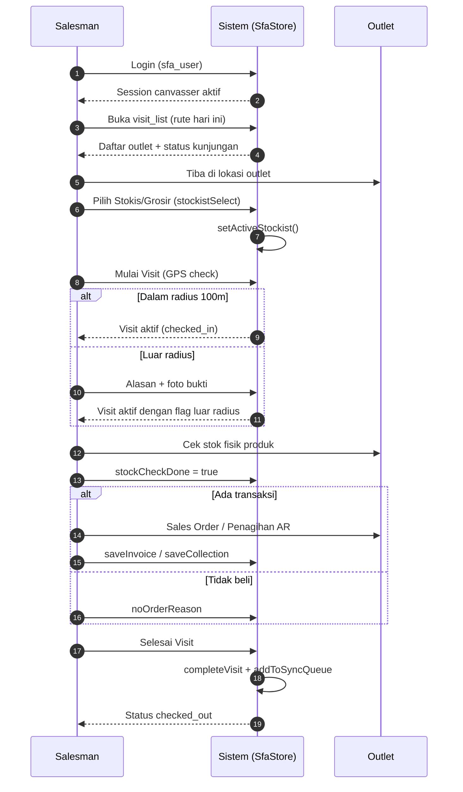
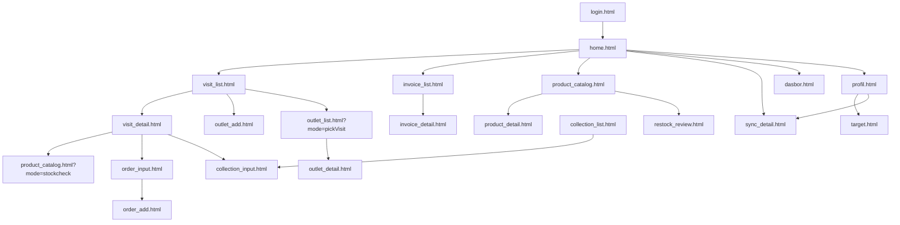
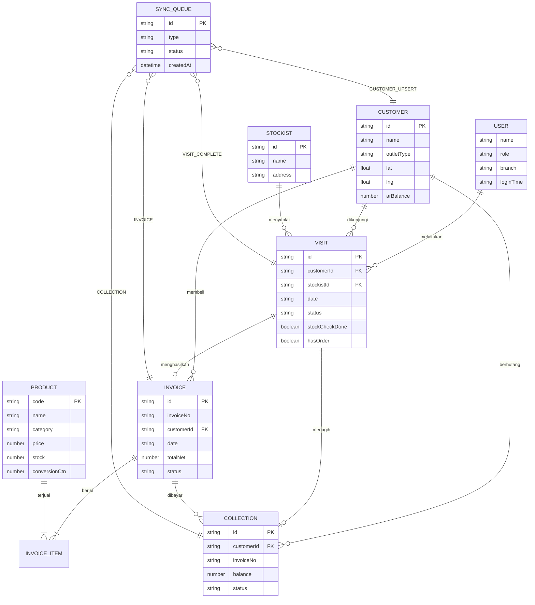

# FUNCTIONAL SPECIFICATION DOCUMENT (FSD)
## Modul: Mobile SFA Falcon FPRS (Field Partner Relation System)
### Sistem: Falcon FPRS
### Versi Dokumen: 1.0

---

| Atribut | Keterangan |
|---------|------------|
| **Nama Dokumen** | FSD Mobile SFA Falcon FPRS |
| **Versi** | 1.0 |
| **Tanggal** | 7 Juli 2026 |
| **Divisi** | ICT / Business – Falcon FPRS |
| **Status** | Draft |
| **Dibuat oleh** | Tim ICT – Falcon FPRS |
| **Sumber Kebenaran** | `Views/Mobile/*.html`, `wwwroot/js/sfa-store.js`, `wwwroot/css/mobile.css` |

---

## Riwayat Revisi

| Versi | Tanggal | Diubah Oleh | Keterangan |
|---------|-------------|-------------|------------|
| **1.0** | **7 Juli 2026** | **Tim ICT** | Initial draft – Mobile SFA prototipe (Views/Mobile, 20 halaman) |

---

## 1. Pendahuluan

### 1.1 Latar Belakang

**Falcon FPRS** (*Field Partner Relation System*) adalah sistem internal PT Kalbe Nutritionals untuk administrasi penjualan lapangan, kunjungan outlet, dan pelacakan kinerja sales. Prototipe **Mobile SFA** di `Views/Mobile/` mensimulasikan aplikasi Android sales lapangan berbasis web responsif dengan tema visual Falcon Mobile (Genoa Green `#005D41`, Atlantis Green `#78B500`).

Alur bisnis utama mengacu pada dekompilasi aplikasi **SimpliDOTS SFA**, sedangkan identitas visual, logo, dan ikon SVG mengadopsi **Falcon Mobile**. Lapisan data menggunakan `SfaStore` (`wwwroot/js/sfa-store.js`) yang mensimulasikan database SQLite offline melalui `localStorage`.

### 1.2 Tujuan Dokumen

1. Mendeskripsikan fungsionalitas **per halaman dan per komponen UI** Mobile SFA Falcon FPRS.
2. Menjadi acuan pengembangan backend/API mobile dan UAT lapangan.
3. Mendokumentasikan business rules (BR-Mxx), pola CRUD, swimlane alur kunjungan, dan ERD entitas data.
4. Menyelaraskan format dokumentasi dengan standar **FSD Generator Engine** (Kalbe Nutritionals).

### 1.3 Ruang Lingkup

| Dalam lingkup | Di luar lingkup |
|---------------|-----------------|
| Mobile SFA `Views/Mobile/` (20 halaman HTML) | Web Admin `Views/FPRS/` (Dashboard, Master Data, Penjualan Admin, Kunjungan Admin) |
| Data layer `sfa-store.js` + seed `localStorage` | Modul legacy `wwwroot/areas/` |
| Desain sistem `wwwroot/css/mobile.css` | Implementasi produksi backend final / integrasi ERP penuh |
| Build APK via `build-apk.bat` (Flutter WebView wrapper) | Manajemen user SSO produksi Kalbe |
| Data wilayah `wwwroot/data/wilayah-jakarta.json` | Modul web portal Vuexy (`layout.js`) |

### 1.4 Stakeholder

| Peran | Tim/Divisi | Keterlibatan |
|-------|------------|--------------|
| Canvasser / Salesman | Sales Lapangan | Kunjungan, order, penagihan AR |
| Supervisor Sales | Sales | Monitoring KPI & target |
| Admin Master Data | ICT / Operations | Validasi data outlet & produk |
| Developer Mobile | ICT | Implementasi API & APK produksi |
| Business Analyst | PDV / Sales | Validasi alur bisnis & UAT |

### 1.5 Daftar Halaman (20 Modul UI)

| No | Berkas | Modul |
|----|--------|-------|
| 1 | `login.html` | Autentikasi |
| 2 | `home.html` | Beranda SFA |
| 3 | `dasbor.html` | Dasbor performa |
| 4 | `profil.html` | Profil canvasser |
| 5 | `target.html` | Target KPI |
| 6 | `visit_list.html` | Daftar rute kunjungan |
| 7 | `visit_detail.html` | Detail kunjungan outlet |
| 8 | `order_input.html` | Sales order (katalog dalam visit) |
| 9 | `order_add.html` | Input transaksi penjualan mandiri |
| 10 | `invoice_list.html` | Daftar faktur |
| 11 | `invoice_detail.html` | Detail faktur |
| 12 | `collection_list.html` | Daftar piutang AR |
| 13 | `collection_input.html` | Input pembayaran AR |
| 14 | `outlet_list.html` | Daftar outlet / geo tag |
| 15 | `outlet_detail.html` | Detail outlet |
| 16 | `outlet_add.html` | Registrasi outlet baru |
| 17 | `product_catalog.html` | Katalog produk / cek stok |
| 18 | `product_detail.html` | Detail produk |
| 19 | `restock_review.html` | Review kulakan stokis |
| 20 | `sync_detail.html` | Antrean sinkronisasi |

---

## 2. Arsitektur Mobile

### 2.1 Ringkasan Teknis

| Aspek | Standar |
|-------|---------|
| Arsitektur | Static MPA — satu `.html` per layar mobile |
| Container UI | `.mobile-wrapper` max-width 450px, centered desktop / fullscreen device |
| CSS Framework | Custom `mobile.css` — Bootstrap utility classes selektif |
| JavaScript | jQuery 3.7, SweetAlert2, Chart.js (dasbor), Leaflet (peta outlet) |
| State / Data | `localStorage` via `SfaStore` (`sfa-store.js`) |
| Seed Data | Auto-refresh harian key `sfa_seeded_v9_today` |
| Branding | Genoa Green `#005D41`, Atlantis `#78B500`, Mint BG `#F1F7E5` |
| Font | Kalbe Geometric (fallback system sans-serif) |
| APK Build | Flutter WebView → `build-apk.bat` → `app-release.apk` |
| Bottom Nav | 3 tab: Dasbor, Beranda, Profil (halaman shell) |

### 2.2 Struktur Berkas

```text
Prototype/
├── Views/Mobile/           # 20 halaman UI (sumber kebenaran)
├── wwwroot/
│   ├── css/mobile.css      # Desain sistem global
│   ├── js/sfa-store.js     # Data layer & business logic
│   ├── data/wilayah-jakarta.json
│   └── assets/images/      # Gambar outlet & ikon
├── build-apk.bat           # Build APK release
└── docs/mobile/            # Dokumentasi pendukung
```

### 2.3 Swimlane — Alur Kunjungan Harian

Tabel swimlane berikut mendefinisikan peran (*lane*) sebelum diagram Mermaid.

| Lane | Peran | Tanggung Jawab dalam Alur Visit |
|------|-------|----------------------------------|
| **L1** | Salesman (Canvasser) | Login, pilih rute, pilih stokis, mulai visit, cek stok, input order/AR/alasan tidak beli, selesai visit |
| **L2** | Sistem (SfaStore) | Validasi GPS radius, single active visit, persistensi visit/invoice/collection, antrean sync |
| **L3** | Outlet (Pelanggan) | Menerima kunjungan, transaksi order, pembayaran piutang, verifikasi stok fisik |



### 2.4 Diagram Navigasi Utama



---

## 3. Login & Shell

Bab ini mencakup halaman autentikasi, beranda, dasbor analitik, profil canvasser, target KPI, dan komponen bottom navigation bersama.

### 3.1 Modul Login (`login.html`)

Halaman login merupakan pintu masuk aplikasi Mobile SFA. Pengguna memasukkan kredensial canvasser; sistem memvalidasi input tidak kosong, menampilkan animasi loading, lalu menyimpan session ke `localStorage` key `sfa_user` (nama, peran, cabang, waktu login) sebelum mengarahkan ke `home.html`. Kredensial demo: `SINGARAJA` / `canvasser`.

| Aspek | Keterangan |
|-------|------------|
| **Tujuan Form** | Memverifikasi identitas canvasser sebelum mengakses aplikasi SFA; membuat session lokal (`sfa_user`) sebagai prasyarat seluruh modul lapangan. |
| **Pengguna** | Canvasser / Salesman lapangan (role `canvasser`). |

**Tampilan 01 Login:**


#### Tabel Field — Login

| Field Name | ID Elemen | Tipe | Mandatory | Default | Validasi | Keterangan |
|------------|-----------|------|-----------|---------|----------|------------|
| Form Login | `loginForm` | form | Ya | - | onsubmit handler | Container form autentikasi |
| Username | `usernameInput` | text | Ya | SINGARAJA | required, tidak kosong | autocomplete username |
| Password | `passwordInput` | password | Ya | - | required, tidak kosong | autocomplete current-password |
| Grup Username | `userGroup` | div | - | - | shake jika kosong | Wrapper input + ikon |
| Grup Password | `passGroup` | div | - | - | shake jika kosong | Wrapper input + toggle |
| Toggle Password | `togglePasswordIcon` | icon | Tidak | fa-eye | toggle type password | Show/hide password |
| Tombol Login | `loginBtn` | button | Ya | - | disabled saat loading | Submit form |
| Teks Tombol | `loginBtnText` | span | - | Login | - | Label tombol |
| Spinner Loading | `loginSpinner` | div | - | d-none | tampil saat proses | Bootstrap spinner |

#### Tabel Business Rules — Login

| ID | Aturan | Keterangan |
|----|--------|------------|
| BR-M01 | Input wajib terisi | Username dan password tidak boleh kosong; kolom bergetar (shake) jika gagal |
| BR-M02 | Session persisten | Data user disimpan ke `sfa_user` via `SfaStore.saveUser()` |
| BR-M03 | Redirect pasca-login | Setelah loading ~1.5 detik, redirect ke `home.html` |

#### Tabel CRUD — Login

| Operasi | Entitas | Method/API | Persistensi |
|---------|---------|------------|-------------|
| Create | Session User | `SfaStore.saveUser()` | `sfa_user` |
| Read | Session User | `SfaStore.getUser()` | `sfa_user` |
| Delete | Session User | `SfaStore.clearUser()` | Hapus `sfa_user` (logout) |

---

### 3.2 Modul Beranda (`home.html`)

Beranda SFA menampilkan sapaan dinamis, banner **Periode Penjualan** bulan berjalan (`SfaStore.getActiveSalesPeriod()`), KPI performa hari ini (K. Efektif, Kunjungan, Total Faktur, progress target kunjungan), tombol **Rute Kunjungan Hari Ini**, accordion sinkronisasi data, dan 4 menu utama (Cek Stok, Faktur, Visit, Sinkronisasi). Bottom navigation 3 tab aktif di halaman ini.

| Aspek | Keterangan |
|-------|------------|
| **Tujuan Form** | Menjadi pusat aktivitas harian: ringkasan KPI hari ini, akses cepat ke rute kunjungan, faktur, cek stok, dan status sinkronisasi data offline. |
| **Pengguna** | Canvasser / Salesman — layar utama setelah login. |

**Tampilan 02 Home:**


#### Tabel Field — Header & KPI

| Field Name | ID Elemen | Tipe | Mandatory | Default | Validasi | Keterangan |
|------------|-----------|------|-----------|---------|----------|------------|
| Konten Utama | `mainContent` | main | - | - | - | Area scrollable |
| Tanggal Hari Ini | `todayDate` | div | - | Memuat tanggal... | locale id-ID | Format: Senin, 7 Juli 2026 |
| Sapaan | `greeting` | div | - | Selamat datang, | Dinamis per jam | Pagi/Siang/Sore/Malam |
| Nama User | `userName` | div | - | SINGARAJA | dari sfa_user | Uppercase |
| Peran User | `userRole` | strong | - | canvasser | dari sfa_user | Role canvasser |
| Label Periode | `salesPeriodLabel` | div | - | - | getActiveSalesPeriod | Rentang bulan aktif |
| Judul KPI | `kpiHeading` | h2 | - | Performa Hari Ini | - | Section heading |
| K. Efektif | `kpiEfektif` | span | - | 0 | getTodayKpi | Kunjungan dengan order |
| Kunjungan | `kpiKunjungan` | span | - | 0 | getTodayKpi | Visit selesai hari ini |
| Total Faktur | `kpiTotalFaktur` | span | - | Rp0 | formatRupiah | Nilai faktur hari ini |
| Progress Count | `kpiProgressCount` | strong | - | 0/0 | done/target | Target kunjungan |
| Progress Pct | `kpiProgressPct` | span | - | (0%) | kalkulasi | Persentase capaian |
| Progress Bar | `kpiProgressBar` | div | - | - | role=progressbar | Container bar |
| Progress Fill | `kpiProgressFill` | div | - | width 0% | CSS width | Isian progress |

#### Tabel Field — Sinkronisasi & Menu

| Field Name | ID Elemen | Tipe | Mandatory | Default | Validasi | Keterangan |
|------------|-----------|------|-----------|---------|----------|------------|
| Timestamp Sync | `syncTimestamp` | span | - | Belum pernah | localStorage | Waktu sync terakhir |
| Tombol Accordion | `syncAccordionBtn` | button | - | - | aria-expanded | Toggle panel sync |
| Ikon Sync | `syncIcon` | i | - | - | rotate saat sync | Font Awesome sync |
| Panel Detail Sync | `syncDetailsPanel` | div | - | collapsed | - | Data Master, Pelanggan, Offline |
| Badge Offline | `offlineCount` | span | - | 0 Pending | getSyncQueue | Jumlah antrean |
| Section Menu | `main-menu` | section | - | - | - | 4 menu lingkaran |
| Judul Menu | `menuHeading` | h2 | - | Menu Utama | - | Section heading |

#### Tabel Business Rules — Beranda

| ID | Aturan | Keterangan |
|----|--------|------------|
| BR-M04 | Periode penjualan dinamis | Label bulan aktif dari `getActiveSalesPeriod()`, bukan periode kanvas |
| BR-M05 | KPI real-time lokal | Angka KPI dihitung dari `getTodayKpi()` berdasarkan visit & invoice hari ini |
| BR-M06 | Menu 4 item stakeholder | Cek Stok, Faktur Penjualan, Visit, Sinkronisasi Data |

#### Tabel CRUD — Beranda

| Operasi | Entitas | Method/API | Keterangan |
|---------|---------|------------|------------|
| Read | KPI Hari Ini | `SfaStore.getTodayKpi()` | Aggregate visit + invoice |
| Read | Periode Aktif | `SfaStore.getActiveSalesPeriod()` | Bulan kalender |
| Read | Antrean Sync | `SfaStore.getSyncQueue()` | Badge pending count |
| Update | Proses Sync | `SfaStore.processQueue()` | Dari accordion sync |

---

### 3.3 Modul Dasbor (`dasbor.html`)

Dasbor menampilkan analitik performa sales dengan filter periode (Hari/Minggu/Bulan), pager tanggal, kartu statistik (Pelanggan, Faktur, Kunjungan, Efektif, Total Faktur, Total Pembayaran), grafik Chart.js, dan tabel top pelanggan/produk. Terhubung ke bottom navigation tab Dasbor.

| Aspek | Keterangan |
|-------|------------|
| **Tujuan Form** | Menampilkan analitik performa penjualan dan kunjungan (chart, progress target) untuk evaluasi pencapaian periode berjalan. |
| **Pengguna** | Canvasser (monitoring diri), Supervisor Sales (review saat coaching). |

**Tampilan 03 Dasbor:**


#### Tabel Field — Dasbor

| Field Name | ID Elemen | Tipe | Mandatory | Default | Validasi | Keterangan |
|------------|-----------|------|-----------|---------|----------|------------|
| Tanggal | `todayDate` | div | - | - | locale id-ID | Header tanggal |
| Nama User | `userName` | div | - | SINGARAJA | sfa_user | Header username |
| Peran | `userRole` | strong | - | canvasser | sfa_user | Role text |
| Timestamp Update | `updateTimestamp` | span | - | - | real-time | Terakhir diperbarui |
| Filter Periode | `periodSelect` | select | - | Hari | onchange | Hari/Minggu/Bulan |
| Pager Text | `pagerText` | span | - | - | navigasi tanggal | Label periode aktif |
| Val Pelanggan | `valPelanggan` | span | - | 0 | getCustomers count | Jumlah outlet |
| Val Faktur | `valFaktur` | span | - | 0 | invoice count | Jumlah faktur |
| Val Kunjungan | `valKunjungan` | span | - | 0 | visit done | Kunjungan selesai |
| Val Efektif | `valEfektif` | span | - | 0 | visit+order | K. efektif |
| Val Total Faktur | `valTotalFaktur` | span | - | Rp0 | formatRupiah | Nilai rupiah |
| Val Pembayaran | `valTotalPembayaran` | span | - | Rp0 | collection sum | Total AR dibayar |
| Chart Faktur | `fakturChart` | canvas | - | - | Chart.js | Grafik penjualan |
| Chart Pembayaran | `pembayaranChart` | canvas | - | - | Chart.js | Grafik AR |
| Tabel Top Customer | `tableTopCustomers` | tbody | - | - | dynamic rows | 5 teratas |
| Tabel Top Produk | `tableTopProducts` | tbody | - | - | dynamic rows | 5 teratas |

#### Tabel CRUD — Dasbor

| Operasi | Entitas | Method/API | Keterangan |
|---------|---------|------------|------------|
| Read | KPI per Tanggal | `getKpiByDate()` | Filter harian |
| Read | KPI per Minggu | `getKpiByWeek()` | ISO week |
| Read | KPI per Bulan | `getKpiByMonth()` | Prefix YYYY-MM |
| Read | Chart Harian | `getDailyChartData(14)` | 14 hari terakhir |
| Read | Top Produk | `getTopProductsByPeriod()` | Ranking amount |
| Read | Top Pelanggan | `getTopCustomersByPeriod()` | Ranking amount |

---

### 3.4 Modul Profil (`profil.html`)

Halaman profil menampilkan avatar inisial, informasi akun canvasser (username, role, cabang, waktu login), periode penjualan aktif, capaian kunjungan hari ini, status antrean sinkronisasi, informasi teknis prototipe, Developer Tools (Sync Queue, Reset Data), dan tombol logout.

| Aspek | Keterangan |
|-------|------------|
| **Tujuan Form** | Menampilkan identitas pengguna, cabang, dan menu pendukung (target, logout, sync) serta pintasan ke pengaturan akun. |
| **Pengguna** | Canvasser / Salesman. |

**Tampilan 04 Profil:**


#### Tabel Field — Profil

| Field Name | ID Elemen | Tipe | Mandatory | Default | Validasi | Keterangan |
|------------|-----------|------|-----------|---------|----------|------------|
| Avatar | `avatarCircle` | div | - | Inisial | huruf pertama nama | Lingkaran avatar |
| Nama Profil | `profileName` | div | - | SINGARAJA | sfa_user | Display name |
| Cabang | `profileBranch` | div | - | - | sfa_user.branch | Cabang kerja |
| Role Badge | `profileRole` | div | - | canvasser | sfa_user.role | Badge peran |
| Username | `infoUsername` | span | - | - | readonly | Info akun |
| Role Info | `infoRole` | span | - | - | readonly | Detail role |
| Cabang Info | `infoBranch` | span | - | - | readonly | Detail cabang |
| Waktu Login | `infoLoginTime` | span | - | - | ISO format | Session start |
| Periode Sales | `infoSalesPeriod` | span | - | - | getActiveSalesPeriod | Bulan aktif |
| Target Visit | `infoTargetVisit` | span | - | - | KPI target | Target harian |
| Visit Hari Ini | `infoTodayVisit` | span | - | - | getTodayKpi | Realisasi |
| Dot Sync Queue | `syncQueueDot` | div | - | orange | status warna | Indikator pending |
| Badge Sync | `syncQueueBadge` | span | - | 0 Pending | queue length | Jumlah antrean |
| Terakhir Sync | `infoLastSync` | span | - | - | localStorage | Timestamp sync |

#### Tabel Business Rules — Profil

| ID | Aturan | Keterangan |
|----|--------|------------|
| BR-M07 | Dev Tools reset | `SfaStore.resetAndReseed()` menghapus semua key localStorage lalu seed ulang |
| BR-M08 | Logout | `clearUser()` + redirect ke login.html |

---

### 3.5 Modul Target KPI (`target.html`)

Dashboard target menampilkan progress visual (bar) untuk target kunjungan, effective call (efektif/kunjungan), dan nilai penjualan bulanan, beserta bar chart harian, daftar top produk, dan top pelanggan periode aktif.

| Aspek | Keterangan |
|-------|------------|
| **Tujuan Form** | Menyajikan target KPI yang ditetapkan (kunjungan, omzet, efektivitas) agar sales dapat memantau gap terhadap goal periode. |
| **Pengguna** | Canvasser, Supervisor Sales (penetapan & review target). |

**Tampilan 05 Target:**


#### Tabel Field — Target

| Field Name | ID Elemen | Tipe | Mandatory | Default | Validasi | Keterangan |
|------------|-----------|------|-----------|---------|----------|------------|
| Tanggal Target | `targetDate` | div | - | - | bulan aktif | Label periode |
| Visit Actual | `visitActual` | b | - | 0 | KPI bulan | Realisasi kunjungan |
| Visit Target | `visitTarget` | b | - | 0 | seed target | Target kunjungan |
| Visit Pct | `visitPct` | div | - | 0% | kalkulasi | Persentase |
| Visit Bar | `visitBar` | div | - | width 0% | progress fill | Bar ungu |
| Efektif Actual | `efektifActual` | b | - | 0 | KPI | EC realisasi |
| Efektif Base | `efektifBase` | b | - | 0 | kunjungan | Basis perhitungan |
| Efektif Pct | `efektifPct` | div | - | 0% | - | Persentase EC |
| Efektif Bar | `efektifBar` | div | - | width 0% | - | Bar hijau |
| Sales Actual | `salesActual` | b | - | Rp0 | formatRupiah | Nilai penjualan |
| Sales Target | `salesTarget` | b | - | Rp0 | formatRupiah | Target rupiah |
| Sales Pct | `salesPct` | div | - | 0% | - | Persentase sales |
| Sales Bar | `salesBar` | div | - | width 0% | - | Bar oranye |
| Bar Chart | `barChart` | div | - | - | CSS bars | Grafik harian |
| Top Produk List | `topProductsList` | div | - | - | dynamic | Ranking produk |
| Top Customer List | `topCustomersList` | div | - | - | dynamic | Ranking outlet |

---

### 3.6 Komponen Bottom Navigation (Shell)

Bottom navigation adalah komponen shell bersama pada halaman `home.html`, `dasbor.html`, `profil.html`, dan `target.html`. Terdiri dari 3 tab tanpa ID elemen individual — menggunakan class `mobile-nav-item` dengan link ke `dasbor.html`, `home.html`, dan `profil.html`. Tab aktif ditandai class `active` dan `aria-current="page"`.

| Aspek | Keterangan |
|-------|------------|
| **Tujuan Form** | Menyediakan navigasi shell persisten antar tiga area utama aplikasi: Dasbor, Beranda, dan Profil. |
| **Pengguna** | Canvasser — komponen UI global di halaman shell. |

**Tampilan 06 Bottom Nav:**


#### Tabel Field — Bottom Navigation

| Field Name | ID Elemen | Tipe | Mandatory | Default | Validasi | Keterangan |
|------------|-----------|------|-----------|---------|----------|------------|
| Nav Container | - | nav.mobile-nav | - | - | aria-label | Tidak memiliki id |
| Tab Dasbor | - | a.mobile-nav-item | - | dasbor.html | - | Ikon grid + label |
| Tab Beranda | - | a.mobile-nav-item | - | home.html | active di home | Ikon rumah |
| Tab Profil | - | a.mobile-nav-item | - | profil.html | - | Ikon user |

#### Tabel Business Rules — Shell Navigation

| ID | Aturan | Keterangan |
|----|--------|------------|
| BR-M09 | 3 tab tetap | Dasbor, Beranda, Profil — tidak ada tab tambahan |
| BR-M10 | Padding konten | `.mobile-content` padding-bottom 70px untuk ruang nav |

---

## 4. Kunjungan

Bab ini mendeskripsikan modul rute kunjungan harian dan detail aktivitas visit di outlet, termasuk validasi GPS, pemilihan stokis, cek stok wajib, dan penyelesaian visit.

### 4.1 Daftar Rute Kunjungan (`visit_list.html`)

Halaman daftar rute kunjungan menampilkan outlet rute hari ini dengan filter status (Semua, Belum Kunjungan, Selesai), pencarian nama/kode outlet, counter jumlah outlet, dan FAB speed dial untuk **Tambah Kunjungan** (pick outlet luar rute) serta **Tambah Outlet Baru**. Seed demo v9: 2 outlet selesai, sisanya belum dikunjungi.

| Aspek | Keterangan |
|-------|------------|
| **Tujuan Form** | Menampilkan daftar outlet/rute kunjungan hari ini beserta status (belum/sedang/selesai) sebagai starting point eksekusi visit. |
| **Pengguna** | Canvasser / Salesman. |

**Tampilan 07 Visit List:**


#### Tabel Field — Visit List

| Field Name | ID Elemen | Tipe | Mandatory | Default | Validasi | Keterangan |
|------------|-----------|------|-----------|---------|----------|------------|
| Search Bar Container | `searchBar` | div | Tidak | d-none | toggle search | Muncul saat klik ikon search |
| Search Input | `searchInput` | text | Tidak | - | oninput renderList | Cari nama/kode outlet |
| Chip Semua | `chipAll` | div | - | active | setStatusFilter all | Filter semua status |
| Chip Belum | `chipUnvisited` | div | - | - | filter unvisited | Belum kunjungan |
| Chip Selesai | `chipVisited` | div | - | - | filter visited | Status selesai |
| Visit Count | `visitCount` | strong | - | 0 | dynamic count | Jumlah outlet tampil |
| List Container | `visitListContainer` | div | - | - | dynamic cards | Kartu per outlet |
| FAB Backdrop | `fabBackdrop` | div | - | d-none | onclick close | Overlay speed dial |
| FAB Menu | `fabMenu` | div | - | - | - | Opsi tambah |
| FAB Main | `fabMain` | button | - | - | toggleFab | Tombol + utama |

#### Tabel Business Rules — Visit List

| ID | Aturan | Keterangan |
|----|--------|------------|
| BR-M11 | Rute hari ini | `TODAY_ROUTE_IDS` = 5 outlet; 2 pertama seed status selesai |
| BR-M12 | Status visit | `checked_in` = Sedang Visit; `checked_out` = Selesai; lainnya = Belum |
| BR-M13 | Auto-refresh seed | Key `sfa_seeded_v9_today` regenerate saat tanggal berubah |

#### Tabel CRUD — Visit List

| Operasi | Entitas | Method/API | Keterangan |
|---------|---------|------------|------------|
| Read | Visits Hari Ini | `getVisits()` filter date | Daftar rute |
| Read | Visit per Customer | `getTodayVisitByCustomerId()` | Status per outlet |
| Create | Visit Baru | via visit_detail | saveVisit() |

---

### 4.2 Detail Kunjungan Outlet (`visit_detail.html`)

Halaman detail kunjungan menampilkan peta mini outlet vs posisi salesman, informasi outlet, pemilihan **Stokis/Grosir** wajib, tombol **Mulai Visit** dengan validasi GPS radius 100 meter, aktivitas visit (Cek Stok, Sales Order, Penagihan AR, Tidak Beli, Selesai Visit), dan ringkasan setelah visit selesai. Modal alasan check-in (luar radius) dan modal alasan tidak beli tersedia.

| Aspek | Keterangan |
|-------|------------|
| **Tujuan Form** | Mengelola siklus kunjungan tunggal: pilih stokis, check-in GPS, cek stok, input order/AR, alasan tidak beli, hingga check-out dan antrean sync. |
| **Pengguna** | Canvasser / Salesman di lokasi outlet. |

**Tampilan 08 Visit Detail:**


#### Tabel Field — Header & Info Outlet

| Field Name | ID Elemen | Tipe | Mandatory | Default | Validasi | Keterangan |
|------------|-----------|------|-----------|---------|----------|------------|
| Judul Header | `headerTitle` | span | - | Detail Outlet | dynamic nama | Header halaman |
| Marker Outlet | `mapOutlet` | i | - | - | peta mini | Ikon lokasi outlet |
| Marker Salesman | `mapSales` | i | - | - | peta mini | Posisi canvasser |
| Jarak GPS | `mapDistance` | span | - | - | haversine calc | Radius 100m |
| Nama Outlet | `outletName` | h2 | - | - | dari customer | Nama toko |
| Tipe Outlet | `outletType` | span | - | - | badge info | Apotek/Baby Shop/dll |
| Badge Status | `outletStatusBadge` | span | - | Belum Dikunjungi | dynamic | Status kunjungan |
| Kode Outlet | `outletCode` | span | - | - | OL-XXXXX | ID pelanggan |
| Alamat | `outletAddress` | span | - | - | readonly | Alamat lengkap |
| Saldo AR | `outletAR` | span | - | Rp 0 | formatRupiah | Piutang outstanding |

#### Tabel Field — Stokis & State Visit

| Field Name | ID Elemen | Tipe | Mandatory | Default | Validasi | Keterangan |
|------------|-----------|------|-----------|---------|----------|------------|
| Kartu Stokis | `stockistSelectorCard` | div | Ya | - | - | Section pemilihan |
| Select Stokis | `stockistSelect` | select | Ya | - | onchange | Wajib sebelum visit |
| Container Unvisited | `unvisitedStateContainer` | div | - | - | - | State belum visit |
| Banner Hint | `checkInHintBanner` | div | - | alert-warning | GPS based | Info radius |
| Teks Hint | `checkInHintText` | span | - | - | dynamic | Pesan GPS |
| Container Checked-In | `checkedInStateContainer` | div | - | d-none | - | State visit aktif |
| Waktu Check-In | `checkInTimeText` | span | - | - | formatTime | Jam mulai visit |
| Alasan Check-In | `checkInReasonText` | span | - | - | jika luar radius | Alasan visit |
| Kartu Cek Stok | `stockCheckCard` | a | Ya* | - | wajib sebelum selesai | Link ke product_catalog |
| Desc Cek Stok | `stockCheckDesc` | span | - | Belum dilakukan * | dynamic | Status cek stok |
| Desc Order | `orderDesc` | span | - | Belum diinput | dynamic | Status SO |
| Desc Collection | `collectionDesc` | span | - | Belum diinput | dynamic | Status AR |
| Desc No Order | `noOrderDesc` | span | - | Pilih alasan | dynamic | Alasan tidak beli |
| Container Completed | `completedStateContainer` | div | - | d-none | - | State selesai |
| Summary In Time | `summaryInTime` | span | - | - | readonly | Jam masuk |
| Summary Out Time | `summaryOutTime` | span | - | - | readonly | Jam keluar |
| Summary Status | `summaryStatus` | span | - | - | Efektif/Tidak | Hasil visit |
| Summary Activity | `summaryActivity` | span | - | - | order/reason | Ringkasan aktivitas |

#### Tabel Field — Modal Check-In (Luar Radius)

| Field Name | ID Elemen | Tipe | Mandatory | Default | Validasi | Keterangan |
|------------|-----------|------|-----------|---------|----------|------------|
| Modal Check-In | `checkInReasonModal` | div | - | - | Bootstrap modal | Dialog alasan |
| Select Alasan | `checkInReasonSelect` | select | Ya | opsi 1 | - | 5 opsi + Lainnya |
| Div Custom | `customReasonDiv` | div | Kondisional | d-none | jika Lainnya | Wrapper textarea |
| Teks Custom | `customReasonText` | textarea | Kondisional | - | wajib jika Lainnya | Detail alasan |
| Camera Overlay | `cameraOverlay` | div | - | - | klik ambil foto | Simulasi kamera |
| Preview Foto | `cameraPreview` | img | Ya | d-none | wajib foto | Bukti kunjungan |

#### Tabel Field — Modal Tidak Beli

| Field Name | ID Elemen | Tipe | Mandatory | Default | Validasi | Keterangan |
|------------|-----------|------|-----------|---------|----------|------------|
| Modal No Order | `noOrderReasonModal` | div | - | - | Bootstrap modal | Dialog alasan |
| Select Alasan | `noOrderReasonSelect` | select | Ya | Stok Masih Banyak | - | 6 opsi + Lainnya |
| Div Custom | `noOrderCustomDiv` | div | Kondisional | d-none | jika Lainnya | Wrapper textarea |
| Teks Custom | `noOrderCustomText` | textarea | Kondisional | - | wajib jika Lainnya | Detail alasan |

#### Tabel Business Rules — Visit Detail

| ID | Aturan | Keterangan |
|----|--------|------------|
| BR-M14 | Stokis wajib | `saveVisit()` return `STOCKIST_REQUIRED` jika stokis belum dipilih |
| BR-M15 | Single active visit | `ACTIVE_VISIT_EXISTS` jika masih ada visit `checked_in` di outlet lain |
| BR-M16 | GPS radius 100m | Dalam radius: langsung mulai; luar radius: modal alasan + foto wajib |
| BR-M17 | Cek stok wajib | `stockCheckDone` harus true sebelum Selesai Visit |
| BR-M18 | Order atau alasan | Harus ada `hasOrder` atau `hasNoOrderReason` untuk complete visit |
| BR-M19 | Terminologi Visit | UI menggunakan "Mulai Visit" / "Selesai Visit", bukan Check-In/Out |

#### Tabel CRUD — Visit Detail

| Operasi | Entitas | Method/API | Keterangan |
|---------|---------|------------|------------|
| Create | Visit | `saveVisit(obj)` | Status checked_in |
| Update | Visit | `updateVisit(id, patch)` | stockCheck, hasOrder, dll |
| Update | Visit Complete | `completeVisit(id, patch)` | Status checked_out + sync queue |
| Read | Active Visit | `getActiveVisit()` | Visit aktif hari ini |
| Read | Customer | `getCustomerById()` | Data outlet |
| Update | Stokis Aktif | `setActiveStockist(id)` | localStorage key |

---

## 5. Penjualan

Bab ini mencakup modul sales order dalam konteks visit (`order_input.html`), input transaksi mandiri (`order_add.html`), daftar faktur (`invoice_list.html`), dan detail faktur (`invoice_detail.html`).

### 5.1 Sales Order dalam Visit (`order_input.html`)

Modul sales order terintegrasi dengan visit aktif. Pengguna memilih pelanggan (pre-filled dari visit), menelusuri katalog produk dengan filter kategori dan pencarian, menambah item ke keranjang dengan UOM toggle (Karton/Box/Pcs) via modal keypad SimpliDOTS, menerapkan diskon otomatis 5% jika total > Rp 200.000, dan menyelesaikan order dengan tanggal pengiriman read-only.

| Aspek | Keterangan |
|-------|------------|
| **Tujuan Form** | Mencatat sales order dalam konteks visit aktif: pilih produk, UOM, diskon, dan menyelesaikan transaksi penjualan ke outlet yang sedang dikunjungi. |
| **Pengguna** | Canvasser saat kunjungan berstatus checked-in. |

**Tampilan 09 Order Input:**


#### Tabel Field — Header & Tab

| Field Name | ID Elemen | Tipe | Mandatory | Default | Validasi | Keterangan |
|------------|-----------|------|-----------|---------|----------|------------|
| Tag Outlet | `outletTag` | span | Ya | Pilih Pelanggan | pre-filled visit | Header pelanggan |
| Tab Katalog | `tabCatalogBtn` | div | - | active | switchTab | Tab katalog |
| Tab Keranjang | `tabCartBtn` | div | - | - | switchTab | Tab cart + count |
| Cart Count Header | `cartCountHeader` | span | - | 0 | dynamic | Jumlah item |

#### Tabel Field — Katalog & Keranjang

| Field Name | ID Elemen | Tipe | Mandatory | Default | Validasi | Keterangan |
|------------|-----------|------|-----------|---------|----------|------------|
| Tab Katalog Panel | `catalogTab` | div | - | - | - | Panel aktif |
| Search Produk | `prdSearch` | text | Tidak | - | onkeyup filter | Cari nama/kode |
| Chip Semua | `catAll` | div | - | active | filter All | Kategori semua |
| Chip Minuman | `catMinuman` | div | - | - | Minuman Kesehatan | Filter kategori |
| Chip Susu Formula | `catSusu` | div | - | - | Susu Formula | Filter kategori |
| Chip Susu Anak | `catAnak` | div | - | - | Susu Anak | Filter kategori |
| Chip Makanan Bayi | `catBayi` | div | - | - | Makanan Bayi | Filter kategori |
| Container Katalog | `productCatalogContainer` | div | - | - | dynamic list | Daftar produk |
| Qty per Produk | `qty_{code}` | span | - | 0 | dynamic id | Stepper qty Pcs |
| Tab Cart Panel | `cartTab` | div | - | d-none | - | Panel keranjang |
| Cart Items | `cartItemsContainer` | div | - | - | dynamic | Daftar item |
| Promo Alert | `promoAlert` | div | - | hidden | total > 200rb | Diskon 5% |
| Tanggal Kirim | `deliveryDate` | text | Ya | hari ini | readonly | Tidak editable |
| Catatan Sales | `salesNote` | textarea | Tidak | - | - | Instruksi ekspedisi |
| Subtotal Gross | `summaryGross` | span | - | Rp 0 | kalkulasi | Total kotor |
| Diskon | `summaryDiscount` | span | - | - Rp 0 | 5% auto | Potongan harga |
| Total Net | `summaryNet` | span | - | Rp 0 | gross-discount | Total bayar |
| Float Bar Cart | `cartFloatBar` | div | - | hidden | - | Bar floating |
| Float Count | `cartFloatCount` | span | - | - | dynamic | Label item |
| Float Total | `cartFloatTotal` | span | - | - | dynamic | Total float |

#### Tabel Field — Modal Produk & Pelanggan

| Field Name | ID Elemen | Tipe | Mandatory | Default | Validasi | Keterangan |
|------------|-----------|------|-----------|---------|----------|------------|
| Modal Add Produk | `simplidotsAddPrdModal` | div | - | - | static backdrop | Modal keypad |
| Badge Focus | `modalPrdFocusBadge` | span | - | Product focus | - | Label promo |
| Ikon Produk | `modalPrdIcon` | i | - | fa-box | fallback | Jika no image |
| Kode Produk | `modalPrdCode` | div | - | KN-SF-001 | readonly | Kode SKU |
| Nama Produk | `modalPrdName` | div | - | - | readonly | Nama produk |
| Stok Karton | `modalStokKarton` | td | - | - | readonly | Stok UOM |
| Stok Box | `modalStokBox` | td | - | - | readonly | Stok UOM |
| Stok Pcs | `modalStokPcs` | td | - | - | readonly | Stok UOM |
| Harga Karton | `modalHargaKarton` | td | - | - | readonly | Harga UOM |
| Harga Box | `modalHargaBox` | td | - | - | readonly | Harga UOM |
| Harga Pcs | `modalHargaPcs` | td | - | - | readonly | Harga UOM |
| Input Karton | `pesananKartonBox` | div | - | 0 | UOM toggle | Qty karton |
| Val Karton | `valKarton` | div | - | 0 | keypad | Angka karton |
| Input Box | `pesananBoxBox` | div | - | 0 | UOM toggle | Qty box |
| Val Box | `valBox` | div | - | 0 | keypad | Angka box |
| Input Pcs | `pesananPcsBox` | div | - | 0 | UOM toggle | Qty pcs |
| Val Pcs | `valPcs` | div | - | 0 | keypad | Angka pcs |
| Container Notes | `notesContainer` | div | - | - | - | Catatan item |
| Btn Show Notes | `btnShowNotes` | button | Tidak | - | toggle | Tampilkan catatan |
| Input Notes Item | `itemNotesInput` | textarea | Tidak | d-none | - | Catatan per item |
| Keypad Display | `keypadDisplay` | span | - | 0 | numeric | Display angka |
| Btn UOM Karton | `keypadBtnKarton` | button | - | - | setActiveInputUom | Tombol KARTON |
| Btn UOM Box | `keypadBtnBox` | button | - | - | setActiveInputUom | Tombol BOX |
| Btn UOM Pcs | `keypadBtnPcs` | button | - | - | setActiveInputUom | Tombol PCS |
| Modal Customer | `selectCustomerModal` | div | - | - | static backdrop | Dialog pilih |
| Close Modal | `closeCustModalBtn` | button | - | - | dismiss | Tombol tutup |
| Search Customer | `custSearchInput` | text | Tidak | - | oninput | Cari pelanggan |
| List Customer | `customerListContainer` | div | - | - | dynamic | Daftar outlet |

#### Tabel Business Rules — Penjualan (Order Input)

| ID | Aturan | Keterangan |
|----|--------|------------|
| BR-M20 | Diskon otomatis 5% | Berlaku jika total order melebihi Rp 200.000 |
| BR-M21 | Tanggal kirim read-only | `deliveryDate` = tanggal transaksi hari ini |
| BR-M22 | UOM konversi | Karton/Box/Pcs dikonversi otomatis via `getProducts()` |
| BR-M23 | Update visit | `saveInvoice` dengan visitId meng-set `hasOrder=true` |

---

### 5.2 Input Transaksi Mandiri (`order_add.html`)

Halaman input transaksi penjualan mandiri dengan pemilihan pelanggan wajib, tanggal faktur read-only, termin pembayaran, daftar item dengan modal produk keypad, ringkasan subtotal/pajak/total, dan aksi Simpan / Lanjutkan pembayaran.

| Aspek | Keterangan |
|-------|------------|
| **Tujuan Form** | Mencatat transaksi penjualan mandiri di luar alur visit terstruktur (mis. order telepon atau follow-up) dengan form produk lengkap. |
| **Pengguna** | Canvasser / Salesman. |

**Tampilan 10 Order Add:**


#### Tabel Field — Order Add

| Field Name | ID Elemen | Tipe | Mandatory | Default | Validasi | Keterangan |
|------------|-----------|------|-----------|---------|----------|------------|
| Ikon Info | `infoIcon` | i | - | - | onclick modal | Bantuan |
| Customer Picker Box | `customerPickerBox` | div | Ya | - | onclick | Area pilih pelanggan |
| Customer Info | `customerPickerInfo` | div | - | - | - | Wrapper info |
| Placeholder | `customerPickerPlaceholder` | span | - | Pelanggan * | hidden jika selected | Label default |
| Nama Selected | `customerSelectedName` | span | - | d-none | - | Nama outlet |
| Kode Selected | `customerSelectedCode` | span | - | d-none | - | Kode OL |
| Tanggal Faktur | `invoiceDateInput` | text | Ya | hari ini | readonly | Tidak editable |
| Termin Bayar | `paymentTermSelect` | select | Ya | - | onchange | TOP hari |
| Jatuh Tempo | `dueDateInput` | text | - | - | readonly | Kalkulasi otomatis |
| Btn Tambah Item | `addItemsBtn` | button | - | - | open modal | Buka katalog |
| Label Count Items | `itemsCountLabel` | div | - | 0 item | dynamic | Jumlah item |
| Container Items | `addedItemsContainer` | div | - | - | dynamic | List item |
| Subtotal | `summarySubtotal` | span | - | Rp0 | kalkulasi | Total kotor |
| Pajak | `summaryTax` | span | - | Rp0 | kalkulasi | PPN/simulasi |
| Catatan Faktur | `invoiceNotes` | textarea | Tidak | - | - | Catatan |
| Total | `summaryTotal` | span | - | Rp0 | subtotal+tax | Grand total |
| Btn Simpan | `btnSimpan` | button | - | - | saveDraft | Simpan draft |
| Btn Lanjutkan | `btnLanjutkan` | button | - | - | checkout | Pembayaran |
| Modal Customer | `customerModal` | div | - | - | - | Dialog pilih |
| Search Customer | `customerSearchInput` | text | Tidak | - | oninput | Filter list |
| List Customer | `customerListContainer` | div | - | - | dynamic | Daftar outlet |
| Modal Product | `productModal` | div | - | - | - | Dialog produk |
| Search Product | `productSearchInput` | text | Tidak | - | oninput | Filter produk |
| Filter Kategori | `categoryFilterContainer` | div | - | - | chips | Kategori scroll |
| List Product | `productListContainer` | div | - | - | dynamic | Grid produk |
| Modal Add Produk | `simplidotsAddPrdModal` | div | - | - | - | Keypad UOM |
| Close Btn | `simplidotsCloseBtn` | button | - | - | dismiss | Tutup modal |
| Img Produk | `modalPrdImg` | img | - | - | fallback icon | Gambar produk |
| Img Box | `modalPrdImgBox` | div | - | - | - | Container gambar |
| Save Btn | `simplidotsSaveBtn` | button | - | - | simpan item | Konfirmasi qty |

---

### 5.3 Daftar Faktur (`invoice_list.html`)

Daftar riwayat faktur penjualan periode 30 hari terakhir dengan ringkasan total nilai dan jumlah faktur, label periode, pencarian nomor INV/nama pelanggan.

| Aspek | Keterangan |
|-------|------------|
| **Tujuan Form** | Menampilkan daftar faktur penjualan yang terbentuk untuk dilacak status dan follow-up pembayaran. |
| **Pengguna** | Canvasser, Supervisor (monitoring piutang lapangan). |

**Tampilan 11 Invoice List:**


#### Tabel Field — Invoice List

| Field Name | ID Elemen | Tipe | Mandatory | Default | Validasi | Keterangan |
|------------|-----------|------|-----------|---------|----------|------------|
| Judul Halaman | `pageTitle` | span | - | Daftar Faktur | - | Header title |
| Search Container | `searchBoxContainer` | div | - | d-none | toggle | Box pencarian |
| Search Input | `invSearchInput` | text | Tidak | - | onkeyup | Cari INV/pelanggan |
| Total Amount | `totalAmount` | div | - | Rp0 | sum filter | Total nilai |
| Total Count | `totalCount` | div | - | 0 | count filter | Jumlah faktur |
| Label Periode | `periodLabel` | span | - | - | 30 hari | Rentang tampil |
| List Container | `listContainer` | div | - | - | dynamic cards | Kartu faktur |

#### Tabel Business Rules — Invoice List

| ID | Aturan | Keterangan |
|----|--------|------------|
| BR-M24 | Periode 30 hari | Filter invoice date >= today - 30 days |
| BR-M25 | Back navigation | Query `?backTo=home` untuk kembali ke beranda |

---

### 5.4 Detail Faktur (`invoice_detail.html`)

Halaman review faktur penjualan read-only.

| Aspek | Keterangan |
|-------|------------|
| **Tujuan Form** | Menampilkan rincian faktur (item, total, status bayar) sebagai bukti transaksi dan referensi penagihan AR. |
| **Pengguna** | Canvasser, Supervisor Sales. |

**Tampilan 12 Invoice Detail:**


#### Tabel Field — Invoice Detail

| Field Name | ID Elemen | Tipe | Mandatory | Default | Validasi | Keterangan |
|------------|-----------|------|-----------|---------|----------|------------|
| No Faktur | `invNo` | span | - | - | readonly | Nomor FKT |
| Badge Status | `invBadge` | span | - | Paid | readonly | Status bayar |
| Jumlah Dibayar | `paidAmount` | div | - | Rp0 | readonly | Paid amount |
| Sisa Tagihan | `remainAmount` | div | - | Rp0 | readonly | Outstanding |
| Nama Customer | `custName` | span | - | - | readonly | Nama outlet |
| Kode Customer | `custCode` | div | - | - | readonly | OL-XXXXX |
| Alamat | `custAddress` | div | - | - | readonly | Alamat outlet |
| Tanggal Faktur | `invDate` | div | - | - | formatDate | Tanggal transaksi |
| Termin | `invPayterm` | div | - | Cash | readonly | TOP |
| Jatuh Tempo | `invDueDate` | div | - | - | formatDate | Due date |
| Items Count | `itemsCount` | span | - | 0 item | dynamic | Jumlah baris |
| Items Container | `itemsContainer` | div | - | - | dynamic | Daftar item |
| Overview Subtotal | `ovSubtotal` | span | - | 0 | readonly | Subtotal |
| Overview Tax | `ovTax` | span | - | 0 | readonly | Pajak |
| Total Value | `totalValue` | span | - | Rp0 | readonly | Grand total |

---

## 6. Penagihan AR

Bab ini mendeskripsikan modul daftar piutang pelanggan dan input pencatatan pembayaran AR.

### 6.1 Daftar Piutang (`collection_list.html`)

Halaman daftar piutang/AR outstanding per pelanggan dengan ringkasan total outstanding hari ini, filter status (Semua, Belum, Sebagian, Lunas), dan navigasi ke input pembayaran.

| Aspek | Keterangan |
|-------|------------|
| **Tujuan Form** | Menampilkan daftar piutang/AR outlet yang belum lunas untuk diprioritaskan penagihan. |
| **Pengguna** | Canvasser (penagihan lapangan), Supervisor. |

**Tampilan 13 Collection List:**


#### Tabel Field — Collection List

| Field Name | ID Elemen | Tipe | Mandatory | Default | Validasi | Keterangan |
|------------|-----------|------|-----------|---------|----------|------------|
| Total Outstanding | `totalOutstanding` | div | - | Rp0 | sum AR | Total piutang |
| Total Customers | `totalCustomers` | div | - | 0 | count | Jumlah pelanggan |
| Tab Semua | `tabSemua` | div | - | active | setFilter | Filter semua |
| Tab Belum | `tabBelum` | div | - | - | filter belum | Belum bayar |
| Tab Sebagian | `tabSebagian` | div | - | - | filter sebagian | Partial paid |
| Tab Lunas | `tabLunas` | div | - | - | filter lunas | Fully paid |
| List Container | `listContainer` | div | - | - | dynamic | Kartu pelanggan |

#### Tabel CRUD — Collection List

| Operasi | Entitas | Method/API | Keterangan |
|---------|---------|------------|------------|
| Read | Collections | `getCollections()` | AR outstanding |
| Read | Outstanding | `getOutstandingByCustomerId()` | Per outlet |

---

### 6.2 Input Pembayaran AR (`collection_input.html`)

Modul input pencatatan pembayaran piutang: pilih invoice checkbox, input nominal, metode Tunai dengan foto bukti, catatan, dan ringkasan tagihan/dibayar/kembalian/sisa.

| Aspek | Keterangan |
|-------|------------|
| **Tujuan Form** | Mencatat pembayaran piutang: pilih invoice, nominal, metode tunai, foto bukti, dan menghitung sisa tagihan. |
| **Pengguna** | Canvasser saat menagih di outlet. |

**Tampilan 14 Collection Input:**


#### Tabel Field — Collection Input

| Field Name | ID Elemen | Tipe | Mandatory | Default | Validasi | Keterangan |
|------------|-----------|------|-----------|---------|----------|------------|
| Nama Outlet | `outletName` | div | - | - | readonly | Header outlet |
| Kode Outlet | `outletCode` | div | - | - | readonly | OL-XXXXX |
| Total Outstanding | `totalOutstanding` | span | - | Rp0 | readonly | Total piutang |
| Selected Count | `selectedCountLabel` | span | - | 0 invoice | dynamic | Invoice terpilih |
| Select All Link | `selectAllLink` | a | - | Pilih Semua | onclick | Toggle semua |
| Invoice List | `invoiceList` | div | - | - | dynamic | Daftar checkbox |
| Invoice Item | `inv_{id}` | div | - | - | dynamic id | Row per invoice |
| Checkbox Invoice | `chk_{id}` | checkbox | Ya* | unchecked | min 1 untuk submit | Pilih invoice |
| Nominal Wrapper | `nominalWrapper` | div | - | - | - | Wrapper input |
| Nominal Input | `nominalInput` | text | Ya | 0 | numeric, inputmode | Jumlah bayar |
| Nominal Status | `nominalStatus` | div | - | - | validasi | Pesan status |
| Selected Total | `selectedTotal` | strong | - | Rp0 | sum checked | Total terpilih |
| Method Tunai | `methodTunai` | div | - | active | selectMethod | Metode bayar |
| Photo Section | `photoSection` | div | - | d-none | - | Area foto bukti |
| Photo Box | `photoBox` | div | - | - | onclick capture | Upload area |
| Photo Placeholder | `photoPlaceholder` | div | - | - | - | Icon kamera |
| Photo Preview | `photoPreview` | img | - | d-none | - | Preview bukti |
| File Input | `fileInput` | file | Kondisional | - | image/* capture | Input file tersembunyi |
| Notes Input | `notesInput` | textarea | Tidak | - | - | Catatan pembayaran |
| Summary Bar | `summaryBar` | div | - | - | - | Footer ringkasan |
| SB Tagihan | `sbTagihan` | span | - | Rp0 | readonly | Total tagihan |
| SB Dibayar | `sbDibayar` | span | - | Rp0 | readonly | Jumlah dibayar |
| SB Kembalian Row | `sbKembalianRow` | div | - | hidden | - | Row kembalian |
| SB Kembalian | `sbKembalian` | span | - | Rp0 | kalkulasi | Uang kembali |
| SB Sisa Row | `sbSisaRow` | div | - | hidden | - | Row sisa tagihan |
| SB Sisa | `sbSisa` | span | - | Rp0 | kalkulasi | Kurang bayar |
| Btn Simpan | `btnSimpan` | button | Ya | - | submitPayment | Simpan pembayaran |

#### Tabel Business Rules — Penagihan AR

| ID | Aturan | Keterangan |
|----|--------|------------|
| BR-M26 | Reduce balance | `saveCollection` mengurangi `balance` invoice terpilih |
| BR-M27 | Status paid | Invoice dengan balance <= 0 status menjadi `paid` |
| BR-M28 | Sync queue | Pembayaran masuk antrean type `COLLECTION` |

#### Tabel CRUD — Collection Input

| Operasi | Entitas | Method/API | Keterangan |
|---------|---------|------------|------------|
| Create | Collection | `saveCollection(obj)` | Record pembayaran |
| Update | AR Balance | internal di saveCollection | Kurangi balance |
| Read | Collections by Customer | `getCollectionsByCustomerId()` | Invoice list |

---

## 7. Outlet & Produk

Bab ini mendeskripsikan modul manajemen outlet (daftar, detail, tambah), katalog produk, detail produk, dan review kulakan stokis.

### 7.1 Daftar Outlet (`outlet_list.html`)

Daftar seluruh outlet dengan pencarian nama/kode, filter kategori (Semua, Aktif, Potential, Belum GPS), dan FAB untuk tambah outlet atau geo tagging.

| Aspek | Keterangan |
|-------|------------|
| **Tujuan Form** | Menampilkan daftar outlet/pelanggan dengan filter dan mode pilih outlet (kunjungan, geo tag, registrasi). |
| **Pengguna** | Canvasser, Supervisor (validasi data outlet). |

**Tampilan 15 Outlet List:**


#### Tabel Field — Outlet List

| Field Name | ID Elemen | Tipe | Mandatory | Default | Validasi | Keterangan |
|------------|-----------|------|-----------|---------|----------|------------|
| Judul Halaman | `pageTitle` | span | - | Geo Tag Outlet | dynamic mode | Header title |
| Search Input | `searchInput` | text | Tidak | - | oninput | Cari outlet |
| Chip Semua | `chipSemua` | div | - | active | setFilter | Filter semua |
| Chip Aktif | `chipAktif` | div | - | - | status Aktif | Outlet aktif |
| Chip Potential | `chipPotential` | div | - | - | status Potential | Prospek |
| Chip No GPS | `chipNoGps` | div | - | - | lat/lng null | Belum geotag |
| List Container | `listContainer` | div | - | - | dynamic | Kartu outlet |
| FAB Backdrop | `fabBackdrop` | div | - | d-none | - | Overlay FAB |
| FAB Menu | `fabMenu` | div | - | - | - | Menu speed dial |
| FAB Main | `fabMain` | button | - | - | toggleFab | Tombol + |

#### Tabel CRUD — Outlet List

| Operasi | Entitas | Method/API | Keterangan |
|---------|---------|------------|------------|
| Read | Customers | `getCustomers()` | Daftar outlet |
| Read | Filter GPS | filter lat/lng | Chip Belum GPS |

---

### 7.2 Detail Outlet (`outlet_detail.html`)

Informasi lengkap outlet dengan peta Leaflet, status GPS, galeri foto, saldo AR, dan tombol aksi kunjungan.

| Aspek | Keterangan |
|-------|------------|
| **Tujuan Form** | Menampilkan profil lengkap outlet (alamat, kontak, saldo AR, riwayat) sebagai referensi sebelum/sesudah kunjungan. |
| **Pengguna** | Canvasser, Supervisor Sales. |

**Tampilan 16 Outlet Detail:**


#### Tabel Field — Outlet Detail

| Field Name | ID Elemen | Tipe | Mandatory | Default | Validasi | Keterangan |
|------------|-----------|------|-----------|---------|----------|------------|
| Judul Header | `headerTitle` | span | - | Detail Outlet | dynamic | Header |
| Tombol Edit | `editBtn` | a | - | - | href edit | Ikon edit |
| Map Container | `mapContainer` | div | - | - | - | Wrapper peta |
| Map Leaflet | `map` | div | - | - | Leaflet JS | Peta interaktif |
| Map Placeholder | `mapPlaceholder` | div | - | hidden | fallback | Jika no GPS |
| GPS Status Bar | `gpsStatus` | div | - | - | dynamic class | Status koordinat |
| GPS Status Text | `gpsStatusText` | div | - | Belum Ada GPS | dynamic | Pesan status |
| GPS Coord Text | `gpsCoordText` | div | - | - | lat,lng | Koordinat |
| Nama Outlet | `outletName` | h2 | - | - | readonly | Nama toko |
| Tipe Outlet | `outletType` | span | - | - | badge | Kategori outlet |
| Status Outlet | `outletStatus` | span | - | - | badge | Aktif/Potential |
| Kode Outlet | `outletCode` | span | - | - | readonly | OL-XXXXX |
| Pemilik | `outletOwner` | span | - | - | readonly | Nama owner |
| Telepon | `outletPhone` | span | - | - | readonly | No HP |
| Alamat | `outletAddress` | span | - | - | readonly | Alamat jalan |
| Kecamatan | `outletKec` | span | - | - | readonly | Kecamatan |
| Kota | `outletKota` | span | - | - | readonly | Kota |
| Channel | `outletChannel` | span | - | - | readonly | GT/MT |
| Saldo AR | `outletAR` | span | - | Rp0 | formatRupiah | Piutang |
| Gallery Row | `galleryRow` | div | - | - | dynamic | Foto outlet |
| Visit Action Bar | `visitActionBar` | div | - | d-none | - | Tombol mulai visit |

#### Tabel Business Rules — Outlet Detail

| ID | Aturan | Keterangan |
|----|--------|------------|
| BR-M29 | Update GPS | `updateCustomerGps(id, lat, lng)` + sync queue `CUSTOMER_GPS` |
| BR-M30 | Peta Leaflet | Marker outlet dari koordinat customer |

#### Tabel CRUD — Outlet Detail

| Operasi | Entitas | Method/API | Keterangan |
|---------|---------|------------|------------|
| Read | Customer | `getCustomerById()` | Detail outlet |
| Update | GPS | `updateCustomerGps()` | Koordinat baru |

---

### 7.3 Tambah Outlet Baru (`outlet_add.html`)

Form pendaftaran outlet baru lapangan dengan foto toko wajib, mask NPWP, dropdown searchable wilayah Jakarta, dan input GPS.

| Aspek | Keterangan |
|-------|------------|
| **Tujuan Form** | Mendaftarkan outlet/pelanggan baru di lapangan beserta koordinat GPS dan data wajib untuk antrean sinkronisasi ke server. |
| **Pengguna** | Canvasser (prospek lapangan), Supervisor (approval data). |

**Tampilan 17 Outlet Add:**


#### Tabel Field — Outlet Add

| Field Name | ID Elemen | Tipe | Mandatory | Default | Validasi | Keterangan |
|------------|-----------|------|-----------|---------|----------|------------|
| Judul Halaman | `pageTitle` | span | - | Tambah Outlet Baru | - | Header |
| Photo Box | `photoBox` | div | Ya | - | onclick file | Upload foto |
| Photo Placeholder | `photoPlaceholder` | div | - | - | - | Icon kamera |
| Photo Preview | `photoPreview` | img | Ya | d-none | wajib foto | Preview toko |
| File Input | `fileInput` | file | Ya | - | image/* capture | Input tersembunyi |
| Nama Toko | `fieldName` | text | Ya | - | tidak kosong | Nama outlet |
| Pemilik | `fieldOwner` | text | Ya | - | tidak kosong | Nama owner |
| Telepon | `fieldPhone` | tel | Ya | - | format HP | No kontak |
| NPWP | `fieldNpwp` | text | Tidak | - | mask 00.000.000.0-000.000 | Format NPWP |
| Alamat | `fieldAddress` | textarea | Ya | - | tidak kosong | Alamat jalan |
| RT | `fieldRt` | text | Tidak | - | maxlength 3 numeric | RT |
| RW | `fieldRw` | text | Tidak | - | maxlength 3 numeric | RW |
| Kota | `fieldKota` | text | Ya | - | searchable readonly | Dropdown kota |
| List Kota | `kotaList` | div | - | - | dynamic | Opsi kota |
| Kecamatan | `fieldKecamatan` | text | Ya | - | searchable | Dropdown kec |
| List Kecamatan | `kecamatanList` | div | - | - | dynamic | Opsi kecamatan |
| Kelurahan | `fieldKelurahan` | text | Ya | - | searchable | Dropdown kel |
| List Kelurahan | `kelurahanList` | div | - | - | dynamic | Opsi kelurahan |
| Channel | `fieldChannel` | select | Ya | GT | - | GT/MT |
| Status | `fieldStatus` | select | Ya | Aktif | - | Aktif/Potential |
| Tipe Outlet | `fieldType` | select | Ya | - | - | Apotek/Baby Shop/dll |
| GPS Preview | `gpsPreview` | div | - | - | - | Area preview GPS |
| GPS Coord Display | `gpsCoordDisplay` | span | - | - | dynamic | Teks koordinat |
| Latitude | `fieldLat` | number | Ya | - | step any | Koordinat lat |
| Longitude | `fieldLng` | number | Ya | - | step any | Koordinat lng |

#### Tabel Business Rules — Outlet Add

| ID | Aturan | Keterangan |
|----|--------|------------|
| BR-M31 | Foto wajib | Submit gagal tanpa foto toko |
| BR-M32 | NPWP mask | Separator permanen format Indonesia |
| BR-M33 | Wilayah Jakarta | Data dari `wilayah-jakarta.json` |
| BR-M34 | RT/RW separator | Format RT/RW dengan pemisah `/` permanen |

#### Tabel CRUD — Outlet Add

| Operasi | Entitas | Method/API | Keterangan |
|---------|---------|------------|------------|
| Create | Customer | `saveCustomer(obj)` | ID auto OL-xxx |
| Create | Sync Queue | `CUSTOMER_UPSERT` | Antrean upload |

---

### 7.4 Katalog Produk (`product_catalog.html`)

Katalog produk grid responsif dengan filter kategori, pencarian, mode cek stok (`?mode=stockcheck`), bottom sheet input stok UOM, dan floating restock bar.

| Aspek | Keterangan |
|-------|------------|
| **Tujuan Form** | Menyediakan katalog produk untuk cek stok, filter kategori, dan pemilihan item order (mode standalone atau dalam visit). |
| **Pengguna** | Canvasser / Salesman. |

**Tampilan 18 Product Catalog:**


#### Tabel Field — Product Catalog

| Field Name | ID Elemen | Tipe | Mandatory | Default | Validasi | Keterangan |
|------------|-----------|------|-----------|---------|----------|------------|
| Header Title | `pageHeaderTitle` | span | - | Cek Stok... | dynamic mode | Judul halaman |
| Search Input | `searchInput` | text | Tidak | - | oninput | Cari produk |
| Category Chips | `categoryChips` | div | - | - | dynamic | Filter kategori |
| Stock Check Banner | `stockCheckBanner` | div | - | d-none | mode=stockcheck | Banner mode cek stok |
| Product Count | `productCountLabel` | span | - | Jumlah: 0 | dynamic | Counter produk |
| Product Grid | `productGrid` | div | - | - | dynamic | Grid kartu produk |
| Restock Container | `restockContainer` | div | - | - | floating bar | Bar aksi restock |
| Sheet Backdrop | `sheetBackdrop` | div | - | - | onclick close | Overlay sheet |
| Stock Sheet | `stockSheet` | div | - | - | bottom sheet | Panel input stok |
| Sheet Product Name | `sheetProductName` | span | - | - | dynamic | Nama produk |
| Sheet Product Code | `sheetProductCode` | hidden | - | - | - | Kode SKU hidden |
| Input Karton | `inputKarton` | number | Tidak | 0 | min 0 | Qty karton |
| Input Box | `inputBox` | number | Tidak | 0 | min 0 | Qty box |
| Input Pcs | `inputPcs` | number | Tidak | 0 | min 0 | Qty pcs |
| History Backdrop | `historyBackdrop` | div | - | - | - | Overlay history |
| History Sheet | `historySheet` | div | - | - | bottom sheet | Riwayat stok |
| History List | `historyList` | div | - | - | dynamic | List riwayat |
| Stok Karton Cell | `stok-karton-{code}` | td | - | - | dynamic id | Display stok K |
| Stok Box Cell | `stok-box-{code}` | td | - | - | dynamic id | Display stok B |
| Stok Pcs Cell | `stok-pcs-{code}` | td | - | - | dynamic id | Display stok P |

#### Tabel Business Rules — Product Catalog

| ID | Aturan | Keterangan |
|----|--------|------------|
| BR-M35 | Mode stockcheck | Query `?mode=stockcheck` dari visit_detail |
| BR-M36 | Stock check done | Menyelesaikan cek stok update `stockCheckDone` pada visit |

---

### 7.5 Detail Produk (`product_detail.html`)

Detail produk dengan hero image, info stok/harga per UOM, konversi satuan, deskripsi, dan section promo.

| Aspek | Keterangan |
|-------|------------|
| **Tujuan Form** | Menampilkan detail produk (harga, konversi UOM, stok) sebelum ditambahkan ke order. |
| **Pengguna** | Canvasser / Salesman. |

**Tampilan 19 Product Detail:**


#### Tabel Field — Product Detail

| Field Name | ID Elemen | Tipe | Mandatory | Default | Validasi | Keterangan |
|------------|-----------|------|-----------|---------|----------|------------|
| Product Hero | `productHero` | div | - | - | - | Area gambar hero |
| Promo Flag | `promoFlag` | div | - | d-none | hasPromo | Badge PROMO |
| Product Name | `productName` | div | - | - | readonly | Nama produk |
| Product Code | `productCode` | div | - | - | readonly | Kode KN |
| Stock Karton | `stockKarton` | td | - | - | readonly | Stok K |
| Stock Box | `stockBox` | td | - | - | readonly | Stok B |
| Stock Pcs | `stockPcs` | td | - | - | readonly | Stok P |
| Price Karton | `priceKarton` | td | - | - | readonly | Harga K |
| Price Box | `priceBox` | td | - | - | readonly | Harga B |
| Price Pcs | `pricePcs` | td | - | - | readonly | Harga P |
| Unit Conversion | `unitConversionList` | div | - | - | dynamic | Tabel konversi |
| Product Desc | `productDesc` | div | - | Produk KN | readonly | Deskripsi |
| Promo Section | `promoSection` | div | - | d-none | hasPromo | Area promo |
| Promo Desc | `promoDesc` | div | - | - | readonly | Teks promo |

---

### 7.6 Review Kulakan (`restock_review.html`)

Formulir konfirmasi kulakan/pemindahan stok dari stokis: lokasi check-in, bukti nota, ringkasan penyesuaian stok, dan catatan tambahan.

| Aspek | Keterangan |
|-------|------------|
| **Tujuan Form** | Mereview kebutuhan kulakan/restock dari stokis berdasarkan hasil cek stok outlet untuk perencanaan pengisian ulang. |
| **Pengguna** | Canvasser, Supervisor (koordinasi supply). |

**Tampilan 20 Restock Review:**


#### Tabel Field — Restock Review

| Field Name | ID Elemen | Tipe | Mandatory | Default | Validasi | Keterangan |
|------------|-----------|------|-----------|---------|----------|------------|
| Nama Grosir | `grosirName` | h4 | - | Grosir Sinar Jaya | readonly | Stokis aktif |
| Waktu Check-In | `checkInTime` | p | - | - | readonly | Waktu kunjungan |
| Summary List | `summaryList` | div | - | - | dynamic | Tabel produk |
| Notes Input | `notesInput` | textarea | Tidak | - | - | Catatan kulakan |

---

## 8. Sinkronisasi

### 8.1 Detail Antrean Sync (`sync_detail.html`)

Halaman detail antrean data sync offline menampilkan KPI pending/success/failed, daftar queue item, aksi hapus selesai, demo item, dan proses sinkronisasi semua dengan progress overlay.

| Aspek | Keterangan |
|-------|------------|
| **Tujuan Form** | Menampilkan antrean data offline yang menunggu sinkronisasi (visit, invoice, collection, outlet) dan status upload ke server. |
| **Pengguna** | Canvasser (trigger sync), ICT/Support (troubleshooting data). |

**Tampilan 21 Sync Detail:**


#### Tabel Field — Sync Detail

| Field Name | ID Elemen | Tipe | Mandatory | Default | Validasi | Keterangan |
|------------|-----------|------|-----------|---------|----------|------------|
| KPI Pending | `kpiPending` | div | - | 0 | count pending | Jumlah antrean |
| KPI Success | `kpiSuccess` | div | - | 0 | count success | Berhasil sync |
| KPI Failed | `kpiFailed` | div | - | 0 | count failed | Gagal sync |
| Queue List | `queueList` | div | - | - | dynamic | Daftar item |
| Queue Item | `qi_{id}` | div | - | - | dynamic id | Row per item |
| Progress Overlay | `progressOverlay` | div | - | d-none | saat sync | Overlay loading |
| Progress Label | `progressLabel` | div | - | Memproses... | dynamic | Teks progress |
| Progress Bar Fill | `progressBarFill` | div | - | width 0% | CSS width | Bar progress |
| Progress Current Item | `progressCurrentItem` | div | - | - | dynamic | Item sedang proses |

#### Tabel Business Rules — Sinkronisasi

| ID | Aturan | Keterangan |
|----|--------|------------|
| BR-M37 | Queue types | VISIT_COMPLETE, INVOICE, COLLECTION, CUSTOMER_UPSERT, CUSTOMER_GPS |
| BR-M38 | Process queue | `processQueue(onProgress)` simulasi upload 350ms/item |
| BR-M39 | Retry failed | `retryQueueItem(id)` set status pending |
| BR-M40 | Clear success | `clearSuccessfulQueue()` hapus item done/success |

#### Tabel CRUD — Sinkronisasi

| Operasi | Entitas | Method/API | Keterangan |
|---------|---------|------------|------------|
| Read | Sync Queue | `getSyncQueue()` | Semua item |
| Create | Queue Item | `addToSyncQueue(type, payload)` | Tambah antrean |
| Update | Process | `processQueue()` | Upload simulasi |
| Delete | Clear Done | `clearSuccessfulQueue()` | Hapus selesai |
| Delete | Clear All | `clearSyncQueue()` | Reset antrean |

---

## 9. Business Rules — Rekapitulasi

Tabel berikut merangkum seluruh business rules Mobile SFA (BR-M01 s.d. BR-M40).

| ID | Modul | Aturan | Prioritas |
|----|-------|--------|-----------|
| BR-M01 | Login | Username dan password wajib terisi | Tinggi |
| BR-M02 | Login | Session disimpan ke `sfa_user` | Tinggi |
| BR-M03 | Login | Redirect ke home setelah loading | Sedang |
| BR-M04 | Home | Periode penjualan dinamis bulan aktif | Sedang |
| BR-M05 | Home | KPI dari `getTodayKpi()` real-time lokal | Sedang |
| BR-M06 | Home | Menu utama 4 item stakeholder | Sedang |
| BR-M07 | Profil | Dev reset via `resetAndReseed()` | Rendah |
| BR-M08 | Profil | Logout hapus session user | Tinggi |
| BR-M09 | Shell | Bottom nav 3 tab tetap | Sedang |
| BR-M10 | Shell | Padding konten untuk bottom nav | Rendah |
| BR-M11 | Visit | Rute hari ini 5 outlet, 2 selesai seed | Sedang |
| BR-M12 | Visit | Status: checked_in / checked_out | Tinggi |
| BR-M13 | Data | Seed refresh harian `sfa_seeded_v9_today` | Tinggi |
| BR-M14 | Visit | Stokis wajib sebelum mulai visit | Tinggi |
| BR-M15 | Visit | Hanya 1 visit aktif per waktu | Tinggi |
| BR-M16 | Visit | GPS radius 100m; luar radius butuh alasan+foto | Tinggi |
| BR-M17 | Visit | Cek stok wajib sebelum selesai visit | Tinggi |
| BR-M18 | Visit | Harus ada order atau alasan tidak beli | Tinggi |
| BR-M19 | Visit | Terminologi Mulai/Selesai Visit | Sedang |
| BR-M20 | Order | Diskon 5% jika total > Rp 200.000 | Sedang |
| BR-M21 | Order | Tanggal kirim read-only hari ini | Sedang |
| BR-M22 | Order | Konversi UOM Karton/Box/Pcs otomatis | Tinggi |
| BR-M23 | Order | Invoice update flag hasOrder pada visit | Tinggi |
| BR-M24 | Invoice | Daftar faktur 30 hari terakhir | Sedang |
| BR-M25 | Invoice | Parameter backTo=home untuk navigasi | Rendah |
| BR-M26 | AR | Pembayaran kurangi balance invoice | Tinggi |
| BR-M27 | AR | Balance 0 → status paid | Tinggi |
| BR-M28 | AR | Collection masuk sync queue | Tinggi |
| BR-M29 | Outlet | Update GPS masuk sync queue | Sedang |
| BR-M30 | Outlet | Peta Leaflet untuk koordinat | Sedang |
| BR-M31 | Outlet Add | Foto toko wajib | Tinggi |
| BR-M32 | Outlet Add | Mask NPWP format Indonesia | Sedang |
| BR-M33 | Outlet Add | Dropdown wilayah Jakarta JSON | Sedang |
| BR-M34 | Outlet Add | RT/RW dengan separator permanen | Rendah |
| BR-M35 | Katalog | Mode stockcheck dari visit | Tinggi |
| BR-M36 | Katalog | Selesai cek stok update visit | Tinggi |
| BR-M37 | Sync | Tipe antrean terdefinisi | Tinggi |
| BR-M38 | Sync | Proses queue simulasi 350ms/item | Sedang |
| BR-M39 | Sync | Retry item gagal | Sedang |
| BR-M40 | Sync | Hapus item sukses dari antrean | Rendah |

---

## 10. RBAC & Data Layer

### 10.1 Role-Based Access Control (Prototipe)

Prototipe Mobile SFA menggunakan autentikasi sederhana berbasis session `localStorage`. Tidak ada granular permission per modul; seluruh fitur tersedia setelah login sebagai canvasser.

| Peran | Kode | Akses Modul | Keterangan |
|-------|------|-------------|------------|
| Canvasser | `canvasser` | Semua 20 halaman | Role default demo |
| Supervisor | `supervisor` | Semua (simulasi) | Belum dibatasi di prototipe |
| Guest | - | `login.html` saja | Tanpa session |

Kredensial demo: **SINGARAJA** / **canvasser**

### 10.2 SfaStore API — Ringkasan Method

| Kategori | Method | Deskripsi |
|----------|--------|-----------|
| Auth | `getUser`, `saveUser`, `clearUser` | Session management |
| Customers | `getCustomers`, `getCustomerById`, `saveCustomer`, `updateCustomerGps` | CRUD outlet |
| Products | `getProducts`, `getProductById`, `getProductCategories`, `updateProductStock` | Katalog & stok |
| Visits | `getVisits`, `getTodayVisitByCustomerId`, `getActiveVisit`, `saveVisit`, `updateVisit`, `completeVisit` | Kunjungan |
| Stockists | `getStockists`, `getStockistById`, `getActiveStockist`, `setActiveStockist` | Stokis/grosir |
| Sales Period | `getActiveSalesPeriod` | Periode penjualan bulan |
| Invoices | `getInvoices`, `getInvoicesByCustomerId`, `getTodayInvoices`, `saveInvoice`, `completeInvoice` | Faktur |
| Collections | `getCollections`, `getCollectionsByCustomerId`, `getOutstandingByCustomerId`, `saveCollection` | AR |
| Sync | `getSyncQueue`, `addToSyncQueue`, `processQueue`, `retryQueueItem`, `clearSuccessfulQueue` | Offline queue |
| KPI | `getTodayKpi`, `getKpiByDate`, `getKpiByMonth`, `getKpiByWeek`, `getDailyChartData` | Dashboard |
| Dev | `resetAndReseed` | Reset localStorage |
| Utils | `formatRupiah`, `formatTime`, `formatDate`, `todayStr` | Formatter |

### 10.3 localStorage Keys

| Key | Konstanta | Tipe Data | Deskripsi |
|-----|-----------|-----------|-----------|
| `sfa_user` | `KEYS.USER` | Object | Session user {name, role, branch, loginTime} |
| `sfa_visits` | `KEYS.VISITS` | Array | Semua record kunjungan |
| `sfa_invoices` | `KEYS.INVOICES` | Array | Faktur penjualan |
| `sfa_collections` | `KEYS.COLLECTIONS` | Array | Piutang & pembayaran AR |
| `sfa_customers` | `KEYS.CUSTOMERS` | Array | Master outlet/pelanggan |
| `sfa_products` | `KEYS.PRODUCTS` | Array | Master produk |
| `sfa_sync_queue` | `KEYS.SYNC_QUEUE` | Array | Antrean upload offline |
| `sfa_seeded_v9_today` | `KEYS.SEEDED` | String (date) | Tanggal seed terakhir |
| `sfa_active_stockist` | `KEYS.ACTIVE_STOCKIST` | String (id) | Stokis aktif terpilih |

### 10.4 Skema Entitas Visit (JSON)

```json
{
  "id": "VST-xxx",
  "customerId": "OL-10283",
  "customerName": "Apotek Roxy Salemba",
  "date": "2026-07-07",
  "status": "checked_in | checked_out",
  "stockistId": "STK-001",
  "stockCheckDone": false,
  "hasOrder": false,
  "hasCollection": false,
  "hasNoOrderReason": false,
  "orderAmount": 0,
  "collectionAmount": 0,
  "checkInTime": "08:30 WIB",
  "checkOutTime": "09:15 WIB"
}
```

---

## 11. Entity Relationship Diagram (ERD)

Diagram berikut menggambarkan relasi entitas data layer Mobile SFA.



---

## Lampiran A — Daftar Berkas Sumber

| Path | Jenis | Keterangan |
|------|-------|------------|
| `Views/Mobile/login.html` | UI | Autentikasi |
| `Views/Mobile/home.html` | UI | Beranda |
| `Views/Mobile/dasbor.html` | UI | Dasbor analitik |
| `Views/Mobile/profil.html` | UI | Profil canvasser |
| `Views/Mobile/target.html` | UI | Target KPI |
| `Views/Mobile/visit_list.html` | UI | Rute kunjungan |
| `Views/Mobile/visit_detail.html` | UI | Detail visit |
| `Views/Mobile/order_input.html` | UI | Sales order visit |
| `Views/Mobile/order_add.html` | UI | Transaksi mandiri |
| `Views/Mobile/invoice_list.html` | UI | Daftar faktur |
| `Views/Mobile/invoice_detail.html` | UI | Detail faktur |
| `Views/Mobile/collection_list.html` | UI | Daftar AR |
| `Views/Mobile/collection_input.html` | UI | Input pembayaran |
| `Views/Mobile/outlet_list.html` | UI | Daftar outlet |
| `Views/Mobile/outlet_detail.html` | UI | Detail outlet |
| `Views/Mobile/outlet_add.html` | UI | Tambah outlet |
| `Views/Mobile/product_catalog.html` | UI | Katalog produk |
| `Views/Mobile/product_detail.html` | UI | Detail produk |
| `Views/Mobile/restock_review.html` | UI | Review kulakan |
| `Views/Mobile/sync_detail.html` | UI | Sinkronisasi |
| `wwwroot/js/sfa-store.js` | Data Layer | Business logic & persistence |
| `wwwroot/css/mobile.css` | Stylesheet | Desain sistem mobile |
| `wwwroot/data/wilayah-jakarta.json` | Seed Data | Wilayah outlet |
| `docs/mobile/sfa_mobile_prototype.md` | Dokumentasi | Spesifikasi prototipe |
| `build-apk.bat` | Build Script | Build APK release |

---

## Lampiran B — Instruksi Build APK

### Prasyarat

| Tool | Versi minimum | Perintah cek |
|------|---------------|--------------|
| Flutter SDK | 3.7+ | `flutter --version` |
| Android SDK | via Android Studio | `flutter doctor` |
| Node.js | 18+ | `node --version` |

### Build Otomatis (Disarankan)

Jalankan dari root proyek:

```bat
build-apk.bat
```

Langkah yang dijalankan script:

1. **Sync aset** — `node scripts/create-flutter-wrapper.js`
   - Salin `Views/Mobile/` → `Mobile/MobileApp/assets/www/Views/Mobile/`
   - Salin `wwwroot/` → `Mobile/MobileApp/assets/www/wwwroot/`
   - Buat `index.html` redirect ke login
   - Perbarui daftar assets di `pubspec.yaml`

2. **Build release** — `cd Mobile\MobileApp` lalu `flutter build apk --release`

3. **Copy output** — `app-release.apk` ke root proyek (`Prototype/app-release.apk`)

### Build Manual

```powershell
cd d:\Work\Source\Comsup\falcon\Prototype
node scripts\create-flutter-wrapper.js
cd Mobile\MobileApp
flutter pub get
flutter build apk --release
Copy-Item build\app\outputs\flutter-apk\app-release.apk ..\..\app-release.apk
```

### Setelah Install APK

1. Uninstall versi lama atau **Clear Data** aplikasi
2. Login: `SINGARAJA` / `canvasser`
3. Seed data otomatis dimuat via key `sfa_seeded_v9_today`

### Troubleshooting

| Masalah | Solusi |
|---------|--------|
| APK masih UI lama | Jalankan ulang `build-apk.bat` |
| `flutter build` gagal | `flutter clean` lalu `flutter pub get` |
| Dropdown wilayah kosong | Pastikan `wilayah-jakarta.json` ikut tersync |
| Visit demo semua selesai | Clear app data agar seed v9 ter-load |

---

## Lampiran C — Panduan UAT Singkat

| No | Skenario | Langkah | Hasil Diharapkan |
|----|----------|---------|------------------|
| 1 | Login | Buka login.html, submit kredensial demo | Redirect ke home, session tersimpan |
| 2 | KPI Beranda | Buka home.html | KPI hari ini tampil dari SfaStore |
| 3 | Mulai Visit | Pilih outlet belum kunjungan, pilih stokis, Mulai Visit | Status checked_in |
| 4 | Single Visit | Mulai visit A, buka outlet B | Diblok pesan visit aktif |
| 5 | Cek Stok | Dari visit, buka Cek Stok, isi qty | stockCheckDone = true |
| 6 | Sales Order | Input order > Rp 200rb | Diskon 5% otomatis |
| 7 | Tidak Beli | Pilih alasan Lainnya + teks | hasNoOrderReason = true |
| 8 | Selesai Visit | Setelah stok + (order/alasan) | Status checked_out, masuk sync queue |
| 9 | Tambah Outlet | FAB → Tambah Outlet, isi form + foto | Outlet baru di sfa_customers |
| 10 | Pembayaran AR | Pilih invoice, input nominal | Balance invoice berkurang |
| 11 | Sinkronisasi | sync_detail → Sinkronisasi Semua | Progress overlay, status success |
| 12 | Reset Data | Profil → Reset Data | localStorage clear + re-seed |

---

*— Akhir Dokumen FSD Mobile SFA Falcon FPRS v1.0 —*
