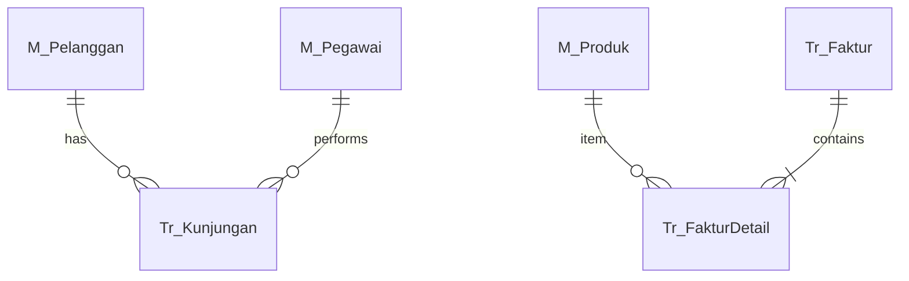

# FUNCTIONAL SPECIFICATION DOCUMENT (FSD)

**Modul:** Web Portal Falcon FPRS (Field Partner Relation System) {.unnumbered}

**Sistem:** Falcon FPRS {.unnumbered}

**Versi Dokumen:** 1.0 {.unnumbered}

## Riwayat Revisi

| Versi | Tanggal | Penulis | Keterangan |
|-------|---------|---------|------------|
| 1.0 | Auto | FSD Generator | Template — diisi oleh worker per job |

<!-- MASTER_DATA_DEEP: placeholder replaced by generate_master_data_deep_spec.py -->

## 1. Pendahuluan

Dokumen ini menjelaskan spesifikasi fungsional modul Web Portal Falcon FPRS.

## 6. Diagram Arsitektur

