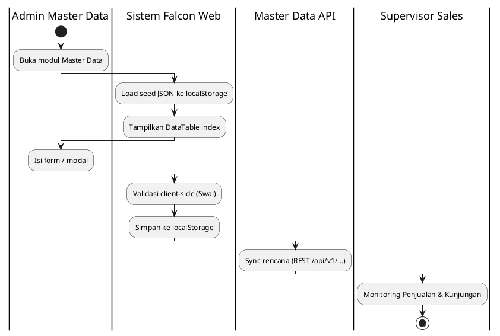
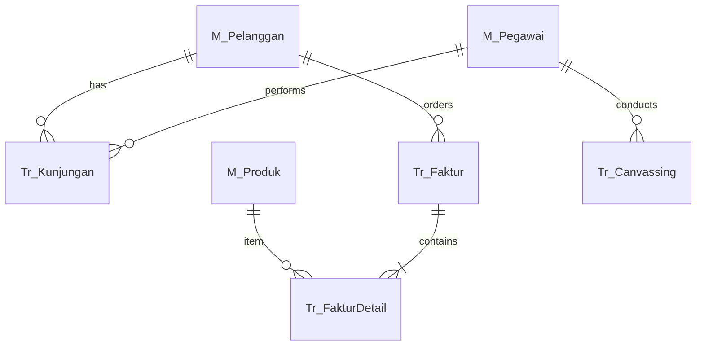

# FUNCTIONAL SPECIFICATION DOCUMENT (FSD)
## Modul: Web Admin Falcon FPRS (Field Partner Relation System)
### Sistem: Falcon FPRS
### Versi Dokumen: 1.0

---

| Atribut | Keterangan |
|---------|------------|
| **Nama Dokumen** | FSD Web Admin Falcon FPRS |
| **Versi** | 1.0 |
| **Tanggal** | 7 Juli 2026 |
| **Divisi** | ICT / Business – Falcon FPRS |
| **Status** | Draft |
| **Dibuat oleh** | Tim ICT – Falcon FPRS |

---

## Riwayat Revisi

| Versi | Tanggal | Diubah Oleh | Keterangan |
|---------|-------------|-------------|------------|
| **1.0** | **7 Juli 2026** | **Tim ICT** | Initial draft – Web Admin prototipe FPRS (Views/FPRS) |

---

## 1. Pendahuluan

### 1.1 Latar Belakang

**Falcon FPRS** (*Field Partner Relation System*) adalah sistem internal PT Kalbe Nutritionals untuk administrasi data master, penjualan lapangan, dan pelacakan kunjungan sales. Prototipe Web Portal di `Views/FPRS/` merupakan *high-fidelity interactive prototype* berbasis HTML statis multi-halaman (MPA) dengan tema Vuexy/Bootstrap, mensimulasikan alur kerja admin sebelum integrasi penuh ke backend Master Data API Kalbe.

Prototipe menggunakan **localStorage** dan file JSON seed di `wwwroot/data/` sebagai lapisan persistensi sisi klien. Dokumen ini mendeskripsikan seluruh modul web admin yang terdaftar pada sidebar `wwwroot/js/layout.js`.

### 1.2 Tujuan Dokumen

1. Mendeskripsikan fungsionalitas **per halaman dan per komponen UI** Web Portal Falcon FPRS.
2. Menjadi acuan pengembangan backend/API dan UAT.
3. Mendokumentasikan business rules, pola CRUD, integrasi API rencana, dan data layer lokal.
4. Menyelaraskan format dokumentasi dengan standar **FSD Generator Engine** (Kalbe Nutritionals).

### 1.3 Ruang Lingkup

| Dalam lingkup | Di luar lingkup |
|---------------|-----------------|
| Web admin `Views/FPRS/` (Dashboard, Master Data, Penjualan, Kunjungan) | Mobile SFA (`Views/Mobile/`, Flutter APK) |
| Shell navigasi `layout.js`, branding Kalbe | Modul legacy `wwwroot/areas/` |
| Persistensi prototipe (localStorage + JSON) | Implementasi produksi backend final |

### 1.4 Stakeholder

| Peran | Tim/Divisi | Keterlibatan |
|-------|------------|--------------|
| Admin Master Data | ICT / Operations | CRUD data referensi |
| Supervisor Sales | Sales | Monitoring kunjungan & penjualan |
| Developer | ICT | Implementasi API & UI produksi |
| Business Analyst | PDV / Sales | Validasi alur bisnis |

---

## 2. Arsitektur Portal

### 2.1 Ringkasan Teknis

| Aspek | Standar |
|-------|---------|
| Arsitektur | Static MPA — satu `.html` per halaman |
| UI Framework | Bootstrap 5.3, Vuexy Admin Theme |
| JavaScript | jQuery 3.7, DataTables, Select2, SweetAlert2 |
| Peta | MapLibre GL JS (modul Geografis Kunjungan) |
| State | `localStorage` + seed `wwwroot/data/*.json` |
| Navigasi | `wwwroot/js/layout.js` — sidebar & navbar injection |
| Branding | Kalbe hijau `#005d41`, font Kalbe Geometric |

### 2.2 Business Flow Portal (Cross-Functional Swimlane)

**Lane (urutan kiri → kanan):**

| # | Lane ID | Label | Tipe | Sumber |
|---|---------|-------|------|--------|
| 1 | L1 | Admin Master Data | User | `layout.js` sidebar |
| 2 | L2 | Supervisor Sales | User | `FSD` stakeholder §1.4 |
| 3 | L3 | Sistem Falcon Web | System | Prototipe `localStorage` |
| 4 | L4 | Master Data API | External | Badge API di sidebar |



Hand-off Admin → Sistem: setiap operasi CRUD menulis `localStorage` key modul. Hand-off Sistem → API: badge **Master Data API** menandakan endpoint rencana produksi.

### 2.3 Konvensi Penamaan File

| Pola | Contoh |
|------|--------|
| Index modul | `Views/FPRS/MasterData/Produk/index.html` |
| Form page | `Views/FPRS/MasterData/Produk/add.html` |
| Detail page | `Views/FPRS/MasterData/Produk/detail.html` |
| Modal CRUD | Form di dalam `index.html` (`#modalForm`) |

---

## 3. Dashboard & Shell

Bab ini mendeskripsikan halaman Home Portal dan shell navigasi Vuexy yang diinjeksikan oleh `wwwroot/js/layout.js` ke seluruh halaman FPRS.

### 3.1 Dashboard & Home Portal

Halaman **Home Portal** (`index.html`) adalah landing page setelah membuka aplikasi. Konten utama berupa kartu saran browser/resolusi; navigasi ke seluruh modul dilakukan melalui **sidebar** yang diinjeksikan oleh `wwwroot/js/layout.js`.

| Aspek | Keterangan |
|-------|------------|
| **Tujuan Form** | Menyediakan halaman awal portal admin dan pintu navigasi ke seluruh modul FPRS (Master Data, Penjualan, Kunjungan) melalui sidebar Vuexy yang diinjeksikan `layout.js`. |
| **Pengguna** | Admin Master Data, Supervisor Sales, Developer ICT — semua peran yang mengakses Web Admin. |


**Tampilan Dashboard & Home Portal:**


#### 3.1.1 Shell Navigasi (Sidebar)

Sidebar Vuexy memuat menu bertingkat berikut (sumber: `layout.js`):

| Menu | Sub-menu | Path |
|------|----------|------|
| Home | — | `index.html` |
| Data Master | Master Produk, Unit, Divisi, Daftar Harga, Kategori, Brand | `Views/FPRS/MasterData/...` |
| Data Master | Master Pelanggan, Grup Pelanggan | `Views/FPRS/MasterData/Pelanggan/...` |
| Data Master | Pegawai, Akun, Posisi, Konfigurasi Akses | `Views/FPRS/MasterData/...` |
| Data Master | Metode/Waktu Pembayaran, Pajak, Alasan, Supplier | `Views/FPRS/MasterData/...` |
| Penjualan | Faktur, Canvassing, Stok Motoris | `Views/FPRS/Penjualan/...`, `Canvassing/` |
| Kunjungan | Informasi, Geografis, Management Rute | `Views/FPRS/Kunjungan/...` |

#### 3.1.2 Komponen Halaman Home

| Field Name | ID Elemen | Tipe | Mandatory | Default | Validasi | Keterangan |
|------------|-----------|------|-----------|---------|----------|------------|
| Judul halaman | `.home-title` | Text (heading) | — | Home Page \| Falcon FPRS | — | H2 di `#app-content` |
| Kartu saran | `.suggestion-card` | Card | — | — | — | Rekomendasi browser & resolusi |

#### 3.1.3 CRUD

| Operasi | Cara | Role | Keterangan |
|---------|------|------|------------|
| **Read** | Buka `index.html` | Semua role | Halaman informasi; bukan modul CRUD |
| **Create** | — | — | Tidak tersedia |
| **Update** | — | — | Tidak tersedia |
| **Delete** | — | — | Tidak tersedia |

## 4. Master Data

### 4.1 Produk

Modul **Produk** merupakan bagian dari Web Portal Falcon FPRS. Tipe UI: **page**. Sumber: `Views/FPRS/MasterData/Produk/index.html`.

Halaman index menampilkan **4 summary cards** (`cntTotal`, `cntActive`, `cntInactive`, `cntAvgPrice`) dan DataTable `#tbl` dengan filter per kolom. Tombol **Tambah Produk** mengarah ke `add.html`. Mode edit mengisi form via query `?id=` dan mengunci field `kode` menjadi read-only.

| Aspek | Keterangan |
|-------|------------|
| **Tujuan Form** | Mendaftarkan dan memelihara data SKU/produk (kode, kategori, brand, harga, pajak, dimensi) sebagai referensi transaksi penjualan dan integrasi Master Data API. |
| **Pengguna** | Admin Master Data, ICT Operations — pengelola katalog produk Kalbe. |


> **Integrasi API (rencana):** `/api/v1/Sku`

> **localStorage key:** `md_produk`

**Tampilan Master Data — Produk:**


#### 4.1.1 Kolom DataTable Index

| Kolom | Field Key | Render | Sortable | Keterangan |
|-------|-----------|--------|----------|------------|
| NO | `No` | Text | Ya | Kolom grid index |
| KODE | `Kode` | Text | Ya | Kolom grid index |
| PRODUK | `Produk` | Text | Ya | Kolom grid index |
| KATEGORI | `Kategori` | Text | Ya | Kolom grid index |
| BRAND | `Brand` | Text | Ya | Kolom grid index |
| UNIT | `Unit` | Text | Ya | Kolom grid index |
| HARGA JUAL | `HargaJual` | Text | Ya | Kolom grid index |
| PAJAK | `Pajak` | Text | Ya | Kolom grid index |
| STATUS | `Status` | Text | Ya | Kolom grid index |

#### 4.1.2 Form Tambah/Ubah

| Field Name | ID Elemen | Tipe | Mandatory | Default | Validasi | Keterangan |
|------------|-----------|------|-----------|---------|----------|------------|
| Kode Produk | `kode` | Text | Ya | (kosong) | — | — |
| Nama Produk | `nama` | Text | Ya | (kosong) | — | — |
| Kategori Produk | `kategori` | Dropdown | Ya | (kosong) | — | — |
| Brand | `brand` | Dropdown | Ya | (kosong) | — | — |
| Divisi | `divisi` | Dropdown | Ya | (kosong) | — | — |
| Harga Beli | `hargaBeli` | Number | Ya | (kosong) | — | — |
| Harga Jual | `hargaJual` | Number | Ya | (kosong) | — | — |
| Skema Pajak | `namaPajak` | Dropdown | Ya | (kosong) | — | — |
| Unit Konversi | `unitNama` | Text | Ya | (kosong) | — | — |
| Status Produk | `status` | Dropdown | Ya | (kosong) | — | — |
| Berat (kg) | `berat` | Number | Tidak | 0.0 | — | — |
| Panjang (cm) | `panjang` | Number | Tidak | 0 | — | — |
| Lebar (cm) | `lebar` | Number | Tidak | 0 | — | — |
| Tinggi (cm) | `tinggi` | Number | Tidak | 0 | — | — |

#### 4.1.3 Tombol Aksi

| Tombol | ID / Handler | Warna/Style | Kondisi Aktif | Fungsi |
|--------|--------------|-------------|---------------|--------|
| Simpan Produk | `—` | btn-success | — | — |

#### 4.1.4 Business Rules

| Rule ID | Aturan |
|---------|--------|
| BR-MD01 | Kode produk wajib diisi. |
| BR-MD02 | Kode produk minimal 3 karakter. |
| BR-MD03 | Kode hanya boleh berisi huruf, angka, dash (-), atau underscore (_). |
| BR-MD04 | Nama produk wajib diisi. |
| BR-MD05 | Nama produk minimal 3 karakter. |
| BR-MD06 | Kategori wajib dipilih. |
| BR-MD07 | Brand wajib dipilih. |
| BR-MD08 | Harga beli harus lebih dari 0. |
| BR-MD09 | Harga jual harus lebih dari 0. |
| BR-MD10 | Harga jual tidak boleh lebih kecil dari harga beli. |
| BR-MD11 | Berat tidak boleh negatif. |
| BR-MD12 | Kode "${kode}" sudah digunakan oleh produk lain. |

#### 4.1.5 CRUD

| Operasi | Cara | Role | Keterangan |
|---------|------|------|------------|
| **Create** | Klik Tambah → `add.html` | Admin | — |
| **Read** | Index + `detail.html` | Semua role | — |
| **Update** | Edit via `add.html?id=` | Admin | — |
| **Delete** | Konfirmasi Swal di index | Admin | — |

### 4.2 Unit

Modul **Unit** merupakan bagian dari Web Portal Falcon FPRS. Tipe UI: **modal**. Sumber: `Views/FPRS/MasterData/Unit/index.html`.

| Aspek | Keterangan |
|-------|------------|
| **Tujuan Form** | Mendefinisikan satuan unit dan konversi kemasan produk (Box, Karton, Pcs) untuk penjualan dan stok. |
| **Pengguna** | Admin Master Data, ICT Operations. |


> **Integrasi API (rencana):** `/api/v1/Unit`

> **localStorage key:** `md_unit`

**Tampilan Master Data — Unit:**


#### 4.2.1 Kolom DataTable Index

| Kolom | Field Key | Render | Sortable | Keterangan |
|-------|-----------|--------|----------|------------|
| NO | `No` | Text | Ya | Kolom grid index |
| NAMA | `Nama` | Text | Ya | Kolom grid index |
| DESKRIPSI | `Deskripsi` | Text | Ya | Kolom grid index |
| UoM PAJAK | `UomPajak` | Text | Ya | Kolom grid index |

#### 4.2.3 Tombol Aksi

| Tombol | ID / Handler | Warna/Style | Kondisi Aktif | Fungsi |
|--------|--------------|-------------|---------------|--------|
| Tambah Unit | `openModal()` | btn-success | — | openModal() |
| Simpan | `saveUnit()` | btn-success | — | saveUnit() |

#### 4.2.4 Business Rules

| Rule ID | Aturan |
|---------|--------|
| BR-MD13 | Nama unit wajib diisi. |

#### 4.2.5 CRUD

| Operasi | Cara | Role | Keterangan |
|---------|------|------|------------|
| **Create** | Klik Tambah → isi modal → Simpan | Admin | Persist ke localStorage |
| **Read** | DataTable index | Semua role | — |
| **Update** | Klik Edit → ubah modal → Simpan | Admin | — |
| **Delete** | Klik Hapus → konfirmasi Swal | Admin | Hapus dari localStorage |

### 4.3 Divisi

Modul **Divisi** merupakan bagian dari Web Portal Falcon FPRS. Tipe UI: **modal**. Sumber: `Views/FPRS/MasterData/Divisi/index.html`.

| Aspek | Keterangan |
|-------|------------|
| **Tujuan Form** | Mengelola struktur divisi organisasi penjualan yang dipakai untuk klasifikasi produk dan pegawai. |
| **Pengguna** | Admin Master Data, HR/ICT. |


> **Integrasi API (rencana):** `/api/v1/Division`

> **localStorage key:** `md_divisi`

**Tampilan Master Data — Divisi:**


#### 4.3.1 Kolom DataTable Index

| Kolom | Field Key | Render | Sortable | Keterangan |
|-------|-----------|--------|----------|------------|
| NO | `No` | Text | Ya | Kolom grid index |
| NAMA | `Nama` | Text | Ya | Kolom grid index |
| DESKRIPSI | `Deskripsi` | Text | Ya | Kolom grid index |

#### 4.3.3 Tombol Aksi

| Tombol | ID / Handler | Warna/Style | Kondisi Aktif | Fungsi |
|--------|--------------|-------------|---------------|--------|
| Tambah Divisi | `openModal()` | btn-success | — | openModal() |
| Simpan | `saveItem()` | btn-success | — | saveItem() |

#### 4.3.4 Business Rules

| Rule ID | Aturan |
|---------|--------|
| BR-MD14 | Nama divisi wajib diisi. |

#### 4.3.5 CRUD

| Operasi | Cara | Role | Keterangan |
|---------|------|------|------------|
| **Create** | Klik Tambah → isi modal → Simpan | Admin | Persist ke localStorage |
| **Read** | DataTable index | Semua role | — |
| **Update** | Klik Edit → ubah modal → Simpan | Admin | — |
| **Delete** | Klik Hapus → konfirmasi Swal | Admin | Hapus dari localStorage |

### 4.4 Daftar Harga

Modul **Daftar Harga** merupakan bagian dari Web Portal Falcon FPRS. Tipe UI: **modal**. Sumber: `Views/FPRS/MasterData/DaftarHarga/index.html`.

| Aspek | Keterangan |
|-------|------------|
| **Tujuan Form** | Menyusun daftar harga jual per segmen pelanggan atau channel; menjadi acuan pricing saat transaksi faktur. |
| **Pengguna** | Admin Master Data, Finance, Pricing Analyst. |


> **Integrasi API (rencana):** `/api/v1/PriceList`

> **localStorage key:** `md_daftar_harga`

**Tampilan Master Data — Daftar Harga:**


#### 4.4.1 Kolom DataTable Index

| Kolom | Field Key | Render | Sortable | Keterangan |
|-------|-----------|--------|----------|------------|
| NO | `No` | Text | Ya | Kolom grid index |
| NAMA | `Nama` | Text | Ya | Kolom grid index |
| IS DEFAULT | `IsDefault` | Text | Ya | Kolom grid index |
| INCLUSIVE TAX | `InclusiveTax` | Text | Ya | Kolom grid index |

#### 4.4.3 Tombol Aksi

| Tombol | ID / Handler | Warna/Style | Kondisi Aktif | Fungsi |
|--------|--------------|-------------|---------------|--------|
| Tambah Daftar Harga | `openModal()` | btn-success | — | openModal() |
| Simpan | `saveItem()` | btn-success | — | saveItem() |

#### 4.4.4 Business Rules

| Rule ID | Aturan |
|---------|--------|
| BR-MD15 | Nama wajib diisi. |

#### 4.4.5 CRUD

| Operasi | Cara | Role | Keterangan |
|---------|------|------|------------|
| **Create** | Klik Tambah → isi modal → Simpan | Admin | Persist ke localStorage |
| **Read** | DataTable index | Semua role | — |
| **Update** | Klik Edit → ubah modal → Simpan | Admin | — |
| **Delete** | Klik Hapus → konfirmasi Swal | Admin | Hapus dari localStorage |

### 4.5 Kategori Produk

Modul **Kategori Produk** merupakan bagian dari Web Portal Falcon FPRS. Tipe UI: **modal**. Sumber: `Views/FPRS/MasterData/KategoriProduk/index.html`.

| Aspek | Keterangan |
|-------|------------|
| **Tujuan Form** | Mengelompokkan produk ke kategori bisnis untuk filter laporan, katalog, dan aturan penjualan. |
| **Pengguna** | Admin Master Data, Product Manager. |


> **Integrasi API (rencana):** `/api/v1/ProductCategory`

> **localStorage key:** `md_kategori_produk`

**Tampilan Master Data — Kategori Produk:**


#### 4.5.1 Kolom DataTable Index

| Kolom | Field Key | Render | Sortable | Keterangan |
|-------|-----------|--------|----------|------------|
| NO | `No` | Text | Ya | Kolom grid index |
| NAMA | `Nama` | Text | Ya | Kolom grid index |
| PARENT KATEGORI | `ParentKategori` | Text | Ya | Kolom grid index |

#### 4.5.3 Tombol Aksi

| Tombol | ID / Handler | Warna/Style | Kondisi Aktif | Fungsi |
|--------|--------------|-------------|---------------|--------|
| Tambah Kategori | `openModal()` | btn-success | — | openModal() |
| Simpan | `saveItem()` | btn-success | — | saveItem() |

#### 4.5.4 Business Rules

| Rule ID | Aturan |
|---------|--------|
| BR-MD16 | Nama kategori wajib diisi. |

#### 4.5.5 CRUD

| Operasi | Cara | Role | Keterangan |
|---------|------|------|------------|
| **Create** | Klik Tambah → isi modal → Simpan | Admin | Persist ke localStorage |
| **Read** | DataTable index | Semua role | — |
| **Update** | Klik Edit → ubah modal → Simpan | Admin | — |
| **Delete** | Klik Hapus → konfirmasi Swal | Admin | Hapus dari localStorage |

### 4.6 Brand

Modul **Brand** merupakan bagian dari Web Portal Falcon FPRS. Tipe UI: **modal**. Sumber: `Views/FPRS/MasterData/Brand/index.html`.

| Aspek | Keterangan |
|-------|------------|
| **Tujuan Form** | Memelihara master brand/merek produk yang terkait dengan portofolio Kalbe Nutritionals. |
| **Pengguna** | Admin Master Data, Marketing/PDV. |


> **Integrasi API (rencana):** `/api/v1/Brand`

> **localStorage key:** `md_brand`

**Tampilan Master Data — Brand:**


#### 4.6.1 Kolom DataTable Index

| Kolom | Field Key | Render | Sortable | Keterangan |
|-------|-----------|--------|----------|------------|
| NO | `No` | Text | Ya | Kolom grid index |
| NAMA | `Nama` | Text | Ya | Kolom grid index |
| DESKRIPSI | `Deskripsi` | Text | Ya | Kolom grid index |
| TOTAL PRODUK | `TotalProduk` | Text | Ya | Kolom grid index |

#### 4.6.3 Tombol Aksi

| Tombol | ID / Handler | Warna/Style | Kondisi Aktif | Fungsi |
|--------|--------------|-------------|---------------|--------|
| Tambah Brand | `openModal()` | btn-success | — | openModal() |
| Simpan | `saveItem()` | btn-success | — | saveItem() |

#### 4.6.4 Business Rules

| Rule ID | Aturan |
|---------|--------|
| BR-MD17 | Nama brand wajib diisi. |

#### 4.6.5 CRUD

| Operasi | Cara | Role | Keterangan |
|---------|------|------|------------|
| **Create** | Klik Tambah → isi modal → Simpan | Admin | Persist ke localStorage |
| **Read** | DataTable index | Semua role | — |
| **Update** | Klik Edit → ubah modal → Simpan | Admin | — |
| **Delete** | Klik Hapus → konfirmasi Swal | Admin | Hapus dari localStorage |

### 4.7 Pelanggan

Modul **Pelanggan** merupakan bagian dari Web Portal Falcon FPRS. Tipe UI: **page**. Sumber: `Views/FPRS/MasterData/Pelanggan/index.html`.

Modul pelanggan/outlet mencakup informasi dasar, grup pelanggan, alamat, dan pengaturan keuangan (daftar harga, waktu pembayaran, metode pembayaran). Data disimpan di `md_pelanggan`.

| Aspek | Keterangan |
|-------|------------|
| **Tujuan Form** | Mendaftarkan outlet/pelanggan beserta alamat, grup, skema harga, dan syarat pembayaran sebagai entitas utama kunjungan sales dan faktur. |
| **Pengguna** | Admin Master Data, Operations, Supervisor Sales (validasi data outlet). |


> **Integrasi API (rencana):** `/api/v1/Customer`

> **localStorage key:** `md_pelanggan`

**Tampilan Master Data — Pelanggan:**


#### 4.7.1 Kolom DataTable Index

| Kolom | Field Key | Render | Sortable | Keterangan |
|-------|-----------|--------|----------|------------|
| NO | `No` | Text | Ya | Kolom grid index |
| KODE | `Kode` | Text | Ya | Kolom grid index |
| PELANGGAN | `Pelanggan` | Text | Ya | Kolom grid index |
| ALAMAT | `Alamat` | Text | Ya | Kolom grid index |
| TELEPON | `Telepon` | Text | Ya | Kolom grid index |
| SALESMAN | `Salesman` | Text | Ya | Kolom grid index |
| KUNJUNGAN TERAKHIR | `KunjunganTerakhir` | Text | Ya | Kolom grid index |
| STATUS | `Status` | Text | Ya | Kolom grid index |

#### 4.7.2 Form Tambah/Ubah

| Field Name | ID Elemen | Tipe | Mandatory | Default | Validasi | Keterangan |
|------------|-----------|------|-----------|---------|----------|------------|
| Kode Pelanggan | `kode` | Text | Ya | (kosong) | — | — |
| Nama Pelanggan | `nama` | Text | Ya | (kosong) | — | — |
| Telepon | `telepon` | Text | Tidak | (kosong) | — | — |
| Grup Pelanggan | `grupPelanggan` | Dropdown | Ya | (kosong) | — | — |
| Alamat Lengkap | `alamat` | Text | Tidak | (kosong) | — | — |
| Daftar Harga | `daftarHarga` | Dropdown | Ya | (kosong) | — | — |
| Waktu Pembayaran | `waktuPembayaran` | Dropdown | Ya | (kosong) | — | — |
| Salesman/Employee | `employee` | Dropdown | Ya | (kosong) | — | — |
| Status | `status` | Dropdown | Ya | (kosong) | — | — |

#### 4.7.3 Tombol Aksi

| Tombol | ID / Handler | Warna/Style | Kondisi Aktif | Fungsi |
|--------|--------------|-------------|---------------|--------|
| Simpan Pelanggan | `—` | btn-success | — | — |

#### 4.7.4 Business Rules

| Rule ID | Aturan |
|---------|--------|
| BR-MD18 | Nama pelanggan wajib diisi. |

#### 4.7.5 CRUD

| Operasi | Cara | Role | Keterangan |
|---------|------|------|------------|
| **Create** | Klik Tambah → `add.html` | Admin | — |
| **Read** | Index + `detail.html` | Semua role | — |
| **Update** | Edit via `add.html?id=` | Admin | — |
| **Delete** | Konfirmasi Swal di index | Admin | — |

### 4.8 Grup Pelanggan

Modul **Grup Pelanggan** merupakan bagian dari Web Portal Falcon FPRS. Tipe UI: **modal**. Sumber: `Views/FPRS/MasterData/GrupPelanggan/index.html`.

| Aspek | Keterangan |
|-------|------------|
| **Tujuan Form** | Mengelompokkan pelanggan (grosir, retail, RS, dll.) untuk kebijakan harga dan laporan segmentasi. |
| **Pengguna** | Admin Master Data, Sales Operations. |


> **Integrasi API (rencana):** `/api/v1/CustomerGroup`

> **localStorage key:** `md_grup_pelanggan`

**Tampilan Master Data — Grup Pelanggan:**


#### 4.8.1 Kolom DataTable Index

| Kolom | Field Key | Render | Sortable | Keterangan |
|-------|-----------|--------|----------|------------|
| NO | `No` | Text | Ya | Kolom grid index |
| NAMA GRUP | `NamaGrup` | Text | Ya | Kolom grid index |
| TOTAL PELANGGAN | `TotalPelanggan` | Text | Ya | Kolom grid index |
| TIPE GRUP | `TipeGrup` | Text | Ya | Kolom grid index |
| ESTIMASI WAKTU | `EstimasiWaktu` | Text | Ya | Kolom grid index |

#### 4.8.3 Tombol Aksi

| Tombol | ID / Handler | Warna/Style | Kondisi Aktif | Fungsi |
|--------|--------------|-------------|---------------|--------|
| Tambah Grup | `openModal()` | btn-success | — | openModal() |
| Simpan | `saveItem()` | btn-success | — | saveItem() |

#### 4.8.4 Business Rules

| Rule ID | Aturan |
|---------|--------|
| BR-MD19 | Nama grup wajib diisi. |

#### 4.8.5 CRUD

| Operasi | Cara | Role | Keterangan |
|---------|------|------|------------|
| **Create** | Klik Tambah → isi modal → Simpan | Admin | Persist ke localStorage |
| **Read** | DataTable index | Semua role | — |
| **Update** | Klik Edit → ubah modal → Simpan | Admin | — |
| **Delete** | Klik Hapus → konfirmasi Swal | Admin | Hapus dari localStorage |

### 4.9 Pegawai

Modul **Pegawai** merupakan bagian dari Web Portal Falcon FPRS. Tipe UI: **page**. Sumber: `Views/FPRS/MasterData/Pegawai/index.html`.

Master pegawai/sales force dengan form `add.html` untuk registrasi karyawan lapangan. Terintegrasi rencana ke `/api/v1/Employee`.

| Aspek | Keterangan |
|-------|------------|
| **Tujuan Form** | Mendaftarkan pegawai/sales force (canvasser, motoris) beserta identitas dan penempatan untuk assignment rute dan otorisasi aplikasi. |
| **Pengguna** | Admin HR, ICT, Supervisor Sales. |


> **Integrasi API (rencana):** `/api/v1/Employee`

> **localStorage key:** `md_pegawai`

**Tampilan Master Data — Pegawai:**


#### 4.9.1 Kolom DataTable Index

| Kolom | Field Key | Render | Sortable | Keterangan |
|-------|-----------|--------|----------|------------|
| NO | `No` | Text | Ya | Kolom grid index |
| KODE | `Kode` | Text | Ya | Kolom grid index |
| NAMA | `Nama` | Text | Ya | Kolom grid index |
| POSISI | `Posisi` | Text | Ya | Kolom grid index |
| DIVISI | `Divisi` | Text | Ya | Kolom grid index |
| USERNAME | `Username` | Text | Ya | Kolom grid index |
| STATUS | `Status` | Text | Ya | Kolom grid index |

#### 4.9.2 Form Tambah/Ubah

| Field Name | ID Elemen | Tipe | Mandatory | Default | Validasi | Keterangan |
|------------|-----------|------|-----------|---------|----------|------------|
| Kode Karyawan | `kode` | Text | Ya | (kosong) | — | — |
| Nama Karyawan | `nama` | Text | Ya | (kosong) | — | — |
| Posisi / Jabatan | `posisi` | Dropdown | Ya | (kosong) | — | — |
| Divisi | `divisi` | Dropdown | Ya | (kosong) | — | — |
| Username | `username` | Text | Tidak | (kosong) | — | — |
| Status Kepegawaian | `status` | Dropdown | Ya | (kosong) | — | — |

#### 4.9.3 Tombol Aksi

| Tombol | ID / Handler | Warna/Style | Kondisi Aktif | Fungsi |
|--------|--------------|-------------|---------------|--------|
| Simpan Pegawai | `—` | btn-success | — | — |

#### 4.9.4 Business Rules

| Rule ID | Aturan |
|---------|--------|
| BR-MD20 | Nama karyawan wajib diisi. |

#### 4.9.5 CRUD

| Operasi | Cara | Role | Keterangan |
|---------|------|------|------------|
| **Create** | Klik Tambah → `add.html` | Admin | — |
| **Read** | Index + `detail.html` | Semua role | — |
| **Update** | Edit via `add.html?id=` | Admin | — |
| **Delete** | Konfirmasi Swal di index | Admin | — |

### 4.10 Akun

Modul **Akun** merupakan bagian dari Web Portal Falcon FPRS. Tipe UI: **modal**. Sumber: `Views/FPRS/MasterData/Akun/index.html`.

| Aspek | Keterangan |
|-------|------------|
| **Tujuan Form** | Mengelola akun login pengguna portal admin dan mengaitkannya dengan pegawai/role akses. |
| **Pengguna** | Admin ICT, Security Administrator. |


> **Integrasi API (rencana):** `/api/v1/Account`

> **localStorage key:** `md_akun`

**Tampilan Master Data — Akun:**


#### 4.10.1 Kolom DataTable Index

| Kolom | Field Key | Render | Sortable | Keterangan |
|-------|-----------|--------|----------|------------|
| NO | `No` | Text | Ya | Kolom grid index |
| USERNAME | `Username` | Text | Ya | Kolom grid index |
| ROLE GROUP | `RoleGroup` | Text | Ya | Kolom grid index |
| TELEPON | `Telepon` | Text | Ya | Kolom grid index |
| EMAIL | `Email` | Text | Ya | Kolom grid index |
| NAMA KARYAWAN | `NamaKaryawan` | Text | Ya | Kolom grid index |
| STATUS | `Status` | Text | Ya | Kolom grid index |

#### 4.10.2 Modal Form

| Field Name | ID Elemen | Tipe | Mandatory | Default | Validasi | Keterangan |
|------------|-----------|------|-----------|---------|----------|------------|
| Username | `inputUsername` | Text | Ya | (kosong) | — | — |
| Role Group | `inputRole` | Dropdown | Ya | (kosong) | — | — |
| Email | `inputEmail` | Email | Tidak | (kosong) | — | — |
| Telepon | `inputTelepon` | Text | Tidak | (kosong) | — | — |
| Nama Karyawan | `inputNamaKaryawan` | Text | Tidak | (kosong) | — | — |
| Status | `inputStatus` | Dropdown | Tidak | (kosong) | — | — |

#### 4.10.3 Tombol Aksi

| Tombol | ID / Handler | Warna/Style | Kondisi Aktif | Fungsi |
|--------|--------------|-------------|---------------|--------|
| Tambah Akun | `openModal()` | btn-success | — | openModal() |
| Simpan | `saveItem()` | btn-success | — | saveItem() |

#### 4.10.4 Business Rules

| Rule ID | Aturan |
|---------|--------|
| BR-MD21 | Username dan Role wajib diisi. |

#### 4.10.5 CRUD

| Operasi | Cara | Role | Keterangan |
|---------|------|------|------------|
| **Create** | Klik Tambah → isi modal → Simpan | Admin | Persist ke localStorage |
| **Read** | DataTable index | Semua role | — |
| **Update** | Klik Edit → ubah modal → Simpan | Admin | — |
| **Delete** | Klik Hapus → konfirmasi Swal | Admin | Hapus dari localStorage |

### 4.11 Posisi

Modul **Posisi** merupakan bagian dari Web Portal Falcon FPRS. Tipe UI: **modal**. Sumber: `Views/FPRS/MasterData/Posisi/index.html`.

| Aspek | Keterangan |
|-------|------------|
| **Tujuan Form** | Mendefinisikan jabatan/posisi kerja (Canvasser, Supervisor, Admin) untuk struktur organisasi dan RBAC. |
| **Pengguna** | Admin HR, ICT. |


> **Integrasi API (rencana):** `/api/v1/Position`

> **localStorage key:** `md_posisi`

**Tampilan Master Data — Posisi:**


#### 4.11.1 Kolom DataTable Index

| Kolom | Field Key | Render | Sortable | Keterangan |
|-------|-----------|--------|----------|------------|
| NO | `No` | Text | Ya | Kolom grid index |
| NAMA | `Nama` | Text | Ya | Kolom grid index |
| LEVEL | `Level` | Text | Ya | Kolom grid index |
| JUMLAH | `Jumlah` | Text | Ya | Kolom grid index |
| ANGGOTA | `Anggota` | Text | Ya | Kolom grid index |

#### 4.11.3 Tombol Aksi

| Tombol | ID / Handler | Warna/Style | Kondisi Aktif | Fungsi |
|--------|--------------|-------------|---------------|--------|
| Tambah Posisi | `openModal()` | btn-success | — | openModal() |
| Simpan | `saveItem()` | btn-success | — | saveItem() |

#### 4.11.4 Business Rules

| Rule ID | Aturan |
|---------|--------|
| BR-MD22 | Nama posisi wajib diisi. |

#### 4.11.5 CRUD

| Operasi | Cara | Role | Keterangan |
|---------|------|------|------------|
| **Create** | Klik Tambah → isi modal → Simpan | Admin | Persist ke localStorage |
| **Read** | DataTable index | Semua role | — |
| **Update** | Klik Edit → ubah modal → Simpan | Admin | — |
| **Delete** | Klik Hapus → konfirmasi Swal | Admin | Hapus dari localStorage |

### 4.12 Konfigurasi Akses

Modul **Konfigurasi Akses** merupakan bagian dari Web Portal Falcon FPRS. Tipe UI: **modal**. Sumber: `Views/FPRS/MasterData/KonfigurasiAkses/index.html`.

| Aspek | Keterangan |
|-------|------------|
| **Tujuan Form** | Mengatur matriks hak akses modul portal (menu, CRUD) per role agar kebijakan keamanan dapat dikonfigurasi tanpa ubah kode. |
| **Pengguna** | Admin ICT, Security Administrator. |


> **Integrasi API (rencana):** `/api/v1/AccessConfig`

> **localStorage key:** `md_konfigurasi_akses`

**Tampilan Master Data — Konfigurasi Akses:**


#### 4.12.1 Kolom DataTable Index

| Kolom | Field Key | Render | Sortable | Keterangan |
|-------|-----------|--------|----------|------------|
| NO | `No` | Text | Ya | Kolom grid index |
| NAMA ROLE | `NamaRole` | Text | Ya | Kolom grid index |

#### 4.12.3 Tombol Aksi

| Tombol | ID / Handler | Warna/Style | Kondisi Aktif | Fungsi |
|--------|--------------|-------------|---------------|--------|
| Tambah Role | `openModal()` | btn-success | — | openModal() |
| Simpan | `saveItem()` | btn-success | — | saveItem() |

#### 4.12.4 Business Rules

| Rule ID | Aturan |
|---------|--------|
| BR-MD23 | Nama role wajib diisi. |

#### 4.12.5 CRUD

| Operasi | Cara | Role | Keterangan |
|---------|------|------|------------|
| **Create** | Klik Tambah → isi modal → Simpan | Admin | Persist ke localStorage |
| **Read** | DataTable index | Semua role | — |
| **Update** | Klik Edit → ubah modal → Simpan | Admin | — |
| **Delete** | Klik Hapus → konfirmasi Swal | Admin | Hapus dari localStorage |

### 4.13 Metode Pembayaran

Modul **Metode Pembayaran** merupakan bagian dari Web Portal Falcon FPRS. Tipe UI: **modal**. Sumber: `Views/FPRS/MasterData/MetodePembayaran/index.html`.

| Aspek | Keterangan |
|-------|------------|
| **Tujuan Form** | Mencatat metode pembayaran yang diperbolehkan (tunai, transfer, giro) pada transaksi penjualan dan AR. |
| **Pengguna** | Admin Finance, Master Data. |


> **Integrasi API (rencana):** `/api/v1/PaymentMethod`

> **localStorage key:** `md_metode_pembayaran`

**Tampilan Master Data — Metode Pembayaran:**


#### 4.13.1 Kolom DataTable Index

| Kolom | Field Key | Render | Sortable | Keterangan |
|-------|-----------|--------|----------|------------|
| NO | `No` | Text | Ya | Kolom grid index |
| NAMA | `Nama` | Text | Ya | Kolom grid index |
| OTOMATIS DIKONFIRMASI | `OtomatisDikonfirmasi` | Text | Ya | Kolom grid index |
| DEFAULT | `Default` | Text | Ya | Kolom grid index |

#### 4.13.3 Tombol Aksi

| Tombol | ID / Handler | Warna/Style | Kondisi Aktif | Fungsi |
|--------|--------------|-------------|---------------|--------|
| Tambah Metode | `openModal()` | btn-success | — | openModal() |
| Simpan | `saveItem()` | btn-success | — | saveItem() |

#### 4.13.4 Business Rules

| Rule ID | Aturan |
|---------|--------|
| BR-MD24 | Nama metode wajib diisi. |

#### 4.13.5 CRUD

| Operasi | Cara | Role | Keterangan |
|---------|------|------|------------|
| **Create** | Klik Tambah → isi modal → Simpan | Admin | Persist ke localStorage |
| **Read** | DataTable index | Semua role | — |
| **Update** | Klik Edit → ubah modal → Simpan | Admin | — |
| **Delete** | Klik Hapus → konfirmasi Swal | Admin | Hapus dari localStorage |

### 4.14 Waktu Pembayaran

Modul **Waktu Pembayaran** merupakan bagian dari Web Portal Falcon FPRS. Tipe UI: **modal**. Sumber: `Views/FPRS/MasterData/WaktuPembayaran/index.html`.

| Aspek | Keterangan |
|-------|------------|
| **Tujuan Form** | Mendefinisikan termin/tempo pembayaran (COD, 7 hari, 14 hari) yang melekat pada pelanggan dan faktur. |
| **Pengguna** | Admin Finance, Credit Control. |


> **Integrasi API (rencana):** `/api/v1/PaymentTerm`

> **localStorage key:** `md_waktu_pembayaran`

**Tampilan Master Data — Waktu Pembayaran:**


#### 4.14.1 Kolom DataTable Index

| Kolom | Field Key | Render | Sortable | Keterangan |
|-------|-----------|--------|----------|------------|
| NO | `No` | Text | Ya | Kolom grid index |
| NAMA | `Nama` | Text | Ya | Kolom grid index |
| HARI | `Hari` | Text | Ya | Kolom grid index |
| DESKRIPSI | `Deskripsi` | Text | Ya | Kolom grid index |
| DEFAULT | `Default` | Text | Ya | Kolom grid index |

#### 4.14.3 Tombol Aksi

| Tombol | ID / Handler | Warna/Style | Kondisi Aktif | Fungsi |
|--------|--------------|-------------|---------------|--------|
| Tambah Waktu Pembayaran | `openModal()` | btn-success | — | openModal() |
| Simpan | `saveItem()` | btn-success | — | saveItem() |

#### 4.14.4 Business Rules

| Rule ID | Aturan |
|---------|--------|
| BR-MD25 | Nama wajib diisi. |

#### 4.14.5 CRUD

| Operasi | Cara | Role | Keterangan |
|---------|------|------|------------|
| **Create** | Klik Tambah → isi modal → Simpan | Admin | Persist ke localStorage |
| **Read** | DataTable index | Semua role | — |
| **Update** | Klik Edit → ubah modal → Simpan | Admin | — |
| **Delete** | Klik Hapus → konfirmasi Swal | Admin | Hapus dari localStorage |

### 4.15 Pajak

Modul **Pajak** merupakan bagian dari Web Portal Falcon FPRS. Tipe UI: **modal**. Sumber: `Views/FPRS/MasterData/Pajak/index.html`.

| Aspek | Keterangan |
|-------|------------|
| **Tujuan Form** | Mengonfigurasi skema pajak (PPN, DPP) yang dipakai perhitungan harga produk dan faktur. |
| **Pengguna** | Admin Finance, Tax/Accounting. |


> **Integrasi API (rencana):** `/api/v1/Tax`

> **localStorage key:** `md_pajak`

**Tampilan Master Data — Pajak:**


#### 4.15.1 Kolom DataTable Index

| Kolom | Field Key | Render | Sortable | Keterangan |
|-------|-----------|--------|----------|------------|
| NO | `No` | Text | Ya | Kolom grid index |
| KODE PAJAK | `KodePajak` | Text | Ya | Kolom grid index |
| NAMA PAJAK | `NamaPajak` | Text | Ya | Kolom grid index |
| PERSENTASE (%) | `Persentase` | Text | Ya | Kolom grid index |
| NILAI DPP | `NilaiDpp` | Text | Ya | Kolom grid index |

#### 4.15.3 Tombol Aksi

| Tombol | ID / Handler | Warna/Style | Kondisi Aktif | Fungsi |
|--------|--------------|-------------|---------------|--------|
| Tambah Pajak | `openModal()` | btn-success | — | openModal() |
| Simpan | `saveItem()` | btn-success | — | saveItem() |

#### 4.15.4 Business Rules

| Rule ID | Aturan |
|---------|--------|
| BR-MD26 | Kode dan Nama pajak wajib diisi. |

#### 4.15.5 CRUD

| Operasi | Cara | Role | Keterangan |
|---------|------|------|------------|
| **Create** | Klik Tambah → isi modal → Simpan | Admin | Persist ke localStorage |
| **Read** | DataTable index | Semua role | — |
| **Update** | Klik Edit → ubah modal → Simpan | Admin | — |
| **Delete** | Klik Hapus → konfirmasi Swal | Admin | Hapus dari localStorage |

### 4.16 Alasan

Modul **Alasan** merupakan bagian dari Web Portal Falcon FPRS. Tipe UI: **modal**. Sumber: `Views/FPRS/MasterData/Alasan/index.html`.

| Aspek | Keterangan |
|-------|------------|
| **Tujuan Form** | Menyimpan kode alasan operasional (tidak order, gagal kunjungan, dll.) untuk pelacakan aktivitas lapangan dan analitik compliance. |
| **Pengguna** | Admin Operations, Supervisor Sales, Business Analyst. |


> **Integrasi API (rencana):** `/api/v1/Reason`

> **localStorage key:** `md_alasan`

**Tampilan Master Data — Alasan:**


#### 4.16.1 Kolom DataTable Index

| Kolom | Field Key | Render | Sortable | Keterangan |
|-------|-----------|--------|----------|------------|
| NO | `No` | Text | Ya | Kolom grid index |
| NAMA ALASAN | `NamaAlasan` | Text | Ya | Kolom grid index |
| DESKRIPSI | `Deskripsi` | Text | Ya | Kolom grid index |
| TIPE | `Tipe` | Text | Ya | Kolom grid index |

#### 4.16.3 Tombol Aksi

| Tombol | ID / Handler | Warna/Style | Kondisi Aktif | Fungsi |
|--------|--------------|-------------|---------------|--------|
| Tambah Alasan | `openModal()` | btn-success | — | openModal() |
| Simpan | `saveItem()` | btn-success | — | saveItem() |

#### 4.16.4 Business Rules

| Rule ID | Aturan |
|---------|--------|
| BR-MD27 | Nama dan Tipe wajib diisi. |

#### 4.16.5 CRUD

| Operasi | Cara | Role | Keterangan |
|---------|------|------|------------|
| **Create** | Klik Tambah → isi modal → Simpan | Admin | Persist ke localStorage |
| **Read** | DataTable index | Semua role | — |
| **Update** | Klik Edit → ubah modal → Simpan | Admin | — |
| **Delete** | Klik Hapus → konfirmasi Swal | Admin | Hapus dari localStorage |

### 4.17 Supplier

Modul **Supplier** merupakan bagian dari Web Portal Falcon FPRS. Tipe UI: **page**. Sumber: `Views/FPRS/MasterData/Supplier/index.html`.

| Aspek | Keterangan |
|-------|------------|
| **Tujuan Form** | Mendaftarkan pemasok/principal untuk kebutuhan supply chain dan referensi data produk. |
| **Pengguna** | Admin Master Data, Procurement. |


> **Integrasi API (rencana):** `/api/v1/Supplier`

> **localStorage key:** `md_supplier`

**Tampilan Master Data — Supplier:**


#### 4.17.1 Kolom DataTable Index

| Kolom | Field Key | Render | Sortable | Keterangan |
|-------|-----------|--------|----------|------------|
| NO | `No` | Text | Ya | Kolom grid index |
| KODE | `Kode` | Text | Ya | Kolom grid index |
| NAMA SUPPLIER | `NamaSupplier` | Text | Ya | Kolom grid index |
| ALAMAT | `Alamat` | Text | Ya | Kolom grid index |
| TELEPON | `Telepon` | Text | Ya | Kolom grid index |
| STATUS | `Status` | Text | Ya | Kolom grid index |

#### 4.17.2 Form Tambah/Ubah

| Field Name | ID Elemen | Tipe | Mandatory | Default | Validasi | Keterangan |
|------------|-----------|------|-----------|---------|----------|------------|
| Kode Supplier | `kode` | Text | Ya | (kosong) | — | — |
| Nama Supplier | `nama` | Text | Ya | (kosong) | — | — |
| Telepon | `telepon` | Text | Tidak | (kosong) | — | — |
| Email | `email` | Email | Tidak | (kosong) | — | — |
| Alamat Lengkap | `alamat` | Text | Tidak | (kosong) | — | — |
| Waktu Pembayaran | `waktuPembayaran` | Dropdown | Ya | (kosong) | — | — |
| Status Hubungan | `status` | Dropdown | Ya | (kosong) | — | — |

#### 4.17.3 Tombol Aksi

| Tombol | ID / Handler | Warna/Style | Kondisi Aktif | Fungsi |
|--------|--------------|-------------|---------------|--------|
| Simpan Supplier | `—` | btn-success | — | — |

#### 4.17.4 Business Rules

| Rule ID | Aturan |
|---------|--------|
| BR-MD28 | Nama supplier wajib diisi. |

#### 4.17.5 CRUD

| Operasi | Cara | Role | Keterangan |
|---------|------|------|------------|
| **Create** | Klik Tambah → `add.html` | Admin | — |
| **Read** | Index + `detail.html` | Semua role | — |
| **Update** | Edit via `add.html?id=` | Admin | — |
| **Delete** | Konfirmasi Swal di index | Admin | — |

## 5. Penjualan

### 5.1 Faktur

Modul **Faktur** merupakan bagian dari Web Portal Falcon FPRS. Tipe UI: **page**. Sumber: `Views/FPRS/Penjualan/Faktur/index.html`.

| Aspek | Keterangan |
|-------|------------|
| **Tujuan Form** | Membuat dan memantau faktur penjualan dari order lapangan; mencatat header, item, diskon, dan status pembayaran untuk rekonsiliasi admin. |
| **Pengguna** | Admin Sales, Supervisor, Finance (monitoring & koreksi). |


> **Integrasi API (rencana):** `/api/v1/Invoice`

> **localStorage key:** `md_faktur`

**Tampilan Penjualan — Faktur:**


#### 5.1.1 Kolom DataTable Index

| Kolom | Field Key | Render | Sortable | Keterangan |
|-------|-----------|--------|----------|------------|
| NO | `No` | Text | Ya | Kolom grid index |
| TANGGAL FAKTUR | `TanggalFaktur` | Text | Ya | Kolom grid index |
| NOMOR FAKTUR | `NomorFaktur` | Text | Ya | Kolom grid index |
| PELANGGAN | `Pelanggan` | Text | Ya | Kolom grid index |
| SALES | `Sales` | Text | Ya | Kolom grid index |
| JATUH TEMPO | `JatuhTempo` | Text | Ya | Kolom grid index |
| JUMLAH TAGIHAN | `JumlahTagihan` | Text | Ya | Kolom grid index |
| BELUM DIBAYAR | `BelumDibayar` | Text | Ya | Kolom grid index |
| STATUS | `Status` | Text | Ya | Kolom grid index |

#### 5.1.2 Form Tambah/Ubah

| Field Name | ID Elemen | Tipe | Mandatory | Default | Validasi | Keterangan |
|------------|-----------|------|-----------|---------|----------|------------|
| Tanggal Faktur | `inpTanggalFaktur` | Text | Tidak | (kosong) | — | — |
| Sales | `inpSalesman` | Dropdown | Tidak | (kosong) | — | — |
| Gudang | `inpGudang` | Dropdown | Tidak | (kosong) | — | — |
| Jangka Waktu Pembayaran | `inpWaktuBayar` | Dropdown | Tidak | (kosong) | — | — |
| Tanggal Jatuh Tempo | `inpJatuhTempo` | Text (readonly) | Tidak | (kosong) | — | — |
| Kode Transaksi | `inpKodeTrx` | Dropdown | Tidak | (kosong) | — | — |

#### 5.1.3 Tombol Aksi

| Tombol | ID / Handler | Warna/Style | Kondisi Aktif | Fungsi |
|--------|--------------|-------------|---------------|--------|
| Ekspor | `btnEkspor` | btn-secondary | — | — |
| Reset | `btnResetFilter` | btn-secondary | — | — |
| Tambah item lain | `btnAddItem` | btn-secondary | — | — |
| Simpan Faktur | `btnSimpan` | btn-success | — | — |

#### 5.1.5 CRUD

| Operasi | Cara | Role | Keterangan |
|---------|------|------|------------|
| **Create** | Klik Tambah → `add.html` | Admin | — |
| **Read** | Index + `detail.html` | Semua role | — |
| **Update** | Edit via `add.html?id=` | Admin | — |
| **Delete** | Konfirmasi Swal di index | Admin | — |

### 5.2 Stok Motoris

Modul **Stok Motoris** merupakan bagian dari Web Portal Falcon FPRS. Tipe UI: **page**. Sumber: `Views/FPRS/Penjualan/StokMotoris/index.html`.

| Aspek | Keterangan |
|-------|------------|
| **Tujuan Form** | Memantau stok produk yang dibawa motoris/canvasser di lapangan untuk kontrol availability sebelum kunjungan dan penjualan. |
| **Pengguna** | Supervisor Sales, Admin Operations, Warehouse (read-only monitoring). |


> **localStorage key:** `md_stok_motoris`

**Tampilan Penjualan — Stok Motoris:**


#### 5.2.1 Kolom DataTable Index

| Kolom | Field Key | Render | Sortable | Keterangan |
|-------|-----------|--------|----------|------------|
| Motoris | `Motoris` | Text | Ya | Kolom grid index |
| Wilayah | `Wilayah` | Text | Ya | Kolom grid index |
| Stok (Krt) | `StokKrt` | Text | Ya | Kolom grid index |
| Stok (Dus) | `StokDus` | Text | Ya | Kolom grid index |
| Stok (Pcs) | `StokPcs` | Text | Ya | Kolom grid index |
| Total Pcs | `TotalPcs` | Text | Ya | Kolom grid index |
| Sell-Through | `SellThrough` | Text | Ya | Kolom grid index |
| Umur Stok | `UmurStok` | Text | Ya | Kolom grid index |
| Nilai Saldo | `NilaiSaldo` | Text | Ya | Kolom grid index |

#### 5.2.3 Tombol Aksi

| Tombol | ID / Handler | Warna/Style | Kondisi Aktif | Fungsi |
|--------|--------------|-------------|---------------|--------|
| Qty | `setUnitMode(` | btn-secondary | — | setUnitMode( |
| Rupiah | `setUnitMode(` | btn-secondary | — | setUnitMode( |
| Export Excel | `exportToExcel()` | btn-secondary | — | exportToExcel() |
| Refresh | `refreshDashboard()` | btn-success | — | refreshDashboard() |
| Reset Semua | `resetAllFilters()` | btn-secondary | — | resetAllFilters() |
| Kembali ke Region | `btnBackDrill` | btn-secondary | — | resetDrilldown() |
| Cetak PDF | `printAuditPopup()` | btn-secondary | — | printAuditPopup() |

#### 5.2.5 CRUD

| Operasi | Cara | Role | Keterangan |
|---------|------|------|------------|
| **Read** | Buka halaman index | Admin, Supervisor | Dashboard/monitoring read-only |
| **Create** | — | — | Tidak tersedia di UI |
| **Update** | — | — | Tidak tersedia |
| **Delete** | — | — | Tidak tersedia |

### 5.3 Canvassing

Modul **Canvassing** merupakan bagian dari Web Portal Falcon FPRS. Tipe UI: **page**. Sumber: `Views/FPRS/Canvassing/index.html`.

| Aspek | Keterangan |
|-------|------------|
| **Tujuan Form** | Menampilkan ringkasan aktivitas canvassing (prospek, konversi, performa) untuk evaluasi efektivitas tim lapangan. |
| **Pengguna** | Supervisor Sales, Sales Manager, Admin PDV. |


> **localStorage key:** `canvassing`

**Tampilan Canvassing:**


#### 5.3.1 Kolom DataTable Index

| Kolom | Field Key | Render | Sortable | Keterangan |
|-------|-----------|--------|----------|------------|
| NO | `No` | Text | Ya | Kolom grid index |
| KODE KANVAS | `KodeKanvas` | Text | Ya | Kolom grid index |
| DRIVER | `Driver` | Text | Ya | Kolom grid index |
| GUDANG | `Gudang` | Text | Ya | Kolom grid index |
| PERIODE | `Periode` | Text | Ya | Kolom grid index |
| STATUS | `Status` | Text | Ya | Kolom grid index |

#### 5.3.2 Form Tambah/Ubah

| Field Name | ID Elemen | Tipe | Mandatory | Default | Validasi | Keterangan |
|------------|-----------|------|-----------|---------|----------|------------|
| Driver | `inpDriver` | Dropdown | Tidak | (kosong) | — | — |
| Helper | `inpHelper` | Dropdown | Tidak | (kosong) | — | — |
| Gudang Kanvas | `inpGudang` | Dropdown | Tidak | (kosong) | — | — |
| Mulai Kanvas | `inpMulai` | Text | Tidak | (kosong) | — | — |
| Selesai Kanvas | `inpSelesai` | Text | Tidak | (kosong) | — | — |

#### 5.3.3 Tombol Aksi

| Tombol | ID / Handler | Warna/Style | Kondisi Aktif | Fungsi |
|--------|--------------|-------------|---------------|--------|
| Tambah Produk | `btnAddProduct` | btn-secondary | — | — |
| - | `stepQty(this,-1)` | btn-secondary | — | stepQty(this,-1) |
| + | `stepQty(this,1)` | btn-secondary | — | stepQty(this,1) |
| - | `stepQty(this,-1)` | btn-secondary | — | stepQty(this,-1) |
| + | `stepQty(this,1)` | btn-secondary | — | stepQty(this,1) |
| Simpan Canvassing | `btnSimpanV2` | btn-success | — | — |
| - | `stepQty(this,-1)` | btn-secondary | — | stepQty(this,-1) |
| + | `stepQty(this,1)` | btn-secondary | — | stepQty(this,1) |

#### 5.3.5 CRUD

| Operasi | Cara | Role | Keterangan |
|---------|------|------|------------|
| **Create** | Klik Tambah → `add.html` | Admin | — |
| **Read** | Index + `detail.html` | Semua role | — |
| **Update** | Edit via `add.html?id=` | Admin | — |
| **Delete** | Konfirmasi Swal di index | Admin | — |

## 6. Kunjungan

### 6.1 Informasi

Modul **Informasi** merupakan bagian dari Web Portal Falcon FPRS. Tipe UI: **page**. Sumber: `Views/FPRS/Kunjungan/Informasi/index.html`.

| Aspek | Keterangan |
|-------|------------|
| **Tujuan Form** | Menyajikan laporan informasi kunjungan (check-in/out, durasi, status) untuk monitoring kepatuhan rute harian sales. |
| **Pengguna** | Supervisor Sales, Admin Operations, Business Analyst. |


**Tampilan Kunjungan — Informasi:**


#### 6.1.1 Kolom DataTable Index

| Kolom | Field Key | Render | Sortable | Keterangan |
|-------|-----------|--------|----------|------------|
| No | `No` | Text | Ya | Kolom grid index |
| Tanggal | `Tanggal` | Text | Ya | Kolom grid index |
| Nama | `Nama` | Text | Ya | Kolom grid index |
| Visited | `Visited` | Text | Ya | Kolom grid index |
| Waktu Mulai | `WaktuMulai` | Text | Ya | Kolom grid index |
| Waktu Akhir | `WaktuAkhir` | Text | Ya | Kolom grid index |
| Total Penjualan | `TotalPenjualan` | Text | Ya | Kolom grid index |

#### 6.1.2 Form Tambah/Ubah

| Field Name | ID Elemen | Tipe | Mandatory | Default | Validasi | Keterangan |
|------------|-----------|------|-----------|---------|----------|------------|
| Nama Salesman | `filterName` | Text | Tidak | (kosong) | — | — |
| Bulan/Tahun | `filterMonth` | Dropdown | Tidak | (kosong) | — | — |
| Area/Region | `filterArea` | Dropdown | Tidak | (kosong) | — | — |
| Divisi | `filterDivisi` | Dropdown | Tidak | (kosong) | — | — |
| Status Kunjungan | `filterStatus` | Dropdown | Tidak | (kosong) | — | — |
| Dari | `filterDateStart` | Text | Tidak | (kosong) | — | — |
| Sampai | `filterDateEnd` | Text | Tidak | (kosong) | — | — |

#### 6.1.3 Tombol Aksi

| Tombol | ID / Handler | Warna/Style | Kondisi Aktif | Fungsi |
|--------|--------------|-------------|---------------|--------|
| Filter | `btnFilter` | btn-secondary | — | — |
| Pengaturan | `btnSettings` | btn-secondary | — | — |
| Terapkan | `applyFilters` | btn-success | — | — |
| Reset | `resetFilters` | btn-secondary | — | — |

#### 6.1.5 CRUD

| Operasi | Cara | Role | Keterangan |
|---------|------|------|------------|
| **Create** | Klik Tambah → `add.html` | Admin | — |
| **Read** | Index + `detail.html` | Semua role | — |
| **Update** | Edit via `add.html?id=` | Admin | — |
| **Delete** | Konfirmasi Swal di index | Admin | — |

### 6.2 Geografis

Modul **Geografis** merupakan bagian dari Web Portal Falcon FPRS. Tipe UI: **page**. Sumber: `Views/FPRS/Kunjungan/Geografis/index.html`.

| Aspek | Keterangan |
|-------|------------|
| **Tujuan Form** | Memvisualisasikan posisi kunjungan/outlet pada peta (MapLibre) untuk audit GPS, deteksi deviasi rute, dan analisis cakupan wilayah. |
| **Pengguna** | Supervisor Sales, Regional Manager, Admin Operations. |


**Tampilan Kunjungan — Geografis:**


#### 6.2.3 Tombol Aksi

| Tombol | ID / Handler | Warna/Style | Kondisi Aktif | Fungsi |
|--------|--------------|-------------|---------------|--------|
| OpenStreetMap | `btnOSM` | btn-secondary | — | — |
| Google Maps | `btnGmaps` | btn-secondary | — | — |
| ${isActive ? 'Sembunyikan Jarak' : 'Lihat Jarak'} | `${s.id}` | btn-secondary | — | — |

#### 6.2.5 CRUD

| Operasi | Cara | Role | Keterangan |
|---------|------|------|------------|
| **Read** | Buka halaman index | Admin, Supervisor | Dashboard/monitoring read-only |
| **Create** | — | — | Tidak tersedia di UI |
| **Update** | — | — | Tidak tersedia |
| **Delete** | — | — | Tidak tersedia |

### 6.3 Management Rute

Modul **Management Rute** merupakan bagian dari Web Portal Falcon FPRS. Tipe UI: **page**. Sumber: `Views/FPRS/Kunjungan/Rute/index.html`.

| Aspek | Keterangan |
|-------|------------|
| **Tujuan Form** | Mengelola dan meninjau rute kunjungan harian per sales (urutan outlet, assignment) sebagai perencanaan sebelum eksekusi di mobile SFA. |
| **Pengguna** | Supervisor Sales, Sales Planner, Admin Operations. |


**Tampilan Kunjungan — Management Rute:**


#### 6.3.1 Kolom DataTable Index

| Kolom | Field Key | Render | Sortable | Keterangan |
|-------|-----------|--------|----------|------------|
| Pegawai | `Pegawai` | Text | Ya | Kolom grid index |
| Rute Mingguan | `RuteMingguan` | Text | Ya | Kolom grid index |
| Senin | `Senin` | Text | Ya | Kolom grid index |
| Selasa | `Selasa` | Text | Ya | Kolom grid index |
| Rabu | `Rabu` | Text | Ya | Kolom grid index |
| Kamis | `Kamis` | Text | Ya | Kolom grid index |
| Jumat | `Jumat` | Text | Ya | Kolom grid index |
| Sabtu | `Sabtu` | Text | Ya | Kolom grid index |
| Minggu | `Minggu` | Text | Ya | Kolom grid index |

#### 6.3.3 Tombol Aksi

| Tombol | ID / Handler | Warna/Style | Kondisi Aktif | Fungsi |
|--------|--------------|-------------|---------------|--------|
| Hapus semua rute | `btnClearAll` | btn-secondary | — | — |
| + Tambah | `btnAddRoute` | btn-secondary | — | — |
| Optimasi Rute | `btnOptimizeRoute` | btn-secondary | — | — |
| Street Map | `btnOSM` | btn-secondary | — | — |
| Satelit | `btnGmaps` | btn-secondary | — | — |
| Assign | `btnBulkAssign` | btn-success | — | — |
| Coba Lagi | `loadPageData()` | btn-secondary | — | loadPageData() |
| Coba Lagi | `loadPageData()` | btn-secondary | — | loadPageData() |

#### 6.3.5 CRUD

| Operasi | Cara | Role | Keterangan |
|---------|------|------|------------|
| **Create** | Klik Tambah → `add.html` | Admin | — |
| **Read** | Index + `detail.html` | Semua role | — |
| **Update** | Edit via `add.html?id=` | Admin | — |
| **Delete** | Konfirmasi Swal di index | Admin | — |

## 7. Aturan Bisnis (Rekap)

Rekap aturan bisnis lintas modul Web Admin. Rule ID menggunakan prefix:
`BR-W` (portal), `BR-MD` (master data), `BR-PJ` (penjualan), `BR-CV` (canvassing), `BR-KJ` (kunjungan).

| Rule ID | Aturan |
|---------|--------|
| BR-MD01 | [Master Data — Produk] Kode produk wajib diisi. |
| BR-MD02 | [Master Data — Produk] Kode produk minimal 3 karakter. |
| BR-MD03 | [Master Data — Produk] Kode hanya boleh berisi huruf, angka, dash (-), atau underscore (_). |
| BR-MD04 | [Master Data — Produk] Nama produk wajib diisi. |
| BR-MD05 | [Master Data — Produk] Nama produk minimal 3 karakter. |
| BR-MD06 | [Master Data — Produk] Kategori wajib dipilih. |
| BR-MD07 | [Master Data — Produk] Brand wajib dipilih. |
| BR-MD08 | [Master Data — Produk] Harga beli harus lebih dari 0. |
| BR-MD09 | [Master Data — Produk] Harga jual harus lebih dari 0. |
| BR-MD10 | [Master Data — Produk] Harga jual tidak boleh lebih kecil dari harga beli. |
| BR-MD11 | [Master Data — Produk] Berat tidak boleh negatif. |
| BR-MD12 | [Master Data — Produk] Kode "${kode}" sudah digunakan oleh produk lain. |
| BR-MD13 | [Master Data — Unit] Nama unit wajib diisi. |
| BR-MD14 | [Master Data — Divisi] Nama divisi wajib diisi. |
| BR-MD15 | [Master Data — Daftar Harga] Nama wajib diisi. |
| BR-MD16 | [Master Data — Kategori Produk] Nama kategori wajib diisi. |
| BR-MD17 | [Master Data — Brand] Nama brand wajib diisi. |
| BR-MD18 | [Master Data — Pelanggan] Nama pelanggan wajib diisi. |
| BR-MD19 | [Master Data — Grup Pelanggan] Nama grup wajib diisi. |
| BR-MD20 | [Master Data — Pegawai] Nama karyawan wajib diisi. |
| BR-MD21 | [Master Data — Akun] Username dan Role wajib diisi. |
| BR-MD22 | [Master Data — Posisi] Nama posisi wajib diisi. |
| BR-MD23 | [Master Data — Konfigurasi Akses] Nama role wajib diisi. |
| BR-MD24 | [Master Data — Metode Pembayaran] Nama metode wajib diisi. |
| BR-MD25 | [Master Data — Waktu Pembayaran] Nama wajib diisi. |
| BR-MD26 | [Master Data — Pajak] Kode dan Nama pajak wajib diisi. |
| BR-MD27 | [Master Data — Alasan] Nama dan Tipe wajib diisi. |
| BR-MD28 | [Master Data — Supplier] Nama supplier wajib diisi. |

---

## 8. Hak Akses & RBAC

### 8.1 Role pada Modul Akun

Modul **Akun** (`Views/FPRS/MasterData/Akun/index.html`) mendefinisikan role group berikut pada dropdown `inputRole`:

| Role Group | Keterangan |
|------------|------------|
| Admin | Akses penuh administrasi |
| Salesman Canvassing (SI) | Sales lapangan canvassing |
| Salesman Order | Input order penjualan |
| Supervisor | Monitoring tim |
| Driver | Operasional pengiriman |
| Customer | Akses terbatas pelanggan |

### 8.2 Konfigurasi Akses

Modul **Konfigurasi Akses** (`Views/FPRS/MasterData/KonfigurasiAkses/index.html`) mengatur mapping posisi/role ke hak akses menu. Pada prototipe, RBAC disimulasikan melalui data master Akun dan Konfigurasi Akses; enforcement penuh di server **belum** diimplementasikan.

### 8.3 Matriks Akses Ringkas

| Bagian Portal | Admin | Supervisor | Salesman | Keterangan |
|---------------|-------|------------|----------|------------|
| Master Data | CRUD | Read | Read terbatas | Sesuai konfigurasi |
| Penjualan | CRUD | Read/Approve | Create/Read | Faktur & Canvassing |
| Kunjungan | Read | Read | Read | Monitoring rute |

---

## 9. Data Layer & Integrasi

### 9.1 Pola Persistensi Prototipe

1. Saat halaman dimuat, cek `localStorage` dengan key modul (mis. `md_produk`).
2. Jika kosong, fetch file JSON seed dari `wwwroot/data/` lalu simpan ke `localStorage`.
3. Operasi CRUD menulis kembali ke `localStorage` (tanpa server round-trip).

### 9.2 Integrasi Master Data API (Rencana)

Portal Kalbe Master Data dev: `https://newmasterdatadev.kalbenutritionals.web.id/`

Modul dengan badge **Master Data API** di sidebar direncanakan terintegrasi ke endpoint REST (`/api/v1/...`). Pada prototipe saat ini, endpoint dicantumkan sebagai referensi; operasi aktual masih lokal.

### 9.3 Mapping Modul – API – Storage

| Modul | API Endpoint (rencana) | localStorage Key |
|-------|--------------------------|------------------|
| Master Data — Produk | `/api/v1/Sku` | `md_produk` |
| Master Data — Akun | `/api/v1/Account` | `md_akun` |
| Master Data — Alasan | `/api/v1/Reason` | `md_alasan` |
| Master Data — Brand | `/api/v1/Brand` | `md_brand` |
| Master Data — Daftar Harga | `/api/v1/PriceList` | `md_daftar_harga` |
| Master Data — Divisi | `/api/v1/Division` | `md_divisi` |
| Master Data — Grup Pelanggan | `/api/v1/CustomerGroup` | `md_grup_pelanggan` |
| Master Data — Kategori Produk | `/api/v1/ProductCategory` | `md_kategori_produk` |
| Master Data — Konfigurasi Akses | `/api/v1/AccessConfig` | `md_konfigurasi_akses` |
| Master Data — Metode Pembayaran | `/api/v1/PaymentMethod` | `md_metode_pembayaran` |
| Master Data — Pajak | `/api/v1/Tax` | `md_pajak` |
| Master Data — Pegawai | `/api/v1/Employee` | `md_pegawai` |
| Master Data — Pelanggan | `/api/v1/Customer` | `md_pelanggan` |
| Master Data — Posisi | `/api/v1/Position` | `md_posisi` |
| Master Data — Supplier | `/api/v1/Supplier` | `md_supplier` |
| Master Data — Unit | `/api/v1/Unit` | `md_unit` |
| Master Data — Waktu Pembayaran | `/api/v1/PaymentTerm` | `md_waktu_pembayaran` |
| Dashboard & Home Portal | `—` | `—` |
| Penjualan — Faktur | `/api/v1/Invoice` | `md_faktur` |
| Penjualan — Stok Motoris | `—` | `md_stok_motoris` |
| Canvassing | `—` | `canvassing` |
| Kunjungan — Informasi | `—` | `—` |
| Kunjungan — Geografis | `—` | `—` |
| Kunjungan — Management Rute | `—` | `—` |

---

## 10. Struktur Data & ERD

Diagram entity relationship tingkat portal (prototipe):



| Entity | Deskripsi |
|--------|-----------|
| `M_Produk` | Master produk/SKU |
| `M_Pelanggan` | Master pelanggan/outlet |
| `M_Pegawai` | Master pegawai/sales |
| `Tr_Faktur` | Transaksi faktur penjualan |
| `Tr_Kunjungan` | Record kunjungan sales |
| `Tr_Canvassing` | Transaksi canvassing desktop |

---

## 11. Appendix

### 11.1 Daftar Modul & File HTML

| No | Modul | File Index | Tipe UI |
|----|-------|------------|---------|
| 1 | Master Data — Produk | `Views/FPRS/MasterData/Produk/index.html` | page |
| 2 | Master Data — Akun | `Views/FPRS/MasterData/Akun/index.html` | modal |
| 3 | Master Data — Alasan | `Views/FPRS/MasterData/Alasan/index.html` | modal |
| 4 | Master Data — Brand | `Views/FPRS/MasterData/Brand/index.html` | modal |
| 5 | Master Data — Daftar Harga | `Views/FPRS/MasterData/DaftarHarga/index.html` | modal |
| 6 | Master Data — Divisi | `Views/FPRS/MasterData/Divisi/index.html` | modal |
| 7 | Master Data — Grup Pelanggan | `Views/FPRS/MasterData/GrupPelanggan/index.html` | modal |
| 8 | Master Data — Kategori Produk | `Views/FPRS/MasterData/KategoriProduk/index.html` | modal |
| 9 | Master Data — Konfigurasi Akses | `Views/FPRS/MasterData/KonfigurasiAkses/index.html` | modal |
| 10 | Master Data — Metode Pembayaran | `Views/FPRS/MasterData/MetodePembayaran/index.html` | modal |
| 11 | Master Data — Pajak | `Views/FPRS/MasterData/Pajak/index.html` | modal |
| 12 | Master Data — Pegawai | `Views/FPRS/MasterData/Pegawai/index.html` | page |
| 13 | Master Data — Pelanggan | `Views/FPRS/MasterData/Pelanggan/index.html` | page |
| 14 | Master Data — Posisi | `Views/FPRS/MasterData/Posisi/index.html` | modal |
| 15 | Master Data — Supplier | `Views/FPRS/MasterData/Supplier/index.html` | page |
| 16 | Master Data — Unit | `Views/FPRS/MasterData/Unit/index.html` | modal |
| 17 | Master Data — Waktu Pembayaran | `Views/FPRS/MasterData/WaktuPembayaran/index.html` | modal |
| 18 | Dashboard & Home Portal | `index.html` | page |
| 19 | Penjualan — Faktur | `Views/FPRS/Penjualan/Faktur/index.html` | page |
| 20 | Penjualan — Stok Motoris | `Views/FPRS/Penjualan/StokMotoris/index.html` | page |
| 21 | Canvassing | `Views/FPRS/Canvassing/index.html` | page |
| 22 | Kunjungan — Informasi | `Views/FPRS/Kunjungan/Informasi/index.html` | page |
| 23 | Kunjungan — Geografis | `Views/FPRS/Kunjungan/Geografis/index.html` | page |
| 24 | Kunjungan — Management Rute | `Views/FPRS/Kunjungan/Rute/index.html` | page |

### 11.2 Status Prototipe vs Produksi

| Aspek | Prototipe Saat Ini | Produksi Target |
|-------|-------------------|-----------------|
| Persistensi | localStorage + JSON | REST API + database |
| Autentikasi | Tidak ada login web admin | SSO / JWT |
| RBAC | Data master saja | Server-side enforcement |
| Screenshot | `screenshots/` folder | — |

### 11.3 Build Dokumen

```powershell
cd wwwroot/document/FSD/FalconWebPortal
py scripts/assemble_fsd.py
py build.py
# Buka output/FSD_Falcon_Web_v1.0.docx → tekan F9 untuk TOC
# Deliverable: Document/{TIMESTAMP}__FSD_FALCON_WEB.docx
```
