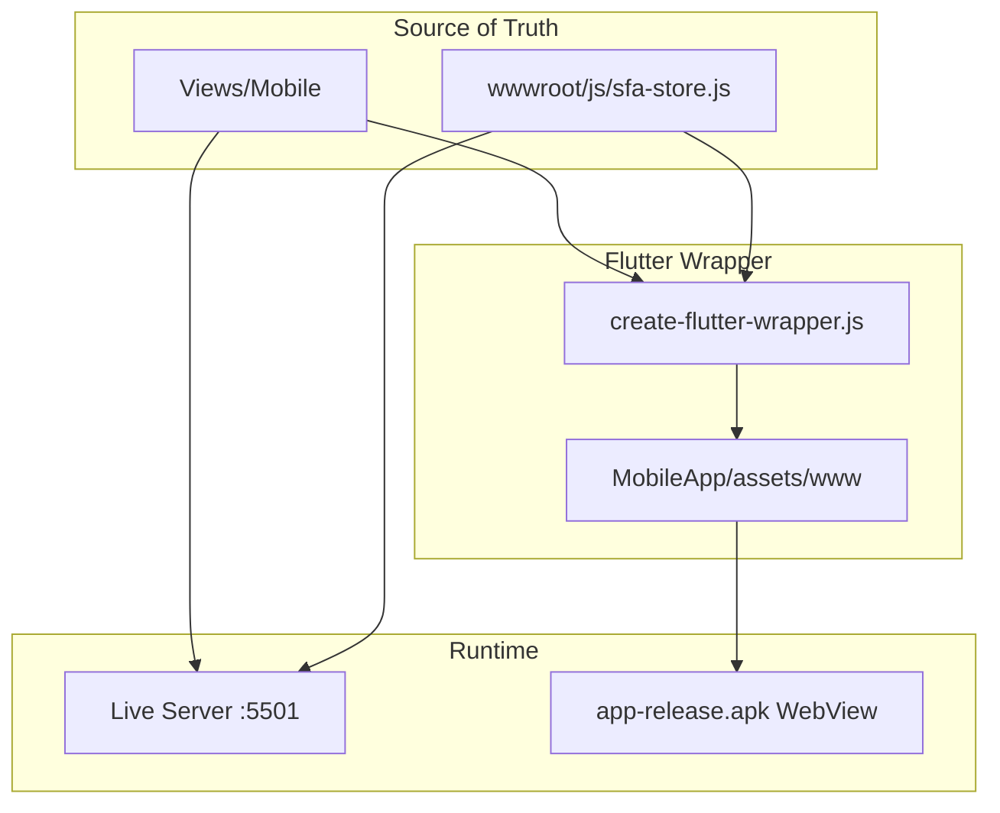

# Dokumentasi Mobile SFA — Falcon

Prototipe aplikasi **Sales Force Automation (SFA)** untuk canvasser lapangan. Berbasis HTML/CSS/JS responsif, dapat dijalankan di browser atau dibungkus sebagai APK Android (Flutter WebView).

---

## Daftar Dokumen

| Dokumen | Fokus |
|---------|-------|
| [pages/README.md](pages/README.md) | **Indeks dokumentasi per halaman (20 halaman)** |
| [sfa_mobile_prototype.md](sfa_mobile_prototype.md) | Arsitektur, modul, alur bisnis, panduan uji |
| [feedback_implementation.md](feedback_implementation.md) | Implementasi feedback stakeholder (PDF) |
| [generate_apk.md](generate_apk.md) | Build APK release |
| [../changelog_web_mobile_jul2026.md](../changelog_web_mobile_jul2026.md) | **Changelog Juli 2026** (unduh data, role MD, antrean upload) |
| [simplidots_sfa_mobile_flow.md](simplidots_sfa_mobile_flow.md) | Referensi alur SimpliDOTS (dekompilasi DLL) |
| [simplidots_sfa_mobile_status.md](simplidots_sfa_mobile_status.md) | Status ekstraksi SimpliDOTS |
| [restock_flow_redesign.md](restock_flow_redesign.md) | Redesign flow kulakan/restock |

---

## Quick Reference

### Entry & Kredensial Demo

```
URL    : http://127.0.0.1:5501/Views/Mobile/login.html
Motoris: sales01 / (password demo)  → urut outlet by GPS
MD     : md / moderntrade           → filter Rute Harian + Overdue
```

Legacy: `SINGARAJA` / `canvasser`, `FARREL` / `canvasser`

### Source Code

| Komponen | Path |
|----------|------|
| Halaman UI | [`Views/Mobile/`](../../Views/Mobile/) |
| Data layer | [`wwwroot/js/sfa-store.js`](../../wwwroot/js/sfa-store.js) |
| CSS mobile | [`wwwroot/css/mobile.css`](../../wwwroot/css/mobile.css) |
| Data wilayah | [`wwwroot/data/wilayah-jakarta.json`](../../wwwroot/data/wilayah-jakarta.json) |
| Flutter wrapper | [`Mobile/MobileApp/`](../../Mobile/MobileApp/) |
| Build script | [`build-apk.bat`](../../build-apk.bat) |
| Output APK | [`app-release.apk`](../../app-release.apk) |

### Alur Build APK

```
build-apk.bat
  ├─ scripts/create-flutter-wrapper.js   (sync Views/Mobile + wwwroot → Flutter assets)
  ├─ flutter build apk --release
  └─ copy → app-release.apk
```

---

## Arsitektur Singkat



---

## Modul Utama (Ringkas)

| Halaman | Fungsi |
|---------|--------|
| `login.html` | Autentikasi & session (role MD / motoris) |
| `home.html` | Beranda: KPI, unduh data server, 3 menu, Rute Kunjungan |
| `dasbor.html` | Grafik performa & filter periode |
| `visit_list.html` | Rute kunjungan: Rute Harian + Overdue (MD) / nearest GPS (motoris) |
| `visit_detail.html` | Visit outlet: cek stok, order, checkout (tanpa selector stokis) |
| `product_catalog.html` | Beli stok / cek stok stokis + picker GPS terdekat |
| `order_input.html` | Input sales order dari visit |
| `invoice_list.html` | Daftar faktur penjualan |
| `outlet_add.html` | Registrasi outlet baru |
| `sync_detail.html` | Antrean upload offline (retry, hapus selesai, kosongkan semua) |

Lihat [sfa_mobile_prototype.md](sfa_mobile_prototype.md) untuk detail lengkap.

---

## Testing

| Resource | Path |
|----------|------|
| Manual checklist | [`Testing/Mobile/testing_mobile.md`](../../Testing/Mobile/testing_mobile.md) |
| Playwright runner | [`Testing/Mobile/automation/verify_flow.js`](../../Testing/Mobile/automation/verify_flow.js) |
| Report generator | [`Testing/Mobile/automation/gen_report.js`](../../Testing/Mobile/automation/gen_report.js) |

---

## Catatan Penting

1. **`Views/Mobile/`** adalah source utama — jangan edit langsung di `Mobile/MobileApp/assets/www/` tanpa sync balik.
2. Setelah perubahan mobile, jalankan **`build-apk.bat`** sebelum distribusi APK.
3. Clear data app / uninstall APK lama setelah update seed (`sfa_seeded_v9_today`) agar demo data ter-refresh.
