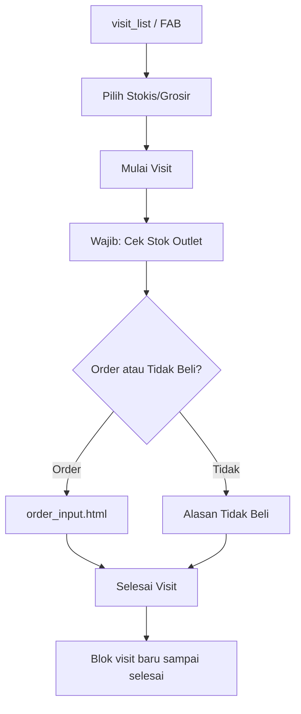

# Implementasi Feedback Mobile SFA (PDF Stakeholder)

Rekaman implementasi feedback stakeholder terhadap prototipe mobile Falcon SFA. Baseline UI mengacu pada versi post-sync `Views/Mobile/` + `wwwroot/`.

**Terakhir diperbarui:** Juli 2026

---

## Ringkasan Status

| Halaman PDF | Tema | Status |
|-------------|------|--------|
| 1 | Beranda & Periode Penjualan | Selesai |
| 2 | Visit flow & FAB | Selesai |
| 3 | Form outlet & order | Selesai |

---

## Halaman 1 — Beranda

| # | Feedback | Implementasi | File |
|---|----------|--------------|------|
| 1 | Periode Kanvas Aktif → **Periode Penjualan** (bulan berjalan) | `getActiveSalesPeriod()` | `home.html`, `sfa-store.js` |
| 2 | Hapus **Nama Siklus Kanvas** | Dihapus dari modal detail | `home.html` → `showCanvasPeriodDetails()` |
| 3 | **Gudang/Stockist Asal** = list grosir/stokis | Render `<ul>` dari `SEED_STOCKISTS` | `home.html`, `sfa-store.js` |
| 4 | Hapus **Kendaraan Operasional** | Dihapus dari modal | `home.html` |
| 5 | **Rute Kunjungan Hari Ini** sebagai tombol utama | CTA hijau di tengah layar | `home.html` |
| 6 | Grid menu: **4 item** saja | Cek Stok, Faktur, Visit, Sync | `home.html` |
| 7 | Beli dari Stokis → **Cek Stok dan Belanja Stokis** | Rename menu & header katalog | `home.html`, `product_catalog.html` |
| 8 | Stokis/Grosir **wajib** saat visit | `#stockistSelect`, guard `STOCKIST_REQUIRED` | `visit_detail.html`, `sfa-store.js` |
| 9 | Visit: **wajib cek stok**, belanja opsional | `stockCheckDone` + mode `stockcheck` | `visit_detail.html`, `product_catalog.html` |
| 10 | Check In → **Visit** | Rename label & copy UI | `home.html`, `visit_detail.html`, `visit_list.html` |
| 11 | Sinkronisasi: Data Master, Pelanggan, Transaksi Offline | Accordion beranda | `home.html` |

---

## Halaman 2 — Visit Flow

| # | Feedback | Implementasi | File |
|---|----------|--------------|------|
| 1 | FAB `+` → **2 menu**: Tambah Kunjungan & Tambah Outlet Baru | Speed dial FAB | `visit_list.html`, `outlet_list.html` |
| 2 | Hanya **1 visit aktif** per waktu | `getActiveVisit()` + guard di `saveVisit()` | `sfa-store.js`, `visit_detail.html`, `outlet_detail.html` |
| 3 | Check-out via **penjualan** atau **alasan tidak beli** | `triggerCheckOutWorkflow()` | `visit_detail.html` |
| 4 | Alasan **"Lainnya"** + kolom custom | `#noOrderCustomDiv` | `visit_detail.html` |
| 5 | Menu Pelanggan tetap ada (di luar FAB) | `outlet_list.html` via navigasi lain | `outlet_list.html` |

### Alur Visit (setelah feedback)



---

## Halaman 3 — Form Outlet & Order

| # | Feedback | Implementasi | File |
|---|----------|--------------|------|
| 1 | **Dropdown & Search** Kota/Kecamatan/Kelurahan | `initSearchSelect()` + JSON wilayah | `outlet_add.html`, `wilayah-jakarta.json` |
| 2 | RT/RW: pemisah **`/`** permanen | `.rtrw-row` + `.rtrw-sep` | `outlet_add.html` |
| 3 | **Foto toko wajib** | Validasi `saveOutlet()` | `outlet_add.html` |
| 4 | **NPWP mask** `00.000.000.0-000.000` | `formatNpwpFromDigits()` | `outlet_add.html` |
| 5 | **Tanggal pengiriman** tidak bisa diubah | Read-only, hari transaksi | `order_input.html` |

---

## Data Dummy yang Ditambahkan

| Data | Lokasi | Keterangan |
|------|--------|------------|
| `wilayah-jakarta.json` | `wwwroot/data/` | 8 kecamatan Jakarta Pusat + kelurahan |
| `SEED_STOCKISTS` | `sfa-store.js` | 6 grosir/stokis demo |
| Seed visit hari ini | `buildSeedVisits()` | 2 outlet selesai, sisanya belum kunjungan |
| Seed key | `sfa_seeded_v9_today` | Auto-refresh localStorage harian |

### Rute demo hari ini

```
DEFAULT_ROUTE_IDS = OL-10492, OL-10511, OL-10283, OL-10772, OL-10819
Hari ini: 2 pertama → checked_out (selesai)
          3 sisanya → unvisited (belum ada record visit)
```

---

## Sinkronisasi Folder

Perubahan diterapkan di:

1. `Views/Mobile/` + `wwwroot/` (source utama)
2. `Mobile/MobileApp/assets/www/` (mirror untuk Flutter)
3. APK via `build-apk.bat`

---

## Checklist Verifikasi

### Beranda
- [ ] Banner "Periode Penjualan" menampilkan bulan berjalan
- [ ] Modal detail: list stockist, tanpa siklus & kendaraan
- [ ] 4 menu grid + tombol Rute Kunjungan

### Visit
- [ ] FAB buka 2 opsi
- [ ] Visit outlet kedua diblok saat outlet pertama masih aktif
- [ ] Selesai visit wajib cek stok dulu
- [ ] Alasan tidak beli "Lainnya" wajib isi teks

### Form
- [ ] NPWP: separator tetap saat mengetik
- [ ] Dropdown kecamatan/kelurahan terisi
- [ ] Foto wajib, tanggal pengiriman locked di order
