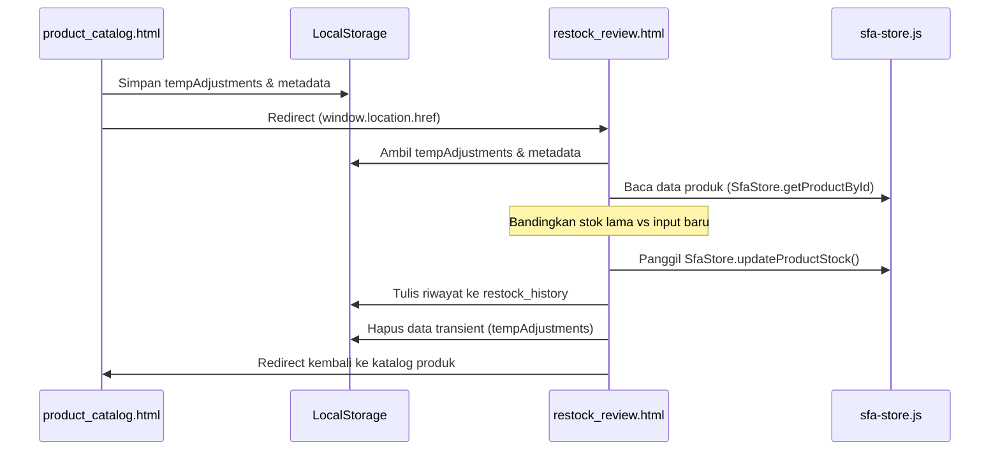

# Desain Alur Kulakan (Restock) SFA Mobile

Dokumen ini mendokumentasikan pembaruan alur konfirmasi pengisian stok ulang (kulakan/restock) motoris pada aplikasi SimpliDOTS SFA Mobile.

## 1. Latar Belakang & Tujuan
Sebelumnya, ketika sales mengklik tombol **Kirim Data Kulakan**, aplikasi langsung memunculkan dialog konfirmasi standar SweetAlert2. Pendekatan ini memiliki beberapa kekurangan:
* **Resiko Selisih Stok (Human Error):** Sales tidak dapat meninjau kembali produk apa saja yang diubah jumlah fisiknya dan berapa nilai lamanya sebelum data terkirim secara permanen ke server.
* **Keterbatasan Informasi:** Tidak ada ruang untuk menampilkan ringkasan nota bukti belanja yang diunggah, koordinat GPS check-in, atau menulis catatan tambahan (remarks).

Untuk mengatasi hal tersebut, alur diubah menjadi sistem **Halaman Review Khusus (Checkout-style)** seperti pada aplikasi modern (contoh: Gojek/Shopee).

---

## 2. Struktur File & Modifikasi

Penerapan alur baru melibatkan modifikasi pada file-file berikut:
* **`Views/Mobile/product_catalog.html` (Modifikasi):**
  * Mengubah panel status & aksi kulakan dari kartu statis di atas list produk menjadi **Floating Bottom Bar (Gojek-style)** yang melayang di bagian bawah layar.
  * Menampilkan counter jumlah produk yang disesuaikan secara real-time pada Floating Bar saat berada di langkah input stok.
  * Menambahkan bottom padding pada daftar produk sebesar `100px` agar produk paling bawah tidak tertutup oleh bar melayang.
  * Mengintegrasikan `localStorage` untuk menyimpan state kulakan (`restock_state`, `temp_restock_adjustments`, `temp_restock_time`, dan `temp_restock_grosir`).
  * Saat tombol **Tinjau** ditekan, data di-serialize dan pengguna diarahkan ke halaman review.
* **`Views/Mobile/restock_review.html` (Baru):**
  * Halaman penuh khusus untuk me-review ringkasan kulakan sebelum diserahkan ke server.
* **`wwwroot/js/sfa-store.js` (Modifikasi):**
  * Menambahkan fungsi `updateProductStock(code, stockKarton)` untuk memperbarui nilai database tiruan di `localStorage` saat laporan dikirim secara sukses.

---

## 3. Desain UI/UX Halaman Review (`restock_review.html`)

Halaman review dirancang dengan estetika premium menggunakan pedoman desain Kalbe Nutritionals:

```
+-------------------------------------------------+
| <  Konfirmasi Kulakan                           |
+-------------------------------------------------+
| REVIEW DATA KULAKAN                             |
| Silakan periksa kembali laporan stok motoris    |
+-------------------------------------------------+
| [STORE] LOKASI & CHECK-IN                       |
| Grosir Sinar Jaya (GPS Valid)                   |
| Check-in: Hari ini, 08:52 WIB                   |
+-------------------------------------------------+
| [RECEIPT] BUKTI PEMBELIAN                       |
| nota_belanja_stokis.jpg (1.4 MB)                |
+-------------------------------------------------+
| [BOX] RINGKASAN PENYESUAIAN STOK                |
| Morinaga Chil*Kid Gold                          |
|   - Karton: 36 -> 40 (Highlight)                |
|   - Box:    0  -> 0                             |
|   - Pcs:    0  -> 0                             |
+-------------------------------------------------+
| [COMMENT] CATATAN TAMBAHAN                      |
| [ Masukkan catatan di sini...                ]  |
+-------------------------------------------------+
| [ KIRIM LAPORAN KULAKAN (GREEN)               ] |
| [ Cek Kembali (OUTLINE)                       ] |
+-------------------------------------------------+
```

### Fitur Kunci:
1. **Tabel Komparatif (Old vs New):** Menampilkan perbandingan stok lama dan stok baru per satuan unit (Karton, Box, Pcs) dengan ikon transisi. Sel yang mengalami perubahan stok akan ditandai dengan badge khusus berwarna hijau (`.val-changed`).
2. **Catatan Remarks:** Field textarea opsional bagi sales untuk menambahkan catatan khusus yang akan disimpan dalam riwayat mutasi.
3. **Penyimpanan Persisten:** Saat pengiriman disetujui, stok produk di `SfaStore` diperbarui dan data transaksi didaftarkan ke logs mutasi lokal.

---

## 4. Alur Sinkronisasi Data


