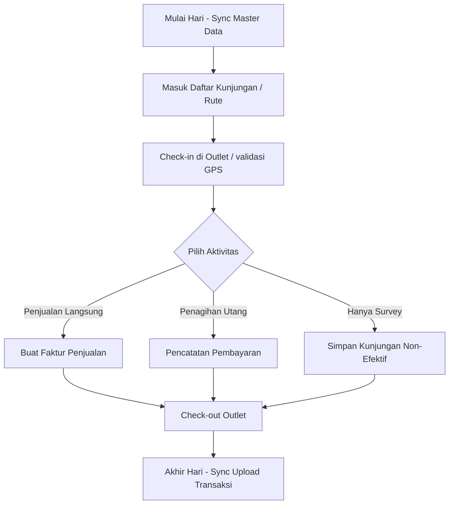

# 🔄 Analisis Alur Kerja & Logika Bisnis (Flow) SimpliDOTS SFA Mobile

Dokumen ini menjelaskan alur kerja operasional (workflow) dan logika bisnis internal aplikasi SimpliDOTS SFA Android berdasarkan hasil ekstraksi metode (*methods*) dan bidang (*fields*) dari kelas C# Service utama di assembly `simplidots.sfa.dll`.

---

## 📌 Alur Transaksi Utama (Data Flow Diagram)

Secara umum, alur kerja di lapangan dibagi menjadi 3 fase utama yang didukung oleh tabel lokal SQLite dan sinkronisasi API:

---

## 🛠️ Detail Alur Bisnis & Method Mapping

Berikut adalah detail bagaimana logika C# di dalam APK mengendalikan alur kerja di antarmuka (UI):

### 1. Alur Kunjungan Harian & Check-in (`DailyVisitService`)
Alur ini mengelola pergerakan salesman dari satu toko ke toko lain berdasarkan jadwal rute harian.
* **Membaca Rute**: Halaman `CustomerDaily` (Daftar Pelanggan Rute) memanggil method **`ReadDailyVisits()`** atau **`ReadDailyVisitsCurrent()`** untuk memuat daftar toko yang harus dikunjungi hari ini.
* **Proses Check-in**:
  1. Ketika sales tiba di lokasi dan menekan tombol *Check-in*, aplikasi memanggil **`GetVisitingCustomer()`** untuk mengunci profil toko yang dikunjungi.
  2. Aplikasi memanggil **`InsertDailyVisitAsync()`** untuk membuat entri kunjungan baru di SQLite lokal dengan status `Mulai` beserta timestamp dan koordinat GPS.
* **Penyelesaian Kunjungan (Check-out)**:
  1. Setelah sales selesai melakukan transaksi (beli atau tidak beli), sales menekan tombol *Check-out*.
  2. Aplikasi memanggil **`CompleteDailyVisitAsync()`** yang mengubah status kunjungan menjadi `Selesai`, mencatat timestamp keluar, mengunci durasi kunjungan, dan mencatat alasan jika kunjungan tersebut tidak menghasilkan penjualan (*Non-Effective Call*).

### 2. Alur Faktur Penjualan Canvasser (`SalesOrderService`)
Karena pengguna berstatus sebagai *Canvasser*, mereka langsung menerbitkan Faktur Penjualan (Invoice) di toko, bukan sekadar Sales Order (SO) untuk dikirim besok.
* **Pembuatan Faktur**:
  1. Saat sales memilih produk dan menginput jumlah karton/pcs di halaman `order_input.html`, keranjang belanja lokal dibentuk.
  2. Ketika sales menekan *Simpan*, aplikasi mengeksekusi **`InsertSalesOrderAsync()`** yang menyimpan draf faktur ke tabel lokal `SalesOrderTable`.
* **Kalkulasi Metrik & Dashboard**:
  - Method **`RequestDashboard()`** secara berkala menghitung total nilai rupiah dan kuantitas faktur yang dibuat hari ini untuk memperbarui tampilan grafik progress di halaman `dasbor.html`.
* **Penyelesaian Faktur**:
  - Setelah dikonfirmasi (misal dicetak ke thermal printer), aplikasi memanggil **`CompleteSalesOrderAsync()`** untuk mengunci faktur tersebut agar siap dikirim ke server.

### 3. Alur Pembayaran Piutang Pelanggan (`CollectionService`)
Digunakan oleh canvasser untuk menagih faktur yang jatuh tempo (*outstanding AR*) dari kunjungan sebelumnya.
* **Membaca Outstanding AR**:
  - Saat sales membuka modul Pembayaran, aplikasi memanggil **`ReadSalesInvoiceCollectionsByCustomerId()`** untuk menampilkan semua tagihan belum lunas milik outlet tersebut.
* **Pencatatan Pembayaran**:
  - Sales menginput nominal uang yang dibayar (Tunai/Transfer/Cek).
  - Jika pembayaran dialokasikan untuk beberapa faktur sekaligus, aplikasi memanggil **`UpdateMultipleCollectionAsync()`** untuk membagi nominal pembayaran secara proporsional.
* **Penyelesaian Pembayaran**:
  - Menekan tombol *Simpan* akan memicu **`InsertSalesInvoiceCollectionAsync()`** disusul dengan **`CompleteSalesInvoiceCollectionAsync()`** untuk menandai faktur tersebut sebagai lunas/lunas sebagian di database lokal.

### 4. Alur Sinkronisasi Offline-to-Online (`SyncViewModel` & Services)
Karena sales sering kehilangan sinyal di dalam toko (minimarket/pasar basah), aplikasi mengadopsi model *Offline-First*.
* **Status Antrean**:
  - Properti **`InvoiceId`** dan **`ErrorCode`** di `SyncViewModel` memantau status antrean transaksi yang belum ter-upload.
* **Proses Upload/Sync**:
  - Ketika tombol *Sinkronisasi Data* ditekan, masing-masing service menjalankan method **`PullAsync()`** secara berurutan:
    1. Mengunggah faktur penjualan baru (`SalesOrderService.PullAsync()`).
    2. Mengunggah hasil penagihan piutang (`CollectionService.PullAsync()`).
    3. Mengunduh data master terbaru dari server seperti daftar harga baru, promo baru, dan sisa stok gudang canvass (`PullAsync()` pada master services).
  - Jika terjadi tabrakan data (misal data pelanggan diubah oleh admin web di waktu yang sama), aplikasi memicu **`ResolveConflictsAsync()`** untuk menentukan versi data mana yang valid.
