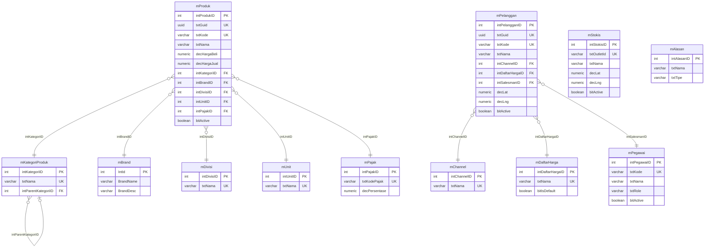

# ERD Data Master Falcon FPRS — Standar Tabel MAVEN

Dokumen ini menyelaraskan bentuk data modul **Data Master** pada prototype Falcon FPRS (`Prototype/Views/FPRS/MasterData`) dengan **standar tabel DAL MAVEN** (.NET 8 + EF Core + PostgreSQL). Tujuannya menjadi acuan pembuatan **ERD di FSD** saat modul prototype dikembangkan menjadi modul CRUD MAVEN yang sebenarnya.

> Sumber data prototype: `Prototype/wwwroot/data/*.json`
> Sumber standar MAVEN: `MAVEN.DAL/ModelBuilders/**` (mis. `MBrandModelBuilder`, `MVendorModelBuilder`, `TProgramModelBuilder`)

---

## 1. Konvensi Standar DAL MAVEN

MAVEN memakai konvensi **Hungarian prefix / PascalCase** (dominan di modul master inti dan seluruh modul DOFS terbaru). Konvensi inilah yang dipakai untuk tabel Falcon yang baru.

### 1.1 Penamaan Tabel

| Jenis | Pola | Contoh |
|-------|------|--------|
| Master | `mXxx` | `mBrand`, `mVendor`, `mProduk` |
| Transaksi | `tXxx` | `tProgram`, `tProgramPO` |
| Mapping/relasi | `MappingXxx` | `MappingSubBrand` |

### 1.2 Prefix Kolom (berdasarkan tipe data)

| Prefix | Tipe | Keterangan |
|--------|------|------------|
| `int` | integer / serial / uuid PK | ID & angka bulat, mis. `intProdukID` |
| `txt` | varchar / text | teks, mis. `txtNama`, `txtGuid` |
| `dt` / `dtm` | timestamp | tanggal/waktu (`timestamp without time zone`) |
| `bit` | boolean | flag, mis. `bitActive` |
| `dec` | numeric / decimal | nilai uang, berat, dimensi, koordinat |

### 1.3 Blok Audit Wajib (standar di setiap tabel)

Diambil dari pola DOFS (`MVendor`, `TProgram`, `MPrizeHeader`):

| Kolom | Tipe | Default | Keterangan |
|-------|------|---------|------------|
| `bitActive` | boolean | `true` | status aktif record |
| `dtInserted` | timestamp | `CURRENT_TIMESTAMP` | tanggal buat |
| `txtInsertedBy` | varchar(100) | — | user pembuat |
| `dtUpdated` | timestamp | — | tanggal ubah terakhir |
| `txtUpdatedBy` | varchar(100) | — | user pengubah |
| `dtNonActive` | timestamp | — | tanggal non-aktif (opsional, soft-delete) |

> Catatan: modul master lama (mis. `mBrand`) memakai varian `DtmCreatedDate/txtCreatedBy/DtmUpdatedDate/txtUpdatedBy`. Untuk tabel baru gunakan blok audit DOFS di atas agar konsisten dengan pengembangan terkini.

### 1.4 Pola Primary Key & GUID

Ada dua pola yang sah di MAVEN — pilih salah satu secara konsisten:

- **Pola Brand (master inti):** PK integer identity `intXxxID` + kolom `txtGuid` uuid terpisah sebagai identitas publik.
- **Pola DOFS (terbaru):** PK langsung uuid dengan default `gen_random_uuid()`.

Dokumen ini memakai **Pola Brand** (PK `intXxxID` serial + `txtGuid` uuid) karena paling cocok untuk data master ber-`id` numerik seperti pada prototype.

### 1.5 Database

- DBMS: **PostgreSQL** (Npgsql), koneksi `PostgreDBConnection`.
- Tipe timestamp: `timestamp without time zone`.
- Context: `CentralContext` (`MAVEN.DAL/Context/CentralContext.cs`).

---

## 2. Ringkasan Modul & Pemetaan

| Modul Prototype | Seed JSON | Tabel MAVEN | Sifat | Keterangan |
|-----------------|-----------|-------------|-------|------------|
| Produk | `produk.json` | `mProduk` (baru) | CRUD | banyak FK lookup |
| Pelanggan | `pelanggan.json` | `mPelanggan` (baru) | CRUD | outlet/customer |
| Pegawai | `pegawai.json` | `mPegawai` (baru) | CRUD | salesman/motoris |
| Stokis / Grosir | `stokis.json` | `mStokis` (baru) | View-only (CSV) | input via Upload CSV |
| Channel | `channel.json` | `mChannel` (baru) | Lookup | |
| Pajak | `pajak.json` | `mPajak` (baru) | Lookup | |
| Alasan | `alasan.json` | `mAlasan` (baru) | Lookup | Return/Kunjungan/Order |
| Kategori Produk | `kategori-produk.json` | `mKategoriProduk` (baru) | Lookup | self-reference |
| Divisi | `divisi.json` | `mDivisi` (baru) | Lookup | |
| Unit (UOM) | `unit.json` | `mUnit` (baru) | Lookup | |
| Daftar Harga | `daftar-harga.json` | `mDaftarHarga` (baru) | Lookup | |
| Brand | `brand.json` | **`mBrand` (REUSE)** | Lookup | sudah ada di MAVEN |

---

## 3. Tabel Master Inti

Setiap tabel mengasumsikan **blok audit standar (1.3)** ditambahkan di akhir; hanya kolom bisnis yang ditampilkan.

### 3.1 `mProduk` — Master Produk
Sumber: `produk.json`

| Kolom | Tipe | Kunci | Asal JSON | Keterangan |
|-------|------|-------|-----------|------------|
| `intProdukID` | serial | PK | `id` | |
| `txtGuid` | uuid | UQ | — | identitas publik |
| `txtKode` | varchar(50) | UQ | `kode` | kode produk / SKU |
| `txtNama` | varchar(255) | | `nama` | nama produk |
| `txtPartnerId` | varchar(100) | | `partnerId` | ID integrasi eksternal |
| `decHargaBeli` | numeric(18,2) | | `hargaBeli` | ≥ 0 |
| `decHargaJual` | numeric(18,2) | | `hargaJual` | ≥ 0, ≥ hargaBeli |
| `intKategoriID` | int | FK → `mKategoriProduk` | `kategori` | disimpan by ID (bukan nama) |
| `intBrandID` | int | FK → `mBrand` | `brand` | reuse master MAVEN |
| `intDivisiID` | int | FK → `mDivisi` | `divisi` | |
| `intUnitID` | int | FK → `mUnit` | `unitNama` | unit konversi |
| `intPajakID` | int | FK → `mPajak` | `namaPajak` | skema pajak |
| `txtUmbrella` | varchar(100) | | `umbrella` | umbrella brand |
| `txtSupplier` | varchar(255) | | `supplier` | |
| `decBerat` | numeric(10,3) | | `berat` | kg, ≥ 0 |
| `decPanjang` | numeric(10,2) | | `panjang` | cm |
| `decLebar` | numeric(10,2) | | `lebar` | cm |
| `decTinggi` | numeric(10,2) | | `tinggi` | cm |
| `bitActive` | boolean | | `status` | "active" → true |

### 3.2 `mPelanggan` — Master Pelanggan / Outlet
Sumber: `pelanggan.json`

| Kolom | Tipe | Kunci | Asal JSON | Keterangan |
|-------|------|-------|-----------|------------|
| `intPelangganID` | serial | PK | `id` | |
| `txtGuid` | uuid | UQ | — | |
| `txtKode` | varchar(50) | UQ | `kode` | kode pelanggan |
| `txtNama` | varchar(255) | | `nama` | nama outlet |
| `txtPartnerId` | varchar(100) | | `partnerId` | |
| `txtAlamat` | varchar(500) | | `alamat` | |
| `txtTelepon` | varchar(30) | | `telepon` | |
| `txtPemilik` | varchar(255) | | `pemilik` | |
| `txtNpwp` | varchar(30) | | `npwp` | |
| `txtRtRw` | varchar(20) | | `rtrw` | |
| `txtKelurahan` | varchar(100) | | `kelurahan` | |
| `txtKecamatan` | varchar(100) | | `kecamatan` | |
| `txtKota` | varchar(100) | | `kota` | |
| `intChannelID` | int | FK → `mChannel` | `channel` | |
| `intDaftarHargaID` | int | FK → `mDaftarHarga` | `daftarHarga` | |
| `intSalesmanID` | int | FK → `mPegawai` | `salesman` / `employee` | salesman penanggung jawab |
| `txtGrupPelanggan` | varchar(100) | | `grupPelanggan` | mis. Apotek, General Trade |
| `txtOutletType` | varchar(100) | | `outletType` | |
| `txtWaktuPembayaran` | varchar(50) | | `waktuPembayaran` | mis. Net 30 |
| `dtKunjunganTerakhir` | timestamp | | `kunjunganTerakhir` | |
| `dtTransaksiTerakhir` | timestamp | | `transaksiTerakhir` | |
| `decLat` | numeric(10,7) | | `lat` | GPS |
| `decLng` | numeric(10,7) | | `lng` | GPS |
| `bitHasGps` | boolean | | `hasGps` | |
| `txtPhoto` | varchar(500) | | `photo` | path/URL foto outlet |
| `bitActive` | boolean | | `status` | "Active" → true |

### 3.3 `mPegawai` — Master Pegawai / Salesman
Sumber: `pegawai.json`

| Kolom | Tipe | Kunci | Asal JSON | Keterangan |
|-------|------|-------|-----------|------------|
| `intPegawaiID` | serial | PK | `id` | |
| `txtGuid` | uuid | UQ | — | |
| `txtKode` | varchar(50) | UQ | `kode` | NIK / kode pegawai |
| `txtNama` | varchar(255) | | `nama` | |
| `txtRole` | varchar(100) | | `role` | mis. Motoris |
| `txtTelepon` | varchar(30) | | `telepon` | |
| `txtBranch` | varchar(100) | | `branch` | |
| `txtRegion` | varchar(100) | | `region` | |
| `txtKeterangan` | varchar(500) | | `keterangan` | |
| `bitActive` | boolean | | `status` | "Active" → true |

### 3.4 `mStokis` — Master Stokis / Grosir (View-only, input via CSV)
Sumber: `stokis.json` (+ `master_stokis.md`)

| Kolom | Tipe | Kunci | Asal JSON | Keterangan |
|-------|------|-------|-----------|------------|
| `intStokisID` | serial | PK | `id` | |
| `txtGuid` | uuid | UQ | — | |
| `txtOutletId` | varchar(50) | UQ | `kode` / `outlet_id` | identitas utama import CSV |
| `txtNama` | varchar(255) | | `nama` | |
| `txtAlamat` | varchar(500) | | `alamat` | |
| `txtKota` | varchar(100) | | `kota` | (dari CSV) |
| `txtBranch` | varchar(100) | | `branch` | |
| `txtRegion` | varchar(100) | | `region` | |
| `txtTelepon` | varchar(30) | | `telepon` | |
| `decLat` | numeric(10,7) | | `lat` | unik per outlet (cek duplikat) |
| `decLng` | numeric(10,7) | | `lng` | unik per outlet (cek duplikat) |
| `bitActive` | boolean | | `status` | Active/Inactive hasil sinkron CSV |

> Aturan khusus: data **hanya** ditambah/diubah via **Upload CSV**. Outlet ID di file → Active; Outlet ID lama yang tidak ada di file → Inactive; koordinat duplikat → baris dilewati.

### 3.5 `mChannel` — Master Channel
Sumber: `channel.json`

| Kolom | Tipe | Kunci | Asal JSON | Keterangan |
|-------|------|-------|-----------|------------|
| `intChannelID` | serial | PK | `id` | |
| `txtGuid` | uuid | UQ | — | |
| `txtNama` | varchar(100) | UQ | `nama` | mis. MT-HPM-NKA |
| `bitActive` | boolean | | — | default true |

> `totalPelanggan` = field turunan (COUNT dari `mPelanggan`), tidak disimpan.

### 3.6 `mPajak` — Master Pajak
Sumber: `pajak.json`

| Kolom | Tipe | Kunci | Asal JSON | Keterangan |
|-------|------|-------|-----------|------------|
| `intPajakID` | serial | PK | `id` | |
| `txtGuid` | uuid | UQ | — | |
| `txtKodePajak` | varchar(50) | UQ | `kodePajak` | mis. PPN, NoPPN |
| `txtNamaPajak` | varchar(100) | | `namaPajak` | |
| `txtPartnerId` | varchar(100) | | `partnerId` | |
| `decPersentase` | numeric(5,2) | | `persentase` | mis. 12.00 |
| `txtNilaiDpp` | varchar(50) | | `nilaiDpp` | dasar pengenaan pajak |
| `bitActive` | boolean | | — | default true |

### 3.7 `mAlasan` — Master Alasan
Sumber: `alasan.json`

| Kolom | Tipe | Kunci | Asal JSON | Keterangan |
|-------|------|-------|-----------|------------|
| `intAlasanID` | serial | PK | `id` | |
| `txtGuid` | uuid | UQ | — | |
| `txtNama` | varchar(255) | | `nama` | |
| `txtDeskripsi` | varchar(500) | | `deskripsi` | |
| `txtTipe` | varchar(50) | | `tipe` | Return / Kunjungan / Order |
| `bitActive` | boolean | | — | default true |

---

## 4. Tabel Lookup Pendukung

### 4.1 `mKategoriProduk` — Kategori Produk (self-reference)
Sumber: `kategori-produk.json`

| Kolom | Tipe | Kunci | Asal JSON | Keterangan |
|-------|------|-------|-----------|------------|
| `intKategoriID` | serial | PK | `id` | |
| `txtGuid` | uuid | UQ | — | |
| `txtNama` | varchar(100) | UQ | `nama` | |
| `intParentKategoriID` | int NULL | FK → `mKategoriProduk` | `parentKategori` | hierarki kategori (self-FK) |
| `bitActive` | boolean | | — | default true |

### 4.2 `mDivisi` — Divisi
Sumber: `divisi.json`

| Kolom | Tipe | Kunci | Asal JSON | Keterangan |
|-------|------|-------|-----------|------------|
| `intDivisiID` | serial | PK | `id` | |
| `txtGuid` | uuid | UQ | — | |
| `txtNama` | varchar(100) | UQ | `nama` | mis. Nutritionals, OTC |
| `txtDeskripsi` | varchar(500) | | `deskripsi` | |
| `bitActive` | boolean | | — | default true |

### 4.3 `mUnit` — Unit / UOM
Sumber: `unit.json`

| Kolom | Tipe | Kunci | Asal JSON | Keterangan |
|-------|------|-------|-----------|------------|
| `intUnitID` | serial | PK | `id` | |
| `txtGuid` | uuid | UQ | — | |
| `txtNama` | varchar(50) | UQ | `nama` | mis. PCS, BOX |
| `txtDeskripsi` | varchar(100) | | `deskripsi` | |
| `txtUomPajak` | varchar(50) | | `uomPajak` | UOM untuk pajak |
| `txtPartnerId` | varchar(100) | | `partnerId` | |
| `bitActive` | boolean | | — | default true |

### 4.4 `mDaftarHarga` — Daftar Harga / Price List
Sumber: `daftar-harga.json`

| Kolom | Tipe | Kunci | Asal JSON | Keterangan |
|-------|------|-------|-----------|------------|
| `intDaftarHargaID` | serial | PK | `id` | |
| `txtGuid` | uuid | UQ | — | |
| `txtNama` | varchar(100) | UQ | `nama` | mis. Inc Pajak |
| `bitIsDefault` | boolean | | `isDefault` | price list default |
| `bitIsInclusiveTax` | boolean | | `isInclusiveTax` | harga termasuk pajak |
| `bitActive` | boolean | | — | default true |

### 4.5 `mBrand` — REUSE tabel MAVEN yang sudah ada
Sumber prototype: `brand.json` → **jangan buat tabel baru**, gunakan `mBrand` yang sudah ada di `CentralContext`.

Pemetaan field:

| Field `brand.json` | Kolom `mBrand` (existing) | Keterangan |
|--------------------|---------------------------|------------|
| `id` | `IntId` (PK) | |
| `nama` | `BrandName` | |
| `deskripsi` | `BrandDesc` | |
| `totalProduk` | — | field turunan (COUNT), tidak disimpan |

> Pertimbangkan juga reuse `mManufacturer` / `mSubBrand` MAVEN bila konsep prototype berkembang ke arah tersebut.

---

## 5. Diagram ERD (Gabungan)



### Daftar Relasi (FK)

| Tabel Anak | Kolom FK | Tabel Induk | Kardinalitas |
|------------|----------|-------------|--------------|
| `mProduk` | `intKategoriID` | `mKategoriProduk` | many-to-one |
| `mProduk` | `intBrandID` | `mBrand` | many-to-one |
| `mProduk` | `intDivisiID` | `mDivisi` | many-to-one |
| `mProduk` | `intUnitID` | `mUnit` | many-to-one |
| `mProduk` | `intPajakID` | `mPajak` | many-to-one |
| `mKategoriProduk` | `intParentKategoriID` | `mKategoriProduk` | self, many-to-one (nullable) |
| `mPelanggan` | `intChannelID` | `mChannel` | many-to-one |
| `mPelanggan` | `intDaftarHargaID` | `mDaftarHarga` | many-to-one |
| `mPelanggan` | `intSalesmanID` | `mPegawai` | many-to-one |

> `mStokis` dan `mAlasan` berdiri sendiri (tanpa FK). `mStokis` dikonsumsi aplikasi mobile via layanan terpisah, `mAlasan` dipakai transaksi (Return/Kunjungan/Order) — relasi terbentuk di modul transaksi, bukan master.

---

## 6. Catatan Desain

- **Status → boolean.** Field `status` string prototype ("active"/"Active"/"Inactive") dipetakan ke `bitActive` boolean. Nilai selain aktif → `false`.
- **Field turunan tidak disimpan.** `totalProduk` (brand) dan `totalPelanggan` (channel) adalah hasil agregasi COUNT, bukan kolom fisik.
- **ID prototype → PK + GUID.** `id` integer prototype menjadi `intXxxID` (PK serial) plus tambahan `txtGuid` uuid sesuai standar MAVEN untuk identitas publik/URL.
- **Relasi by ID, bukan nama.** Di prototype relasi disimpan sebagai string nama (mis. `kategori`, `brand`, `channel`). Di MAVEN diganti kolom FK `intXxxID` yang mengacu tabel lookup, agar integritas referensial terjaga.
- **Reuse master eksisting.** `brand.json` dipetakan ke `mBrand` MAVEN yang sudah ada — hindari duplikasi. Pertimbangkan `mManufacturer` dan `mSubBrand` bila relevan.
- **Blok audit.** Setiap tabel baru menambahkan blok audit standar (bagian 1.3): `bitActive`, `dtInserted`, `txtInsertedBy`, `dtUpdated`, `txtUpdatedBy`, `dtNonActive`.
- **Panjang kolom (varchar) bersifat usulan** mengikuti pola MAVEN (kode ≤ 50, nama ≤ 255, deskripsi ≤ 500) dan dapat disesuaikan saat implementasi.
- **`mStokis` non-CRUD.** Tidak ada form Create/Edit; sinkronisasi penuh via Upload CSV dengan aturan Active/Inactive dan validasi duplikat koordinat.

---

## 7. Query Pembuatan Tabel (DDL PostgreSQL)

Skrip DDL berikut siap dieksekusi di PostgreSQL (sesuai konvensi bagian 1). Setiap tabel memakai PK serial `intXxxID`, kolom `txtGuid` uuid (default `gen_random_uuid()`), dan blok audit standar. Nama tabel/kolom dikutip (`"..."`) agar case-sensitive sesuai gaya MAVEN.

### 7.1 Tabel Lookup (buat lebih dulu — jadi target FK)

```sql
-- Kategori Produk (self-reference)
CREATE TABLE "mKategoriProduk" (
    "intKategoriID"       serial PRIMARY KEY,
    "txtGuid"             uuid NOT NULL DEFAULT gen_random_uuid(),
    "txtNama"             varchar(100) NOT NULL,
    "intParentKategoriID" int NULL,
    "bitActive"           boolean NOT NULL DEFAULT true,
    "dtInserted"          timestamp without time zone NOT NULL DEFAULT CURRENT_TIMESTAMP,
    "txtInsertedBy"       varchar(100) NULL,
    "dtUpdated"           timestamp without time zone NULL,
    "txtUpdatedBy"        varchar(100) NULL,
    "dtNonActive"         timestamp without time zone NULL,
    CONSTRAINT "mKategoriProduk_txtNama_uq" UNIQUE ("txtNama"),
    CONSTRAINT "mKategoriProduk_parent_fk" FOREIGN KEY ("intParentKategoriID")
        REFERENCES "mKategoriProduk" ("intKategoriID")
);

-- Divisi
CREATE TABLE "mDivisi" (
    "intDivisiID"   serial PRIMARY KEY,
    "txtGuid"       uuid NOT NULL DEFAULT gen_random_uuid(),
    "txtNama"       varchar(100) NOT NULL,
    "txtDeskripsi"  varchar(500) NULL,
    "bitActive"     boolean NOT NULL DEFAULT true,
    "dtInserted"    timestamp without time zone NOT NULL DEFAULT CURRENT_TIMESTAMP,
    "txtInsertedBy" varchar(100) NULL,
    "dtUpdated"     timestamp without time zone NULL,
    "txtUpdatedBy"  varchar(100) NULL,
    "dtNonActive"   timestamp without time zone NULL,
    CONSTRAINT "mDivisi_txtNama_uq" UNIQUE ("txtNama")
);

-- Unit / UOM
CREATE TABLE "mUnit" (
    "intUnitID"     serial PRIMARY KEY,
    "txtGuid"       uuid NOT NULL DEFAULT gen_random_uuid(),
    "txtNama"       varchar(50) NOT NULL,
    "txtDeskripsi"  varchar(100) NULL,
    "txtUomPajak"   varchar(50) NULL,
    "txtPartnerId"  varchar(100) NULL,
    "bitActive"     boolean NOT NULL DEFAULT true,
    "dtInserted"    timestamp without time zone NOT NULL DEFAULT CURRENT_TIMESTAMP,
    "txtInsertedBy" varchar(100) NULL,
    "dtUpdated"     timestamp without time zone NULL,
    "txtUpdatedBy"  varchar(100) NULL,
    "dtNonActive"   timestamp without time zone NULL,
    CONSTRAINT "mUnit_txtNama_uq" UNIQUE ("txtNama")
);

-- Daftar Harga / Price List
CREATE TABLE "mDaftarHarga" (
    "intDaftarHargaID"  serial PRIMARY KEY,
    "txtGuid"           uuid NOT NULL DEFAULT gen_random_uuid(),
    "txtNama"           varchar(100) NOT NULL,
    "bitIsDefault"      boolean NOT NULL DEFAULT false,
    "bitIsInclusiveTax" boolean NOT NULL DEFAULT false,
    "bitActive"         boolean NOT NULL DEFAULT true,
    "dtInserted"        timestamp without time zone NOT NULL DEFAULT CURRENT_TIMESTAMP,
    "txtInsertedBy"     varchar(100) NULL,
    "dtUpdated"         timestamp without time zone NULL,
    "txtUpdatedBy"      varchar(100) NULL,
    "dtNonActive"       timestamp without time zone NULL,
    CONSTRAINT "mDaftarHarga_txtNama_uq" UNIQUE ("txtNama")
);

-- Channel
CREATE TABLE "mChannel" (
    "intChannelID"  serial PRIMARY KEY,
    "txtGuid"       uuid NOT NULL DEFAULT gen_random_uuid(),
    "txtNama"       varchar(100) NOT NULL,
    "bitActive"     boolean NOT NULL DEFAULT true,
    "dtInserted"    timestamp without time zone NOT NULL DEFAULT CURRENT_TIMESTAMP,
    "txtInsertedBy" varchar(100) NULL,
    "dtUpdated"     timestamp without time zone NULL,
    "txtUpdatedBy"  varchar(100) NULL,
    "dtNonActive"   timestamp without time zone NULL,
    CONSTRAINT "mChannel_txtNama_uq" UNIQUE ("txtNama")
);

-- Pajak
CREATE TABLE "mPajak" (
    "intPajakID"    serial PRIMARY KEY,
    "txtGuid"       uuid NOT NULL DEFAULT gen_random_uuid(),
    "txtKodePajak"  varchar(50) NOT NULL,
    "txtNamaPajak"  varchar(100) NULL,
    "txtPartnerId"  varchar(100) NULL,
    "decPersentase" numeric(5,2) NULL,
    "txtNilaiDpp"   varchar(50) NULL,
    "bitActive"     boolean NOT NULL DEFAULT true,
    "dtInserted"    timestamp without time zone NOT NULL DEFAULT CURRENT_TIMESTAMP,
    "txtInsertedBy" varchar(100) NULL,
    "dtUpdated"     timestamp without time zone NULL,
    "txtUpdatedBy"  varchar(100) NULL,
    "dtNonActive"   timestamp without time zone NULL,
    CONSTRAINT "mPajak_txtKodePajak_uq" UNIQUE ("txtKodePajak")
);

-- Alasan
CREATE TABLE "mAlasan" (
    "intAlasanID"   serial PRIMARY KEY,
    "txtGuid"       uuid NOT NULL DEFAULT gen_random_uuid(),
    "txtNama"       varchar(255) NOT NULL,
    "txtDeskripsi"  varchar(500) NULL,
    "txtTipe"       varchar(50) NULL,
    "bitActive"     boolean NOT NULL DEFAULT true,
    "dtInserted"    timestamp without time zone NOT NULL DEFAULT CURRENT_TIMESTAMP,
    "txtInsertedBy" varchar(100) NULL,
    "dtUpdated"     timestamp without time zone NULL,
    "txtUpdatedBy"  varchar(100) NULL,
    "dtNonActive"   timestamp without time zone NULL
);

-- Pegawai (target FK dari mPelanggan.intSalesmanID)
CREATE TABLE "mPegawai" (
    "intPegawaiID"  serial PRIMARY KEY,
    "txtGuid"       uuid NOT NULL DEFAULT gen_random_uuid(),
    "txtKode"       varchar(50) NOT NULL,
    "txtNama"       varchar(255) NOT NULL,
    "txtRole"       varchar(100) NULL,
    "txtTelepon"    varchar(30) NULL,
    "txtBranch"     varchar(100) NULL,
    "txtRegion"     varchar(100) NULL,
    "txtKeterangan" varchar(500) NULL,
    "bitActive"     boolean NOT NULL DEFAULT true,
    "dtInserted"    timestamp without time zone NOT NULL DEFAULT CURRENT_TIMESTAMP,
    "txtInsertedBy" varchar(100) NULL,
    "dtUpdated"     timestamp without time zone NULL,
    "txtUpdatedBy"  varchar(100) NULL,
    "dtNonActive"   timestamp without time zone NULL,
    CONSTRAINT "mPegawai_txtKode_uq" UNIQUE ("txtKode")
);
```

### 7.2 Tabel Master Inti

```sql
-- Produk (FK: kategori, brand, divisi, unit, pajak)
CREATE TABLE "mProduk" (
    "intProdukID"   serial PRIMARY KEY,
    "txtGuid"       uuid NOT NULL DEFAULT gen_random_uuid(),
    "txtKode"       varchar(50) NOT NULL,
    "txtNama"       varchar(255) NOT NULL,
    "txtPartnerId"  varchar(100) NULL,
    "decHargaBeli"  numeric(18,2) NULL,
    "decHargaJual"  numeric(18,2) NULL,
    "intKategoriID" int NULL,
    "intBrandID"    int NULL,
    "intDivisiID"   int NULL,
    "intUnitID"     int NULL,
    "intPajakID"    int NULL,
    "txtUmbrella"   varchar(100) NULL,
    "txtSupplier"   varchar(255) NULL,
    "decBerat"      numeric(10,3) NULL,
    "decPanjang"    numeric(10,2) NULL,
    "decLebar"      numeric(10,2) NULL,
    "decTinggi"     numeric(10,2) NULL,
    "bitActive"     boolean NOT NULL DEFAULT true,
    "dtInserted"    timestamp without time zone NOT NULL DEFAULT CURRENT_TIMESTAMP,
    "txtInsertedBy" varchar(100) NULL,
    "dtUpdated"     timestamp without time zone NULL,
    "txtUpdatedBy"  varchar(100) NULL,
    "dtNonActive"   timestamp without time zone NULL,
    CONSTRAINT "mProduk_txtKode_uq"    UNIQUE ("txtKode"),
    CONSTRAINT "mProduk_kategori_fk"   FOREIGN KEY ("intKategoriID") REFERENCES "mKategoriProduk" ("intKategoriID"),
    CONSTRAINT "mProduk_brand_fk"      FOREIGN KEY ("intBrandID")    REFERENCES "mBrand" ("IntId"),
    CONSTRAINT "mProduk_divisi_fk"     FOREIGN KEY ("intDivisiID")   REFERENCES "mDivisi" ("intDivisiID"),
    CONSTRAINT "mProduk_unit_fk"       FOREIGN KEY ("intUnitID")     REFERENCES "mUnit" ("intUnitID"),
    CONSTRAINT "mProduk_pajak_fk"      FOREIGN KEY ("intPajakID")    REFERENCES "mPajak" ("intPajakID")
);

-- Pelanggan / Outlet (FK: channel, daftarHarga, salesman)
CREATE TABLE "mPelanggan" (
    "intPelangganID"      serial PRIMARY KEY,
    "txtGuid"             uuid NOT NULL DEFAULT gen_random_uuid(),
    "txtKode"             varchar(50) NOT NULL,
    "txtNama"             varchar(255) NOT NULL,
    "txtPartnerId"        varchar(100) NULL,
    "txtAlamat"           varchar(500) NULL,
    "txtTelepon"          varchar(30) NULL,
    "txtPemilik"          varchar(255) NULL,
    "txtNpwp"             varchar(30) NULL,
    "txtRtRw"             varchar(20) NULL,
    "txtKelurahan"        varchar(100) NULL,
    "txtKecamatan"        varchar(100) NULL,
    "txtKota"             varchar(100) NULL,
    "intChannelID"        int NULL,
    "intDaftarHargaID"    int NULL,
    "intSalesmanID"       int NULL,
    "txtGrupPelanggan"    varchar(100) NULL,
    "txtOutletType"       varchar(100) NULL,
    "txtWaktuPembayaran"  varchar(50) NULL,
    "dtKunjunganTerakhir" timestamp without time zone NULL,
    "dtTransaksiTerakhir" timestamp without time zone NULL,
    "decLat"              numeric(10,7) NULL,
    "decLng"              numeric(10,7) NULL,
    "bitHasGps"           boolean NOT NULL DEFAULT false,
    "txtPhoto"            varchar(500) NULL,
    "bitActive"           boolean NOT NULL DEFAULT true,
    "dtInserted"          timestamp without time zone NOT NULL DEFAULT CURRENT_TIMESTAMP,
    "txtInsertedBy"       varchar(100) NULL,
    "dtUpdated"           timestamp without time zone NULL,
    "txtUpdatedBy"        varchar(100) NULL,
    "dtNonActive"         timestamp without time zone NULL,
    CONSTRAINT "mPelanggan_txtKode_uq"     UNIQUE ("txtKode"),
    CONSTRAINT "mPelanggan_channel_fk"     FOREIGN KEY ("intChannelID")     REFERENCES "mChannel" ("intChannelID"),
    CONSTRAINT "mPelanggan_daftarharga_fk" FOREIGN KEY ("intDaftarHargaID") REFERENCES "mDaftarHarga" ("intDaftarHargaID"),
    CONSTRAINT "mPelanggan_salesman_fk"    FOREIGN KEY ("intSalesmanID")    REFERENCES "mPegawai" ("intPegawaiID")
);

-- Stokis / Grosir (view-only, sinkron via Upload CSV)
CREATE TABLE "mStokis" (
    "intStokisID"   serial PRIMARY KEY,
    "txtGuid"       uuid NOT NULL DEFAULT gen_random_uuid(),
    "txtOutletId"   varchar(50) NOT NULL,
    "txtNama"       varchar(255) NOT NULL,
    "txtAlamat"     varchar(500) NULL,
    "txtKota"       varchar(100) NULL,
    "txtBranch"     varchar(100) NULL,
    "txtRegion"     varchar(100) NULL,
    "txtTelepon"    varchar(30) NULL,
    "decLat"        numeric(10,7) NULL,
    "decLng"        numeric(10,7) NULL,
    "bitActive"     boolean NOT NULL DEFAULT true,
    "dtInserted"    timestamp without time zone NOT NULL DEFAULT CURRENT_TIMESTAMP,
    "txtInsertedBy" varchar(100) NULL,
    "dtUpdated"     timestamp without time zone NULL,
    "txtUpdatedBy"  varchar(100) NULL,
    "dtNonActive"   timestamp without time zone NULL,
    CONSTRAINT "mStokis_txtOutletId_uq" UNIQUE ("txtOutletId")
);
```

### 7.3 Catatan DDL

- `mBrand` **tidak** dibuat ulang — sudah ada di MAVEN (PK `"IntId"`). FK `mProduk.intBrandID` mengacu ke sana.
- Urutan eksekusi: buat tabel lookup (7.1) dulu, baru tabel master inti (7.2) karena ada dependensi FK.
- Ekstensi `pgcrypto` diperlukan bila `gen_random_uuid()` belum tersedia: `CREATE EXTENSION IF NOT EXISTS pgcrypto;` (PostgreSQL 13+ sudah bawaan lewat `gen_random_uuid`).
- Indeks tambahan pada kolom FK disarankan untuk performa join, mis. `CREATE INDEX "mProduk_intBrandID_idx" ON "mProduk" ("intBrandID");`.

---

## 8. Dokumen Terkait

- [FSD_Falcon_Web_Portal.md](FSD_Falcon_Web_Portal.md) — FSD web portal (legacy)
- [master_stokis.md](master_stokis.md) — spesifikasi modul Stokis (view-only/CSV)
