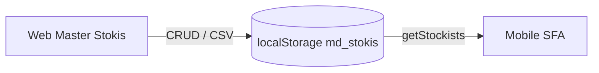

# Master Stokis / Grosir — Web Portal

Modul administrasi untuk mengelola data **Stokis** dan **Grosir** yang digunakan salesman mobile untuk kulakan dan cek stok di lapangan.

---

## Lokasi & Akses

| Item | Path |
|------|------|
| Daftar | `Views/FPRS/MasterData/Stokis/index.html` |
| Tambah | `Views/FPRS/MasterData/Stokis/add.html` |
| Menu sidebar | Data Master → **Stokis / Grosir** |
| Seed JSON | `wwwroot/data/stokis.json` |
| Storage | `localStorage` key `md_stokis` |

---

## Fitur

### CRUD Manual

- Tambah stokis via form `add.html`
- Edit / hapus dari tabel `index.html`
- Kolom: Kode, Nama, Tipe, Kota, Telepon, Status, Koordinat (lat/lng)

### Download Data (CSV)

Tombol **Download Data** mengekspor seluruh record ke file CSV untuk diedit di Excel.

### Upload Data (CSV)

Tombol **Upload Data** mengimpor file CSV hasil edit.

**Aturan impor:**

| Aturan | Detail |
|--------|--------|
| Duplikat | Dicek dari **latitude & longitude** saja |
| Koordinat sama | Baris dilewati (tidak di-insert ulang) |
| Kode kosong / bentrok | Auto-generate kode baru |
| Format | CSV dengan header kolom standar modul |

### Integrasi Mobile

Data disimpan ke `localStorage` key `md_stokis`. Aplikasi mobile membaca via:

```javascript
SfaStore.getStockists()
SfaStore.getNearestStockists(lat, lng, limit)
```

Digunakan di:

- `product_catalog.html` — picker stokis terdekat setelah GPS
- `home.html` — detail periode penjualan (daftar gudang/stokis asal)

---

## Alur Data



---

## Pengujian

1. Jalankan Live Server port `5501`
2. Buka halaman Stokis index
3. Tambah 1 record manual dengan koordinat unik
4. Download CSV → ubah nama → upload ulang
5. Upload baris dengan lat/lng sama → harus dilewati (notifikasi skip)
6. Buka mobile `product_catalog.html` → GPS check-in → stokis baru muncul di picker

---

## Dokumen Terkait

- [README.md](README.md) — indeks dokumentasi web
- [changelog_web_mobile_jul2026.md](../changelog_web_mobile_jul2026.md) — ringkasan perubahan sesi
- [../mobile/sfa_mobile_prototype.md](../mobile/sfa_mobile_prototype.md) — dual mode Beli / Cek Stok mobile
