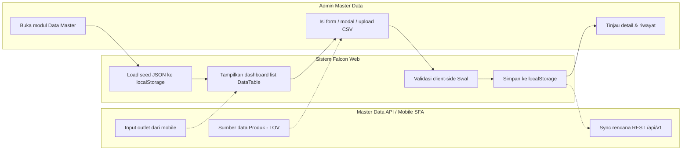
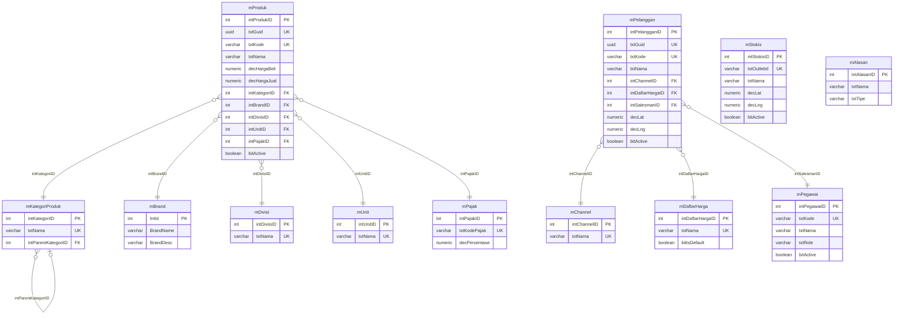

# FUNCTIONAL SPECIFICATION DOCUMENT (FSD)
## Modul: Falcon FPRS — Data Master (Web Admin)
### Sistem: Falcon FPRS
### Versi Dokumen: 1.1

---

| Atribut | Keterangan |
|---------|------------|
| **Nama Dokumen** | FSD Modul Data Master — Web Admin Falcon FPRS |
| **Versi** | 1.1 |
| **Tanggal** | 9 Juli 2026 |
| **Divisi** | IT / Business – Falcon FPRS |
| **Status** | Draft |
| **Dibuat oleh** | Tim IT – Falcon FPRS |

---

## Riwayat Revisi

| Versi | Tanggal | Diubah Oleh | Keterangan |
|---------|-------------|-------------|------------|
| **1.1** | **9 Juli 2026** | **Tim IT** | Tambah arsitektur produksi MAVEN, mapping UI→database, ERD lengkap, DDL PostgreSQL, tooltip prototipe |
| **1.0** | **8 Juli 2026** | **Tim IT** | Initial draft – modul Data Master Web Admin FPRS |

---

## Persetujuan Dokumen (Document Approval)

| Full Name | Job Title | Signature | Signature Date |
|-----------|-----------|-----------|----------------|
| Muhammad Rafi | SHP Channel & Customer Development |  |  |
| Silvester Mario Nian Destrada | SHP Channel & Customer Development |  |  |
| Ageng Kurniawan Sugianto | IT Product |  |  |
| Albet | IT Product |  |  |

---

## 1. Pendahuluan

### 1.1 Latar Belakang

**Falcon FPRS** (*Field Partner Relation System*) adalah sistem internal PT Kalbe
Nutritionals untuk administrasi data master, penjualan lapangan, dan pelacakan
kunjungan sales. Dokumen ini memfokuskan lingkup pada **modul Data Master** pada
Web Admin (`Views/FPRS/MasterData/`) — kumpulan halaman referensi yang menjadi
fondasi seluruh transaksi FPRS.

Prototipe Web Portal berupa *high-fidelity interactive prototype* berbasis HTML
statis (MPA) bertema Vuexy/Bootstrap yang menggunakan **localStorage** dan file
JSON seed di `wwwroot/data/` sebagai lapisan persistensi sisi klien, mensimulasikan
alur kerja admin sebelum integrasi penuh ke Master Data API Kalbe.

### 1.2 Tujuan Dokumen

1. Mendeskripsikan fungsionalitas **per halaman dan per komponen UI** modul Data Master.
2. Menjadi acuan pengembangan backend/API dan UAT untuk data referensi FPRS.
3. Mendokumentasikan business rules, pola CRUD, integrasi API rencana, dan data layer lokal.
4. Menyelaraskan format dokumentasi dengan standar **FSD Generator Engine** (Kalbe Nutritionals).

### 1.3 Ruang Lingkup

| Dalam lingkup | Di luar lingkup |
|---------------|-----------------|
| Modul Data Master Web (`Views/FPRS/MasterData/`) | Modul Penjualan, Kunjungan, Dashboard |
| Produk, Pelanggan, Channel, Pegawai, Stokis, Pajak, Alasan | Mobile SFA (`Views/Mobile/`, Flutter APK) |
| Persistensi prototipe (localStorage + JSON seed) | Modul DOFS MAVEN yang sudah ada |
| Desain database produksi MAVEN (PostgreSQL + EF Core) | — |
| Mapping UI → tabel/kolom MAVEN & skrip DDL | — |

### 1.4 Stakeholder

| Peran | Tim/Divisi | Keterlibatan |
|-------|------------|--------------|
| Admin Master Data | IT / Operations | CRUD & sinkronisasi data referensi |
| Supervisor Sales | Sales | Validasi data outlet & pegawai |
| Developer | IT | Implementasi API & UI produksi |
| Business Analyst | PDV / Sales | Validasi alur bisnis |

---

## 2. Arsitektur & Alur Data Master

### 2.1 Ringkasan Teknis

| Aspek | Standar |
|-------|---------|
| Arsitektur | Static MPA — satu `.html` per halaman |
| UI Framework | Bootstrap 5.3, Vuexy Admin Theme |
| JavaScript | jQuery 3.7, DataTables, Select2, SweetAlert2 |
| State | `localStorage` + seed `wwwroot/data/*.json` (versi seed `*_seed_ver`) |
| Navigasi | `wwwroot/js/layout.js` — sidebar & navbar injection |
| Branding | Kalbe hijau `#005d41`, font Kalbe Geometric |

### 2.2 Pola Pengelolaan Data Master

Modul Data Master memakai **tiga pola** pengelolaan data:

| Pola | Modul | Cara Kelola |
|------|-------|-------------|
| Form (add/edit) | Produk | Halaman `detail.html` fleksibel + LOV Master Data API |
| Modal CRUD | Channel, Pajak, Alasan | Modal `#modalForm` di dalam `index.html` |
| Upload-only (CSV + history) | Pegawai, Stokis | Download/Upload CSV, status disinkronkan, riwayat dicatat |
| View-only (sumber mobile) | Pelanggan | Ditampilkan dari data aplikasi mobile |

### 2.3 Business Flow Data Master (Swimlane)

**Lane (urutan kiri → kanan):**

| # | Lane ID | Label | Tipe |
|---|---------|-------|------|
| 1 | L1 | Admin Master Data | User |
| 2 | L2 | Sistem Falcon Web | System |
| 3 | L3 | Master Data API / Mobile SFA | External |




## 3. Modul Data Master

Bab ini mendeskripsikan setiap modul Data Master: kolom dashboard list (DataTable), field form/modal/detail, tombol aksi, business rules (hasil ekstraksi validasi UI), dan pola CRUD. Konten field/kolom/validasi diambil langsung dari file HTML sumber.

### 3.1 Produk

Modul **Produk** merupakan bagian dari Web Portal Falcon FPRS. Tipe UI: **page**. Sumber: `Views/FPRS/MasterData/Produk/index.html`.

Halaman dashboard list menampilkan **summary cards** (`cntTotal`, `cntActive`, `cntInactive`, `cntUmbrella`) dan DataTable `#tbl` dengan filter per kolom, termasuk kolom **Umbrella Brand**. Tombol **Tambah Produk** mengarah ke `detail.html`. Halaman `detail.html` bersifat fleksibel (add & edit): **Kode Produk** berupa LOV searchable (Select2) yang mengambil data dari Master Data API, mengunci field turunan (nama, umbrella, brand) menjadi read-only. **Harga Beli** dapat diedit, **Harga Jual** read-only dihitung otomatis (`Harga Beli + PPN`, default skema PPN 11%). **Unit Konversi** dikunci ke `PCS`, dan **Status Produk** berupa checkbox aktif/nonaktif.

| Aspek | Keterangan |
|-------|------------|
| **Tujuan Form** | Mendaftarkan dan memelihara data SKU/produk (kode, umbrella brand, brand, harga beli, harga jual, pajak, status) sebagai referensi transaksi penjualan. Data produk bersumber dari Master Data API, sedangkan harga jual, pajak, dan status dikelola di aplikasi ini. |
| **Pengguna** | Admin Master Data, IT Operations — pengelola katalog produk Kalbe. |


> **Integrasi API (rencana):** `/api/v1/Sku`

> **localStorage key:** `md_produk`


#### 3.1.1 Kolom DataTable Dashboard List

| Kolom | Field Key | Render | Sortable | Keterangan |
|-------|-----------|--------|----------|------------|
| NO | `No` | Text | Ya | Kolom grid dashboard list |
| KODE | `Kode` | Text | Ya | Kolom grid dashboard list |
| PRODUK | `Produk` | Text | Ya | Kolom grid dashboard list |
| UMBRELLA BRAND | `UmbrellaBrand` | Text | Ya | Kolom grid dashboard list |
| BRAND | `Brand` | Text | Ya | Kolom grid dashboard list |
| UNIT | `Unit` | Text | Ya | Kolom grid dashboard list |
| HARGA JUAL | `HargaJual` | Text | Ya | Kolom grid dashboard list |
| PAJAK | `Pajak` | Text | Ya | Kolom grid dashboard list |
| STATUS | `Status` | Text | Ya | Kolom grid dashboard list |

#### 3.1.2 Tombol Aksi — Dashboard List

| Tampilan | Tombol | ID / Handler | Warna/Style | Fungsi |
|----------|--------|--------------|-------------|--------|
|  | Tambah Produk | `—` | btn-success | Membuka modal form untuk menambah data baru. |
| — | Detail / Ubah | `—` | btn-outline-secondary | Menampilkan halaman detail record terpilih (parameter URL terenkripsi). |

Halaman **detail** (`detail.html`) diakses melalui aksi baris pada dashboard list (parameter URL terenkripsi `?param=`).

#### 3.1.3 Form Detail (read-only)

| Field Name | ID Elemen | Tipe | Mandatory | Default | Validasi | Keterangan |
|------------|-----------|------|-----------|---------|----------|------------|
| Kode Produk | `kode` | Dropdown | Ya | (kosong) | — | — |
| Nama Produk | `nama` | Text (readonly) | Tidak | (kosong) | — | — |
| Umbrella Brand | `umbrella` | Text (readonly) | Tidak | (kosong) | — | — |
| Brand | `brand` | Text (readonly) | Tidak | (kosong) | — | — |
| Harga Beli | `hargaBeli` | Number | Ya | (kosong) | — | — |
| Skema Pajak | `namaPajak` | Dropdown | Ya | (kosong) | — | — |
| Harga Jual (otomatis) | `hargaJual` | Number | Tidak | (kosong) | — | — |
| Unit Konversi | `unitNama` | Text (readonly) | Tidak | PCS | — | — |
| Status Produk | `status` | Text | Tidak | (kosong) | — | — |

#### 3.1.4 Tombol Aksi — Halaman Detail

| Tampilan | Tombol | ID / Handler | Warna/Style | Fungsi |
|----------|--------|--------------|-------------|--------|
|  | Simpan Produk | `—` | btn-success | Menyimpan perubahan dari modal ke penyimpanan lokal setelah validasi. |

#### 3.1.5 Business Rules

| Rule ID | Aturan |
|---------|--------|
| BR-MD01 | Kode produk wajib dipilih dari Master Data API. |
| BR-MD02 | Data produk belum termuat. Pilih ulang Kode Produk. |
| BR-MD03 | Harga beli harus lebih dari 0. |
| BR-MD04 | Kode "${kode}" sudah terdaftar pada Master Produk. |

#### 3.1.6 CRUD

| Operasi | Cara | Role | Keterangan |
|---------|------|------|------------|
| **Create** | Klik Tambah Produk → `detail.html` (LOV Kode Produk) | Admin | Persist ke localStorage |
| **Read** | dashboard list (DataTable) + `detail.html` | Semua role | — |
| **Update** | Buka `detail.html?param=` → ubah harga beli/pajak/status | Admin | Kode & data API read-only |

#### 3.1.6 Mapping Database MAVEN

| Field UI / Kolom Grid | Tabel MAVEN | Kolom MAVEN | Kunci | Keterangan |
|-----------------------|-------------|-------------|-------|------------|
| Kode Produk | `mProduk` | `txtKode` | UQ | LOV dari Master Data API |
| Nama Produk | `mProduk` | `txtNama` | | Read-only dari API |
| Umbrella Brand | `mProduk` | `txtUmbrella` | | Read-only dari API |
| Brand | `mProduk` | `intBrandID` | FK → `mBrand` | Reuse tabel MAVEN existing |
| Harga Beli | `mProduk` | `decHargaBeli` | | ≥ 0 |
| Harga Jual | `mProduk` | `decHargaJual` | | Dihitung otomatis |
| Skema Pajak | `mProduk` | `intPajakID` | FK → `mPajak` | |
| Unit | `mProduk` | `intUnitID` | FK → `mUnit` | Selalu PCS di prototipe |
| Status | `mProduk` | `bitActive` | | active → true |
| Kategori (API) | `mProduk` | `intKategoriID` | FK → `mKategoriProduk` | |
| Divisi (API) | `mProduk` | `intDivisiID` | FK → `mDivisi` | |

### 3.2 Pelanggan

Modul **Pelanggan** merupakan bagian dari Web Portal Falcon FPRS. Tipe UI: **page**. Sumber: `Views/FPRS/MasterData/Pelanggan/index.html`.

Data pelanggan/outlet **diinput dari aplikasi mobile** (SFA), sehingga Web Portal bersifat **view-only** — tanpa tombol Tambah/Edit/Hapus. Halaman detail menampilkan atribut hasil capture lapangan: foto outlet, pemilik, NPWP, alamat, RT/RW, kelurahan, kecamatan, kota, koordinat GPS, **channel**, dan tipe outlet. Data disimpan di `md_pelanggan`.

| Aspek | Keterangan |
|-------|------------|
| **Tujuan Form** | Menampilkan data outlet/pelanggan yang diinput dari aplikasi mobile (foto, pemilik, alamat, GPS, channel, tipe outlet) sebagai entitas utama kunjungan sales dan faktur. Bersifat view-only di web. |
| **Pengguna** | Admin Master Data, Operations, Supervisor Sales (validasi data outlet). |


> **Integrasi API (rencana):** `/api/v1/Customer`

> **localStorage key:** `md_pelanggan`


#### 3.2.1 Kolom DataTable Dashboard List

| Kolom | Field Key | Render | Sortable | Keterangan |
|-------|-----------|--------|----------|------------|
| NO | `No` | Text | Ya | Kolom grid dashboard list |
| KODE | `Kode` | Text | Ya | Kolom grid dashboard list |
| PELANGGAN | `Pelanggan` | Text | Ya | Kolom grid dashboard list |
| ALAMAT | `Alamat` | Text | Ya | Kolom grid dashboard list |
| TELEPON | `Telepon` | Text | Ya | Kolom grid dashboard list |
| SALESMAN | `Salesman` | Text | Ya | Kolom grid dashboard list |
| KUNJUNGAN TERAKHIR | `KunjunganTerakhir` | Text | Ya | Kolom grid dashboard list |
| STATUS | `Status` | Text | Ya | Kolom grid dashboard list |

#### 3.2.2 Tombol Aksi — Dashboard List

| Tampilan | Tombol | ID / Handler | Warna/Style | Fungsi |
|----------|--------|--------------|-------------|--------|
|  | Detail | `—` | btn-outline-secondary | Menampilkan halaman detail record terpilih (parameter URL terenkripsi). |

Halaman **detail** (`detail.html`) diakses melalui aksi baris pada dashboard list (parameter URL terenkripsi `?param=`).

#### 3.2.3 Tombol Aksi — Halaman Detail

| Tampilan | Tombol | ID / Handler | Warna/Style | Fungsi |
|----------|--------|--------------|-------------|--------|
|  | Kembali | `—` | btn-secondary | Kembali ke dashboard list modul. |

#### 3.2.4 CRUD

| Operasi | Cara | Role | Keterangan |
|---------|------|------|------------|
| **Create** | — | — | Data diinput dari aplikasi mobile (SFA) |
| **Read** | dashboard list (DataTable) + `detail.html` | Semua role | View-only |

#### 3.2.6 Mapping Database MAVEN

| Field UI / Kolom Grid | Tabel MAVEN | Kolom MAVEN | Kunci | Keterangan |
|-----------------------|-------------|-------------|-------|------------|
| Kode | `mPelanggan` | `txtKode` | UQ | |
| Nama / PELANGGAN | `mPelanggan` | `txtNama` | | |
| Alamat | `mPelanggan` | `txtAlamat` | | |
| Telepon | `mPelanggan` | `txtTelepon` | | |
| Salesman | `mPelanggan` | `intSalesmanID` | FK → `mPegawai` | |
| Kunjungan Terakhir | `mPelanggan` | `dtKunjunganTerakhir` | | |
| Status | `mPelanggan` | `bitActive` | | Active → true |
| Pemilik | `mPelanggan` | `txtPemilik` | | Dari mobile |
| NPWP | `mPelanggan` | `txtNpwp` | | |
| Channel | `mPelanggan` | `intChannelID` | FK → `mChannel` | |
| Daftar Harga | `mPelanggan` | `intDaftarHargaID` | FK → `mDaftarHarga` | |
| Tipe Outlet | `mPelanggan` | `txtOutletType` | | |
| Grup Pelanggan | `mPelanggan` | `txtGrupPelanggan` | | |
| RT/RW, Kelurahan, Kecamatan, Kota | `mPelanggan` | `txtRtRw`, `txtKelurahan`, `txtKecamatan`, `txtKota` | | |
| Koordinat GPS | `mPelanggan` | `decLat`, `decLng`, `bitHasGps` | | |
| Foto Toko | `mPelanggan` | `txtPhoto` | | Path/URL dari mobile |
| Waktu Pembayaran | `mPelanggan` | `txtWaktuPembayaran` | | |
| Transaksi Terakhir | `mPelanggan` | `dtTransaksiTerakhir` | | |

### 3.3 Channel

Modul **Channel** merupakan bagian dari Web Portal Falcon FPRS. Tipe UI: **modal**. Sumber: `Views/FPRS/MasterData/Channel/index.html`.

Modul **Channel** mengelola klasifikasi channel pelanggan (mis. MT-HPM-NKA, GT-GROSIR, MED-APOTIK). Tidak terintegrasi Master Data API. Modal edit menampilkan bit **Active** dan daftar pelanggan ter-paginasi yang tergabung pada channel tersebut (relasi 1 pelanggan → 1 channel, 1 channel → banyak pelanggan) berdasarkan data `md_pelanggan`.

| Aspek | Keterangan |
|-------|------------|
| **Tujuan Form** | Mengelola daftar channel pelanggan (MT/GT/SPC/MED/GI/ECOM, dll.) untuk segmentasi dan kebijakan penjualan. Setiap pelanggan tergabung pada tepat satu channel. |
| **Pengguna** | Admin Master Data, Sales Operations. |


> **localStorage key:** `md_channel`


#### 3.3.1 Kolom DataTable Dashboard List

| Kolom | Field Key | Render | Sortable | Keterangan |
|-------|-----------|--------|----------|------------|
| NO | `No` | Text | Ya | Kolom grid dashboard list |
| NAMA CHANNEL | `NamaChannel` | Text | Ya | Kolom grid dashboard list |
| TOTAL PELANGGAN | `TotalPelanggan` | Text | Ya | Kolom grid dashboard list |
| STATUS | `Status` | Text | Ya | Kolom grid dashboard list |

#### 3.3.2 Tombol Aksi — Dashboard List

| Tampilan | Tombol | ID / Handler | Warna/Style | Fungsi |
|----------|--------|--------------|-------------|--------|
|  | Tambah Channel | `openModal()` | btn-success | Membuka modal form untuk menambah data baru. |
|  | Edit | `editItem('1')` | btn-outline-secondary | Membuka modal form dalam mode ubah untuk baris yang dipilih. |


**Dashboard list** menampilkan DataTable channel. **Form modal** muncul di atas halaman yang sama (bukan halaman terpisah). Mode **Tambah**: pengguna mengisi Nama Channel dan Status Active/Inactive. Mode **Ubah**: field yang sama ditampilkan terisi, ditambah panel **Pelanggan pada Channel Ini** (read-only, paginasi) yang menampilkan outlet dengan `channel` yang cocok.


#### 3.3.3 Form Modal (Tambah / Ubah)

| Field Name | ID Elemen | Tipe | Mandatory | Default | Validasi | Keterangan |
|------------|-----------|------|-----------|---------|----------|------------|
| Nama Channel | `inputNama` | Text | Ya | (kosong) | — | — |
| Status | `inputActive` | Text | Tidak | (kosong) | — | — |
| Pelanggan pada Channel Ini | `custSection` | Sub-tabel (read-only) | — | — | — | Hanya mode Ubah; data dari `md_pelanggan`, paginasi 5 baris |

#### 3.3.4 Tombol Aksi — Form Modal

| Tampilan | Tombol | ID / Handler | Warna/Style | Fungsi |
|----------|--------|--------------|-------------|--------|
| — | Simpan | `saveItem()` | btn-success | Menyimpan perubahan dari modal ke penyimpanan lokal setelah validasi. |

#### 3.3.5 Business Rules

| Rule ID | Aturan |
|---------|--------|
| BR-MD05 | Nama channel wajib diisi. |

#### 3.3.6 CRUD

| Operasi | Cara | Role | Keterangan |
|---------|------|------|------------|
| **Create** | Klik Tambah → isi modal → Simpan | Admin | Persist ke localStorage |
| **Read** | dashboard list (DataTable); modal edit menampilkan pelanggan ter-paginasi | Semua role | — |
| **Update** | Klik Edit → ubah nama/bit Active → Simpan | Admin | — |

#### 3.3.6 Mapping Database MAVEN

| Field UI / Kolom Grid | Tabel MAVEN | Kolom MAVEN | Kunci | Keterangan |
|-----------------------|-------------|-------------|-------|------------|
| Nama Channel | `mChannel` | `txtNama` | UQ | |
| Total Pelanggan | — | — | | Kolom turunan COUNT(`mPelanggan`) |
| Status | `mChannel` | `bitActive` | | |

### 3.4 Pegawai

Modul **Pegawai** merupakan bagian dari Web Portal Falcon FPRS. Tipe UI: **page**. Sumber: `Views/FPRS/MasterData/Pegawai/index.html`.

Master pegawai/sales force bersifat **upload-only** (pola seperti Master Stokis): data disinkronkan via **Download/Upload CSV** dan setiap perubahan status Active/Inactive dicatat pada **riwayat status**. Setiap pegawai memiliki **role** (Motoris / SPG GT) dan penempatan **Branch** & **Region**. Identitas unik menggunakan **NIK**. Halaman `detail.html` menampilkan data pegawai secara read-only beserta riwayat status.

| Aspek | Keterangan |
|-------|------------|
| **Tujuan Form** | Memelihara data pegawai/sales force (Motoris, SPG GT) beserta NIK, Branch, dan Region melalui mekanisme Download/Upload CSV dengan pencatatan riwayat status aktif/nonaktif. |
| **Pengguna** | Admin HR, IT, Supervisor Sales. |


> **localStorage key:** `md_pegawai`


#### 3.4.1 Kolom DataTable Dashboard List

| Kolom | Field Key | Render | Sortable | Keterangan |
|-------|-----------|--------|----------|------------|
| NO | `No` | Text | Ya | Kolom grid dashboard list |
| NIK | `Nik` | Text | Ya | Kolom grid dashboard list |
| NAMA | `Nama` | Text | Ya | Kolom grid dashboard list |
| ROLE | `Role` | Text | Ya | Kolom grid dashboard list |
| BRANCH | `Branch` | Text | Ya | Kolom grid dashboard list |
| REGION | `Region` | Text | Ya | Kolom grid dashboard list |
| STATUS | `Status` | Text | Ya | Kolom grid dashboard list |

#### 3.4.2 Tombol Aksi — Dashboard List

| Tampilan | Tombol | ID / Handler | Warna/Style | Fungsi |
|----------|--------|--------------|-------------|--------|
|  | Download Data | `downloadPegawai()` | btn-outline-secondary | Mengunduh data modul sebagai file CSV. |
|  | Upload Data | `triggerUploadPegawai()` | btn-outline-secondary | Mengunggah file CSV untuk sinkronisasi data. |
|  | Lihat Detail | `—` | btn-outline-secondary | Menampilkan halaman detail record terpilih (parameter URL terenkripsi). |

Halaman **detail** (`detail.html`) diakses melalui aksi baris pada dashboard list (parameter URL terenkripsi `?param=`).

#### 3.4.3 Form Detail (read-only)

| Field Name | ID Elemen | Tipe | Mandatory | Default | Validasi | Keterangan |
|------------|-----------|------|-----------|---------|----------|------------|
| NIK | `kode` | Text | Tidak | (kosong) | — | — |
| Nama | `nama` | Text | Tidak | (kosong) | — | — |
| Role | `role` | Text | Tidak | (kosong) | — | — |
| Branch | `branch` | Text | Tidak | (kosong) | — | — |
| Region | `region` | Text | Tidak | (kosong) | — | — |
| Telepon | `telepon` | Text | Tidak | (kosong) | — | — |
| Status | `status` | Text | Tidak | (kosong) | — | — |
| Keterangan | `keterangan` | Text | Tidak | (kosong) | — | — |

#### 3.4.4 Tombol Aksi — Halaman Detail

| Tampilan | Tombol | ID / Handler | Warna/Style | Fungsi |
|----------|--------|--------------|-------------|--------|
|  | Kembali | `—` | btn-secondary | Kembali ke dashboard list modul. |

#### 3.4.5 Business Rules

| Rule ID | Aturan |
|---------|--------|
| BR-MD06 | File kosong atau format header tidak dikenali. |
| BR-MD07 | Tidak ada baris data yang dapat diproses. |

#### 3.4.6 CRUD

| Operasi | Cara | Role | Keterangan |
|---------|------|------|------------|
| **Create** | Upload CSV (baris baru) | Admin | Sinkronisasi dari file, bukan input manual |
| **Read** | dashboard list (DataTable) + `detail.html` | Semua role | Termasuk riwayat status/stok |
| **Update** | Upload CSV (status Active/Inactive) | Admin | Status disimpulkan dari keberadaan ID di file |

#### 3.4.6 Mapping Database MAVEN

| Field UI / Kolom Grid | Tabel MAVEN | Kolom MAVEN | Kunci | Keterangan |
|-----------------------|-------------|-------------|-------|------------|
| NIK | `mPegawai` | `txtKode` | UQ | Identitas CSV upload |
| Nama | `mPegawai` | `txtNama` | | |
| Role | `mPegawai` | `txtRole` | | Motoris / SPG GT |
| Branch | `mPegawai` | `txtBranch` | | |
| Region | `mPegawai` | `txtRegion` | | Diturunkan dari Branch |
| Telepon | `mPegawai` | `txtTelepon` | | |
| Keterangan | `mPegawai` | `txtKeterangan` | | |
| Status | `mPegawai` | `bitActive` | | Active/Inactive via CSV |

### 3.5 Stokis

Modul **Stokis** merupakan bagian dari Web Portal Falcon FPRS. Tipe UI: **page**. Sumber: `Views/FPRS/MasterData/Stokis/index.html`.

Master **Stokis/Grosir** bersifat **upload-only** (Download/Upload CSV + riwayat stok). Menampilkan **Branch** dan **Region** (menggantikan kolom Kota), koordinat GPS untuk validasi check-in mobile, serta island **Riwayat Input Stok oleh Motoris** pada halaman detail.

| Aspek | Keterangan |
|-------|------------|
| **Tujuan Form** | Mendaftarkan grosir/distributor stokis tempat salesman melakukan kulakan dan cek stok barang. Termasuk koordinat GPS untuk validasi check-in mobile. |
| **Pengguna** | Admin Master Data, Sales Operations, Supervisor Sales. |


> **localStorage key:** `md_stokis`


#### 3.5.1 Kolom DataTable Dashboard List

| Kolom | Field Key | Render | Sortable | Keterangan |
|-------|-----------|--------|----------|------------|
| NO | `No` | Text | Ya | Kolom grid dashboard list |
| OUTLET ID | `OutletId` | Text | Ya | Kolom grid dashboard list |
| NAMA STOKIS | `NamaStokis` | Text | Ya | Kolom grid dashboard list |
| BRANCH | `Branch` | Text | Ya | Kolom grid dashboard list |
| REGION | `Region` | Text | Ya | Kolom grid dashboard list |
| STATUS | `Status` | Text | Ya | Kolom grid dashboard list |

#### 3.5.2 Tombol Aksi — Dashboard List

| Tampilan | Tombol | ID / Handler | Warna/Style | Fungsi |
|----------|--------|--------------|-------------|--------|
|  | Download Data | `downloadStokis()` | btn-outline-secondary | Mengunduh data modul sebagai file CSV. |
|  | Upload Data | `triggerUploadStokis()` | btn-outline-secondary | Mengunggah file CSV untuk sinkronisasi data. |
|  | Lihat Detail | `—` | btn-outline-secondary | Menampilkan halaman detail record terpilih (parameter URL terenkripsi). |

Halaman **detail** (`detail.html`) diakses melalui aksi baris pada dashboard list (parameter URL terenkripsi `?param=`).

#### 3.5.3 Form Detail (read-only)

| Field Name | ID Elemen | Tipe | Mandatory | Default | Validasi | Keterangan |
|------------|-----------|------|-----------|---------|----------|------------|
| Outlet ID | `kode` | Text | Tidak | (kosong) | — | — |
| Nama Stokis | `nama` | Text | Tidak | (kosong) | — | — |
| Branch | `branch` | Text | Tidak | (kosong) | — | — |
| Region | `region` | Text | Tidak | (kosong) | — | — |
| Telepon | `telepon` | Text | Tidak | (kosong) | — | — |
| Status | `status` | Text | Tidak | (kosong) | — | — |
| Alamat Lengkap | `alamat` | Text | Tidak | (kosong) | — | — |
| Latitude | `lat` | Text | Tidak | (kosong) | — | — |
| Longitude | `lng` | Text | Tidak | (kosong) | — | — |

#### 3.5.4 Tombol Aksi — Halaman Detail

| Tampilan | Tombol | ID / Handler | Warna/Style | Fungsi |
|----------|--------|--------------|-------------|--------|
|  | Kembali | `—` | btn-secondary | Kembali ke dashboard list modul. |
|  | Stok per Produk | `—` | btn-secondary | Membuka panel Stok per Produk menampilkan data terkait pada halaman detail. |
| — | Riwayat Input Stok oleh Motoris | `—` | btn-secondary | Membuka panel Riwayat Input Stok oleh Motoris menampilkan data terkait pada halaman detail. |
| — | Riwayat Status (Active / Inactive) — dari Upload | `—` | btn-secondary | Membuka panel Riwayat Status (Active / Inactive) — dari Upload menampilkan data terkait pada halaman detail. |

#### 3.5.5 Business Rules

| Rule ID | Aturan |
|---------|--------|
| BR-MD08 | File kosong atau format header tidak dikenali. |
| BR-MD09 | Tidak ada baris data yang dapat diproses. |

#### 3.5.6 CRUD

| Operasi | Cara | Role | Keterangan |
|---------|------|------|------------|
| **Create** | Upload CSV (baris baru) | Admin | Sinkronisasi dari file, bukan input manual |
| **Read** | dashboard list (DataTable) + `detail.html` | Semua role | Termasuk riwayat status/stok |
| **Update** | Upload CSV (status Active/Inactive) | Admin | Status disimpulkan dari keberadaan ID di file |

#### 3.5.6 Mapping Database MAVEN

| Field UI / Kolom Grid | Tabel MAVEN | Kolom MAVEN | Kunci | Keterangan |
|-----------------------|-------------|-------------|-------|------------|
| Outlet ID | `mStokis` | `txtOutletId` | UQ | Identitas CSV upload |
| Nama Stokis | `mStokis` | `txtNama` | | |
| Branch | `mStokis` | `txtBranch` | | |
| Region | `mStokis` | `txtRegion` | | |
| Telepon | `mStokis` | `txtTelepon` | | |
| Alamat | `mStokis` | `txtAlamat` | | |
| Latitude / Longitude | `mStokis` | `decLat`, `decLng` | | Unik per outlet |
| Status | `mStokis` | `bitActive` | | Active/Inactive via CSV |

### 3.6 Pajak

Modul **Pajak** merupakan bagian dari Web Portal Falcon FPRS. Tipe UI: **modal**. Sumber: `Views/FPRS/MasterData/Pajak/index.html`.

| Aspek | Keterangan |
|-------|------------|
| **Tujuan Form** | Mengonfigurasi skema pajak (PPN, DPP) yang dipakai perhitungan harga produk dan faktur. |
| **Pengguna** | Admin Finance, Tax/Accounting. |


> **Integrasi API (rencana):** `/api/v1/Tax`

> **localStorage key:** `md_pajak`


#### 3.6.1 Kolom DataTable Dashboard List

| Kolom | Field Key | Render | Sortable | Keterangan |
|-------|-----------|--------|----------|------------|
| NO | `No` | Text | Ya | Kolom grid dashboard list |
| KODE PAJAK | `KodePajak` | Text | Ya | Kolom grid dashboard list |
| NAMA PAJAK | `NamaPajak` | Text | Ya | Kolom grid dashboard list |
| PERSENTASE (%) | `Persentase` | Text | Ya | Kolom grid dashboard list |
| NILAI DPP | `NilaiDpp` | Text | Ya | Kolom grid dashboard list |

#### 3.6.2 Tombol Aksi — Dashboard List

| Tampilan | Tombol | ID / Handler | Warna/Style | Fungsi |
|----------|--------|--------------|-------------|--------|
|  | Tambah Pajak | `openModal()` | btn-success | Membuka modal form untuk menambah data baru. |
|  | Edit | `editItem('1')` | btn-outline-secondary | Membuka modal form dalam mode ubah untuk baris yang dipilih. |
|  | Hapus | `del('1','PPN')` | btn-outline-secondary | Menghapus data terpilih setelah konfirmasi pengguna. |


**Dashboard list** menampilkan daftar skema pajak. **Form modal** untuk Tambah/Ubah berisi Kode Pajak, Nama Pajak, Persentase (%), dan Nilai DPP. Data disimpan ke `localStorage` setelah validasi.


#### 3.6.3 Form Modal (Tambah / Ubah)

| Field Name | ID Elemen | Tipe | Mandatory | Default | Validasi | Keterangan |
|------------|-----------|------|-----------|---------|----------|------------|
| Kode Pajak | `inputKode` | Text | Ya | (kosong) | — | — |
| Nama Pajak | `inputNama` | Text | Ya | (kosong) | — | — |
| Persentase (%) | `inputPersen` | Number | Ya | (kosong) | — | — |
| Nilai DPP | `inputDpp` | Text | Tidak | (kosong) | — | — |

#### 3.6.4 Tombol Aksi — Form Modal

| Tampilan | Tombol | ID / Handler | Warna/Style | Fungsi |
|----------|--------|--------------|-------------|--------|
|  | Simpan | `saveItem()` | btn-success | Menyimpan perubahan dari modal ke penyimpanan lokal setelah validasi. |

#### 3.6.5 Business Rules

| Rule ID | Aturan |
|---------|--------|
| BR-MD10 | Kode dan Nama pajak wajib diisi. |

#### 3.6.6 CRUD

| Operasi | Cara | Role | Keterangan |
|---------|------|------|------------|
| **Create** | Klik Tambah → isi modal → Simpan | Admin | Persist ke localStorage |
| **Read** | dashboard list (DataTable) | Semua role | — |
| **Update** | Klik Edit → ubah modal → Simpan | Admin | — |
| **Delete** | Klik Hapus → konfirmasi Swal | Admin | Hapus dari localStorage |

#### 3.6.6 Mapping Database MAVEN

| Field UI / Kolom Grid | Tabel MAVEN | Kolom MAVEN | Kunci | Keterangan |
|-----------------------|-------------|-------------|-------|------------|
| Kode Pajak | `mPajak` | `txtKodePajak` | UQ | mis. PPN, NoPPN |
| Nama Pajak | `mPajak` | `txtNamaPajak` | | |
| Persentase (%) | `mPajak` | `decPersentase` | | |
| Nilai DPP | `mPajak` | `txtNilaiDpp` | | |

### 3.7 Alasan

Modul **Alasan** merupakan bagian dari Web Portal Falcon FPRS. Tipe UI: **modal**. Sumber: `Views/FPRS/MasterData/Alasan/index.html`.

| Aspek | Keterangan |
|-------|------------|
| **Tujuan Form** | Menyimpan kode alasan operasional (tidak order, gagal kunjungan, dll.) untuk pelacakan aktivitas lapangan dan analitik compliance. |
| **Pengguna** | Admin Operations, Supervisor Sales, Business Analyst. |


> **Integrasi API (rencana):** `/api/v1/Reason`

> **localStorage key:** `md_alasan`


#### 3.7.1 Kolom DataTable Dashboard List

| Kolom | Field Key | Render | Sortable | Keterangan |
|-------|-----------|--------|----------|------------|
| NO | `No` | Text | Ya | Kolom grid dashboard list |
| NAMA ALASAN | `NamaAlasan` | Text | Ya | Kolom grid dashboard list |
| DESKRIPSI | `Deskripsi` | Text | Ya | Kolom grid dashboard list |
| TIPE | `Tipe` | Text | Ya | Kolom grid dashboard list |

#### 3.7.2 Tombol Aksi — Dashboard List

| Tampilan | Tombol | ID / Handler | Warna/Style | Fungsi |
|----------|--------|--------------|-------------|--------|
|  | Tambah Alasan | `openModal()` | btn-success | Membuka modal form untuk menambah data baru. |
|  | Edit | `editItem('1')` | btn-outline-secondary | Membuka modal form dalam mode ubah untuk baris yang dipilih. |
|  | Hapus | `del('1','Salah Pengiriman')` | btn-outline-secondary | Menghapus data terpilih setelah konfirmasi pengguna. |


**Dashboard list** menampilkan master alasan operasional. **Form modal** Tambah/Ubah berisi Nama Alasan, Deskripsi, dan Tipe (Return/Kunjungan/Order/Lainnya). Terintegrasi rencana API `/api/v1/Param`.


#### 3.7.3 Form Modal (Tambah / Ubah)

| Field Name | ID Elemen | Tipe | Mandatory | Default | Validasi | Keterangan |
|------------|-----------|------|-----------|---------|----------|------------|
| Nama Alasan | `inputNama` | Text | Ya | (kosong) | — | — |
| Deskripsi | `inputDeskripsi` | Text | Ya | (kosong) | — | — |
| Tipe | `inputTipe` | Dropdown | Ya | (kosong) | — | — |

#### 3.7.4 Tombol Aksi — Form Modal

| Tampilan | Tombol | ID / Handler | Warna/Style | Fungsi |
|----------|--------|--------------|-------------|--------|
|  | Simpan | `saveItem()` | btn-success | Menyimpan perubahan dari modal ke penyimpanan lokal setelah validasi. |

#### 3.7.5 Business Rules

| Rule ID | Aturan |
|---------|--------|
| BR-MD11 | Nama dan Tipe wajib diisi. |

#### 3.7.6 CRUD

| Operasi | Cara | Role | Keterangan |
|---------|------|------|------------|
| **Create** | Klik Tambah → isi modal → Simpan | Admin | Persist ke localStorage |
| **Read** | dashboard list (DataTable) | Semua role | — |
| **Update** | Klik Edit → ubah modal → Simpan | Admin | — |
| **Delete** | Klik Hapus → konfirmasi Swal | Admin | Hapus dari localStorage |

#### 3.7.6 Mapping Database MAVEN

| Field UI / Kolom Grid | Tabel MAVEN | Kolom MAVEN | Kunci | Keterangan |
|-----------------------|-------------|-------------|-------|------------|
| Nama Alasan | `mAlasan` | `txtNama` | | |
| Deskripsi | `mAlasan` | `txtDeskripsi` | | |
| Tipe | `mAlasan` | `txtTipe` | | Return / Kunjungan / Order |

## 4. Aturan Bisnis (Rekap)

Rekap aturan bisnis modul Data Master. Rule ID memakai prefix `BR-MD`.

| Rule ID | Aturan |
|---------|--------|
| BR-MD01 | [Master Data — Produk] Kode produk wajib dipilih dari Master Data API. |
| BR-MD02 | [Master Data — Produk] Data produk belum termuat. Pilih ulang Kode Produk. |
| BR-MD03 | [Master Data — Produk] Harga beli harus lebih dari 0. |
| BR-MD04 | [Master Data — Produk] Kode "${kode}" sudah terdaftar pada Master Produk. |
| BR-MD05 | [Master Data — Channel] Nama channel wajib diisi. |
| BR-MD06 | [Master Data — Pegawai] File kosong atau format header tidak dikenali. |
| BR-MD07 | [Master Data — Pegawai] Tidak ada baris data yang dapat diproses. |
| BR-MD08 | [Master Data — Stokis] File kosong atau format header tidak dikenali. |
| BR-MD09 | [Master Data — Stokis] Tidak ada baris data yang dapat diproses. |
| BR-MD10 | [Master Data — Pajak] Kode dan Nama pajak wajib diisi. |
| BR-MD11 | [Master Data — Alasan] Nama dan Tipe wajib diisi. |

---

## 5. Hak Akses & RBAC

Pada prototipe, seluruh halaman Data Master dapat diakses tanpa login web admin;
enforcement RBAC penuh di server **belum** diimplementasikan. Matriks berikut adalah
target kebijakan produksi:

| Modul | Admin Master Data | Supervisor Sales | Keterangan |
|-------|-------------------|------------------|------------|
| Produk | Create/Read/Update | Read | Hapus tidak tersedia |
| Pelanggan | Read | Read | View-only, sumber mobile |
| Channel | Create/Read/Update | Read | Kelola via bit Active |
| Pegawai | Upload/Read | Read | Sinkronisasi CSV |
| Stokis | Upload/Read | Read | Sinkronisasi CSV |
| Pajak | Create/Read/Update/Delete | Read | Konfigurasi finance |
| Alasan | Create/Read/Update/Delete | Read | Kode operasional |

---

## 6. Data Layer & Integrasi

### 6.1 Pola Persistensi Prototipe

1. Saat halaman dimuat, cek `localStorage` dengan key modul (mis. `md_produk`).
2. Bandingkan penanda versi seed (`*_seed_ver`); bila berbeda/kosong, muat ulang JSON seed dari `wwwroot/data/`.
3. Operasi CRUD / Upload menulis kembali ke `localStorage` (tanpa server round-trip).

### 6.2 Integrasi Master Data API (Rencana)

Portal Kalbe Master Data dev: `https://newmasterdatadev.kalbenutritionals.web.id/`.
Modul dengan endpoint di bawah direncanakan tersinkron ke REST API produksi; pada
prototipe, endpoint dicantumkan sebagai referensi. Modul **Channel**, **Pegawai**,
dan **Stokis** dikelola lokal (tanpa Master Data API), sedangkan **Pelanggan**
bersumber dari aplikasi mobile.

### 6.3 Mapping Modul – API – Storage

| Modul | API Endpoint (rencana) | localStorage Key |
|-------|--------------------------|------------------|
| Master Data — Produk | `/api/v1/Sku` | `md_produk` |
| Master Data — Pelanggan | `/api/v1/Customer` | `md_pelanggan` |
| Master Data — Channel | `— (dikelola lokal)` | `md_channel` |
| Master Data — Pegawai | `— (dikelola lokal)` | `md_pegawai` |
| Master Data — Stokis | `— (dikelola lokal)` | `md_stokis` |
| Master Data — Pajak | `/api/v1/Tax` | `md_pajak` |
| Master Data — Alasan | `/api/v1/Reason` | `md_alasan` |

---

## 7. Struktur Data & ERD

### 7.1 Prototipe (localStorage)

| Entity | localStorage Key | Deskripsi |
|--------|------------------|-----------|
| `M_Produk` | `md_produk` | Master produk/SKU (kode, umbrella brand, harga, pajak, status) |
| `M_Pelanggan` | `md_pelanggan` | Master pelanggan/outlet (sumber mobile) |
| `M_Channel` | `md_channel` | Klasifikasi channel pelanggan |
| `M_Pegawai` | `md_pegawai` | Master pegawai (Motoris/SPG GT, NIK, Branch/Region) |
| `M_Stokis` | `md_stokis` | Master stokis/grosir (Branch/Region, GPS) |
| `M_Pajak` | `md_pajak` | Skema pajak (PPN/DPP) |
| `M_Alasan` | `md_alasan` | Kode alasan operasional |

Relasi prototipe disimpan sebagai **string nama** (bukan FK). Di produksi MAVEN diganti kolom `intXxxID`.

### 7.2 ERD Produksi MAVEN (PostgreSQL)

Diagram berikut menggambarkan target database produksi. Detail kolom per tabel ada di subsection mapping modul (3.1.6–3.7.6) dan dokumen referensi `docs/web/erd_master_data_maven.md`.



### 7.3 Daftar Relasi (FK)

| Tabel Anak | Kolom FK | Tabel Induk | Kardinalitas |
|------------|----------|-------------|--------------|
| `mProduk` | `intKategoriID` | `mKategoriProduk` | many-to-one |
| `mProduk` | `intBrandID` | `mBrand` | many-to-one (reuse existing) |
| `mProduk` | `intDivisiID` | `mDivisi` | many-to-one |
| `mProduk` | `intUnitID` | `mUnit` | many-to-one |
| `mProduk` | `intPajakID` | `mPajak` | many-to-one |
| `mKategoriProduk` | `intParentKategoriID` | `mKategoriProduk` | self, many-to-one (nullable) |
| `mPelanggan` | `intChannelID` | `mChannel` | many-to-one |
| `mPelanggan` | `intDaftarHargaID` | `mDaftarHarga` | many-to-one |
| `mPelanggan` | `intSalesmanID` | `mPegawai` | many-to-one |

> `mStokis` dan `mAlasan` berdiri sendiri (tanpa FK di level master). `totalPelanggan` (channel) dan `totalProduk` (brand) adalah agregasi COUNT, bukan kolom fisik.

### 7.4 Catatan Desain Database

- **Status → boolean:** field `status` string prototipe dipetakan ke `bitActive`.
- **ID prototype → PK + GUID:** `id` integer menjadi `intXxxID` serial + `txtGuid` uuid.
- **Relasi by ID:** string nama di prototipe diganti FK `intXxxID` di MAVEN.
- **Reuse `mBrand`:** tabel brand sudah ada di MAVEN — jangan buat duplikat.
- **Blok audit wajib:** `bitActive`, `dtInserted`, `txtInsertedBy`, `dtUpdated`, `txtUpdatedBy`, `dtNonActive`.

### 7.5 Query Pembuatan Tabel (DDL PostgreSQL)

Skrip DDL siap dieksekusi di PostgreSQL. Urutan: lookup (7.5.1) dulu, lalu master inti (7.5.2). Ekstensi bila perlu: `CREATE EXTENSION IF NOT EXISTS pgcrypto;`

#### 7.5.1 Tabel Lookup

```sql
-- Kategori Produk (self-reference)
CREATE TABLE "mKategoriProduk" (
    "intKategoriID"       serial PRIMARY KEY,
    "txtGuid"             uuid NOT NULL DEFAULT gen_random_uuid(),
    "txtNama"             varchar(100) NOT NULL,
    "intParentKategoriID" int NULL,
    "bitActive"           boolean NOT NULL DEFAULT true,
    "dtInserted"          timestamp without time zone NOT NULL DEFAULT CURRENT_TIMESTAMP,
    "txtInsertedBy"       varchar(100) NULL,
    "dtUpdated"           timestamp without time zone NULL,
    "txtUpdatedBy"        varchar(100) NULL,
    "dtNonActive"         timestamp without time zone NULL,
    CONSTRAINT "mKategoriProduk_txtNama_uq" UNIQUE ("txtNama"),
    CONSTRAINT "mKategoriProduk_parent_fk" FOREIGN KEY ("intParentKategoriID")
        REFERENCES "mKategoriProduk" ("intKategoriID")
);

-- Divisi
CREATE TABLE "mDivisi" (
    "intDivisiID"   serial PRIMARY KEY,
    "txtGuid"       uuid NOT NULL DEFAULT gen_random_uuid(),
    "txtNama"       varchar(100) NOT NULL,
    "txtDeskripsi"  varchar(500) NULL,
    "bitActive"     boolean NOT NULL DEFAULT true,
    "dtInserted"    timestamp without time zone NOT NULL DEFAULT CURRENT_TIMESTAMP,
    "txtInsertedBy" varchar(100) NULL,
    "dtUpdated"     timestamp without time zone NULL,
    "txtUpdatedBy"  varchar(100) NULL,
    "dtNonActive"   timestamp without time zone NULL,
    CONSTRAINT "mDivisi_txtNama_uq" UNIQUE ("txtNama")
);

-- Unit / UOM
CREATE TABLE "mUnit" (
    "intUnitID"     serial PRIMARY KEY,
    "txtGuid"       uuid NOT NULL DEFAULT gen_random_uuid(),
    "txtNama"       varchar(50) NOT NULL,
    "txtDeskripsi"  varchar(100) NULL,
    "txtUomPajak"   varchar(50) NULL,
    "txtPartnerId"  varchar(100) NULL,
    "bitActive"     boolean NOT NULL DEFAULT true,
    "dtInserted"    timestamp without time zone NOT NULL DEFAULT CURRENT_TIMESTAMP,
    "txtInsertedBy" varchar(100) NULL,
    "dtUpdated"     timestamp without time zone NULL,
    "txtUpdatedBy"  varchar(100) NULL,
    "dtNonActive"   timestamp without time zone NULL,
    CONSTRAINT "mUnit_txtNama_uq" UNIQUE ("txtNama")
);

-- Daftar Harga / Price List
CREATE TABLE "mDaftarHarga" (
    "intDaftarHargaID"  serial PRIMARY KEY,
    "txtGuid"           uuid NOT NULL DEFAULT gen_random_uuid(),
    "txtNama"           varchar(100) NOT NULL,
    "bitIsDefault"      boolean NOT NULL DEFAULT false,
    "bitIsInclusiveTax" boolean NOT NULL DEFAULT false,
    "bitActive"         boolean NOT NULL DEFAULT true,
    "dtInserted"        timestamp without time zone NOT NULL DEFAULT CURRENT_TIMESTAMP,
    "txtInsertedBy"     varchar(100) NULL,
    "dtUpdated"         timestamp without time zone NULL,
    "txtUpdatedBy"      varchar(100) NULL,
    "dtNonActive"       timestamp without time zone NULL,
    CONSTRAINT "mDaftarHarga_txtNama_uq" UNIQUE ("txtNama")
);

-- Channel
CREATE TABLE "mChannel" (
    "intChannelID"  serial PRIMARY KEY,
    "txtGuid"       uuid NOT NULL DEFAULT gen_random_uuid(),
    "txtNama"       varchar(100) NOT NULL,
    "bitActive"     boolean NOT NULL DEFAULT true,
    "dtInserted"    timestamp without time zone NOT NULL DEFAULT CURRENT_TIMESTAMP,
    "txtInsertedBy" varchar(100) NULL,
    "dtUpdated"     timestamp without time zone NULL,
    "txtUpdatedBy"  varchar(100) NULL,
    "dtNonActive"   timestamp without time zone NULL,
    CONSTRAINT "mChannel_txtNama_uq" UNIQUE ("txtNama")
);

-- Pajak
CREATE TABLE "mPajak" (
    "intPajakID"    serial PRIMARY KEY,
    "txtGuid"       uuid NOT NULL DEFAULT gen_random_uuid(),
    "txtKodePajak"  varchar(50) NOT NULL,
    "txtNamaPajak"  varchar(100) NULL,
    "txtPartnerId"  varchar(100) NULL,
    "decPersentase" numeric(5,2) NULL,
    "txtNilaiDpp"   varchar(50) NULL,
    "bitActive"     boolean NOT NULL DEFAULT true,
    "dtInserted"    timestamp without time zone NOT NULL DEFAULT CURRENT_TIMESTAMP,
    "txtInsertedBy" varchar(100) NULL,
    "dtUpdated"     timestamp without time zone NULL,
    "txtUpdatedBy"  varchar(100) NULL,
    "dtNonActive"   timestamp without time zone NULL,
    CONSTRAINT "mPajak_txtKodePajak_uq" UNIQUE ("txtKodePajak")
);

-- Alasan
CREATE TABLE "mAlasan" (
    "intAlasanID"   serial PRIMARY KEY,
    "txtGuid"       uuid NOT NULL DEFAULT gen_random_uuid(),
    "txtNama"       varchar(255) NOT NULL,
    "txtDeskripsi"  varchar(500) NULL,
    "txtTipe"       varchar(50) NULL,
    "bitActive"     boolean NOT NULL DEFAULT true,
    "dtInserted"    timestamp without time zone NOT NULL DEFAULT CURRENT_TIMESTAMP,
    "txtInsertedBy" varchar(100) NULL,
    "dtUpdated"     timestamp without time zone NULL,
    "txtUpdatedBy"  varchar(100) NULL,
    "dtNonActive"   timestamp without time zone NULL
);

-- Pegawai (target FK dari mPelanggan.intSalesmanID)
CREATE TABLE "mPegawai" (
    "intPegawaiID"  serial PRIMARY KEY,
    "txtGuid"       uuid NOT NULL DEFAULT gen_random_uuid(),
    "txtKode"       varchar(50) NOT NULL,
    "txtNama"       varchar(255) NOT NULL,
    "txtRole"       varchar(100) NULL,
    "txtTelepon"    varchar(30) NULL,
    "txtBranch"     varchar(100) NULL,
    "txtRegion"     varchar(100) NULL,
    "txtKeterangan" varchar(500) NULL,
    "bitActive"     boolean NOT NULL DEFAULT true,
    "dtInserted"    timestamp without time zone NOT NULL DEFAULT CURRENT_TIMESTAMP,
    "txtInsertedBy" varchar(100) NULL,
    "dtUpdated"     timestamp without time zone NULL,
    "txtUpdatedBy"  varchar(100) NULL,
    "dtNonActive"   timestamp without time zone NULL,
    CONSTRAINT "mPegawai_txtKode_uq" UNIQUE ("txtKode")
);
```

#### 7.5.2 Tabel Master Inti

```sql
-- Produk (FK: kategori, brand, divisi, unit, pajak)
CREATE TABLE "mProduk" (
    "intProdukID"   serial PRIMARY KEY,
    "txtGuid"       uuid NOT NULL DEFAULT gen_random_uuid(),
    "txtKode"       varchar(50) NOT NULL,
    "txtNama"       varchar(255) NOT NULL,
    "txtPartnerId"  varchar(100) NULL,
    "decHargaBeli"  numeric(18,2) NULL,
    "decHargaJual"  numeric(18,2) NULL,
    "intKategoriID" int NULL,
    "intBrandID"    int NULL,
    "intDivisiID"   int NULL,
    "intUnitID"     int NULL,
    "intPajakID"    int NULL,
    "txtUmbrella"   varchar(100) NULL,
    "txtSupplier"   varchar(255) NULL,
    "decBerat"      numeric(10,3) NULL,
    "decPanjang"    numeric(10,2) NULL,
    "decLebar"      numeric(10,2) NULL,
    "decTinggi"     numeric(10,2) NULL,
    "bitActive"     boolean NOT NULL DEFAULT true,
    "dtInserted"    timestamp without time zone NOT NULL DEFAULT CURRENT_TIMESTAMP,
    "txtInsertedBy" varchar(100) NULL,
    "dtUpdated"     timestamp without time zone NULL,
    "txtUpdatedBy"  varchar(100) NULL,
    "dtNonActive"   timestamp without time zone NULL,
    CONSTRAINT "mProduk_txtKode_uq"    UNIQUE ("txtKode"),
    CONSTRAINT "mProduk_kategori_fk"   FOREIGN KEY ("intKategoriID") REFERENCES "mKategoriProduk" ("intKategoriID"),
    CONSTRAINT "mProduk_brand_fk"      FOREIGN KEY ("intBrandID")    REFERENCES "mBrand" ("IntId"),
    CONSTRAINT "mProduk_divisi_fk"     FOREIGN KEY ("intDivisiID")   REFERENCES "mDivisi" ("intDivisiID"),
    CONSTRAINT "mProduk_unit_fk"       FOREIGN KEY ("intUnitID")     REFERENCES "mUnit" ("intUnitID"),
    CONSTRAINT "mProduk_pajak_fk"      FOREIGN KEY ("intPajakID")    REFERENCES "mPajak" ("intPajakID")
);

-- Pelanggan / Outlet (FK: channel, daftarHarga, salesman)
CREATE TABLE "mPelanggan" (
    "intPelangganID"      serial PRIMARY KEY,
    "txtGuid"             uuid NOT NULL DEFAULT gen_random_uuid(),
    "txtKode"             varchar(50) NOT NULL,
    "txtNama"             varchar(255) NOT NULL,
    "txtPartnerId"        varchar(100) NULL,
    "txtAlamat"           varchar(500) NULL,
    "txtTelepon"          varchar(30) NULL,
    "txtPemilik"          varchar(255) NULL,
    "txtNpwp"             varchar(30) NULL,
    "txtRtRw"             varchar(20) NULL,
    "txtKelurahan"        varchar(100) NULL,
    "txtKecamatan"        varchar(100) NULL,
    "txtKota"             varchar(100) NULL,
    "intChannelID"        int NULL,
    "intDaftarHargaID"    int NULL,
    "intSalesmanID"       int NULL,
    "txtGrupPelanggan"    varchar(100) NULL,
    "txtOutletType"       varchar(100) NULL,
    "txtWaktuPembayaran"  varchar(50) NULL,
    "dtKunjunganTerakhir" timestamp without time zone NULL,
    "dtTransaksiTerakhir" timestamp without time zone NULL,
    "decLat"              numeric(10,7) NULL,
    "decLng"              numeric(10,7) NULL,
    "bitHasGps"           boolean NOT NULL DEFAULT false,
    "txtPhoto"            varchar(500) NULL,
    "bitActive"           boolean NOT NULL DEFAULT true,
    "dtInserted"          timestamp without time zone NOT NULL DEFAULT CURRENT_TIMESTAMP,
    "txtInsertedBy"       varchar(100) NULL,
    "dtUpdated"           timestamp without time zone NULL,
    "txtUpdatedBy"        varchar(100) NULL,
    "dtNonActive"         timestamp without time zone NULL,
    CONSTRAINT "mPelanggan_txtKode_uq"     UNIQUE ("txtKode"),
    CONSTRAINT "mPelanggan_channel_fk"     FOREIGN KEY ("intChannelID")     REFERENCES "mChannel" ("intChannelID"),
    CONSTRAINT "mPelanggan_daftarharga_fk" FOREIGN KEY ("intDaftarHargaID") REFERENCES "mDaftarHarga" ("intDaftarHargaID"),
    CONSTRAINT "mPelanggan_salesman_fk"    FOREIGN KEY ("intSalesmanID")    REFERENCES "mPegawai" ("intPegawaiID")
);

-- Stokis / Grosir (view-only, sinkron via Upload CSV)
CREATE TABLE "mStokis" (
    "intStokisID"   serial PRIMARY KEY,
    "txtGuid"       uuid NOT NULL DEFAULT gen_random_uuid(),
    "txtOutletId"   varchar(50) NOT NULL,
    "txtNama"       varchar(255) NOT NULL,
    "txtAlamat"     varchar(500) NULL,
    "txtKota"       varchar(100) NULL,
    "txtBranch"     varchar(100) NULL,
    "txtRegion"     varchar(100) NULL,
    "txtTelepon"    varchar(30) NULL,
    "decLat"        numeric(10,7) NULL,
    "decLng"        numeric(10,7) NULL,
    "bitActive"     boolean NOT NULL DEFAULT true,
    "dtInserted"    timestamp without time zone NOT NULL DEFAULT CURRENT_TIMESTAMP,
    "txtInsertedBy" varchar(100) NULL,
    "dtUpdated"     timestamp without time zone NULL,
    "txtUpdatedBy"  varchar(100) NULL,
    "dtNonActive"   timestamp without time zone NULL,
    CONSTRAINT "mStokis_txtOutletId_uq" UNIQUE ("txtOutletId")
);
```

> `mBrand` tidak dibuat ulang — sudah ada di MAVEN (PK `"IntId"`). Indeks tambahan pada kolom FK disarankan untuk performa join.

---

## 8. Appendix

### 8.1 Daftar Modul & File HTML

| No | Modul | File Index | Tipe UI |
|----|-------|------------|---------|
| 1 | Master Data — Produk | `Views/FPRS/MasterData/Produk/index.html` | page |
| 2 | Master Data — Pelanggan | `Views/FPRS/MasterData/Pelanggan/index.html` | page |
| 3 | Master Data — Channel | `Views/FPRS/MasterData/Channel/index.html` | modal |
| 4 | Master Data — Pegawai | `Views/FPRS/MasterData/Pegawai/index.html` | page |
| 5 | Master Data — Stokis | `Views/FPRS/MasterData/Stokis/index.html` | page |
| 6 | Master Data — Pajak | `Views/FPRS/MasterData/Pajak/index.html` | modal |
| 7 | Master Data — Alasan | `Views/FPRS/MasterData/Alasan/index.html` | modal |

### 8.2 Status Prototipe vs Produksi

| Aspek | Prototipe Saat Ini | Produksi Target (MAVEN) |
|-------|-------------------|-------------------------|
| Persistensi | localStorage + JSON seed (`wwwroot/data/`) | PostgreSQL via `CentralContext` |
| Arsitektur | HTML statis + inline JS | ASP.NET Core 8 MVC (4 layer) |
| Autentikasi | Tidak ada login web admin | SSO / JWT |
| RBAC | Simulasi client-side | Server-side enforcement |
| Relasi data | String nama (channel, brand, dll.) | FK `intXxxID` + integritas referensial |
| Status | String `"active"` / `"Active"` | Boolean `bitActive` |
| Brand | Seed `brand.json` | Reuse tabel `mBrand` MAVEN existing |
| Audit trail | Tidak ada | `dtInserted`, `txtInsertedBy`, `dtUpdated`, `txtUpdatedBy`, `dtNonActive` |
| Tooltip UI | `title="Tabel: mXxx | Kolom: txtYyy"` | Acuan validasi mapping saat UAT |

### 8.3 Build Dokumen

```powershell
cd wwwroot/document/FSD/FalconWebPortal
py scripts/capture_masterdata_full.py    # screenshot halaman (opsional)
py scripts/assemble_fsd_masterdata.py    # regenerate markdown
py scripts/build_masterdata_fsd.py       # render DOCX ke Document/
```

### 8.4 Tooltip UI → Database Mapping

Setiap label form dan header kolom tabel di halaman Master Data prototipe memiliki atribut HTML `title` native (bukan Bootstrap tooltip) dengan format:

```
Tabel: mXxx | Kolom: txtYyy
```

| Modul | File | Contoh Tooltip |
|-------|------|----------------|
| Produk | `Produk/index.html`, `detail.html` | `Tabel: mProduk | Kolom: txtKode` |
| Pelanggan | `Pelanggan/index.html`, `detail.html` | `Tabel: mPelanggan | Kolom: txtNama` |
| Pegawai | `Pegawai/index.html`, `detail.html` | `Tabel: mPegawai | Kolom: txtKode` |
| Stokis | `Stokis/index.html`, `detail.html` | `Tabel: mStokis | Kolom: txtOutletId` |
| Channel | `Channel/index.html` | `Tabel: mChannel | Kolom: txtNama` |
| Pajak | `Pajak/index.html` | `Tabel: mPajak | Kolom: txtKodePajak` |
| Alasan | `Alasan/index.html` | `Tabel: mAlasan | Kolom: txtNama` |

Tooltip ini memudahkan tim bisnis dan developer memverifikasi kesesuaian UI prototipe dengan skema database MAVEN saat walkthrough UAT.

### 8.5 Dokumen Terkait

| Dokumen | Lokasi | Keterangan |
|---------|--------|------------|
| ERD MAVEN detail | `docs/web/erd_master_data_maven.md` | Spesifikasi kolom lengkap + DDL |
| Modul Stokis | `docs/web/master_stokis.md` | Aturan CSV upload |
| Build FSD | `docs/web/pages/tools_generate_fsd.md` | Instruksi pipeline DOCX |
