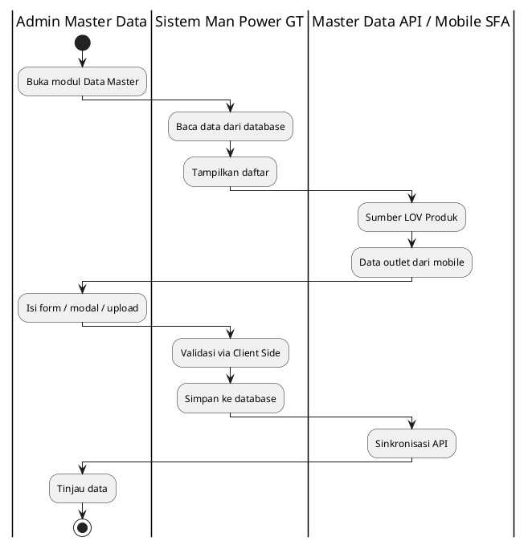

# FUNCTIONAL SPECIFICATION DOCUMENT (FSD)
## Modul: Man Power GT — Data Master (Web Admin)
### Sistem: Man Power GT
### Versi Dokumen: 1.17

---

| Atribut | Keterangan |
|---------|------------|
| **Nama Dokumen** | FSD Modul Data Master — Web Admin Man Power GT |
| **Versi** | 1.17 |
| **Tanggal** | 12 Agustus 2026 |
| **Divisi** | IT / Business – Man Power GT |
| **Status** | Draft |
| **Dibuat oleh** | Tim IT – Man Power GT |

---

## Riwayat Revisi

| Versi | Tanggal | Diubah Oleh | Keterangan |
|---------|-------------|-------------|------------|
| **1.17** | **12 Agustus 2026** | **Tim IT** | Channel: screenshot tombol aksi lengkap + validasi SweetAlert (BR-MD08–18) |
| **1.16** | **12 Agustus 2026** | **Tim IT** | Perbaikan caption ganda pada gambar (alt Pandoc vs Gambar N.M) |
| **1.15** | **12 Agustus 2026** | **Tim IT** | Channel: kembalikan tabel Aspek; hilangkan metadata prototipe; catatan sumber italic |
| **1.14** | **12 Agustus 2026** | **Tim IT** | Narasi modul Channel: paragraf + poin; path sumber italic/kecil |
| **1.13** | **12 Agustus 2026** | **Tim IT** | Channel: screenshot dual-surface (Portal Mapping/Manage + MP GT view-only); Produk: refresh screenshot |
| **1.12** | **12 Agustus 2026** | **Tim IT** | Produk: **Product Category** dari Param `PRODUCT_CATEGORY_GT` (`/api/v1/Param`) |
| **1.11** | **12 Agustus 2026** | **Tim IT** | Channel dual-surface (Portal Mapping/Manage + FPRS list-only); TypeCus global; Produk: upload **Foto Produk** |
| **1.10** | **12 Agustus 2026** | **Tim IT** | Channel: hierarki **Channel → Type Customer → Account**; tab Manage + Mapping (simulasi Master Data) |
| **1.9** | **10 Agustus 2026** | **Tim IT** | Limit: field **Nama** wajib & unik global (`txtNama`); kolom list + input Header |
| **1.8** | **7 Agustus 2026** | **Tim IT** | Channel: **view-only** (sumber API `/api/v1/Channel`); hapus Tambah/Edit di UI + FSD |
| **1.7** | **6 Agustus 2026** | **Tim IT** | Limit: sumber LOV Jabatan/Type dari API `/api/v1/Position` (tooltip + narasi FSD) |
| **1.6** | **6 Agustus 2026** | **Tim IT** | Limit: screenshot + narasi validasi (field, duplikat, periode bentrok) + History |
| **1.5** | **6 Agustus 2026** | **Tim IT** | ERD + DDL **Limit** (`mLimitTargetHarian` / `mLimitTargetHarianVer`); script `012_mLimitTargetHarian.sql` |
| **1.4** | **4 Agustus 2026** | **Tim IT** | Swimlane Bab 2 diganti ke **PlantUML** kolom role (standar FSD Engine) |
| **1.3** | **4 Agustus 2026** | **Tim IT** | Rename **Man Power GT**; tambah modul **Limit**; screenshot ulang 8 modul |
| **1.2** | **10 Juli 2026** | **Tim IT** | Perkaya business flow, RBAC/approval, sumber data & API; rapikan ERD |
| **1.1** | **9 Juli 2026** | **Tim IT** | Tambah arsitektur MAVEN, mapping UI→database, ERD lengkap |
| **1.0** | **8 Juli 2026** | **Tim IT** | Initial draft – modul Data Master Web Admin |

---

## Persetujuan Dokumen (Document Approval)

| Full Name | Job Title | Signature | Signature Date |
|-----------|-----------|-----------|----------------|
| Muhammad Rafi | SHP Channel & Customer Development |  |  |
| Silvester Mario Nian Destrada | SHP Channel & Customer Development |  |  |
| Aldira Rahmania | SHP Channel & Customer Development |  |  |
| Ageng Kurniawan Sugianto | IT Product |  |  |
| Albet | IT Product |  |  |

---

## 1. Pendahuluan

### 1.1 Latar Belakang

**Man Power GT** (*Man Power General Trade*) adalah sistem internal PT Kalbe
Nutritionals untuk mengelola tenaga lapangan General Trade (motoris / canvasser),
administrasi data master terkait, monitoring penjualan lapangan, dan pelacakan
kunjungan sales. Dokumen ini memfokuskan lingkup pada **modul Data Master** Web Admin
(`Views/FPRS/MasterData/` dan **Master Data Portal** `Views/MasterDataPortal/` untuk Channel) —
kumpulan halaman referensi yang menjadi fondasi transaksi.

Prototipe Web Portal berupa *high-fidelity interactive prototype* berbasis HTML
statis (MPA) bertema Vuexy/Bootstrap yang menggunakan **localStorage** dan file
JSON seed di `wwwroot/data/` sebagai lapisan persistensi sisi klien, mensimulasikan
alur kerja admin sebelum integrasi penuh ke Master Data API Kalbe dan backend MAVEN.

### 1.2 Tujuan Dokumen

1. Mendeskripsikan fungsionalitas **per halaman dan per komponen UI** modul Data Master.
2. Menjadi acuan pengembangan backend/API dan UAT untuk data referensi FPRS.
3. Mendokumentasikan business rules (UI + produksi), pola CRUD, sumber data, integrasi API, RBAC, dan data layer.
4. Menyelaraskan format dokumentasi dengan standar **FSD Generator Engine** (Kalbe Nutritionals).

### 1.3 Ruang Lingkup

| Dalam lingkup | Di luar lingkup |
|---------------|-----------------|
| Modul Data Master Web (`Views/FPRS/MasterData/`) + **Master Data Portal** (`Views/MasterDataPortal/`) untuk Channel | Modul Penjualan, Kunjungan, Dashboard |
| Produk, Pelanggan, Channel, Pegawai, Stokis, Limit, Pajak, Alasan | Mobile SFA (`Views/Mobile/`, Flutter APK) — kecuali sebagai **sumber data** Pelanggan |
| Persistensi prototipe (localStorage + JSON seed) | Modul DOFS MAVEN yang sudah ada |
| Desain database produksi MAVEN (PostgreSQL + EF Core) | Workflow approval multi-level (tidak berlaku untuk Data Master v1) |
| Mapping UI → tabel/kolom MAVEN & skrip DDL | — |
| Target RBAC produksi (KNGlobal `mMenu` / `mRoleAccess`) | — |

### 1.4 Stakeholder

| Peran | Tim/Divisi | Keterlibatan |
|-------|------------|--------------|
| Admin Master Data | IT / Operations | CRUD & sinkronisasi data referensi |
| Supervisor Sales | Sales | Validasi data outlet & pegawai (read) |
| Developer | IT | Implementasi API & UI produksi (MAVEN) |
| Business Analyst | PDV / Sales | Validasi alur bisnis & sumber data |
| IT Security / Access Admin | IT | Konfigurasi role access KNGlobal |

---

## 2. Arsitektur & Alur Data Master

### 2.1 Ringkasan Teknis

| Aspek | Prototipe | Produksi (MAVEN) |
|-------|-----------|------------------|
| Arsitektur | Static MPA — satu `.html` per halaman | ASP.NET Core MVC + service layer |
| UI Framework | Bootstrap 5.3, Vuexy Admin Theme | Vuexy + Razor Views |
| JavaScript | jQuery, DataTables, Select2, SweetAlert2 | Sama (server-side DataTable) |
| Persistensi | `localStorage` + seed `wwwroot/data/*.json` | PostgreSQL via `CentralContext` (EF Core) |
| Auth / Menu | Tidak ada login | KNGlobal SSO + `mMenu` / `mRoleAccess` |
| Navigasi | `wwwroot/js/layout.js` | Menu dinamis dari KNGlobal |
| Branding | Kalbe hijau `#005d41`, font Kalbe Geometric | Sama |

### 2.2 Pola Pengelolaan Data Master

Modul Data Master memakai **empat pola** pengelolaan data:

| Pola | Modul | Cara Kelola | Sumber kebenaran (produksi) |
|------|-------|-------------|------------------------------|
| Form (add/edit) | Produk | Halaman detail fleksibel + LOV SKU + Param Category | Katalog SKU dari Master Data API; category dari Param `PRODUCT_CATEGORY_GT`; harga/pajak/status/foto di DB FPRS |
| Modal CRUD | Pajak, Alasan | Modal di dalam Index | Tabel lokal MAVEN (`mPajak`, `mAlasan`) |
| Upload-only (CSV + history) | Pegawai, Stokis | Download/Upload CSV, status disinkronkan | File CSV sebagai input; hasil di `mPegawai` / `mStokis` + tabel riwayat |
| View-only (sumber mobile) | Pelanggan | List + detail read-only | Mobile SFA → `mPelanggan` |
| Dual-surface (Portal CRUD + MP GT view-only) | Channel | Portal: tab Mapping + Manage; FPRS: list mapping saja | Channel → Type Customer → Account; triple mapping |
| Form + versi (append-only) | Limit | Header + versi periode | LOV jabatan dari API Position; persist `mLimitTargetHarian` / Ver |

### 2.3 Business Flow (Swimlane)

Alur berikut menggambarkan pengelolaan Data Master **saat menggunakan database produksi** (MAVEN / PostgreSQL), bukan localStorage prototipe.

**Lane (urutan kiri → kanan):**

| # | Lane ID | Label | Tipe | Sumber |
|---|---------|-------|------|--------|
| 1 | L1 | Admin Master Data | User | RBAC Web Admin |
| 2 | L2 | Sistem Man Power GT | System | Controllers PowerGT Master Data |
| 3 | L3 | Master Data API / Mobile SFA | External | LOV Produk + sync outlet |



Hand-off Admin → Sistem: setiap operasi form/modal/upload dibaca dan disimpan ke database. Hand-off Sistem ↔ API/Mobile: LOV Produk dan data outlet mensuplai form; hasil simpan dapat disinkronkan ke API.

### 2.4 Ringkasan Alur per Pola (Produksi)

| Pola | Trigger | Validasi utama | Hasil | Approval |
|------|---------|----------------|-------|----------|
| Form Produk | Create / Edit | Kode dari LOV API; harga beli > 0; kode unik | Insert/update `mProduk` | Tidak ada — langsung simpan |
| Modal Pajak/Alasan | Tambah / Ubah (/ Hapus) | Field wajib; unik nama/kode; Pajak cek FK produk sebelum hapus | Persist ke tabel terkait | Tidak ada |
| CSV Pegawai/Stokis | Upload file | Header dikenali; baris wajib; Stokis: GPS unik | Upsert Active; absen di file → Inactive + hist | Tidak ada |
| Channel | Portal Mapping/Manage; FPRS view-only | TypeCus global; Account unik; triple unik | Persist simulasi MD (Channel/TypeCus/Account/mapping) | Tidak ada |
| Pelanggan | Buka list/detail | — (read-only) | Tampil dari `mPelanggan` | N/A |
| Limit | Create header / append versi | Nama wajib+unik global; Jabatan+type unik; Max≥Min; no backdate; overlap dialog | `mLimitTargetHarian` + Ver | Tidak ada |

**Catatan approval:** modul Data Master **tidak** memakai workflow approval multi-level. Perubahan langsung tersimpan jika user punya `bitEdit` (atau hak upload untuk Pegawai/Stokis). Audit trail: `txtInsertedBy` / `txtUpdatedBy` / `dtInserted` / `dtUpdated`.


## 3. Modul Data Master

Bab ini mendeskripsikan setiap modul Data Master: kolom dashboard list (DataTable), field form/modal/detail, tombol aksi, business rules (hasil ekstraksi validasi UI), dan pola CRUD. Konten field/kolom/validasi diambil langsung dari file HTML sumber.

### 3.1 Produk

Modul **Produk** merupakan bagian dari Web Portal Falcon FPRS. Tipe UI: **page**.

Halaman dashboard list menampilkan **summary cards** (`cntTotal`, `cntActive`, `cntInactive`, `cntUmbrella`) dan DataTable `#tbl` dengan filter per kolom, termasuk kolom **Category**, **Umbrella Brand**, dan thumbnail **Foto**. Tombol **Tambah Produk** mengarah ke `detail.html`. Halaman `detail.html` bersifat fleksibel (add & edit): **Kode Produk** berupa LOV searchable (Select2) yang mengambil data dari Master Data API, mengunci field turunan (nama, umbrella, brand) menjadi read-only. **Product Category** dropdown wajib dari Master Data API `GET /api/v1/Param` dengan **`paramCode = PRODUCT_CATEGORY_GT`** (prototipe: seed `param-product-category-gt.json`; simpan `kategori`, `kategoriCode`, `kategoriId`). **Foto Produk** dapat di-upload (JPG/PNG/WebP, dikompres otomatis) dan disimpan pada field `foto`. **Harga Beli** dapat diedit, **Harga Jual** read-only dihitung otomatis (`Harga Beli + PPN`, default skema PPN 11%). **Unit Konversi** dikunci ke `PCS`, dan **Status Produk** berupa checkbox aktif/nonaktif.

| Aspek | Keterangan |
|-------|------------|
| **Tujuan Form** | Mendaftarkan dan memelihara data SKU/produk (kode, umbrella brand, brand, harga beli, harga jual, pajak, status, foto produk) sebagai referensi transaksi penjualan. Data produk bersumber dari Master Data API, sedangkan harga jual, pajak, status, dan foto dikelola di aplikasi ini. |
| **Pengguna** | Admin Master Data, IT Operations — pengelola katalog produk Kalbe. |


<!-- fig-title: Master Data — Produk — Dashboard List -->


#### 3.1.1 Kolom DataTable Dashboard List

| Kolom | Field Key | Render | Sortable | Keterangan |
|-------|-----------|--------|----------|------------|
| NO | `No` | Text | Ya | Kolom grid dashboard list |
| FOTO | `Foto` | Text | Ya | Kolom grid dashboard list |
| KODE | `Kode` | Text | Ya | *mProduk \| txtKode* |
| PRODUK | `Produk` | Text | Ya | *mProduk \| txtNama* |
| CATEGORY | `Category` | Text | Ya | *Master Data API /api/v1/Param \| paramCode=PRODUCT_CATEGORY_GT* |
| UMBRELLA BRAND | `UmbrellaBrand` | Text | Ya | *mProduk \| txtUmbrella* |
| BRAND | `Brand` | Text | Ya | *mProduk \| intBrandID (FK mBrand.BrandName)* |
| UNIT | `Unit` | Text | Ya | *mProduk \| intUnitID (FK mUnit.txtNama)* |
| HARGA JUAL | `HargaJual` | Text | Ya | *mProduk \| decHargaJual* |
| PAJAK | `Pajak` | Text | Ya | *mProduk \| intPajakID (FK mPajak.txtNamaPajak)* |
| STATUS | `Status` | Text | Ya | *mProduk \| bitActive* |

#### 3.1.2 Tombol Aksi — Dashboard List

| Tampilan | Tombol | ID / Handler | Warna/Style | Fungsi |
|----------|--------|--------------|-------------|--------|
|  | Tambah Produk | `—` | btn-success | Membuka modal form untuk menambah data baru. |
|  | Detail / Ubah | `—` | btn-outline-secondary | Menampilkan halaman detail record terpilih (parameter URL terenkripsi). |
|  | Hapus foto | `btnClearFoto` | btn-outline-secondary | Menghapus data terpilih setelah konfirmasi pengguna. |

<!-- fig-title: Master Data — Produk — Halaman Detail -->


#### 3.1.3 Form Tambah/Ubah

| Field Name | ID Elemen | Tipe | Mandatory | Default | Validasi | Keterangan |
|------------|-----------|------|-----------|---------|----------|------------|
| Kode Produk | `kode` | Dropdown | Ya | (kosong) | Wajib; Kode produk wajib dipilih dari Master Data API.; Data produk belum termuat. Pilih ulang Kode Produk.; Kode "{nilai}" sudah terdaftar pada Master Produk. | *mProduk \| txtKode* |
| Nama Produk | `nama` | Text (readonly) | Tidak | (kosong) | readonly | *mProduk \| txtNama* |
| Umbrella Brand | `umbrella` | Text (readonly) | Tidak | (kosong) | readonly | *mProduk \| txtUmbrella* |
| Brand | `brand` | Text (readonly) | Tidak | (kosong) | readonly | *mProduk \| intBrandID (FK mBrand)* |
| Product Category | `kategori` | Dropdown | Ya | (kosong) | Wajib; Product Category wajib dipilih. | *Master Data API /api/v1/Param \| paramCode=PRODUCT_CATEGORY_GT* |
| Harga Beli | `hargaBeli` | Number | Ya | (kosong) | Wajib; min=0; Harga beli harus lebih dari 0. | *mProduk \| decHargaBeli* |
| Skema Pajak | `namaPajak` | Dropdown | Ya | (kosong) | Wajib | *mProduk \| intPajakID (FK mPajak)* |
| Harga Jual (otomatis) | `hargaJual` | Number | Tidak | (kosong) | readonly | *mProduk \| decHargaJual* |
| Unit Konversi | `unitNama` | Text (readonly) | Tidak | PCS | readonly | *mProduk \| intUnitID (FK mUnit)* |
| Status Produk | `status` | Text | Tidak | (kosong) | — | *mProduk \| bitActive* |

#### 3.1.4 Tombol Aksi — Halaman Detail

| Tampilan | Tombol | ID / Handler | Warna/Style | Fungsi |
|----------|--------|--------------|-------------|--------|
|  | Simpan Produk | `—` | btn-success | Menyimpan perubahan dari modal ke penyimpanan lokal setelah validasi. |

#### 3.1.5 Business Rules

| Rule ID | Aturan |
|---------|--------|
| BR-MD01 | File harus berupa gambar. |
| BR-MD02 | Ukuran file maksimal 2 MB. |
| BR-MD03 | Kode produk wajib dipilih dari Master Data API. |
| BR-MD04 | Data produk belum termuat. Pilih ulang Kode Produk. |
| BR-MD05 | Harga beli harus lebih dari 0. |
| BR-MD06 | Product Category wajib dipilih. |
| BR-MD07 | Kode "${kode}" sudah terdaftar pada Master Produk. |

#### 3.1.6 CRUD

| Operasi | Cara | Role | Keterangan |
|---------|------|------|------------|
| **Create** | Klik Tambah Produk → `detail.html` (LOV Kode Produk + upload Foto) | Admin | Simpan setelah validasi |
| **Read** | dashboard list (DataTable + thumbnail foto) + `detail.html` | Semua role | — |
| **Update** | Buka `detail.html?param=` → ubah harga beli/pajak/status/foto | Admin | Kode & data API read-only |

#### 3.1.6 Mapping Database MAVEN

| Field UI / Kolom Grid | Tabel MAVEN | Kolom MAVEN | Kunci | Keterangan |
|-----------------------|-------------|-------------|-------|------------|
| Kode Produk | `mProduk` | `txtKode` | UQ | LOV dari Master Data API |
| Nama Produk | `mProduk` | `txtNama` | | Read-only dari API |
| Umbrella Brand | `mProduk` | `txtUmbrella` | | Read-only dari API |
| Brand | `mProduk` | `intBrandID` | FK → `mBrand` | Reuse tabel MAVEN existing |
| Product Category | `mProduk` | `txtKategoriCode` | | LOV dari `GET /api/v1/Param?paramCode=PRODUCT_CATEGORY_GT`; simpan kode + label cache |
| Foto Produk | `mProduk` | `txtFoto` | | URL/path atau blob; prototipe: data URL di field `foto` |
| Harga Beli | `mProduk` | `decHargaBeli` | | ≥ 0 |
| Harga Jual | `mProduk` | `decHargaJual` | | Dihitung otomatis |
| Skema Pajak | `mProduk` | `intPajakID` | FK → `mPajak` | |
| Unit | `mProduk` | `intUnitID` | FK → `mUnit` | Selalu PCS di prototipe |
| Status | `mProduk` | `bitActive` | | active → true |
| Divisi (API) | `mProduk` | `intDivisiID` | FK → `mDivisi` | |

### 3.2 Pelanggan

Modul **Pelanggan** merupakan bagian dari Web Portal Falcon FPRS. Tipe UI: **page**.

Data pelanggan/outlet **diinput dari aplikasi mobile** (SFA), sehingga Web Portal bersifat **view-only** — tanpa tombol Tambah/Edit/Hapus. Halaman detail menampilkan atribut hasil capture lapangan: foto outlet, pemilik, NPWP, alamat, RT/RW, kelurahan, kecamatan, kota, koordinat GPS, **channel**, dan tipe outlet. Data disimpan di `md_pelanggan`.

| Aspek | Keterangan |
|-------|------------|
| **Tujuan Form** | Menampilkan data outlet/pelanggan yang diinput dari aplikasi mobile (foto, pemilik, alamat, GPS, channel, tipe outlet) sebagai entitas utama kunjungan sales dan faktur. Bersifat view-only di web. |
| **Pengguna** | Admin Master Data, Operations, Supervisor Sales (validasi data outlet). |


<!-- fig-title: Master Data — Pelanggan — Dashboard List -->


#### 3.2.1 Kolom DataTable Dashboard List

| Kolom | Field Key | Render | Sortable | Keterangan |
|-------|-----------|--------|----------|------------|
| NO | `No` | Text | Ya | Kolom grid dashboard list |
| KODE | `Kode` | Text | Ya | *mPelanggan \| txtKode* |
| PELANGGAN | `Pelanggan` | Text | Ya | *mPelanggan \| txtNama* |
| ALAMAT | `Alamat` | Text | Ya | *mPelanggan \| txtAlamat* |
| TELEPON | `Telepon` | Text | Ya | *mPelanggan \| txtTelepon* |
| SALESMAN | `Salesman` | Text | Ya | *mPelanggan \| intSalesmanID (FK mPegawai)* |
| KUNJUNGAN TERAKHIR | `KunjunganTerakhir` | Text | Ya | *mPelanggan \| dtKunjunganTerakhir* |
| STATUS | `Status` | Text | Ya | *mPelanggan \| bitActive* |

#### 3.2.2 Tombol Aksi — Dashboard List

| Tampilan | Tombol | ID / Handler | Warna/Style | Fungsi |
|----------|--------|--------------|-------------|--------|
|  | Detail | `—` | btn-outline-secondary | Menampilkan halaman detail record terpilih (parameter URL terenkripsi). |

<!-- fig-title: Master Data — Pelanggan — Halaman Detail -->


#### 3.2.3 Tombol Aksi — Halaman Detail

| Tampilan | Tombol | ID / Handler | Warna/Style | Fungsi |
|----------|--------|--------------|-------------|--------|
|  | Kembali | `—` | btn-secondary | Kembali ke dashboard list modul. |

#### 3.2.4 CRUD

| Operasi | Cara | Role | Keterangan |
|---------|------|------|------------|
| **Create** | — | — | Data diinput dari aplikasi mobile (SFA) |
| **Read** | dashboard list (DataTable) + `detail.html` | Semua role | View-only |

#### 3.2.6 Mapping Database MAVEN

| Field UI / Kolom Grid | Tabel MAVEN | Kolom MAVEN | Kunci | Keterangan |
|-----------------------|-------------|-------------|-------|------------|
| Kode | `mPelanggan` | `txtKode` | UQ | |
| Nama / PELANGGAN | `mPelanggan` | `txtNama` | | |
| Alamat | `mPelanggan` | `txtAlamat` | | |
| Telepon | `mPelanggan` | `txtTelepon` | | |
| Salesman | `mPelanggan` | `intSalesmanID` | FK → `mPegawai` | |
| Kunjungan Terakhir | `mPelanggan` | `dtKunjunganTerakhir` | | |
| Status | `mPelanggan` | `bitActive` | | Active → true |
| Pemilik | `mPelanggan` | `txtPemilik` | | Dari mobile |
| NPWP | `mPelanggan` | `txtNpwp` | | |
| Channel | `mPelanggan` | `intChannelID` | FK → `mChannel` | |
| Daftar Harga | `mPelanggan` | `intDaftarHargaID` | FK → `mDaftarHarga` | |
| Tipe Outlet | `mPelanggan` | `txtOutletType` | | |
| Grup Pelanggan | `mPelanggan` | `txtGrupPelanggan` | | |
| RT/RW, Kelurahan, Kecamatan, Kota | `mPelanggan` | `txtRtRw`, `txtKelurahan`, `txtKecamatan`, `txtKota` | | |
| Koordinat GPS | `mPelanggan` | `decLat`, `decLng`, `bitHasGps` | | |
| Foto Toko | `mPelanggan` | `txtPhoto` | | Path/URL dari mobile |
| Waktu Pembayaran | `mPelanggan` | `txtWaktuPembayaran` | | |
| Transaksi Terakhir | `mPelanggan` | `dtTransaksiTerakhir` | | |

### 3.3 Channel

Modul **Channel** mengatur klasifikasi outlet lewat **mapping triple**: **Channel** · **Type Customer** · **Account** (kombinasi unik).

Prototipe memakai **dual-surface**:

- **Master Data Portal** — kelola master dan mapping (tab **Mapping** + **Manage**).
- **Man Power GT** — lihat daftar mapping saja; tanpa tambah, ubah, atau hapus.

**Type Customer** adalah master **global** (bukan turunan Channel). Hubungan ke Channel hanya lewat baris mapping.


| Aspek | Keterangan |
|-------|------------|
| **Tujuan Form** | Mengelola master Channel, Type Customer (global), Account, dan mapping triple di **Master Data Portal** (tab Mapping + Manage); menu Channel Man Power GT hanya list mapping view-only. |
| **Pengguna** | Admin Master Data (CRUD Portal); Sales Ops / Supervisor (view FPRS). |


<!-- fig-title: Master Data — Channel — Master Data Portal — Tab Mapping -->


<!-- fig-title: Master Data — Channel — Master Data Portal — Tab Manage -->


<!-- fig-title: Master Data — Channel — Man Power GT — View-only List -->


<!-- fig-title: Master Data — Channel — Modal Tambah Mapping -->


<!-- fig-title: Master Data — Channel — Modal Tambah Channel -->


<!-- fig-title: Master Data — Channel — Modal Tambah Type Customer -->


<!-- fig-title: Master Data — Channel — Modal Tambah Account -->


#### 3.3.1 Kolom DataTable Dashboard List

| Kolom | Field Key | Render | Sortable | Keterangan |
|-------|-----------|--------|----------|------------|
| NO | `No` | Text | Ya | Kolom grid dashboard list |
| CHANNEL | `Channel` | Text | Ya | Kolom grid dashboard list |
| TYPE CUSTOMER | `TypeCustomer` | Text | Ya | Kolom grid dashboard list |
| ACCOUNT | `Account` | Text | Ya | Kolom grid dashboard list |

#### 3.3.2 Tombol Aksi — Mapping & Manage

| Tampilan | Tombol | ID / Handler | Warna/Style | Fungsi |
|----------|--------|--------------|-------------|--------|
|  | Tambah Mapping | `btnAddMapping` | btn-success | Membuka modal untuk menambah triple mapping baru. |
|  | Hapus | `btn-del-map` | btn-outline-danger | Menghapus baris mapping setelah konfirmasi. |
|  | Mapping | `tab-mapping-btn` | btn-secondary | Menampilkan tab daftar triple mapping. |
|  | Manage | `tab-manage-btn` | btn-secondary | Menampilkan tab kelola master Channel, Type Customer, dan Account. |
|  | Channel | `hdChannel` | btn-secondary | Membuka panel master Channel pada tab Manage. |
|  | Tambah Channel | `btnAddChannel` | btn-success | Membuka modal tambah master Channel. |
|  | Ubah Channel | `btn-edit-ch` | btn-outline-success | Membuka modal ubah master Channel terpilih. |
|  | Simpan Channel | `btnSaveChannel` | btn-success | Menyimpan master Channel setelah validasi. |
|  | Type Customer | `hdTypeCus` | btn-secondary | Membuka panel master Type Customer (global). |
|  | Tambah Type Customer | `btnAddTypeCus` | btn-success | Membuka modal tambah Type Customer. |
|  | Ubah Type Customer | `btn-edit-tc` | btn-outline-success | Membuka modal ubah Type Customer terpilih. |
|  | Simpan Type Customer | `btnSaveTypeCus` | btn-success | Menyimpan master Type Customer setelah validasi. |
|  | Account | `hdAccount` | btn-secondary | Membuka panel master Account (global). |
|  | Tambah Account | `btnAddAccount` | btn-success | Membuka modal tambah Account. |
|  | Ubah Account | `btn-edit-acc` | btn-outline-success | Membuka modal ubah Account terpilih. |
|  | Simpan Account | `btnSaveAccount` | btn-success | Menyimpan master Account setelah validasi. |
|  | Simpan Mapping | `btnSaveMapping` | btn-success | Menyimpan triple mapping setelah validasi. |
| — | Simpan | `btnSaveChannel` | btn-success | Menyimpan perubahan dari modal ke penyimpanan lokal setelah validasi. |

#### 3.3.3 Business Rules

| Rule ID | Aturan |
|---------|--------|
| BR-MD08 | Nama Channel wajib diisi. |
| BR-MD09 | Nama Channel sudah dipakai. |
| BR-MD10 | Nama Type Customer wajib diisi. |
| BR-MD11 | Nama Type Customer sudah dipakai. |
| BR-MD12 | Kode Account wajib diisi. |
| BR-MD13 | Kode Account sudah dipakai. |
| BR-MD14 | Belum ada Channel aktif. Tambah di tab Manage. |
| BR-MD15 | Belum ada Type Customer aktif. Tambah di tab Manage. |
| BR-MD16 | Belum ada Account aktif. Tambah di tab Manage. |
| BR-MD17 | Channel, Type Customer, dan Account wajib dipilih. |
| BR-MD18 | Mapping triple sudah ada. |

#### 3.3.4 CRUD

| Operasi | Cara | Role | Keterangan |
|---------|------|------|------------|
| **Create** | Portal: Tambah Mapping / Channel / Type Customer / Account (tab Manage) | Admin Master Data | TypeCus & Account global; FPRS tidak punya Create |
| **Read** | Portal Mapping+Manage; FPRS list mapping view-only (tanpa detail) | Semua role dengan bitView | Data sama di kedua surface |
| **Update** | Hanya di Master Data Portal (tab Manage / Mapping) | Admin Master Data | TypeCus unik global; Account unik global; triple unik |
| **Delete** | Portal: hapus baris Mapping; soft nonaktif master via Status | Admin Master Data | FPRS tidak bisa hapus/ubah |

#### 3.3.6 Mapping Database MAVEN

| Field UI / Kolom Grid | Tabel MAVEN | Kolom MAVEN | Kunci | Keterangan |
|-----------------------|-------------|-------------|-------|------------|
| Nama Channel | `mChannel` | `txtNama` | UQ | Master global |
| Status Channel | `mChannel` | `bitActive` | | Soft active |
| Type Customer | `mTypeCustomer` *(rencana)* | `txtNama` | UQ | **Master global** (bukan child Channel); seed `type-customer.json` |
| Status Type Customer | `mTypeCustomer` | `bitActive` | | Soft active |
| Account | `mAccount` *(rencana)* | `txtKode` | UQ | Kode reusable (IND/NKA/RKA/MM/MTI); seed `account.json` |
| Status Account | `mAccount` | `bitActive` | | Soft active |
| Mapping | `mChannelMapping` *(rencana)* | channel+typeCus+account | UQ | Triple; seed `channel-mapping.json` |

> **Dual-surface:** CRUD di **Master Data Portal** (tab Mapping + Manage accordion). Menu Channel **Man Power GT** = list mapping view-only. Produksi sync/cache ke `mChannel` + Type Customer / Account / mapping.


#### 3.3.5 Narasi Validasi (Master Data Portal)

Validasi di modul **Channel** ditampilkan sebagai dialog **SweetAlert** (`Swal.fire`) saat simpan master atau mapping gagal. **Type Customer** dan **Account** bersifat master **global**; triple **Channel · Type Customer · Account** harus unik.

**Validasi master (modal Channel / Type Customer / Account):**

| Rule ID | Kondisi | Tampilan |
|---------|---------|----------|
| BR-MD08 | Nama Channel kosong |  |
| BR-MD09 | Nama Channel sudah dipakai |  |
| BR-MD10 | Nama Type Customer kosong |  |
| BR-MD11 | Nama Type Customer sudah dipakai |  |
| BR-MD12 | Kode Account kosong |  |
| BR-MD13 | Kode Account sudah dipakai |  |

**Validasi mapping (tab Mapping):**

| Rule ID | Kondisi | Tampilan |
|---------|---------|----------|
| BR-MD14 | Belum ada Channel aktif |  |
| BR-MD15 | Belum ada Type Customer aktif |  |
| BR-MD16 | Belum ada Account aktif |  |
| BR-MD17 | Channel / Type Customer / Account belum dipilih di modal |  |
| BR-MD18 | Triple mapping sudah ada |  |

### 3.4 Pegawai

Modul **Pegawai** merupakan bagian dari Web Portal Falcon FPRS. Tipe UI: **page**.

Master pegawai/sales force bersifat **upload-only** (pola seperti Master Stokis): data disinkronkan via **Download/Upload CSV** dan setiap perubahan status Active/Inactive dicatat pada **riwayat status**. Setiap pegawai memiliki **role** (Motoris / SPG GT) dan penempatan **Branch** & **Region**. Identitas unik menggunakan **NIK**. Halaman `detail.html` menampilkan data pegawai secara read-only beserta riwayat status.

| Aspek | Keterangan |
|-------|------------|
| **Tujuan Form** | Memelihara data pegawai/sales force (Motoris, SPG GT) beserta NIK, Branch, dan Region melalui mekanisme Download/Upload CSV dengan pencatatan riwayat status aktif/nonaktif. |
| **Pengguna** | Admin HR, IT, Supervisor Sales. |


<!-- fig-title: Master Data — Pegawai — Dashboard List -->


#### 3.4.1 Kolom DataTable Dashboard List

| Kolom | Field Key | Render | Sortable | Keterangan |
|-------|-----------|--------|----------|------------|
| NO | `No` | Text | Ya | Kolom grid dashboard list |
| NIK | `Nik` | Text | Ya | *mPegawai \| txtKode (NIK)* |
| NAMA | `Nama` | Text | Ya | *mPegawai \| txtNama* |
| ROLE | `Role` | Text | Ya | *mPegawai \| txtRole* |
| BRANCH | `Branch` | Text | Ya | *mPegawai \| txtBranch* |
| REGION | `Region` | Text | Ya | *mPegawai \| txtRegion* |
| STATUS | `Status` | Text | Ya | *mPegawai \| bitActive* |

#### 3.4.2 Tombol Aksi — Dashboard List

| Tampilan | Tombol | ID / Handler | Warna/Style | Fungsi |
|----------|--------|--------------|-------------|--------|
|  | Download Data | `downloadPegawai()` | btn-outline-secondary | Mengunduh data modul sebagai file CSV. |
|  | Upload Data | `triggerUploadPegawai()` | btn-outline-secondary | Mengunggah file CSV untuk sinkronisasi data. |
|  | Lihat Detail | `—` | btn-outline-secondary | Menampilkan halaman detail record terpilih (parameter URL terenkripsi). |

<!-- fig-title: Master Data — Pegawai — Halaman Detail -->


#### 3.4.3 Form Detail (read-only)

| Field Name | ID Elemen | Tipe | Mandatory | Default | Validasi | Keterangan |
|------------|-----------|------|-----------|---------|----------|------------|
| NIK | `kode` | Text | Tidak | (kosong) | readonly | *mPegawai \| txtKode (NIK)* |
| Nama | `nama` | Text | Tidak | (kosong) | readonly | *mPegawai \| txtNama* |
| Role | `role` | Text | Tidak | (kosong) | readonly | *mPegawai \| txtRole* |
| Branch | `branch` | Text | Tidak | (kosong) | readonly | *mPegawai \| txtBranch* |
| Region | `region` | Text | Tidak | (kosong) | readonly | *mPegawai \| txtRegion* |
| Telepon | `telepon` | Text | Tidak | (kosong) | readonly | *mPegawai \| txtTelepon* |
| Status | `status` | Text | Tidak | (kosong) | readonly | *mPegawai \| bitActive* |
| Keterangan | `keterangan` | Text | Tidak | (kosong) | readonly | *mPegawai \| txtKeterangan* |

#### 3.4.4 Tombol Aksi — Halaman Detail

| Tampilan | Tombol | ID / Handler | Warna/Style | Fungsi |
|----------|--------|--------------|-------------|--------|
|  | Kembali | `—` | btn-secondary | Kembali ke dashboard list modul. |

#### 3.4.5 Business Rules

| Rule ID | Aturan |
|---------|--------|
| BR-MD19 | File kosong atau format header tidak dikenali. |
| BR-MD20 | Tidak ada baris data yang dapat diproses. |

#### 3.4.6 CRUD

| Operasi | Cara | Role | Keterangan |
|---------|------|------|------------|
| **Create** | Upload CSV (baris baru) | Admin | Sinkronisasi dari file, bukan input manual |
| **Read** | dashboard list (DataTable) + `detail.html` | Semua role | Termasuk riwayat status/stok |
| **Update** | Upload CSV (status Active/Inactive) | Admin | Status disimpulkan dari keberadaan ID di file |

#### 3.4.6 Mapping Database MAVEN

| Field UI / Kolom Grid | Tabel MAVEN | Kolom MAVEN | Kunci | Keterangan |
|-----------------------|-------------|-------------|-------|------------|
| NIK | `mPegawai` | `txtKode` | UQ | Identitas CSV upload |
| Nama | `mPegawai` | `txtNama` | | |
| Role | `mPegawai` | `txtRole` | | Motoris / SPG GT |
| Branch | `mPegawai` | `txtBranch` | | |
| Region | `mPegawai` | `txtRegion` | | Diturunkan dari Branch |
| Telepon | `mPegawai` | `txtTelepon` | | |
| Keterangan | `mPegawai` | `txtKeterangan` | | |
| Status | `mPegawai` | `bitActive` | | Active/Inactive via CSV |

### 3.5 Stokis

Modul **Stokis** merupakan bagian dari Web Portal Falcon FPRS. Tipe UI: **page**.

Master **Stokis/Grosir** bersifat **upload-only** (Download/Upload CSV + riwayat stok). Menampilkan **Branch** dan **Region** (menggantikan kolom Kota), koordinat GPS untuk validasi check-in mobile, serta island **Riwayat Input Stok oleh Motoris** pada halaman detail.

| Aspek | Keterangan |
|-------|------------|
| **Tujuan Form** | Mendaftarkan grosir/distributor stokis tempat salesman melakukan kulakan dan cek stok barang. Termasuk koordinat GPS untuk validasi check-in mobile. |
| **Pengguna** | Admin Master Data, Sales Operations, Supervisor Sales. |


<!-- fig-title: Master Data — Stokis — Dashboard List -->


#### 3.5.1 Kolom DataTable Dashboard List

| Kolom | Field Key | Render | Sortable | Keterangan |
|-------|-----------|--------|----------|------------|
| NO | `No` | Text | Ya | Kolom grid dashboard list |
| OUTLET ID | `OutletId` | Text | Ya | *mStokis \| txtOutletId* |
| NAMA STOKIS | `NamaStokis` | Text | Ya | *mStokis \| txtNama* |
| BRANCH | `Branch` | Text | Ya | *mStokis \| txtBranch* |
| REGION | `Region` | Text | Ya | *mStokis \| txtRegion* |
| STATUS | `Status` | Text | Ya | *mStokis \| bitActive* |

#### 3.5.2 Tombol Aksi — Dashboard List

| Tampilan | Tombol | ID / Handler | Warna/Style | Fungsi |
|----------|--------|--------------|-------------|--------|
|  | Download Data | `downloadStokis()` | btn-outline-secondary | Mengunduh data modul sebagai file CSV. |
|  | Upload Data | `triggerUploadStokis()` | btn-outline-secondary | Mengunggah file CSV untuk sinkronisasi data. |
|  | Lihat Detail | `—` | btn-outline-secondary | Menampilkan halaman detail record terpilih (parameter URL terenkripsi). |

<!-- fig-title: Master Data — Stokis — Halaman Detail -->


#### 3.5.3 Form Detail (read-only)

| Field Name | ID Elemen | Tipe | Mandatory | Default | Validasi | Keterangan |
|------------|-----------|------|-----------|---------|----------|------------|
| Outlet ID | `kode` | Text | Tidak | (kosong) | readonly | *mStokis \| txtOutletId* |
| Nama Stokis | `nama` | Text | Tidak | (kosong) | readonly | *mStokis \| txtNama* |
| Branch | `branch` | Text | Tidak | (kosong) | readonly | *mStokis \| txtBranch* |
| Region | `region` | Text | Tidak | (kosong) | readonly | *mStokis \| txtRegion* |
| Telepon | `telepon` | Text | Tidak | (kosong) | readonly | *mStokis \| txtTelepon* |
| Status | `status` | Text | Tidak | (kosong) | readonly | *mStokis \| bitActive* |
| Alamat Lengkap | `alamat` | Text | Tidak | (kosong) | readonly | *mStokis \| txtAlamat* |
| Latitude | `lat` | Text | Tidak | (kosong) | readonly | *mStokis \| decLat* |
| Longitude | `lng` | Text | Tidak | (kosong) | readonly | *mStokis \| decLng* |

#### 3.5.4 Tombol Aksi — Halaman Detail

| Tampilan | Tombol | ID / Handler | Warna/Style | Fungsi |
|----------|--------|--------------|-------------|--------|
|  | Kembali | `—` | btn-secondary | Kembali ke dashboard list modul. |
|  | Stok per Produk | `—` | btn-secondary | Membuka panel Stok per Produk menampilkan data terkait pada halaman detail. |
|  | Riwayat Input Stok oleh Motoris | `—` | btn-secondary | Membuka panel Riwayat Input Stok oleh Motoris menampilkan data terkait pada halaman detail. |
|  | Riwayat Status (Active / Inactive) — dari Upload | `—` | btn-secondary | Membuka panel Riwayat Status (Active / Inactive) — dari Upload menampilkan data terkait pada halaman detail. |

#### 3.5.5 Business Rules

| Rule ID | Aturan |
|---------|--------|
| BR-MD21 | File kosong atau format header tidak dikenali. |
| BR-MD22 | Tidak ada baris data yang dapat diproses. |

#### 3.5.6 CRUD

| Operasi | Cara | Role | Keterangan |
|---------|------|------|------------|
| **Create** | Upload CSV (baris baru) | Admin | Sinkronisasi dari file, bukan input manual |
| **Read** | dashboard list (DataTable) + `detail.html` | Semua role | Termasuk riwayat status/stok |
| **Update** | Upload CSV (status Active/Inactive) | Admin | Status disimpulkan dari keberadaan ID di file |

#### 3.5.6 Mapping Database MAVEN

| Field UI / Kolom Grid | Tabel MAVEN | Kolom MAVEN | Kunci | Keterangan |
|-----------------------|-------------|-------------|-------|------------|
| Outlet ID | `mStokis` | `txtOutletId` | UQ | Identitas CSV upload |
| Nama Stokis | `mStokis` | `txtNama` | | |
| Branch | `mStokis` | `txtBranch` | | |
| Region | `mStokis` | `txtRegion` | | |
| Telepon | `mStokis` | `txtTelepon` | | |
| Alamat | `mStokis` | `txtAlamat` | | |
| Latitude / Longitude | `mStokis` | `decLat`, `decLng` | | Unik per outlet |
| Status | `mStokis` | `bitActive` | | Active/Inactive via CSV |

### 3.6 Limit

Modul **Limit** merupakan bagian dari Web Portal Falcon FPRS. Tipe UI: **page**.

<!-- fig-title: Master Data — Limit — Dashboard List -->


#### 3.6.1 Kolom DataTable Dashboard List

| Kolom | Field Key | Render | Sortable | Keterangan |
|-------|-----------|--------|----------|------------|
| NAMA | `Nama` | Text | Ya | Kolom grid dashboard list |
| JABATAN | `Jabatan` | Text | Ya | *Master Data API /api/v1/Position \| mJabatan.txtJabatanName → mLimitTargetHarian.txtJabatan* |
| TYPE JABATAN | `TypeJabatan` | Text | Ya | *Master Data API /api/v1/Position \| tipe jabatan → mLimitTargetHarian.txtTypeJabatan* |
| MIN HARIAN | `MinHarian` | Text | Ya | *mLimitTargetHarianVer \| intMinimalHarian* |
| MAX HARIAN | `MaxHarian` | Text | Ya | *mLimitTargetHarianVer \| intMaximalHarian* |
| ACTIVE | `Active` | Text | Ya | *mLimitTargetHarianVer \| bitActive (versi berlaku hari ini)* |

#### 3.6.2 Tombol Aksi — Dashboard List

| Tampilan | Tombol | ID / Handler | Warna/Style | Fungsi |
|----------|--------|--------------|-------------|--------|
|  | Create | `—` | btn-success | Menjalankan aksi Create. |
|  | Detail | `—` | btn-success | Menampilkan halaman detail record terpilih (parameter URL terenkripsi). |
|  | History | `—` | btn-secondary | Menjalankan aksi History. |
|  | Update | `btnUpdate` | btn-success | Menjalankan aksi terkait tombol Update. |
|  | Back | `—` | btn-danger | Menjalankan aksi Back. |

<!-- fig-title: Master Data — Limit — Halaman Detail -->


#### 3.6.3 Form Tambah/Ubah

| Field Name | ID Elemen | Tipe | Mandatory | Default | Validasi | Keterangan |
|------------|-----------|------|-----------|---------|----------|------------|
| Nama | `inputNama` | Text | Ya | (kosong) | Wajib; maks. 150 karakter | — |
| Jabatan | `inputJabatan` | Dropdown | Ya | (kosong) | Wajib | *Master Data API /api/v1/Position \| mJabatan.txtJabatanName* |
| Type Jabatan | `inputTypeJabatan` | Dropdown | Ya | (kosong) | Wajib | *Master Data API /api/v1/Position \| tipe jabatan (mTipeJabatan / intTipeJabatanId)* |
| Minimal Harian | `inputMin` | Number | Ya | (kosong) | Wajib; min=0 | — |
| Maximal Harian | `inputMax` | Number | Ya | (kosong) | Wajib; min=0 | — |
| Target HKE Mingguan | `inputHke` | Number | Ya | (kosong) | Wajib; min=0 | — |
| Target HKE Bulanan | `inputHkeBulanan` | Number | Ya | (kosong) | Wajib; min=0 | — |
| Tanggal Mulai | `inputMulai` | Text | Ya | (kosong) | Wajib | — |
| Tanggal Selesai | `inputSelesai` | Text | Ya | (kosong) | Wajib | — |

#### 3.6.4 Business Rules

| Rule ID | Aturan |
|---------|--------|
| BR-MD23 | ID limit tidak ditemukan. |
| BR-MD24 | Data limit tidak ditemukan. |
| BR-MD25 | Menutup versi aktif akan membuat periode versi lama tidak valid. Geser tanggal mulai versi baru saja. |
| BR-MD26 | Nama Limit wajib diisi. |
| BR-MD27 | Jabatan dan Type Jabatan wajib diisi. |
| BR-MD28 | Semua field angka dan periode wajib diisi (≥0). |
| BR-MD29 | Maximal Harian tidak boleh lebih kecil dari Minimal Harian. |
| BR-MD30 | Tanggal mulai tidak boleh backdate. Minimal hari ini. |
| BR-MD31 | Tanggal selesai tidak boleh sebelum tanggal mulai. |
| BR-MD32 | Nama Limit sudah dipakai (unik global). |
| BR-MD33 | Limit untuk pasangan Jabatan / Type Jabatan sudah ada (duplikat header). |
| BR-MD34 | Tidak ada slot tanggal mulai ≥ hari ini tanpa menutup versi aktif lebih awal. |
| BR-MD35 | Tanggal mulai yang digeser melebihi tanggal selesai. Perpanjang tanggal selesai dulu. |
| BR-MD36 | Setelah digeser masih bentrok. Tutup versi aktif lebih awal. |
| BR-MD37 | Periode bentrok: tanggal mulai versi baru bentrok dengan versi aktif — pilih Tutup versi aktif lebih awal / Geser mulai versi baru / Batal. |

#### 3.6.5 CRUD

| Operasi | Cara | Role | Keterangan |
|---------|------|------|------------|
| **Create** | Klik Tambah → `add.html` | Admin | — |
| **Read** | dashboard list + `detail.html` | Semua role | — |
| **Update** | Edit via `add.html?id=` | Admin | — |
| **Delete** | Konfirmasi Swal pada dashboard list | Admin | — |

#### 3.6.6 Mapping Database MAVEN

| Field UI / Kolom Grid | Tabel MAVEN | Kolom MAVEN | Kunci | Keterangan |
|-----------------------|-------------|-------------|-------|------------|
| Nama | `mLimitTargetHarian` | `txtNama` | UQ | Wajib; unik global (case-insensitive di UI) |
| Jabatan | `mLimitTargetHarian` | `txtJabatan` | UQ* | LOV dari Master Data API `/api/v1/Position` (`mJabatan.txtJabatanName`); *unik bersama Type |
| Type Jabatan | `mLimitTargetHarian` | `txtTypeJabatan` | UQ* | LOV tipe jabatan dari API Position (ikut jabatan terpilih) |
| Minimal Harian | `mLimitTargetHarianVer` | `intMinimalHarian` | | Target kunjungan dasbor mobile |
| Maximal Harian | `mLimitTargetHarianVer` | `intMaximalHarian` | | ≥ Minimal Harian |
| Target HKE Mingguan | `mLimitTargetHarianVer` | `intTargetHkeMingguan` | | Hari kerja efektif / minggu |
| Target HKE Bulanan | `mLimitTargetHarianVer` | `intTargetHkeBulanan` | | |
| Tanggal Mulai | `mLimitTargetHarianVer` | `dtTanggalMulai` | | Tidak boleh backdate (BR) |
| Tanggal Selesai | `mLimitTargetHarianVer` | `dtTanggalSelesai` | | ≥ Tanggal Mulai |
| Active (versi) | `mLimitTargetHarianVer` | `bitActive` | | Versi aktif dalam periode |
| Active (header) | `mLimitTargetHarian` | `bitActive` | | Soft-delete header |

> **Sumber LOV Header:** Jabatan & Type Jabatan = Master Data API `/api/v1/Position`. **Nama** = input lokal wajib & unik global (`txtNama`). Nilai jabatan/type yang dipilih **disimpan** di `mLimitTargetHarian` (snapshot teks); Update append versi ke `mLimitTargetHarianVer`. DDL: `MAVEN.DAL/Scripts/012_mLimitTargetHarian.sql`.


#### 3.6.7 Sumber Data Jabatan & Type Jabatan (Master Data API)

Pada halaman **Create / Detail** (form Header), dropdown **Jabatan** dan **Type Jabatan** bersumber dari **Master Data API** endpoint **`/api/v1/Position`** (master jabatan / posisi).

| Field UI | Sumber API (rencana produksi) | Persistensi lokal Limit |
|----------|-------------------------------|-------------------------|
| Nama | Input lokal (wajib, unik global) | Disimpan di `mLimitTargetHarian.txtNama` |
| Jabatan | `/api/v1/Position` → `mJabatan.txtJabatanName` (mis. MD, Motoris) | Disimpan di `mLimitTargetHarian.txtJabatan` |
| Type Jabatan | `/api/v1/Position` → tipe jabatan terkait (mis. MD Reguler, Motoris Reguler) | Disimpan di `mLimitTargetHarian.txtTypeJabatan` |

**UI prototipe:**

- Banner info di atas form Header menjelaskan sumber API.
- Tooltip (`title`) pada label & kontrol: `Source : Master Data API /api/v1/Position | …` — pola sama seperti modul Produk/Alasan.
- Placeholder opsi: `-- Pilih (Master Data API) --`. Di prototipe opsi masih seed lokal; produksi wajib LOV live dari API.

**Catatan desain:** LOV selalu dari API agar selaras master organisasi; header Limit menyimpan **snapshot teks** jabatan/type agar histori versi tetap terbaca meskipun master Position berubah kemudian.

#### 3.6.8 Narasi Validasi & Alur Versi

Modul **Limit** mengelola target kunjungan harian per **Jabatan + Type Jabatan**, dengan **Nama** header wajib & unik global. Create membuat header + versi pertama; **Update selalu append versi baru** (append-only) ke History — versi lama tidak di-overwrite.

**Alur singkat:** isi header (Create) / form versi → klik Save/Update → validasi field → (Update) cek overlap periode versi aktif → simpan atau tampilkan dialog penyelesaian bentrok.

**Validasi field (SweetAlert Peringatan):**

| Rule ID | Kondisi | Tampilan |
|---------|---------|----------|
| BR-MD12 | Nama Limit kosong | (Swal: Nama Limit wajib diisi) |
| BR-MD13 | Jabatan / Type Jabatan kosong |  |
| BR-MD14 | Angka atau periode kosong / &lt; 0 |  |
| BR-MD15 | Maximal Harian &lt; Minimal Harian |  |
| BR-MD16 | Tanggal mulai &lt; hari ini (backdate) |  |
| BR-MD17 | Tanggal selesai &lt; tanggal mulai |  |

**Validasi unik & periode:**

| Rule ID | Kondisi | Tampilan |
|---------|---------|----------|
| BR-MD18a | Create/Update: Nama Limit sudah dipakai (unik global) | (Swal Duplikat Nama) |
| BR-MD18 | Create: pasangan Jabatan + Type sudah ada |  |
| BR-MD22 | Update: periode versi baru bentrok dengan versi aktif |  |

Pada dialog **Periode bentrok**, pengguna memilih:

1. **Tutup versi aktif lebih awal** — `tanggalSelesai` versi lama digeser ke sehari sebelum mulai versi baru, lalu versi baru di-append.
2. **Geser mulai versi baru** — sistem mengusulkan tanggal mulai = sehari setelah selesai versi aktif (jika masih valid vs hari ini & tanggal selesai).
3. **Batal** — tidak menyimpan.

**History (view-only):** menampilkan form readonly + panel daftar versi untuk header terpilih.


**Pemakaian di dashboard Mobile:** target kunjungan = `minimalHarian` dari versi Limit yang **aktif pada tanggal** filter, untuk jabatan yang dipetakan dari role user (MD → MD/MD Reguler; selain itu → Motoris/Motoris Reguler). Transaksi visit **tidak** menyimpan FK Limit; nilai target di-resolve saat baca KPI.

### 3.7 Pajak

Modul **Pajak** merupakan bagian dari Web Portal Falcon FPRS. Tipe UI: **page**.

| Aspek | Keterangan |
|-------|------------|
| **Tujuan Form** | Mengonfigurasi skema pajak (PPN, DPP) yang dipakai perhitungan harga produk dan faktur. |
| **Pengguna** | Admin Finance, Tax/Accounting. |


<!-- fig-title: Master Data — Pajak — Dashboard List -->


#### 3.7.1 Kolom DataTable Dashboard List

| Kolom | Field Key | Render | Sortable | Keterangan |
|-------|-----------|--------|----------|------------|
| NO | `No` | Text | Ya | Kolom grid dashboard list |
| KODE PAJAK | `KodePajak` | Text | Ya | *mPajak \| txtKodePajak* |
| NAMA PAJAK | `NamaPajak` | Text | Ya | *mPajak \| txtNamaPajak* |
| PERSENTASE (%) | `Persentase` | Text | Ya | *mPajak \| decPersentase* |
| NILAI DPP | `NilaiDpp` | Text | Ya | *mPajak \| txtNilaiDpp* |

<!-- fig-title: Master Data — Pajak — Form Modal (full page) -->


#### 3.7.2 CRUD

| Operasi | Cara | Role | Keterangan |
|---------|------|------|------------|
| **Create** | Klik Tambah → `add.html` | Admin | — |
| **Read** | dashboard list + `detail.html` | Semua role | — |
| **Update** | Edit via `add.html?id=` | Admin | — |
| **Delete** | Konfirmasi Swal pada dashboard list | Admin | — |

#### 3.7.6 Mapping Database MAVEN

| Field UI / Kolom Grid | Tabel MAVEN | Kolom MAVEN | Kunci | Keterangan |
|-----------------------|-------------|-------------|-------|------------|
| Kode Pajak | `mPajak` | `txtKodePajak` | UQ | mis. PPN, NoPPN |
| Nama Pajak | `mPajak` | `txtNamaPajak` | | |
| Persentase (%) | `mPajak` | `decPersentase` | | |
| Nilai DPP | `mPajak` | `txtNilaiDpp` | | |

### 3.8 Alasan

Modul **Alasan** merupakan bagian dari Web Portal Falcon FPRS. Tipe UI: **modal**.

| Aspek | Keterangan |
|-------|------------|
| **Tujuan Form** | Menyimpan kode alasan operasional (tidak order, gagal kunjungan, dll.) untuk pelacakan aktivitas lapangan dan analitik compliance. |
| **Pengguna** | Admin Operations, Supervisor Sales, Business Analyst. |


<!-- fig-title: Master Data — Alasan — Dashboard List -->


#### 3.8.1 Kolom DataTable Dashboard List

| Kolom | Field Key | Render | Sortable | Keterangan |
|-------|-----------|--------|----------|------------|
| NO | `No` | Text | Ya | Kolom grid dashboard list |
| NAMA ALASAN | `NamaAlasan` | Text | Ya | *mAlasan \| txtNama* |
| DESKRIPSI | `Deskripsi` | Text | Ya | *mAlasan \| txtDeskripsi* |
| TIPE | `Tipe` | Text | Ya | *mAlasan \| txtTipe* |

#### 3.8.2 Tombol Aksi — Dashboard List

| Tampilan | Tombol | ID / Handler | Warna/Style | Fungsi |
|----------|--------|--------------|-------------|--------|
|  | Tambah Alasan | `openModal()` | btn-success | Membuka modal form untuk menambah data baru. |
|  | Edit | `editItem('1')` | btn-outline-secondary | Membuka modal form dalam mode ubah untuk baris yang dipilih. |
|  | Hapus | `del('1','Salah Pengiriman')` | btn-outline-secondary | Menghapus data terpilih setelah konfirmasi pengguna. |

<!-- fig-title: Master Data — Alasan — Form Modal (full page) -->


**Dashboard list** menampilkan master alasan operasional. **Form modal** Tambah/Ubah berisi Nama Alasan, Deskripsi, dan Tipe (Return/Kunjungan/Order/Lainnya). Terintegrasi rencana API `/api/v1/Param`.


#### 3.8.3 Form Modal (Tambah / Ubah)

| Field Name | ID Elemen | Tipe | Mandatory | Default | Validasi | Keterangan |
|------------|-----------|------|-----------|---------|----------|------------|
| Nama Alasan | `inputNama` | Text | Ya | (kosong) | Wajib | *mAlasan \| txtNama* |
| Deskripsi | `inputDeskripsi` | Text | Ya | (kosong) | Wajib | *mAlasan \| txtDeskripsi* |
| Tipe | `inputTipe` | Dropdown | Ya | (kosong) | Wajib | *mAlasan \| txtTipe* |

#### 3.8.4 Tombol Aksi — Form Modal

| Tampilan | Tombol | ID / Handler | Warna/Style | Fungsi |
|----------|--------|--------------|-------------|--------|
|  | Simpan | `saveItem()` | btn-success | Menyimpan perubahan dari modal ke penyimpanan lokal setelah validasi. |

#### 3.8.5 Business Rules

| Rule ID | Aturan |
|---------|--------|
| BR-MD38 | Nama dan Tipe wajib diisi. |

#### 3.8.6 CRUD

| Operasi | Cara | Role | Keterangan |
|---------|------|------|------------|
| **Create** | Klik Tambah → isi modal → Simpan | Admin | Simpan setelah validasi |
| **Read** | dashboard list (DataTable) | Semua role | — |
| **Update** | Klik Edit → ubah modal → Simpan | Admin | — |
| **Delete** | Klik Hapus → konfirmasi Swal | Admin | Hapus permanen setelah konfirmasi |

#### 3.8.6 Mapping Database MAVEN

| Field UI / Kolom Grid | Tabel MAVEN | Kolom MAVEN | Kunci | Keterangan |
|-----------------------|-------------|-------------|-------|------------|
| Nama Alasan | `mAlasan` | `txtNama` | | |
| Deskripsi | `mAlasan` | `txtDeskripsi` | | |
| Tipe | `mAlasan` | `txtTipe` | | Return / Kunjungan / Order |

## 4. Aturan Bisnis (Rekap)

Bab ini memisahkan aturan yang **terdeteksi dari validasi UI prototipe** dengan aturan **produksi** yang wajib diimplementasikan di MAVEN (meski belum tampak di prototipe).

### 4.1 Aturan dari Validasi UI Prototipe

Rule ID memakai prefix `BR-MD`. Sumber: pesan validasi / SweetAlert di HTML.

| Rule ID | Aturan |
|---------|--------|
| BR-MD01 | [Master Data — Produk] File harus berupa gambar. |
| BR-MD02 | [Master Data — Produk] Ukuran file maksimal 2 MB. |
| BR-MD03 | [Master Data — Produk] Kode produk wajib dipilih dari Master Data API. |
| BR-MD04 | [Master Data — Produk] Data produk belum termuat. Pilih ulang Kode Produk. |
| BR-MD05 | [Master Data — Produk] Harga beli harus lebih dari 0. |
| BR-MD06 | [Master Data — Produk] Product Category wajib dipilih. |
| BR-MD07 | [Master Data — Produk] Kode "${kode}" sudah terdaftar pada Master Produk. |
| BR-MD08 | [Master Data — Channel] Nama Channel wajib diisi. |
| BR-MD09 | [Master Data — Channel] Nama Channel sudah dipakai. |
| BR-MD10 | [Master Data — Channel] Nama Type Customer wajib diisi. |
| BR-MD11 | [Master Data — Channel] Nama Type Customer sudah dipakai. |
| BR-MD12 | [Master Data — Channel] Kode Account wajib diisi. |
| BR-MD13 | [Master Data — Channel] Kode Account sudah dipakai. |
| BR-MD14 | [Master Data — Channel] Belum ada Channel aktif. Tambah di tab Manage. |
| BR-MD15 | [Master Data — Channel] Belum ada Type Customer aktif. Tambah di tab Manage. |
| BR-MD16 | [Master Data — Channel] Belum ada Account aktif. Tambah di tab Manage. |
| BR-MD17 | [Master Data — Channel] Channel, Type Customer, dan Account wajib dipilih. |
| BR-MD18 | [Master Data — Channel] Mapping triple sudah ada. |
| BR-MD19 | [Master Data — Pegawai] File kosong atau format header tidak dikenali. |
| BR-MD20 | [Master Data — Pegawai] Tidak ada baris data yang dapat diproses. |
| BR-MD21 | [Master Data — Stokis] File kosong atau format header tidak dikenali. |
| BR-MD22 | [Master Data — Stokis] Tidak ada baris data yang dapat diproses. |
| BR-MD23 | [Master Data — Limit] ID limit tidak ditemukan. |
| BR-MD24 | [Master Data — Limit] Data limit tidak ditemukan. |
| BR-MD25 | [Master Data — Limit] Menutup versi aktif akan membuat periode versi lama tidak valid. Geser tanggal mulai versi baru saja. |
| BR-MD26 | [Master Data — Limit] Nama Limit wajib diisi. |
| BR-MD27 | [Master Data — Limit] Jabatan dan Type Jabatan wajib diisi. |
| BR-MD28 | [Master Data — Limit] Semua field angka dan periode wajib diisi (≥0). |
| BR-MD29 | [Master Data — Limit] Maximal Harian tidak boleh lebih kecil dari Minimal Harian. |
| BR-MD30 | [Master Data — Limit] Tanggal mulai tidak boleh backdate. Minimal hari ini. |
| BR-MD31 | [Master Data — Limit] Tanggal selesai tidak boleh sebelum tanggal mulai. |
| BR-MD32 | [Master Data — Limit] Nama Limit sudah dipakai (unik global). |
| BR-MD33 | [Master Data — Limit] Limit untuk pasangan Jabatan / Type Jabatan sudah ada (duplikat header). |
| BR-MD34 | [Master Data — Limit] Tidak ada slot tanggal mulai ≥ hari ini tanpa menutup versi aktif lebih awal. |
| BR-MD35 | [Master Data — Limit] Tanggal mulai yang digeser melebihi tanggal selesai. Perpanjang tanggal selesai dulu. |
| BR-MD36 | [Master Data — Limit] Setelah digeser masih bentrok. Tutup versi aktif lebih awal. |
| BR-MD37 | [Master Data — Limit] Periode bentrok: tanggal mulai versi baru bentrok dengan versi aktif — pilih Tutup versi aktif lebih awal / Geser mulai versi baru / Batal. |
| BR-MD38 | [Master Data — Alasan] Nama dan Tipe wajib diisi. |

### 4.2 Aturan Produksi (di luar prototipe)

Aturan berikut **wajib** di backend MAVEN / kebijakan operasional, meskipun prototipe hanya mensimulasikan sebagian.

| Rule ID | Modul | Aturan |
|---------|-------|--------|
| BR-PR01 | Semua | Akses halaman membutuhkan `bitView` pada `mRoleAccess` untuk `txtMenuCode` terkait; tanpa hak → HTTP 403. |
| BR-PR02 | Semua | Create/Update/Delete/Upload membutuhkan `bitEdit` (atau `bitDelete` untuk hapus); audit `txtInsertedBy` / `txtUpdatedBy` wajib terisi dari user login. |
| BR-PR03 | Semua | **Tidak ada approval workflow** untuk Data Master v1 — simpan langsung setelah validasi lolos. |
| BR-PR04 | Produk | Identitas SKU (kode/nama/umbrella/brand) bersumber Master Data API; **Product Category** dari Param `PRODUCT_CATEGORY_GT`; aplikasi hanya boleh mengubah kategori (param), harga beli, skema pajak, foto, unit default PCS, dan status. |
| BR-PR05 | Produk | Harga jual = f(harga beli, persentase pajak); tidak diinput manual. |
| BR-PR06 | Pajak | Hapus ditolak jika `mProduk.intPajakID` masih mereferensikan record tersebut. |
| BR-PR07 | Channel | Hierarki Channel → Type Customer → Account; mapping triple unik; prototype simulasi Master Data (CRUD Web Admin). |
| BR-PR08 | Pelanggan | Web Admin **read-only**; create/update hanya dari Mobile SFA / job sync (fase integrasi). |
| BR-PR09 | Pegawai | Upload CSV: baris di file → Active (insert/update); NIK yang tidak ada di file → Inactive + catat `mPegawaiStatusHist`. |
| BR-PR10 | Stokis | Upload CSV: sama pola Active/Inactive; `lat`/`lng` wajib dan unik antar outlet; catat `mStokisStatusHist`. |
| BR-PR11 | Alasan | `txtTipe` terbatas enum: Return, Kunjungan, Order, Lainnya. |
| BR-PR12 | Limit | `txtNama` wajib & unik global; header unik (`txtJabatan`+`txtTypeJabatan`); Update = append `mLimitTargetHarianVer`; Max ≥ Min; no backdate; bentrok periode wajib dialog tutup-versi / geser-mulai. |

---

## 5. Hak Akses & RBAC

### 5.1 Prototipe vs Produksi

| Aspek | Prototipe | Produksi (MAVEN) |
|-------|-----------|------------------|
| Login | Tidak ada | KNGlobal SSO |
| Menu | Hardcoded `layout.js` | `KNGlobalDB.dbo.mMenu` (`intProgramID` FPRS) |
| Enforcement | Tidak ada | `CheckRoleAccessMenu(txtMenuCode)` → `mRoleAccess` |
| Permission flag | — | `bitView`, `bitEdit`, `bitDelete`, `bitSuperuser` |

### 5.2 Mapping Menu Code (KNGlobal)

Konstanta di aplikasi **harus** match `mMenu.txtMenuCode` (bukan `txtMenuName`):

| Modul | `txtMenuCode` | `txtMenuName` | Route MAVEN | Hak minimum list | Hak tulis |
|-------|---------------|--------------|-------------|------------------|-----------|
| Produk | `MPR` | Product | `/MasterData/Product` | `bitView` | `bitEdit` |
| Pelanggan | `MPL` | Customer | `/MasterData/Customer` | `bitView` | — (read-only) |
| Channel | `MCH` | Channel | `/MasterData/Channel` | `bitView` | `bitEdit` |
| Pegawai | `MPE` | Employee | `/MasterData/Pegawai` | `bitView` | `bitEdit` (upload) |
| Pajak | `MTX` | Tax | `/MasterData/Tax` | `bitView` | `bitEdit` / `bitDelete` |
| Alasan | `MRS` | Reason | `/MasterData/Reason` | `bitView` | `bitEdit` / `bitDelete` |
| Stokis | `MST` | Stokis | `/MasterData/Stokis` | `bitView` | `bitEdit` (upload) |

Parent menu Data Master: `intParentID = 3936`, `intModuleID = 2749` (sama untuk semua child di seed awal).

### 5.3 Matriks Role Target

| Modul | Admin Master Data | Supervisor Sales | Keterangan |
|-------|-------------------|------------------|------------|
| Produk | Create / Read / Update | Read | Hapus tidak tersedia |
| Pelanggan | Read | Read | View-only; sumber mobile |
| Channel | Create / Read / Update | Read | Hierarki + mapping Type Customer / Account |
| Pegawai | Upload / Read | Read | Sinkronisasi CSV |
| Stokis | Upload / Read | Read | Sinkronisasi CSV |
| Pajak | Create / Read / Update / Delete | Read | Cek FK produk sebelum hapus |
| Alasan | Create / Read / Update / Delete | Read | Kode operasional |

### 5.4 Approval

Data Master **tidak** masuk antrian approval (berbeda dengan modul transaksi DOFS / Task Approval).
Kontrol perubahan = RBAC + audit trail kolom insert/update. Jika di masa depan diperlukan
*maker-checker*, itu diluar scope FSD v1.2 dan harus ditambahkan sebagai change request terpisah.

---

## 6. Data Layer & Integrasi

### 6.1 Integrasi Master Data API (Rencana Produksi)

| Item | Nilai |
|------|-------|
| Portal referensi (dev) | `https://newmasterdatadev.kalbenutritionals.web.id/` |
| Pola konsumsi di MAVEN | Service External (`clsMasterData_*API`) → LOV / metadata |
| Auth API | Mengikuti standar Master Data Kalbe (token/header sesuai environment) |

**Pemakaian per endpoint:**

| Endpoint | Modul FPRS | Arah | Digunakan untuk |
|----------|------------|------|-----------------|
| `GET /api/v1/Sku` | Produk | Inbound LOV | Pilih kode produk; isi nama, umbrella, brand (read-only di form) |
| `GET /api/v1/Param?paramCode=PRODUCT_CATEGORY_GT` | Produk | Inbound LOV | Dropdown **Product Category** pada form Create/Edit |
| `GET /api/v1/Channel` | Channel | Referensi / sync (rencana) | Prototype: simulasi lokal hierarki + mapping; produksi boleh sync |
| `GET /api/v1/Position` | Limit | Inbound LOV | Dropdown **Jabatan** & **Type Jabatan** pada form Create/Detail |
| `/api/v1/Customer` | Pelanggan | Inbound sync (fase 4b) | Isi/update `mPelanggan` dari mobile/SFA — **belum** di v1 web write |
| `/api/v1/Tax` | Pajak | Opsional sync | Referensi skema pajak; v1 boleh fully lokal di `mPajak` |
| `/api/v1/Reason` | Alasan | Opsional sync | Referensi alasan; v1 boleh fully lokal di `mAlasan` |
| — | Pegawai, Stokis | Lokal / CSV | Tidak bergantung Master Data API |

### 6.2 Persistensi Produksi MAVEN

| Lapisan | Teknologi |
|---------|-----------|
| DB | PostgreSQL (Central DB) |
| ORM | EF Core `CentralContext` |
| Identitas record di URL | `txtGuid` (UUID) |
| Menu / RBAC | SQL Server `KNGlobalDB` (`mMenu`, `mRoleAccess`) |

Skrip DDL: `MAVEN.DAL/Scripts/001_*.sql`, `002_*.sql`, `012_mLimitTargetHarian.sql`. Seed UAT opsional: `003_seed_masterdata_uat.sql`.

---

## 7. Struktur Data & ERD

Cara baca bab ini:

1. **7.1** — ERD produksi (1 halaman): relasi + **kolom lengkap** sesuai skrip DDL `001`/`002`/`012`.
2. **7.2** — tabel teks FK yang **1:1** dengan garis di diagram 7.1.
3. **7.3–7.4** — catatan desain + DDL (query penuh).

### 7.1 ERD Produksi (1 halaman)

Diagram di bawah mengikuti tabel di `MAVEN.DAL/Scripts/001_*.sql`, `002_*.sql`, dan `012_mLimitTargetHarian.sql`.
Kolom digambar **lengkap** (termasuk audit). Lookup tanpa FK constraint (`mDivisi`, `mDaftarHarga`) **tidak** digambar — kolom cadangan dicatat di bawah. **Product Category** bersumber Master Data Param (`PRODUCT_CATEGORY_GT`), bukan tabel lokal.

```mermaid
%%{init: {"theme":"default","themeVariables":{"fontSize":"16px"},"er":{"layoutDirection":"TB","entityPadding":8,"fontSize":16}}}%%
erDiagram
    mPajak ||--o{ mProduk : intPajakID
    mUnit ||--o{ mProduk : intUnitID
    mBrand ||--o{ mProduk : intBrandID
    mChannel ||--o{ mPelanggan : intChannelID
    mPegawai ||--o{ mPelanggan : intSalesmanID
    mPegawai ||--o{ mPegawaiStatusHist : intPegawaiID
    mStokis ||--o{ mStokisStatusHist : intStokisID
    mStokis ||--o{ mStokisStockHist : intStokisID
    mLimitTargetHarian ||--o{ mLimitTargetHarianVer : intLimitID

    mProduk {
        int intProdukID PK
        uuid txtGuid UK
        varchar txtKode UK
        varchar txtNama
        varchar txtPartnerId
        numeric decHargaBeli
        numeric decHargaJual
        varchar txtKategoriCode
        int intBrandID FK
        int intDivisiID
        int intUnitID FK
        int intPajakID FK
        varchar txtUmbrella
        varchar txtSupplier
        varchar txtFoto
        numeric decBerat
        numeric decPanjang
        numeric decLebar
        numeric decTinggi
        boolean bitActive
        timestamp dtInserted
        varchar txtInsertedBy
        timestamp dtUpdated
        varchar txtUpdatedBy
        timestamp dtNonActive
    }
    mPajak {
        int intPajakID PK
        uuid txtGuid UK
        varchar txtKodePajak UK
        varchar txtNamaPajak
        varchar txtPartnerId
        numeric decPersentase
        varchar txtNilaiDpp
        boolean bitActive
        timestamp dtInserted
        varchar txtInsertedBy
        timestamp dtUpdated
        varchar txtUpdatedBy
        timestamp dtNonActive
    }
    mUnit {
        int intUnitID PK
        uuid txtGuid UK
        varchar txtNama UK
        varchar txtDeskripsi
        varchar txtUomPajak
        varchar txtPartnerId
        boolean bitActive
        timestamp dtInserted
        varchar txtInsertedBy
        timestamp dtUpdated
        varchar txtUpdatedBy
        timestamp dtNonActive
    }
    mBrand {
        int IntId PK
        uuid TxtGuidBrand
        varchar BrandName
        varchar BrandDesc
        varchar BrandCodeOra
        varchar BrandDescMasking
        boolean IsReadyProduction
        boolean BitActive
        varchar TxtCreatedBy
        varchar TxtUpdatedBy
        timestamp DtmCreatedDate
        timestamp DtmUpdatedDate
    }
    mPelanggan {
        int intPelangganID PK
        uuid txtGuid UK
        varchar txtKode UK
        varchar txtNama
        varchar txtPartnerId
        varchar txtAlamat
        varchar txtTelepon
        varchar txtPemilik
        varchar txtNpwp
        varchar txtRtRw
        varchar txtKelurahan
        varchar txtKecamatan
        varchar txtKota
        int intChannelID FK
        int intDaftarHargaID
        int intSalesmanID FK
        varchar txtGrupPelanggan
        varchar txtOutletType
        varchar txtWaktuPembayaran
        timestamp dtKunjunganTerakhir
        timestamp dtTransaksiTerakhir
        numeric decLat
        numeric decLng
        boolean bitHasGps
        varchar txtPhoto
        boolean bitActive
        timestamp dtInserted
        varchar txtInsertedBy
        timestamp dtUpdated
        varchar txtUpdatedBy
        timestamp dtNonActive
    }
    mChannel {
        int intChannelID PK
        uuid txtGuid UK
        varchar txtNama UK
        boolean bitActive
        timestamp dtInserted
        varchar txtInsertedBy
        timestamp dtUpdated
        varchar txtUpdatedBy
        timestamp dtNonActive
    }
    mPegawai {
        int intPegawaiID PK
        uuid txtGuid UK
        varchar txtKode UK
        varchar txtNama
        varchar txtRole
        varchar txtTelepon
        varchar txtBranch
        varchar txtRegion
        varchar txtKeterangan
        boolean bitActive
        timestamp dtInserted
        varchar txtInsertedBy
        timestamp dtUpdated
        varchar txtUpdatedBy
        timestamp dtNonActive
    }
    mPegawaiStatusHist {
        int intHistID PK
        int intPegawaiID FK
        varchar txtKode
        boolean bitActive
        varchar txtSumber
        varchar txtKeterangan
        timestamp dtInserted
        varchar txtInsertedBy
    }
    mStokis {
        int intStokisID PK
        uuid txtGuid UK
        varchar txtOutletId UK
        varchar txtNama
        varchar txtAlamat
        varchar txtKota
        varchar txtBranch
        varchar txtRegion
        varchar txtTelepon
        numeric decLat
        numeric decLng
        boolean bitActive
        timestamp dtInserted
        varchar txtInsertedBy
        timestamp dtUpdated
        varchar txtUpdatedBy
        timestamp dtNonActive
    }
    mStokisStatusHist {
        int intHistID PK
        int intStokisID FK
        varchar txtOutletId
        boolean bitActive
        varchar txtSumber
        varchar txtKeterangan
        timestamp dtInserted
        varchar txtInsertedBy
    }
    mStokisStockHist {
        int intHistID PK
        int intStokisID FK
        varchar txtOutletId
        varchar txtKodeProduk
        varchar txtNamaProduk
        numeric decQty
        varchar txtMotoris
        timestamp dtInput
        varchar txtKeterangan
        timestamp dtInserted
        varchar txtInsertedBy
    }
    mAlasan {
        int intAlasanID PK
        uuid txtGuid UK
        varchar txtNama
        varchar txtDeskripsi
        varchar txtTipe
        boolean bitActive
        timestamp dtInserted
        varchar txtInsertedBy
        timestamp dtUpdated
        varchar txtUpdatedBy
        timestamp dtNonActive
    }
    mLimitTargetHarian {
        int intLimitID PK
        uuid txtGuid UK
        varchar txtNama UK
        varchar txtJabatan
        varchar txtTypeJabatan
        boolean bitActive
        timestamp dtInserted
        varchar txtInsertedBy
        timestamp dtUpdated
        varchar txtUpdatedBy
        timestamp dtNonActive
    }
    mLimitTargetHarianVer {
        int intLimitVerID PK
        uuid txtGuid UK
        int intLimitID FK
        int intMinimalHarian
        int intMaximalHarian
        int intTargetHkeMingguan
        int intTargetHkeBulanan
        date dtTanggalMulai
        date dtTanggalSelesai
        boolean bitActive
        timestamp dtInserted
        varchar txtInsertedBy
        timestamp dtUpdated
        varchar txtUpdatedBy
        timestamp dtNonActive
    }
```



> `mAlasan` standalone (tanpa FK). `mLimitTargetHarian` standalone (tanpa FK ke pegawai — jabatan teks). `mBrand` reuse tabel existing MAVEN.

**Kolom cadangan v1 (belum ada FK di DDL):** `txtKategoriCode` (LOV Param `PRODUCT_CATEGORY_GT`), `intDivisiID`, `intDaftarHargaID` — nullable; tabel lookup eksternal tidak digambar.

### 7.2 Daftar Relasi FK (selaras diagram 7.1)

| # | Table Turunan/Child Table | Kolom FK | Tabel Induk | Kardinalitas | Wajib terisi? |
|---|---------------------------|----------|-------------|--------------|---------------|
| 1 | `mProduk` | `intPajakID` | `mPajak` | many-to-one | Ya (hitung harga jual) |
| 2 | `mProduk` | `intUnitID` | `mUnit` | many-to-one | Ya (default PCS) |
| 3 | `mProduk` | `intBrandID` | `mBrand` | many-to-one | Ya (reuse MAVEN) |
| 4 | `mPelanggan` | `intChannelID` | `mChannel` | many-to-one | Disarankan |
| 5 | `mPelanggan` | `intSalesmanID` | `mPegawai` | many-to-one | Opsional |
| 6 | `mPegawaiStatusHist` | `intPegawaiID` | `mPegawai` | many-to-one | Ya (audit CSV) |
| 7 | `mStokisStatusHist` | `intStokisID` | `mStokis` | many-to-one | Ya (audit CSV) |
| 8 | `mStokisStockHist` | `intStokisID` | `mStokis` | many-to-one | Ya (riwayat stok) |
| 9 | `mLimitTargetHarianVer` | `intLimitID` | `mLimitTargetHarian` | many-to-one | Ya (versi periode) |

Agregasi non-fisik: `totalPelanggan` (channel) = `COUNT(mPelanggan)` — **bukan** kolom tabel. Versi Limit aktif pada tanggal = baris `mLimitTargetHarianVer` dengan `bitActive` dan `dtTanggalMulai` ≤ hari ini ≤ `dtTanggalSelesai`.

### 7.3 Catatan Desain Database

- **Status → boolean:** field `status` string prototipe dipetakan ke `bitActive`.
- **ID prototype → PK + GUID:** `id` integer menjadi `intXxxID` serial + `txtGuid` uuid.
- **Relasi by ID:** string nama di prototipe diganti FK `intXxxID` di MAVEN.
- **Reuse `mBrand`:** tabel brand sudah ada di MAVEN — jangan buat duplikat.
- **Limit append-only:** Update UI menambah baris `mLimitTargetHarianVer`; History menampilkan seluruh versi per header.
- **Blok audit wajib:** `bitActive`, `dtInserted`, `txtInsertedBy`, `dtUpdated`, `txtUpdatedBy`, `dtNonActive`.

### 7.4 Query Pembuatan Tabel (DDL PostgreSQL)

Skrip DDL siap dieksekusi di PostgreSQL. Urutan: lookup (7.4.1) dulu, lalu master inti (7.4.2), lalu Limit (7.4.3). Ekstensi bila perlu: `CREATE EXTENSION IF NOT EXISTS pgcrypto;`

> Implementasi MAVEN: `MAVEN.DAL/Scripts/001_mUnit_mPajak_mProduk.sql`, `002_mChannel_mAlasan_mPegawai_mPelanggan_mStokis.sql`, `012_mLimitTargetHarian.sql`.

#### 7.4.1 Tabel Lookup

```sql
-- Product Category: LOV dari Master Data API Param `PRODUCT_CATEGORY_GT` (bukan tabel lokal).
-- Kolom `mProduk.txtKategoriCode` menyimpan kode nilai param terpilih.

-- Divisi
CREATE TABLE "mDivisi" (
    "intDivisiID"   serial PRIMARY KEY,
    "txtGuid"       uuid NOT NULL DEFAULT gen_random_uuid(),
    "txtNama"       varchar(100) NOT NULL,
    "txtDeskripsi"  varchar(500) NULL,
    "bitActive"     boolean NOT NULL DEFAULT true,
    "dtInserted"    timestamp without time zone NOT NULL DEFAULT CURRENT_TIMESTAMP,
    "txtInsertedBy" varchar(100) NULL,
    "dtUpdated"     timestamp without time zone NULL,
    "txtUpdatedBy"  varchar(100) NULL,
    "dtNonActive"   timestamp without time zone NULL,
    CONSTRAINT "mDivisi_txtNama_uq" UNIQUE ("txtNama")
);

-- Unit / UOM
CREATE TABLE "mUnit" (
    "intUnitID"     serial PRIMARY KEY,
    "txtGuid"       uuid NOT NULL DEFAULT gen_random_uuid(),
    "txtNama"       varchar(50) NOT NULL,
    "txtDeskripsi"  varchar(100) NULL,
    "txtUomPajak"   varchar(50) NULL,
    "txtPartnerId"  varchar(100) NULL,
    "bitActive"     boolean NOT NULL DEFAULT true,
    "dtInserted"    timestamp without time zone NOT NULL DEFAULT CURRENT_TIMESTAMP,
    "txtInsertedBy" varchar(100) NULL,
    "dtUpdated"     timestamp without time zone NULL,
    "txtUpdatedBy"  varchar(100) NULL,
    "dtNonActive"   timestamp without time zone NULL,
    CONSTRAINT "mUnit_txtNama_uq" UNIQUE ("txtNama")
);

-- Daftar Harga / Price List
CREATE TABLE "mDaftarHarga" (
    "intDaftarHargaID"  serial PRIMARY KEY,
    "txtGuid"           uuid NOT NULL DEFAULT gen_random_uuid(),
    "txtNama"           varchar(100) NOT NULL,
    "bitIsDefault"      boolean NOT NULL DEFAULT false,
    "bitIsInclusiveTax" boolean NOT NULL DEFAULT false,
    "bitActive"         boolean NOT NULL DEFAULT true,
    "dtInserted"        timestamp without time zone NOT NULL DEFAULT CURRENT_TIMESTAMP,
    "txtInsertedBy"     varchar(100) NULL,
    "dtUpdated"         timestamp without time zone NULL,
    "txtUpdatedBy"      varchar(100) NULL,
    "dtNonActive"       timestamp without time zone NULL,
    CONSTRAINT "mDaftarHarga_txtNama_uq" UNIQUE ("txtNama")
);

-- Channel
CREATE TABLE "mChannel" (
    "intChannelID"  serial PRIMARY KEY,
    "txtGuid"       uuid NOT NULL DEFAULT gen_random_uuid(),
    "txtNama"       varchar(100) NOT NULL,
    "bitActive"     boolean NOT NULL DEFAULT true,
    "dtInserted"    timestamp without time zone NOT NULL DEFAULT CURRENT_TIMESTAMP,
    "txtInsertedBy" varchar(100) NULL,
    "dtUpdated"     timestamp without time zone NULL,
    "txtUpdatedBy"  varchar(100) NULL,
    "dtNonActive"   timestamp without time zone NULL,
    CONSTRAINT "mChannel_txtNama_uq" UNIQUE ("txtNama")
);

-- Pajak
CREATE TABLE "mPajak" (
    "intPajakID"    serial PRIMARY KEY,
    "txtGuid"       uuid NOT NULL DEFAULT gen_random_uuid(),
    "txtKodePajak"  varchar(50) NOT NULL,
    "txtNamaPajak"  varchar(100) NULL,
    "txtPartnerId"  varchar(100) NULL,
    "decPersentase" numeric(5,2) NULL,
    "txtNilaiDpp"   varchar(50) NULL,
    "bitActive"     boolean NOT NULL DEFAULT true,
    "dtInserted"    timestamp without time zone NOT NULL DEFAULT CURRENT_TIMESTAMP,
    "txtInsertedBy" varchar(100) NULL,
    "dtUpdated"     timestamp without time zone NULL,
    "txtUpdatedBy"  varchar(100) NULL,
    "dtNonActive"   timestamp without time zone NULL,
    CONSTRAINT "mPajak_txtKodePajak_uq" UNIQUE ("txtKodePajak")
);

-- Alasan
CREATE TABLE "mAlasan" (
    "intAlasanID"   serial PRIMARY KEY,
    "txtGuid"       uuid NOT NULL DEFAULT gen_random_uuid(),
    "txtNama"       varchar(255) NOT NULL,
    "txtDeskripsi"  varchar(500) NULL,
    "txtTipe"       varchar(50) NULL,
    "bitActive"     boolean NOT NULL DEFAULT true,
    "dtInserted"    timestamp without time zone NOT NULL DEFAULT CURRENT_TIMESTAMP,
    "txtInsertedBy" varchar(100) NULL,
    "dtUpdated"     timestamp without time zone NULL,
    "txtUpdatedBy"  varchar(100) NULL,
    "dtNonActive"   timestamp without time zone NULL
);

-- Pegawai (target FK dari mPelanggan.intSalesmanID)
CREATE TABLE "mPegawai" (
    "intPegawaiID"  serial PRIMARY KEY,
    "txtGuid"       uuid NOT NULL DEFAULT gen_random_uuid(),
    "txtKode"       varchar(50) NOT NULL,
    "txtNama"       varchar(255) NOT NULL,
    "txtRole"       varchar(100) NULL,
    "txtTelepon"    varchar(30) NULL,
    "txtBranch"     varchar(100) NULL,
    "txtRegion"     varchar(100) NULL,
    "txtKeterangan" varchar(500) NULL,
    "bitActive"     boolean NOT NULL DEFAULT true,
    "dtInserted"    timestamp without time zone NOT NULL DEFAULT CURRENT_TIMESTAMP,
    "txtInsertedBy" varchar(100) NULL,
    "dtUpdated"     timestamp without time zone NULL,
    "txtUpdatedBy"  varchar(100) NULL,
    "dtNonActive"   timestamp without time zone NULL,
    CONSTRAINT "mPegawai_txtKode_uq" UNIQUE ("txtKode")
);
```

#### 7.4.2 Tabel Master Inti

```sql
-- Produk (FK: brand, divisi, unit, pajak; kategori dari Param PRODUCT_CATEGORY_GT)
CREATE TABLE "mProduk" (
    "intProdukID"   serial PRIMARY KEY,
    "txtGuid"       uuid NOT NULL DEFAULT gen_random_uuid(),
    "txtKode"       varchar(50) NOT NULL,
    "txtNama"       varchar(255) NOT NULL,
    "txtPartnerId"  varchar(100) NULL,
    "decHargaBeli"  numeric(18,2) NULL,
    "decHargaJual"  numeric(18,2) NULL,
    "txtKategoriCode" varchar(50) NULL,
    "intBrandID"    int NULL,
    "intDivisiID"   int NULL,
    "intUnitID"     int NULL,
    "intPajakID"    int NULL,
    "txtUmbrella"   varchar(100) NULL,
    "txtSupplier"   varchar(255) NULL,
    "txtFoto"       varchar(500) NULL,
    "decBerat"      numeric(10,3) NULL,
    "decPanjang"    numeric(10,2) NULL,
    "decLebar"      numeric(10,2) NULL,
    "decTinggi"     numeric(10,2) NULL,
    "bitActive"     boolean NOT NULL DEFAULT true,
    "dtInserted"    timestamp without time zone NOT NULL DEFAULT CURRENT_TIMESTAMP,
    "txtInsertedBy" varchar(100) NULL,
    "dtUpdated"     timestamp without time zone NULL,
    "txtUpdatedBy"  varchar(100) NULL,
    "dtNonActive"   timestamp without time zone NULL,
    CONSTRAINT "mProduk_txtKode_uq"    UNIQUE ("txtKode"),
    CONSTRAINT "mProduk_brand_fk"      FOREIGN KEY ("intBrandID")    REFERENCES "mBrand" ("IntId"),
    CONSTRAINT "mProduk_divisi_fk"     FOREIGN KEY ("intDivisiID")   REFERENCES "mDivisi" ("intDivisiID"),
    CONSTRAINT "mProduk_unit_fk"       FOREIGN KEY ("intUnitID")     REFERENCES "mUnit" ("intUnitID"),
    CONSTRAINT "mProduk_pajak_fk"      FOREIGN KEY ("intPajakID")    REFERENCES "mPajak" ("intPajakID")
);

-- Pelanggan / Outlet (FK: channel, daftarHarga, salesman)
CREATE TABLE "mPelanggan" (
    "intPelangganID"      serial PRIMARY KEY,
    "txtGuid"             uuid NOT NULL DEFAULT gen_random_uuid(),
    "txtKode"             varchar(50) NOT NULL,
    "txtNama"             varchar(255) NOT NULL,
    "txtPartnerId"        varchar(100) NULL,
    "txtAlamat"           varchar(500) NULL,
    "txtTelepon"          varchar(30) NULL,
    "txtPemilik"          varchar(255) NULL,
    "txtNpwp"             varchar(30) NULL,
    "txtRtRw"             varchar(20) NULL,
    "txtKelurahan"        varchar(100) NULL,
    "txtKecamatan"        varchar(100) NULL,
    "txtKota"             varchar(100) NULL,
    "intChannelID"        int NULL,
    "intDaftarHargaID"    int NULL,
    "intSalesmanID"       int NULL,
    "txtGrupPelanggan"    varchar(100) NULL,
    "txtOutletType"       varchar(100) NULL,
    "txtWaktuPembayaran"  varchar(50) NULL,
    "dtKunjunganTerakhir" timestamp without time zone NULL,
    "dtTransaksiTerakhir" timestamp without time zone NULL,
    "decLat"              numeric(10,7) NULL,
    "decLng"              numeric(10,7) NULL,
    "bitHasGps"           boolean NOT NULL DEFAULT false,
    "txtPhoto"            varchar(500) NULL,
    "bitActive"           boolean NOT NULL DEFAULT true,
    "dtInserted"          timestamp without time zone NOT NULL DEFAULT CURRENT_TIMESTAMP,
    "txtInsertedBy"       varchar(100) NULL,
    "dtUpdated"           timestamp without time zone NULL,
    "txtUpdatedBy"        varchar(100) NULL,
    "dtNonActive"         timestamp without time zone NULL,
    CONSTRAINT "mPelanggan_txtKode_uq"     UNIQUE ("txtKode"),
    CONSTRAINT "mPelanggan_channel_fk"     FOREIGN KEY ("intChannelID")     REFERENCES "mChannel" ("intChannelID"),
    CONSTRAINT "mPelanggan_daftarharga_fk" FOREIGN KEY ("intDaftarHargaID") REFERENCES "mDaftarHarga" ("intDaftarHargaID"),
    CONSTRAINT "mPelanggan_salesman_fk"    FOREIGN KEY ("intSalesmanID")    REFERENCES "mPegawai" ("intPegawaiID")
);

-- Stokis / Grosir (view-only, sinkron via Upload CSV)
CREATE TABLE "mStokis" (
    "intStokisID"   serial PRIMARY KEY,
    "txtGuid"       uuid NOT NULL DEFAULT gen_random_uuid(),
    "txtOutletId"   varchar(50) NOT NULL,
    "txtNama"       varchar(255) NOT NULL,
    "txtAlamat"     varchar(500) NULL,
    "txtKota"       varchar(100) NULL,
    "txtBranch"     varchar(100) NULL,
    "txtRegion"     varchar(100) NULL,
    "txtTelepon"    varchar(30) NULL,
    "decLat"        numeric(10,7) NULL,
    "decLng"        numeric(10,7) NULL,
    "bitActive"     boolean NOT NULL DEFAULT true,
    "dtInserted"    timestamp without time zone NOT NULL DEFAULT CURRENT_TIMESTAMP,
    "txtInsertedBy" varchar(100) NULL,
    "dtUpdated"     timestamp without time zone NULL,
    "txtUpdatedBy"  varchar(100) NULL,
    "dtNonActive"   timestamp without time zone NULL,
    CONSTRAINT "mStokis_txtOutletId_uq" UNIQUE ("txtOutletId")
);

-- Limit Target Harian (header + versi) — juga di 012_mLimitTargetHarian.sql
CREATE TABLE "mLimitTargetHarian" (
    "intLimitID"      serial PRIMARY KEY,
    "txtGuid"         uuid NOT NULL DEFAULT gen_random_uuid(),
    "txtNama"         varchar(150) NOT NULL,
    "txtJabatan"      varchar(50)  NOT NULL,
    "txtTypeJabatan"  varchar(100) NOT NULL,
    "bitActive"       boolean NOT NULL DEFAULT true,
    "dtInserted"      timestamp without time zone NOT NULL DEFAULT CURRENT_TIMESTAMP,
    "txtInsertedBy"   varchar(100) NULL,
    "dtUpdated"       timestamp without time zone NULL,
    "txtUpdatedBy"    varchar(100) NULL,
    "dtNonActive"     timestamp without time zone NULL,
    CONSTRAINT "mLimitTargetHarian_txtGuid_uq" UNIQUE ("txtGuid"),
    CONSTRAINT "mLimitTargetHarian_txtNama_uq" UNIQUE ("txtNama"),
    CONSTRAINT "mLimitTargetHarian_jabatan_type_uq" UNIQUE ("txtJabatan", "txtTypeJabatan")
);

CREATE TABLE "mLimitTargetHarianVer" (
    "intLimitVerID"          serial PRIMARY KEY,
    "txtGuid"                uuid NOT NULL DEFAULT gen_random_uuid(),
    "intLimitID"             int NOT NULL,
    "intMinimalHarian"       int NOT NULL DEFAULT 0,
    "intMaximalHarian"       int NOT NULL DEFAULT 0,
    "intTargetHkeMingguan"   int NOT NULL DEFAULT 0,
    "intTargetHkeBulanan"    int NOT NULL DEFAULT 0,
    "dtTanggalMulai"         date NOT NULL,
    "dtTanggalSelesai"       date NOT NULL,
    "bitActive"              boolean NOT NULL DEFAULT true,
    "dtInserted"             timestamp without time zone NOT NULL DEFAULT CURRENT_TIMESTAMP,
    "txtInsertedBy"          varchar(100) NULL,
    "dtUpdated"              timestamp without time zone NULL,
    "txtUpdatedBy"           varchar(100) NULL,
    "dtNonActive"            timestamp without time zone NULL,
    CONSTRAINT "mLimitTargetHarianVer_txtGuid_uq" UNIQUE ("txtGuid"),
    CONSTRAINT "mLimitTargetHarianVer_limit_fk"
        FOREIGN KEY ("intLimitID") REFERENCES "mLimitTargetHarian" ("intLimitID"),
    CONSTRAINT "mLimitTargetHarianVer_min_max_chk"
        CHECK ("intMaximalHarian" >= "intMinimalHarian"),
    CONSTRAINT "mLimitTargetHarianVer_periode_chk"
        CHECK ("dtTanggalSelesai" >= "dtTanggalMulai")
);
```

> `mBrand` tidak dibuat ulang — sudah ada di MAVEN (PK `"IntId"`). Indeks tambahan pada kolom FK disarankan untuk performa join. Skrip lengkap Limit (+ seed): `012_mLimitTargetHarian.sql`.

---
