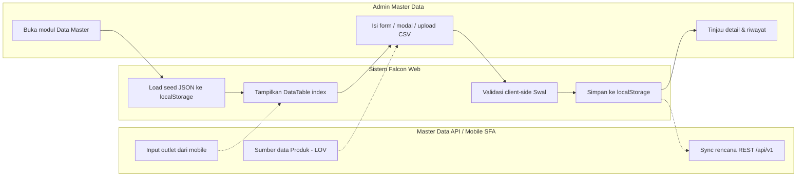
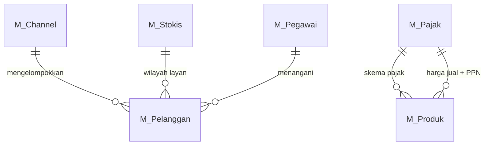

# FUNCTIONAL SPECIFICATION DOCUMENT (FSD)
## Modul: Falcon FPRS — Data Master (Web Admin)
### Sistem: Falcon FPRS
### Versi Dokumen: 1.0

---

| Atribut | Keterangan |
|---------|------------|
| **Nama Dokumen** | FSD Modul Data Master — Web Admin Falcon FPRS |
| **Versi** | 1.0 |
| **Tanggal** | 8 Juli 2026 |
| **Divisi** | ICT / Business – Falcon FPRS |
| **Status** | Draft |
| **Dibuat oleh** | Tim ICT – Falcon FPRS |

---

## Riwayat Revisi

| Versi | Tanggal | Diubah Oleh | Keterangan |
|---------|-------------|-------------|------------|
| **1.0** | **8 Juli 2026** | **Tim ICT** | Initial draft – modul Data Master Web Admin FPRS |

---

## Persetujuan Dokumen (Document Approval)

| Full Name | Job Title | Signature | Signature Date |
|-----------|-----------|-----------|----------------|
| Muhammad Rafi | SHP Channel & Customer Development |  |  |
| Silvester Mario Nian Destrada | SHP Channel & Customer Development |  |  |
| Ageng Kurniawan Sugianto | IT Product |  |  |
| Albet | IT Product |  |  |

---

## 1. Pendahuluan

### 1.1 Latar Belakang

**Falcon FPRS** (*Field Partner Relation System*) adalah sistem internal PT Kalbe
Nutritionals untuk administrasi data master, penjualan lapangan, dan pelacakan
kunjungan sales. Dokumen ini memfokuskan lingkup pada **modul Data Master** pada
Web Admin (`Views/FPRS/MasterData/`) — kumpulan halaman referensi yang menjadi
fondasi seluruh transaksi FPRS.

Prototipe Web Portal berupa *high-fidelity interactive prototype* berbasis HTML
statis (MPA) bertema Vuexy/Bootstrap yang menggunakan **localStorage** dan file
JSON seed di `wwwroot/data/` sebagai lapisan persistensi sisi klien, mensimulasikan
alur kerja admin sebelum integrasi penuh ke Master Data API Kalbe.

### 1.2 Tujuan Dokumen

1. Mendeskripsikan fungsionalitas **per halaman dan per komponen UI** modul Data Master.
2. Menjadi acuan pengembangan backend/API dan UAT untuk data referensi FPRS.
3. Mendokumentasikan business rules, pola CRUD, integrasi API rencana, dan data layer lokal.
4. Menyelaraskan format dokumentasi dengan standar **FSD Generator Engine** (Kalbe Nutritionals).

### 1.3 Ruang Lingkup

| Dalam lingkup | Di luar lingkup |
|---------------|-----------------|
| Modul Data Master Web (`Views/FPRS/MasterData/`) | Modul Penjualan, Kunjungan, Dashboard |
| Produk, Pelanggan, Channel, Pegawai, Stokis, Pajak, Alasan | Mobile SFA (`Views/Mobile/`, Flutter APK) |
| Persistensi prototipe (localStorage + JSON seed) | Implementasi produksi backend final |

### 1.4 Stakeholder

| Peran | Tim/Divisi | Keterlibatan |
|-------|------------|--------------|
| Admin Master Data | ICT / Operations | CRUD & sinkronisasi data referensi |
| Supervisor Sales | Sales | Validasi data outlet & pegawai |
| Developer | ICT | Implementasi API & UI produksi |
| Business Analyst | PDV / Sales | Validasi alur bisnis |

---

## 2. Arsitektur & Alur Data Master

### 2.1 Ringkasan Teknis

| Aspek | Standar |
|-------|---------|
| Arsitektur | Static MPA — satu `.html` per halaman |
| UI Framework | Bootstrap 5.3, Vuexy Admin Theme |
| JavaScript | jQuery 3.7, DataTables, Select2, SweetAlert2 |
| State | `localStorage` + seed `wwwroot/data/*.json` (versi seed `*_seed_ver`) |
| Navigasi | `wwwroot/js/layout.js` — sidebar & navbar injection |
| Branding | Kalbe hijau `#005d41`, font Kalbe Geometric |

### 2.2 Pola Pengelolaan Data Master

Modul Data Master memakai **tiga pola** pengelolaan data:

| Pola | Modul | Cara Kelola |
|------|-------|-------------|
| Form (add/edit) | Produk | Halaman `detail.html` fleksibel + LOV Master Data API |
| Modal CRUD | Channel, Pajak, Alasan | Modal `#modalForm` di dalam `index.html` |
| Upload-only (CSV + history) | Pegawai, Stokis | Download/Upload CSV, status disinkronkan, riwayat dicatat |
| View-only (sumber mobile) | Pelanggan | Ditampilkan dari data aplikasi mobile |

### 2.3 Business Flow Data Master (Swimlane)

**Lane (urutan kiri → kanan):**

| # | Lane ID | Label | Tipe |
|---|---------|-------|------|
| 1 | L1 | Admin Master Data | User |
| 2 | L2 | Sistem Falcon Web | System |
| 3 | L3 | Master Data API / Mobile SFA | External |



### 2.4 Konvensi Penamaan File

| Pola | Contoh |
|------|--------|
| Index modul | `Views/FPRS/MasterData/Produk/index.html` |
| Form/Detail page | `Views/FPRS/MasterData/Produk/detail.html` |
| Modal CRUD | Form di dalam `index.html` (`#modalForm`) |

---

## 3. Modul Data Master

Bab ini mendeskripsikan setiap modul Data Master: kolom DataTable index, field form/modal, tombol aksi, business rules (hasil ekstraksi validasi UI), dan pola CRUD. Konten field/kolom/validasi diambil langsung dari file HTML sumber.

### 3.1 Produk

Modul **Produk** merupakan bagian dari Web Portal Falcon FPRS. Tipe UI: **page**. Sumber: `Views/FPRS/MasterData/Produk/index.html`.

Halaman index menampilkan **summary cards** (`cntTotal`, `cntActive`, `cntInactive`, `cntUmbrella`) dan DataTable `#tbl` dengan filter per kolom, termasuk kolom **Umbrella Brand**. Tombol **Tambah Produk** mengarah ke `detail.html`. Halaman `detail.html` bersifat fleksibel (add & edit): **Kode Produk** berupa LOV searchable (Select2) yang mengambil data dari Master Data API, mengunci field turunan (nama, umbrella, brand) menjadi read-only. **Harga Beli** dapat diedit, **Harga Jual** read-only dihitung otomatis (`Harga Beli + PPN`, default skema PPN 11%). **Unit Konversi** dikunci ke `PCS`, dan **Status Produk** berupa checkbox aktif/nonaktif.

| Aspek | Keterangan |
|-------|------------|
| **Tujuan Form** | Mendaftarkan dan memelihara data SKU/produk (kode, umbrella brand, brand, harga beli, harga jual, pajak, status) sebagai referensi transaksi penjualan. Data produk bersumber dari Master Data API, sedangkan harga jual, pajak, dan status dikelola di aplikasi ini. |
| **Pengguna** | Admin Master Data, ICT Operations — pengelola katalog produk Kalbe. |


> **Integrasi API (rencana):** `/api/v1/Sku`

> **localStorage key:** `md_produk`

**Tampilan Master Data — Produk:**


#### 3.1.1 Kolom DataTable Index

| Kolom | Field Key | Render | Sortable | Keterangan |
|-------|-----------|--------|----------|------------|
| NO | `No` | Text | Ya | Kolom grid index |
| KODE | `Kode` | Text | Ya | Kolom grid index |
| PRODUK | `Produk` | Text | Ya | Kolom grid index |
| UMBRELLA BRAND | `UmbrellaBrand` | Text | Ya | Kolom grid index |
| BRAND | `Brand` | Text | Ya | Kolom grid index |
| UNIT | `Unit` | Text | Ya | Kolom grid index |
| HARGA JUAL | `HargaJual` | Text | Ya | Kolom grid index |
| PAJAK | `Pajak` | Text | Ya | Kolom grid index |
| STATUS | `Status` | Text | Ya | Kolom grid index |

#### 3.1.2 Form Tambah/Ubah

| Field Name | ID Elemen | Tipe | Mandatory | Default | Validasi | Keterangan |
|------------|-----------|------|-----------|---------|----------|------------|
| Kode Produk | `kode` | Dropdown | Ya | (kosong) | — | — |
| Nama Produk | `nama` | Text (readonly) | Tidak | (kosong) | — | — |
| Umbrella Brand | `umbrella` | Text (readonly) | Tidak | (kosong) | — | — |
| Brand | `brand` | Text (readonly) | Tidak | (kosong) | — | — |
| Harga Beli | `hargaBeli` | Number | Ya | (kosong) | — | — |
| Skema Pajak | `namaPajak` | Dropdown | Ya | (kosong) | — | — |
| Harga Jual (otomatis) | `hargaJual` | Number | Tidak | (kosong) | — | — |
| Unit Konversi | `unitNama` | Text (readonly) | Tidak | PCS | — | — |
| Status Produk | `status` | Text | Tidak | (kosong) | — | — |

#### 3.1.3 Tombol Aksi

| Tombol | ID / Handler | Warna/Style | Kondisi Aktif | Fungsi |
|--------|--------------|-------------|---------------|--------|
| Simpan Produk | `—` | btn-success | — | — |

#### 3.1.4 Business Rules

| Rule ID | Aturan |
|---------|--------|
| BR-MD01 | Kode produk wajib dipilih dari Master Data API. |
| BR-MD02 | Data produk belum termuat. Pilih ulang Kode Produk. |
| BR-MD03 | Harga beli harus lebih dari 0. |
| BR-MD04 | Kode "${kode}" sudah terdaftar pada Master Produk. |

#### 3.1.5 CRUD

| Operasi | Cara | Role | Keterangan |
|---------|------|------|------------|
| **Create** | Klik Tambah Produk → `detail.html` (LOV Kode Produk) | Admin | Persist ke localStorage |
| **Read** | DataTable index + `detail.html` | Semua role | — |
| **Update** | Buka `detail.html?id=` → ubah harga beli/pajak/status | Admin | Kode & data API read-only |
| **Delete** | — | — | Tombol hapus dihilangkan |

### 3.2 Pelanggan

Modul **Pelanggan** merupakan bagian dari Web Portal Falcon FPRS. Tipe UI: **page**. Sumber: `Views/FPRS/MasterData/Pelanggan/index.html`.

Data pelanggan/outlet **diinput dari aplikasi mobile** (SFA), sehingga Web Portal bersifat **view-only** — tanpa tombol Tambah/Edit/Hapus. Halaman detail menampilkan atribut hasil capture lapangan: foto outlet, pemilik, NPWP, alamat, RT/RW, kelurahan, kecamatan, kota, koordinat GPS, **channel**, dan tipe outlet. Data disimpan di `md_pelanggan`.

| Aspek | Keterangan |
|-------|------------|
| **Tujuan Form** | Menampilkan data outlet/pelanggan yang diinput dari aplikasi mobile (foto, pemilik, alamat, GPS, channel, tipe outlet) sebagai entitas utama kunjungan sales dan faktur. Bersifat view-only di web. |
| **Pengguna** | Admin Master Data, Operations, Supervisor Sales (validasi data outlet). |


> **Integrasi API (rencana):** `/api/v1/Customer`

> **localStorage key:** `md_pelanggan`

**Tampilan Master Data — Pelanggan:**


#### 3.2.1 Kolom DataTable Index

| Kolom | Field Key | Render | Sortable | Keterangan |
|-------|-----------|--------|----------|------------|
| NO | `No` | Text | Ya | Kolom grid index |
| KODE | `Kode` | Text | Ya | Kolom grid index |
| PELANGGAN | `Pelanggan` | Text | Ya | Kolom grid index |
| ALAMAT | `Alamat` | Text | Ya | Kolom grid index |
| TELEPON | `Telepon` | Text | Ya | Kolom grid index |
| SALESMAN | `Salesman` | Text | Ya | Kolom grid index |
| KUNJUNGAN TERAKHIR | `KunjunganTerakhir` | Text | Ya | Kolom grid index |
| STATUS | `Status` | Text | Ya | Kolom grid index |

#### 3.2.5 CRUD

| Operasi | Cara | Role | Keterangan |
|---------|------|------|------------|
| **Create** | — | — | Data diinput dari aplikasi mobile (SFA) |
| **Read** | DataTable index + `detail.html` | Semua role | View-only |
| **Update** | — | — | Tidak tersedia di web (sumber mobile) |
| **Delete** | — | — | Tidak tersedia di web |

### 3.3 Channel

Modul **Channel** merupakan bagian dari Web Portal Falcon FPRS. Tipe UI: **modal**. Sumber: `Views/FPRS/MasterData/Channel/index.html`.

Modul **Channel** mengelola klasifikasi channel pelanggan (mis. MT-HPM-NKA, GT-GROSIR, MED-APOTIK). Tidak terintegrasi Master Data API. Modal edit menampilkan bit **Active** dan daftar pelanggan ter-paginasi yang tergabung pada channel tersebut (relasi 1 pelanggan → 1 channel, 1 channel → banyak pelanggan) berdasarkan data `md_pelanggan`.

| Aspek | Keterangan |
|-------|------------|
| **Tujuan Form** | Mengelola daftar channel pelanggan (MT/GT/SPC/MED/GI/ECOM, dll.) untuk segmentasi dan kebijakan penjualan. Setiap pelanggan tergabung pada tepat satu channel. |
| **Pengguna** | Admin Master Data, Sales Operations. |


> **localStorage key:** `md_channel`

**Tampilan Master Data — Channel:**


#### 3.3.1 Kolom DataTable Index

| Kolom | Field Key | Render | Sortable | Keterangan |
|-------|-----------|--------|----------|------------|
| NO | `No` | Text | Ya | Kolom grid index |
| NAMA CHANNEL | `NamaChannel` | Text | Ya | Kolom grid index |
| TOTAL PELANGGAN | `TotalPelanggan` | Text | Ya | Kolom grid index |
| STATUS | `Status` | Text | Ya | Kolom grid index |

#### 3.3.3 Tombol Aksi

| Tombol | ID / Handler | Warna/Style | Kondisi Aktif | Fungsi |
|--------|--------------|-------------|---------------|--------|
| Tambah Channel | `openModal()` | btn-success | — | openModal() |
| Simpan | `saveItem()` | btn-success | — | saveItem() |

#### 3.3.4 Business Rules

| Rule ID | Aturan |
|---------|--------|
| BR-MD05 | Nama channel wajib diisi. |

#### 3.3.5 CRUD

| Operasi | Cara | Role | Keterangan |
|---------|------|------|------------|
| **Create** | Klik Tambah → isi modal → Simpan | Admin | Persist ke localStorage |
| **Read** | DataTable index; modal edit menampilkan pelanggan ter-paginasi | Semua role | — |
| **Update** | Klik Edit → ubah nama/bit Active → Simpan | Admin | — |
| **Delete** | — | — | Tombol hapus dihilangkan; gunakan bit Active |

### 3.4 Pegawai

Modul **Pegawai** merupakan bagian dari Web Portal Falcon FPRS. Tipe UI: **page**. Sumber: `Views/FPRS/MasterData/Pegawai/index.html`.

Master pegawai/sales force bersifat **upload-only** (pola seperti Master Stokis): data disinkronkan via **Download/Upload CSV** dan setiap perubahan status Active/Inactive dicatat pada **riwayat status**. Setiap pegawai memiliki **role** (Motoris / SPG GT) dan penempatan **Branch** & **Region**. Identitas unik menggunakan **NIK**. Halaman `detail.html` menampilkan data pegawai secara read-only beserta riwayat status.

| Aspek | Keterangan |
|-------|------------|
| **Tujuan Form** | Memelihara data pegawai/sales force (Motoris, SPG GT) beserta NIK, Branch, dan Region melalui mekanisme Download/Upload CSV dengan pencatatan riwayat status aktif/nonaktif. |
| **Pengguna** | Admin HR, ICT, Supervisor Sales. |


> **localStorage key:** `md_pegawai`

**Tampilan Master Data — Pegawai:**


#### 3.4.1 Kolom DataTable Index

| Kolom | Field Key | Render | Sortable | Keterangan |
|-------|-----------|--------|----------|------------|
| NO | `No` | Text | Ya | Kolom grid index |
| NIK | `Nik` | Text | Ya | Kolom grid index |
| NAMA | `Nama` | Text | Ya | Kolom grid index |
| ROLE | `Role` | Text | Ya | Kolom grid index |
| BRANCH | `Branch` | Text | Ya | Kolom grid index |
| REGION | `Region` | Text | Ya | Kolom grid index |
| STATUS | `Status` | Text | Ya | Kolom grid index |

#### 3.4.2 Form Tambah/Ubah

| Field Name | ID Elemen | Tipe | Mandatory | Default | Validasi | Keterangan |
|------------|-----------|------|-----------|---------|----------|------------|
| NIK | `kode` | Text | Tidak | (kosong) | — | — |
| Nama | `nama` | Text | Tidak | (kosong) | — | — |
| Role | `role` | Text | Tidak | (kosong) | — | — |
| Branch | `branch` | Text | Tidak | (kosong) | — | — |
| Region | `region` | Text | Tidak | (kosong) | — | — |
| Telepon | `telepon` | Text | Tidak | (kosong) | — | — |
| Status | `status` | Text | Tidak | (kosong) | — | — |
| Keterangan | `keterangan` | Text | Tidak | (kosong) | — | — |

#### 3.4.3 Tombol Aksi

| Tombol | ID / Handler | Warna/Style | Kondisi Aktif | Fungsi |
|--------|--------------|-------------|---------------|--------|
| Download Data | `downloadPegawai()` | btn-secondary | — | downloadPegawai() |
| Upload Data | `triggerUploadPegawai()` | btn-secondary | — | triggerUploadPegawai() |

#### 3.4.4 Business Rules

| Rule ID | Aturan |
|---------|--------|
| BR-MD06 | File kosong atau format header tidak dikenali. |
| BR-MD07 | Tidak ada baris data yang dapat diproses. |

#### 3.4.5 CRUD

| Operasi | Cara | Role | Keterangan |
|---------|------|------|------------|
| **Create** | Upload CSV (baris baru) | Admin | Sinkronisasi dari file, bukan input manual |
| **Read** | DataTable index + `detail.html` | Semua role | Termasuk riwayat status/stok |
| **Update** | Upload CSV (status Active/Inactive) | Admin | Status disimpulkan dari keberadaan ID di file |
| **Delete** | — | — | Tidak ada hapus; nonaktif via sinkronisasi CSV |

### 3.5 Stokis

Modul **Stokis** merupakan bagian dari Web Portal Falcon FPRS. Tipe UI: **page**. Sumber: `Views/FPRS/MasterData/Stokis/index.html`.

Master **Stokis/Grosir** bersifat **upload-only** (Download/Upload CSV + riwayat stok). Menampilkan **Branch** dan **Region** (menggantikan kolom Kota), koordinat GPS untuk validasi check-in mobile, serta island **Riwayat Input Stok oleh Motoris** pada halaman detail.

| Aspek | Keterangan |
|-------|------------|
| **Tujuan Form** | Mendaftarkan grosir/distributor stokis tempat salesman melakukan kulakan dan cek stok barang. Termasuk koordinat GPS untuk validasi check-in mobile. |
| **Pengguna** | Admin Master Data, Sales Operations, Supervisor Sales. |


> **localStorage key:** `md_stokis`

**Tampilan Master Data — Stokis:**


#### 3.5.1 Kolom DataTable Index

| Kolom | Field Key | Render | Sortable | Keterangan |
|-------|-----------|--------|----------|------------|
| NO | `No` | Text | Ya | Kolom grid index |
| OUTLET ID | `OutletId` | Text | Ya | Kolom grid index |
| NAMA STOKIS | `NamaStokis` | Text | Ya | Kolom grid index |
| BRANCH | `Branch` | Text | Ya | Kolom grid index |
| REGION | `Region` | Text | Ya | Kolom grid index |
| STATUS | `Status` | Text | Ya | Kolom grid index |

#### 3.5.2 Form Tambah/Ubah

| Field Name | ID Elemen | Tipe | Mandatory | Default | Validasi | Keterangan |
|------------|-----------|------|-----------|---------|----------|------------|
| Outlet ID | `kode` | Text | Tidak | (kosong) | — | — |
| Nama Stokis | `nama` | Text | Tidak | (kosong) | — | — |
| Branch | `branch` | Text | Tidak | (kosong) | — | — |
| Region | `region` | Text | Tidak | (kosong) | — | — |
| Telepon | `telepon` | Text | Tidak | (kosong) | — | — |
| Status | `status` | Text | Tidak | (kosong) | — | — |
| Alamat Lengkap | `alamat` | Text | Tidak | (kosong) | — | — |
| Latitude | `lat` | Text | Tidak | (kosong) | — | — |
| Longitude | `lng` | Text | Tidak | (kosong) | — | — |

#### 3.5.3 Tombol Aksi

| Tombol | ID / Handler | Warna/Style | Kondisi Aktif | Fungsi |
|--------|--------------|-------------|---------------|--------|
| Download Data | `downloadStokis()` | btn-secondary | — | downloadStokis() |
| Upload Data | `triggerUploadStokis()` | btn-secondary | — | triggerUploadStokis() |
| Stok per Produk | `—` | btn-secondary | — | — |
| Riwayat Input Stok oleh Motoris | `—` | btn-secondary | — | — |
| Riwayat Status (Active / Inactive) — dari Upload | `—` | btn-secondary | — | — |

#### 3.5.4 Business Rules

| Rule ID | Aturan |
|---------|--------|
| BR-MD08 | File kosong atau format header tidak dikenali. |
| BR-MD09 | Tidak ada baris data yang dapat diproses. |

#### 3.5.5 CRUD

| Operasi | Cara | Role | Keterangan |
|---------|------|------|------------|
| **Create** | Upload CSV (baris baru) | Admin | Sinkronisasi dari file, bukan input manual |
| **Read** | DataTable index + `detail.html` | Semua role | Termasuk riwayat status/stok |
| **Update** | Upload CSV (status Active/Inactive) | Admin | Status disimpulkan dari keberadaan ID di file |
| **Delete** | — | — | Tidak ada hapus; nonaktif via sinkronisasi CSV |

### 3.6 Pajak

Modul **Pajak** merupakan bagian dari Web Portal Falcon FPRS. Tipe UI: **modal**. Sumber: `Views/FPRS/MasterData/Pajak/index.html`.

| Aspek | Keterangan |
|-------|------------|
| **Tujuan Form** | Mengonfigurasi skema pajak (PPN, DPP) yang dipakai perhitungan harga produk dan faktur. |
| **Pengguna** | Admin Finance, Tax/Accounting. |


> **Integrasi API (rencana):** `/api/v1/Tax`

> **localStorage key:** `md_pajak`

**Tampilan Master Data — Pajak:**


#### 3.6.1 Kolom DataTable Index

| Kolom | Field Key | Render | Sortable | Keterangan |
|-------|-----------|--------|----------|------------|
| NO | `No` | Text | Ya | Kolom grid index |
| KODE PAJAK | `KodePajak` | Text | Ya | Kolom grid index |
| NAMA PAJAK | `NamaPajak` | Text | Ya | Kolom grid index |
| PERSENTASE (%) | `Persentase` | Text | Ya | Kolom grid index |
| NILAI DPP | `NilaiDpp` | Text | Ya | Kolom grid index |

#### 3.6.3 Tombol Aksi

| Tombol | ID / Handler | Warna/Style | Kondisi Aktif | Fungsi |
|--------|--------------|-------------|---------------|--------|
| Tambah Pajak | `openModal()` | btn-success | — | openModal() |
| Simpan | `saveItem()` | btn-success | — | saveItem() |

#### 3.6.4 Business Rules

| Rule ID | Aturan |
|---------|--------|
| BR-MD10 | Kode dan Nama pajak wajib diisi. |

#### 3.6.5 CRUD

| Operasi | Cara | Role | Keterangan |
|---------|------|------|------------|
| **Create** | Klik Tambah → isi modal → Simpan | Admin | Persist ke localStorage |
| **Read** | DataTable index | Semua role | — |
| **Update** | Klik Edit → ubah modal → Simpan | Admin | — |
| **Delete** | Klik Hapus → konfirmasi Swal | Admin | Hapus dari localStorage |

### 3.7 Alasan

Modul **Alasan** merupakan bagian dari Web Portal Falcon FPRS. Tipe UI: **modal**. Sumber: `Views/FPRS/MasterData/Alasan/index.html`.

| Aspek | Keterangan |
|-------|------------|
| **Tujuan Form** | Menyimpan kode alasan operasional (tidak order, gagal kunjungan, dll.) untuk pelacakan aktivitas lapangan dan analitik compliance. |
| **Pengguna** | Admin Operations, Supervisor Sales, Business Analyst. |


> **Integrasi API (rencana):** `/api/v1/Reason`

> **localStorage key:** `md_alasan`

**Tampilan Master Data — Alasan:**


#### 3.7.1 Kolom DataTable Index

| Kolom | Field Key | Render | Sortable | Keterangan |
|-------|-----------|--------|----------|------------|
| NO | `No` | Text | Ya | Kolom grid index |
| NAMA ALASAN | `NamaAlasan` | Text | Ya | Kolom grid index |
| DESKRIPSI | `Deskripsi` | Text | Ya | Kolom grid index |
| TIPE | `Tipe` | Text | Ya | Kolom grid index |

#### 3.7.3 Tombol Aksi

| Tombol | ID / Handler | Warna/Style | Kondisi Aktif | Fungsi |
|--------|--------------|-------------|---------------|--------|
| Tambah Alasan | `openModal()` | btn-success | — | openModal() |
| Simpan | `saveItem()` | btn-success | — | saveItem() |

#### 3.7.4 Business Rules

| Rule ID | Aturan |
|---------|--------|
| BR-MD11 | Nama dan Tipe wajib diisi. |

#### 3.7.5 CRUD

| Operasi | Cara | Role | Keterangan |
|---------|------|------|------------|
| **Create** | Klik Tambah → isi modal → Simpan | Admin | Persist ke localStorage |
| **Read** | DataTable index | Semua role | — |
| **Update** | Klik Edit → ubah modal → Simpan | Admin | — |
| **Delete** | Klik Hapus → konfirmasi Swal | Admin | Hapus dari localStorage |

## 4. Aturan Bisnis (Rekap)

Rekap aturan bisnis modul Data Master. Rule ID memakai prefix `BR-MD`.

| Rule ID | Aturan |
|---------|--------|
| BR-MD01 | [Master Data — Produk] Kode produk wajib dipilih dari Master Data API. |
| BR-MD02 | [Master Data — Produk] Data produk belum termuat. Pilih ulang Kode Produk. |
| BR-MD03 | [Master Data — Produk] Harga beli harus lebih dari 0. |
| BR-MD04 | [Master Data — Produk] Kode "${kode}" sudah terdaftar pada Master Produk. |
| BR-MD05 | [Master Data — Channel] Nama channel wajib diisi. |
| BR-MD06 | [Master Data — Pegawai] File kosong atau format header tidak dikenali. |
| BR-MD07 | [Master Data — Pegawai] Tidak ada baris data yang dapat diproses. |
| BR-MD08 | [Master Data — Stokis] File kosong atau format header tidak dikenali. |
| BR-MD09 | [Master Data — Stokis] Tidak ada baris data yang dapat diproses. |
| BR-MD10 | [Master Data — Pajak] Kode dan Nama pajak wajib diisi. |
| BR-MD11 | [Master Data — Alasan] Nama dan Tipe wajib diisi. |

---

## 5. Hak Akses & RBAC

Pada prototipe, seluruh halaman Data Master dapat diakses tanpa login web admin;
enforcement RBAC penuh di server **belum** diimplementasikan. Matriks berikut adalah
target kebijakan produksi:

| Modul | Admin Master Data | Supervisor Sales | Keterangan |
|-------|-------------------|------------------|------------|
| Produk | Create/Read/Update | Read | Hapus tidak tersedia |
| Pelanggan | Read | Read | View-only, sumber mobile |
| Channel | Create/Read/Update | Read | Kelola via bit Active |
| Pegawai | Upload/Read | Read | Sinkronisasi CSV |
| Stokis | Upload/Read | Read | Sinkronisasi CSV |
| Pajak | Create/Read/Update/Delete | Read | Konfigurasi finance |
| Alasan | Create/Read/Update/Delete | Read | Kode operasional |

---

## 6. Data Layer & Integrasi

### 6.1 Pola Persistensi Prototipe

1. Saat halaman dimuat, cek `localStorage` dengan key modul (mis. `md_produk`).
2. Bandingkan penanda versi seed (`*_seed_ver`); bila berbeda/kosong, muat ulang JSON seed dari `wwwroot/data/`.
3. Operasi CRUD / Upload menulis kembali ke `localStorage` (tanpa server round-trip).

### 6.2 Integrasi Master Data API (Rencana)

Portal Kalbe Master Data dev: `https://newmasterdatadev.kalbenutritionals.web.id/`.
Modul dengan endpoint di bawah direncanakan tersinkron ke REST API produksi; pada
prototipe, endpoint dicantumkan sebagai referensi. Modul **Channel**, **Pegawai**,
dan **Stokis** dikelola lokal (tanpa Master Data API), sedangkan **Pelanggan**
bersumber dari aplikasi mobile.

### 6.3 Mapping Modul – API – Storage

| Modul | API Endpoint (rencana) | localStorage Key |
|-------|--------------------------|------------------|
| Master Data — Produk | `/api/v1/Sku` | `md_produk` |
| Master Data — Pelanggan | `/api/v1/Customer` | `md_pelanggan` |
| Master Data — Channel | `— (dikelola lokal)` | `md_channel` |
| Master Data — Pegawai | `— (dikelola lokal)` | `md_pegawai` |
| Master Data — Stokis | `— (dikelola lokal)` | `md_stokis` |
| Master Data — Pajak | `/api/v1/Tax` | `md_pajak` |
| Master Data — Alasan | `/api/v1/Reason` | `md_alasan` |

---

## 7. Struktur Data & ERD

Relasi entity master (prototipe):



| Entity | localStorage Key | Deskripsi |
|--------|------------------|-----------|
| `M_Produk` | `md_produk` | Master produk/SKU (kode, umbrella brand, harga, pajak, status) |
| `M_Pelanggan` | `md_pelanggan` | Master pelanggan/outlet (sumber mobile) |
| `M_Channel` | `md_channel` | Klasifikasi channel pelanggan |
| `M_Pegawai` | `md_pegawai` | Master pegawai (Motoris/SPG GT, NIK, Branch/Region) |
| `M_Stokis` | `md_stokis` | Master stokis/grosir (Branch/Region, GPS) |
| `M_Pajak` | `md_pajak` | Skema pajak (PPN/DPP) |
| `M_Alasan` | `md_alasan` | Kode alasan operasional |

---

## 8. Appendix

### 8.1 Daftar Modul & File HTML

| No | Modul | File Index | Tipe UI |
|----|-------|------------|---------|
| 1 | Master Data — Produk | `Views/FPRS/MasterData/Produk/index.html` | page |
| 2 | Master Data — Pelanggan | `Views/FPRS/MasterData/Pelanggan/index.html` | page |
| 3 | Master Data — Channel | `Views/FPRS/MasterData/Channel/index.html` | modal |
| 4 | Master Data — Pegawai | `Views/FPRS/MasterData/Pegawai/index.html` | page |
| 5 | Master Data — Stokis | `Views/FPRS/MasterData/Stokis/index.html` | page |
| 6 | Master Data — Pajak | `Views/FPRS/MasterData/Pajak/index.html` | modal |
| 7 | Master Data — Alasan | `Views/FPRS/MasterData/Alasan/index.html` | modal |

### 8.2 Status Prototipe vs Produksi

| Aspek | Prototipe Saat Ini | Produksi Target |
|-------|-------------------|-----------------|
| Persistensi | localStorage + JSON seed | REST API + database |
| Autentikasi | Tidak ada login web admin | SSO / JWT |
| RBAC | Simulasi | Server-side enforcement |

### 8.3 Build Dokumen

```powershell
cd wwwroot/document/FSD/FalconWebPortal
py scripts/assemble_fsd_masterdata.py   # regenerate markdown
py scripts/build_masterdata_fsd.py       # render DOCX ke Document/
```
