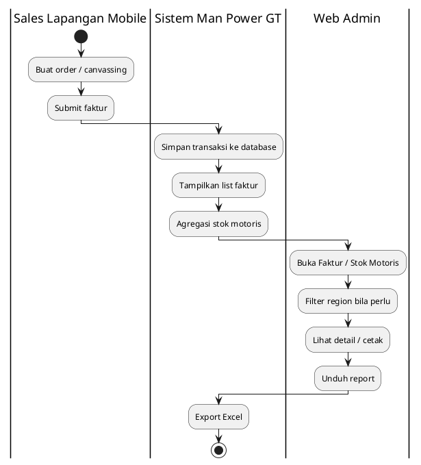

# FUNCTIONAL SPECIFICATION DOCUMENT (FSD)
## Modul: Man Power GT — Penjualan (Web Admin)
### Sistem: Man Power GT
### Versi Dokumen: 1.9

---

| Atribut | Keterangan |
|---------|------------|
| **Nama Dokumen** | FSD Modul Penjualan — Web Admin Man Power GT |
| **Versi** | 1.9 |
| **Tanggal** | 26 Agustus 2026 |
| **Divisi** | IT / Business – Man Power GT |
| **Status** | Draft |
| **Dibuat oleh** | Tim IT – Man Power GT |

---

## Riwayat Revisi

| Versi | Tanggal | Diubah Oleh | Keterangan |
|-------|---------|-------------|------------|
| 1.0 | 17 Juli 2026 | Tim IT | Initial draft – Faktur + Stok Motoris; RBAC; spesifikasi kolom report Excel |
| 1.1 | 17 Juli 2026 | Tim IT | Tambah bab **Skalabilitas & Tuning** (Fase A): agregasi SQL, batas filter/export, seed UAT 6 bulan Cash/Lunas, script `008`–`010` |
| 1.2 | 21 Juli 2026 | Tim IT | Rename sistem ke **Man Power GT**; tambah business rule Filter & Pop-up dashboard **(+screenshot & narasi)**; hapus cuplikan SQL; wording **Produksi → Database** |
| 1.3 | 4 Agustus 2026 | Tim IT | Screenshot ulang Faktur + Stok Motoris (dashboard, filter, popup, tombol aksi) |
| 1.4 | 4 Agustus 2026 | Tim IT | Swimlane Bab 2 diganti ke **PlantUML** kolom role (standar FSD Engine) |
| 1.5 | 14 Agustus 2026 | Tim IT | ERD nama fisik MAVEN + `tStokMotorisSaldo`; DDL PostgreSQL lengkap (§7.4) |
| 1.6 | 14 Agustus 2026 | Tim IT | Prototipe: gudang = nama stokis; sales = nama pegawai; history penjualan 1 kota/kecamatan; ERD kolom lengkap sesuai DDL |
| 1.7 | 14 Agustus 2026 | Tim IT | Screenshot ulang Faktur + Stok Motoris; dummy 300 motoris × 30 kunjungan/hari; faktur seluruhnya Paid; wilayah nama kota |
| 1.8 | 14 Agustus 2026 | Tim IT | Dummy Stok Motoris: **900 kunjungan/hari** dari **300 motoris** (3/motoris/hari); data tetap tersebar sepanjang 2026 |
| **1.9** | **26 Agustus 2026** | **Tim IT** | Web Admin Faktur: hapus **Jatuh Tempo** (list/detail/print) dan **Stokis** (detail); screenshot ulang |

---

## Persetujuan Dokumen (Document Approval)

| Full Name | Job Title | Signature | Signature Date |
|-----------|-----------|-----------|----------------|
| Muhammad Rafi | SHP Channel & Customer Development |  |  |
| Silvester Mario Nian Destrada | SHP Channel & Customer Development |  |  |
| Aldira Rahmania | SHP Channel & Customer Development |  |  |
| Ageng Kurniawan Sugianto | IT Product |  |  |
| Albet | IT Product |  |  |

---

## 1. Pendahuluan

### 1.1 Latar Belakang

**Man Power GT** (*Man Power General Trade*) adalah sistem internal PT Kalbe
Nutritionals untuk mengelola tenaga lapangan General Trade (motoris / canvasser),
administrasi data master terkait, monitoring penjualan lapangan, dan pelacakan
kunjungan sales. Dokumen ini memfokuskan lingkup pada **modul Penjualan** Web Admin
— monitoring faktur dari Mobile SFA dan dashboard stok motoris.

Prototipe Web Portal berupa *high-fidelity interactive prototype* berbasis HTML
statis (MPA) bertema Vuexy/Bootstrap yang menggunakan **localStorage** dan file
JSON seed di `wwwroot/data/` sebagai lapisan persistensi sisi klien. Implementasi
database berada di **MAVEN** (ASP.NET Core + PostgreSQL) dengan route
`/Transaction/SalesOrder` dan `/Dashboard/MotorisStock`.

### 1.2 Tujuan Dokumen

1. Mendeskripsikan fungsionalitas **per halaman dan per komponen UI** modul Penjualan.
2. Menjadi acuan pengembangan backend/API dan UAT untuk monitoring penjualan Man Power GT.
3. Mendokumentasikan business rules, pola akses (RBAC + scope region), dan **spesifikasi kolom report Excel**.
4. Menyelaraskan format dokumentasi dengan standar **FSD Generator Engine** (Kalbe Nutritionals).
5. Mendokumentasikan **strategi skalabilitas & tuning dashboard Stok Motoris (Fase A)** termasuk seed data UAT dan index SQL.

### 1.3 Ruang Lingkup

| Dalam lingkup | Di luar lingkup |
|---------------|-----------------|
| Faktur Penjualan (list, detail, print) | Modul Canvassing (belum ada UI aktif) |
| Monitoring Stok Motoris (dashboard + export Excel) | Create/Edit/Hapus faktur di Web Admin |
| Persistensi prototipe (`fprs_faktur_v7`, `md_stok_motoris`) + seed MAVEN | Mobile SFA (sumber order — disebut sebagai integrasi) |
| RBAC Super Admin / Sales Manager / RSM | Approval multi-level transaksi |
| Spesifikasi kolom report Excel/CSV | Modul Master Data & Kunjungan (dokumen terpisah) |
| Tuning Fase A (agregasi SQL, index, seed 6 bulan) | Tuning Fase B (tabel agregat harian / partition — roadmap) |

### 1.4 Stakeholder

| Peran | Tim/Divisi | Keterlibatan |
|-------|------------|--------------|
| Super Admin | IT | Akses seluruh menu & data nasional |
| Sales Manager | Sales | Monitoring nasional + filter regional |
| RSM | Sales regional | Monitoring region sendiri |
| Finance | Finance | Monitoring faktur / tagihan (read) |
| Developer | IT | Implementasi API & UI database (MAVEN) |

---

## 2. Arsitektur & Alur Penjualan

### 2.1 Ringkasan Teknis

| Aspek | Prototipe | Database (MAVEN) |
|-------|-----------|------------------|
| Arsitektur | Static MPA — satu `.html` per halaman | ASP.NET Core MVC + service layer |
| UI Framework | Bootstrap 5.3, Vuexy Admin Theme | Vuexy + Razor Views |
| JavaScript | jQuery, DataTables, Select2, SweetAlert2, Chart.js, Leaflet, SheetJS | Sama / setara (Chart.js 2.9 lokal) |
| Persistensi | `fprs_faktur_v7`, `md_stok_motoris` + seed JSON | PostgreSQL: `tPenjualanFaktur`, `tKunjunganHarian`, `tStokMotorisSaldo`, `tStokMotorisMutasi` |
| Auth / Menu | Tidak ada login | KNGlobal SSO + `mMenu` / `mRoleAccess` (`TSO`, `DMS`) |
| Navigasi | `wwwroot/js/layout.js` | Menu dinamis dari KNGlobal |
| Folder kode | `Views/FPRS/Penjualan/` | `Controllers/PowerGT/...`, `Views/PowerGT/...` |

### 2.2 Pola Modul Penjualan

| Pola | Modul | Cara kelola |
|------|-------|-------------|
| View-only + cetak | Faktur / Sales Order | List → detail → print; order dari Mobile |
| Dashboard monitoring + export | Stok Motoris | KPI + chart + saldo + audit; Export Excel 2 sheet |

### 2.3 Business Flow (Swimlane)

Alur konseptual database: order dari Mobile → faktur terbaca di Web; stok motoris diagregasi untuk monitoring.

**Lane (urutan kiri → kanan):**

| # | Lane ID | Label | Tipe | Sumber |
|---|---------|-------|------|--------|
| 1 | L1 | Sales Lapangan (Mobile) | User | Mobile SFA canvassing |
| 2 | L2 | Sistem Man Power GT | System | Transaksi Sales Order / stok |
| 3 | L3 | Web Admin | User | Sales Manager / RSM |



Hand-off Mobile → Sistem: submit faktur menulis transaksi ke database. Hand-off Web Admin → Sistem: monitoring list/agregasi dan export Excel.

**Gambar 2.1 — Business Flow Penjualan (Web Admin)**

---

## 3. Modul Penjualan

Bab ini mendeskripsikan modul **Faktur** dan **Stok Motoris**: dashboard list / monitoring, halaman detail (jika ada), tombol aksi, business rules, pola CRUD/akses, dan **spesifikasi kolom report**.

### 3.1 Faktur

Modul **Faktur** merupakan bagian dari Web Portal **Man Power GT**. Tipe UI: **page**. Sumber prototipe: `Views/FPRS/Penjualan/Faktur/index.html`; database: `/Transaction/SalesOrder`.

Halaman dashboard list menampilkan **KPI cards** (Total, Paid, Total Tagihan) dan DataTable `#tblFaktur` dengan filter tanggal, pelanggan, sales, dan status. **Semua faktur dummy berstatus Paid** (`belumDibayar = 0`); tidak ada Unpaid/Draft. Data faktur bersumber dari aktivitas **Mobile SFA** (`localStorage` key `fprs_faktur_v7`, seed `faktur.json`). Web Admin bersifat **view-only**: aksi baris adalah **lihat detail** dan **cetak**; tidak ada Tambah/Edit/Hapus di web. Halaman `detail.html` menampilkan header pelanggan, item line, ringkasan pembayaran (Tanggal Faktur, Sales, Jangka Waktu Bayar, Kode Transaksi), dan tombol Cetak menuju `print.html`. **Tidak ada** field **Stokis** / **Jatuh Tempo** pada UI Web Admin Faktur (list, detail, print). Filter Sales menampilkan **nama pegawai** (`mPegawai.txtNama`).

| Aspek | Keterangan |
|-------|------------|
| **Tujuan Form** | Memantau dan mencetak faktur penjualan yang dihasilkan dari order Mobile SFA. Web Admin bersifat view-only (list, detail, print); tidak membuat/mengubah faktur di portal. |
| **Pengguna** | Super Admin, Sales Manager, RSM (lihat sesuai cakupan region); Finance (monitoring). |


> **Integrasi API (rencana):** `/api/v1/Invoice`

> **localStorage key:** `fprs_faktur_v7`


#### 3.1.1 Kolom DataTable Dashboard List

| Kolom | Field Key | Render | Sortable | Keterangan |
|-------|-----------|--------|----------|------------|
| NO | `No` | Text | Ya | Kolom grid dashboard list |
| TANGGAL FAKTUR | `TanggalFaktur` | Text | Ya | Kolom grid dashboard list |
| NOMOR FAKTUR | `NomorFaktur` | Text | Ya | Kolom grid dashboard list |
| PELANGGAN | `Pelanggan` | Text | Ya | Kolom grid dashboard list |
| SALES | `Sales` | Text | Ya | Kolom grid dashboard list |
| JUMLAH TAGIHAN | `JumlahTagihan` | Text | Ya | Kolom grid dashboard list |
| BELUM DIBAYAR | `BelumDibayar` | Text | Ya | Kolom grid dashboard list |
| STATUS | `Status` | Text | Ya | Kolom grid dashboard list |

#### 3.1.2 Tombol Aksi — Dashboard List

| Tampilan | Tombol | ID / Handler | Warna/Style | Fungsi |
|----------|--------|--------------|-------------|--------|
|  | Ekspor | `#btnEkspor` | btn-outline-secondary | Mengekspor daftar faktur (prototipe: mock Swal; database: Excel header-level mengikuti filter). |
|  | Lihat Detail | `a.btn-action-view` → `detail.html?id=…` | btn-action (ikon mata) | Membuka halaman detail faktur terpilih. |
|  | Cetak Faktur (list) | `cetakFaktur(id)` | btn-action (ikon printer) | Mencetak faktur dari baris DataTable. |
|  | Cetak Faktur (detail) | `#btnCetak` | btn-cetak-faktur | Mencetak faktur dari halaman detail (`print.html`). |
|  | Reset | `#btnResetFilter` | btn-reset-filter | Mengembalikan seluruh filter list faktur ke kondisi awal. |


#### 3.1.3 CRUD

| Operasi | Cara | Role | Keterangan |
|---------|------|------|------------|
| **Read** | dashboard list + `detail.html` + `print.html` | Super Admin, Sales Manager, RSM | View-only; cakupan region sesuai RBAC |
| **Export** | Tombol Ekspor (rencana Excel) | Super Admin, Sales Manager, RSM | Prototipe: mock Swal; database: file Excel header-level |


#### Report / Ekspor Faktur

Tombol **Ekspor** pada dashboard list. Di prototipe masih **mock** (konfirmasi Swal tanpa file).
Target database: Excel `.xlsx`, **1 baris = 1 faktur** (header-level), mengikuti filter list + scope RBAC region.

> **Sumber database:** query atas `tPenjualanFaktur` dengan join `mPelanggan`, `mPegawai`. Snapshot stokis (`txtGudang` / `txtWarehouseCode`) dan `dtJatuhTempo` tetap ada di DB / seed; **tidak ditampilkan** pada UI Web Admin Faktur (list, detail, print) sejak v1.9.
> **Prototipe saat ini:** field denormalized di `fprs_faktur_v7` / `faktur.json` (belum persist ke MAVEN). `salesNama` memakai nama `mPegawai`.

| # | Nama kolom (rencana) | Keterangan | Tabel sumber | Kolom database |
|---|----------------------|------------|--------------|----------------|
| 1 | Tanggal Faktur | Tanggal dokumen | `tPenjualanFaktur` | `dtTanggalFaktur` |
| 2 | Nomor Faktur | ID / nomor faktur | `tPenjualanFaktur` | `txtNomorFaktur` |
| 3 | Kode Pelanggan | Kode outlet | `mPelanggan` / snapshot | `txtKode` (FK `tPenjualanFaktur.intPelangganID`) atau `txtPelangganKode` |
| 4 | Nama Pelanggan | Nama outlet | `mPelanggan` / snapshot | `txtNama` atau `txtPelangganNama` |
| 5 | Sales | Nama / kode sales / motoris | `mPegawai` / snapshot | `txtNama` / `txtKode` (FK `intPegawaiID`) atau `txtSalesNama` / `txtSalesKode` |
| 6 | Jumlah Tagihan | Total tagihan | `tPenjualanFaktur` | `decJumlahTagihan` |
| 7 | Belum Dibayar | Sisa piutang | `tPenjualanFaktur` | `decBelumDibayar` |
| 8 | Status | Paid / Unpaid / Draft / dll. | `tPenjualanFaktur` | `txtStatus` |

Kolom opsional (tidak di sheet / UI Web Admin Faktur v1.9; tersedia di DB): `tPenjualanFaktur.dtJatuhTempo`, `tPenjualanFaktur.txtGudang` (nama stokis), `tPenjualanFaktur.txtTipe`, `tPenjualanFaktur.txtJangkaWaktuPembayaran`, `tPenjualanFaktur.txtCatatan`.


### 3.2 Stok Motoris

Modul **Stok Motoris** merupakan bagian dari Web Portal **Man Power GT**. Tipe UI: **page**. Sumber prototipe: `Views/FPRS/Penjualan/StokMotoris/index.html`; database: `/Dashboard/MotorisStock`.

Halaman **Monitoring Stok Motoris** adalah dashboard agregat (bukan CRUD): KPI cards, flow stok, Chart.js, peta Leaflet, grid saldo, dan audit trail. Snapshot disimpan di `md_stok_motoris` dan dibangun dari master (`md_pegawai`, `md_produk`, `md_stokis`, `md_pelanggan`) plus faktur `fprs_faktur_v7`. Tombol **Export Excel** menghasilkan file dua sheet (`SalesInvoices`, `DailyVisits`); **Refresh** memuat ulang data master dan meregenerasi dashboard.

**Asumsi dummy prototipe (v1.8):** **300 motoris**; **minimal 900 kunjungan per hari** secara nasional (300 × 3 kunjungan/motoris/hari). Filter tanggal default **1 Jan – 31 Des 2026** — kartu Kunjungan ≈ `900 × jumlah hari` pada rentang itu. Data faktur, kunjungan, penjualan, dan kulakan **tersebar sepanjang tahun 2026**. Wilayah memakai **nama kota** (Jakarta, Depok, Bekasi, …) tanpa angka. Satu motoris beroperasi di kota stokis yang sama. History penjualan menampilkan **10 toko berbeda**.

| Aspek | Keterangan |
|-------|------------|
| **Tujuan Form** | Memantau stok & aktivitas motoris (KPI, saldo, kunjungan, audit) serta mengekspor report Excel SalesInvoices / DailyVisits untuk analisis operasional. |
| **Pengguna** | Super Admin, Sales Manager, RSM (lihat sesuai cakupan region); Admin Operations. |


> **localStorage key:** `md_stok_motoris`


#### 3.2.1 Filter Dashboard

Panel filter di atas KPI/chart membatasi seluruh komponen dashboard (KPI, chart, grid saldo, audit trail, export). Perubahan nilai filter langsung memuat ulang data (tanpa tombol "Terapkan" terpisah).


**Narasi UI:** Baris atas berisi dropdown **Region**, **Area**, **Motoris**, **Umbrand**, serta rentang tanggal **Dari / S/D**. Setelah user memilih nilai (contoh: Region 1 + Umbrand BENECOL), baris kedua menampilkan **Filter Aktif** sebagai chip yang bisa dihapus satu per satu, plus tombol **Reset Semua** untuk mengembalikan seluruh filter ke default.

| Filter | Control ID | Default | Business Rule |
|--------|------------|---------|---------------|
| Region | `#filterRegion` | Kosong = Seluruh Indonesia (Nasional) | Cascading: mengubah Region mengosongkan/memfilter opsi Area & Motoris yang relevan. Scope RBAC: RSM hanya melihat region sendiri. |
| Area | `#filterArea` | Kosong = Semua Area | Cascading dari Region; mengubah Area memfilter daftar Motoris. |
| Motoris | `#filterSales` | Kosong = Semua Motoris | Opsi diisi dari master pegawai role Motoris yang cocok dengan Region/Area aktif. |
| Umbrand | `#filterBrand` | Kosong = Semua Umbrand | Memfilter KPI/chart/saldo berdasarkan umbrella brand produk. Juga bisa di-toggle dari chart kontribusi brand. |
| Tanggal Mulai | `#filterDateStart` | **Hari ini − 29 hari** (30 hari kalender) | Wajib untuk query agregasi. Server menerapkan fallback 30 hari terakhir bila kosong. |
| Tanggal Akhir | `#filterDateEnd` | **Hari ini** | Harus ≥ Tanggal Mulai. |
| Reset Filter | `#btnResetFilter` / `resetAllFilters()` | — | Mengembalikan Region/Area/Motoris/Umbrand ke kosong dan tanggal ke default 30 hari terakhir, lalu reload. |

**Chip filter aktif:** sistem menampilkan chip ringkas untuk setiap filter non-kosong; klik ikon ✕ pada chip menghapus filter terkait saja.

**Aturan filter terkait export:**

| Rule | Keterangan |
|------|------------|
| BR-SM-F01 | Export Excel memakai **parameter filter yang sama** dengan dashboard (Region, Area, Motoris, Umbrand, rentang tanggal). |
| BR-SM-F02 | Rentang tanggal export maksimal **31 hari** kalender; lebih lebar → ditolak (HTTP 400 + pesan jelas). |
| BR-SM-F03 | Filter berlaku ke seluruh KPI, chart, DataTable saldo, dan audit trail — tidak ada komponen yang bypass filter. |


#### 3.2.2 Kolom DataTable Dashboard List

| Kolom | Field Key | Render | Sortable | Keterangan |
|-------|-----------|--------|----------|------------|
| Motoris | `Motoris` | Text | Ya | Kolom grid dashboard list |
| Wilayah | `Wilayah` | Text | Ya | Kolom grid dashboard list |
| Nilai Kulakan | `NilaiKulakan` | Text | Ya | Kolom grid dashboard list |
| Nilai Penjualan | `NilaiPenjualan` | Text | Ya | Kolom grid dashboard list |
| Nilai Saldo | `NilaiSaldo` | Text | Ya | Kolom grid dashboard list |

#### 3.2.3 Tombol Aksi — Dashboard List

| Tampilan | Tombol | ID / Handler | Warna/Style | Fungsi |
|----------|--------|--------------|-------------|--------|
|  | Export Excel | `exportToExcel()` / `#btnEkspor` | btn-outline-secondary | Unduh Excel 2 sheet (`SalesInvoices` + `DailyVisits`) mengikuti filter aktif. |
|  | Refresh | `refreshDashboard()` / `#btnRefresh` | btn-success | Muat ulang seluruh data dashboard sesuai filter; tampilkan Swal sukses singkat. |
|  | Reset Semua | `resetAllFilters()` | filter-reset-btn | Reset filter ke default (lihat §3.2.1). |
|  | Cetak PDF | `printAuditPopup()` | btn (di header pop-up audit) | Cetak isi pop-up **ID Transaksi & Pergerakan Stok** (hanya aktif saat pop-up audit terbuka). |

#### 3.2.4 Pop-up Dashboard

Dashboard memiliki dua pop-up utama (SweetAlert2) untuk drill-down operasional: **detail motoris** (termasuk sebaran outlet) dan **audit transaksi** (ID & pergerakan stok).

##### A. Pop-up Detail Motoris — *Sebaran Outlet Dikunjungi*

**Pemicu:** klik nama motoris pada grid saldo (handler `showMotorisDetail`).

**Endpoint database:** `GET /Dashboard/MotorisStock/GetMotorisDetail`


**Narasi UI:** Pop-up menampilkan profil motoris (nama, kode, area, region) di header hijau. Di kiri, tabel **Stok per SKU** menampilkan nilai saldo berjalan per produk plus baris TOTAL. Di kanan atas, mini chart **Penjualan 7 Hari Terakhir** (line Chart.js) dan kartu **Info Kulakan Terakhir** (tanggal, stokis, nilai, status GPS Valid/Invalid). Bagian bawah **Sebaran Outlet Dikunjungi** menampilkan peta Leaflet dengan marker bernomor untuk outlet yang dikunjungi pada periode terkait; caption di bawah peta menuliskan jumlah outlet (contoh: *10 outlet dalam 30 hari terakhir*). Scroll ke bawah pada pop-up (jika ada) menampilkan **History Penjualan Terakhir** hingga 10 transaksi — tanggal berurutan mundur, **10 toko berbeda** di kota/wilayah stokis motoris (bukan 1 toko berulang, bukan lintas pulau).

**Isi pop-up:**

| Bagian | Keterangan |
|--------|------------|
| Header | Nama motoris, kode, area, region |
| Stok per SKU | Tabel produk + nilai Rp (saldo berjalan) + baris TOTAL |
| Penjualan 7 Hari Terakhir | Mini chart line Chart.js (Rp per hari) |
| Info Kulakan Terakhir | Tanggal, nama stokis, nilai Rp, status GPS Valid/Invalid |
| **Sebaran Outlet Dikunjungi** | Peta Leaflet: marker bernomor outlet dikunjungi; circle marker oranye untuk stokis kulakan terakhir; tooltip outlet; klik nama outlet di history mem-focus marker (`focusMotorisMapMarker`) |
| History Penjualan Terakhir | Tabel hingga **10 transaksi** terakhir (1 hari 1 baris, mundur dari akhir periode): #, Tanggal, Outlet, Produk, Nilai (Rp). **Minimal 10 toko berbeda** di kota/wilayah stokis motoris. |

**Business rule pop-up:**

| Rule ID | Aturan |
|---------|--------|
| BR-SM-P01 | Data detail mengikuti filter dashboard yang aktif (region/area/umbrand/tanggal). |
| BR-SM-P02 | Marker peta hanya digambar jika outlet punya koordinat `lat`/`lng`; outlet tanpa GPS tetap tampil di tabel tanpa link peta. |
| BR-SM-P03 | Pop-up **read-only** — tidak ada aksi ubah data; tutup via tombol close (✕). |
| BR-SM-P08 | History penjualan, kunjungan, dan pelanggan terdaftar satu motoris berada di wilayah stokis yang sama (kota/region, bukan lintas pulau). Dummy: **minimal 10 toko berbeda** per motoris; kulakan inbound memakai stokis yang sama. |


##### B. Pop-up Audit — *ID Transaksi & Pergerakan Stok*

**Pemicu:** klik ikon mata / aksi detail pada DataTable **Audit Trail** (handler `showAuditDetail`).

**Endpoint database:** `GET /Dashboard/MotorisStock/GetAuditDetail?id=…`

**Judul header:** **ID Transaksi & Pergerakan Stok** + nomor transaksi (`txId`, contoh `TX-OUT-260628-053`) + tombol **Cetak PDF**.


**Narasi UI:** Header menampilkan ID transaksi dan tombol **Cetak PDF**. Stepper tiga langkah (**Input Motoris → Validasi GPS → HO Synced**) menandai progres validasi. Panel kiri **Profil Sales & Informasi Lokasi** merinci motoris, wilayah, jenis transaksi (badge Kulakan Inbound / Penjualan Outbound), partner tujuan, dan waktu unggah. Panel kanan **Pemantauan Jarak & Akurasi GPS** menampilkan badge GPS Match/Deviation, jarak ke target, mock-map, dan koordinat. Di bawahnya, **Stock Ledger** menampilkan mutasi fisik (Sebelum / Mutasi / Sesudah) per SKU; panel **Dokumen Pendukung** menampilkan nota (jika ada) atau placeholder *Tidak Ada Bukti* untuk outbound warung. Tombol **Tutup** menutup pop-up.

**Isi pop-up:**

| Bagian | Keterangan |
|--------|------------|
| Stepper status | 3 langkah: **Input Motoris** → **Validasi GPS** → **HO Synced** (aktif/warning sesuai hasil GPS & status verified) |
| Profil Sales & Lokasi | Motoris (kode), wilayah kerja (region–area), jenis transaksi (Kulakan Inbound / Penjualan Outbound), partner tujuan (outlet/stokis), waktu unggah |
| Pemantauan Jarak & GPS | Badge GPS Match / GPS Deviation, ringkasan jarak vs toleransi, mock-map pin motoris vs target outlet, koordinat |
| Stock Ledger | Tabel mutasi fisik: Nama SKU, Sebelum, Mutasi (+/−), Sesudah |
| Dokumen Pendukung | Kartu nota belanja (jika ada) atau placeholder “Tidak Ada Bukti” (umum untuk outbound warung) |

**Business rule pop-up:**

| Rule ID | Aturan |
|---------|--------|
| BR-SM-P04 | Satu pop-up = satu mutasi (`tStokMotorisMutasi`); raw detail di-paging di grid, detail penuh hanya saat dibuka. |
| BR-SM-P05 | Tipe **inbound** = Kulakan (stok masuk dari stokis); **outbound** = Penjualan (stok keluar ke outlet). |
| BR-SM-P06 | GPS Valid / Match jika jarak check-in dalam toleransi sistem; Deviation menandai potensi mismatch lokasi. |
| BR-SM-P07 | **Cetak PDF** (`printAuditPopup`) mencetak konten pop-up yang sedang terbuka ke jendela print browser; tidak menyimpan file di server. |

#### 3.2.5 CRUD

| Operasi | Cara | Role | Keterangan |
|---------|------|------|------------|
| **Read** | Buka dashboard monitoring | Super Admin, Sales Manager, RSM | Dashboard/monitoring read-only |
| **Export** | Export Excel → `SalesInvoices` + `DailyVisits` | Super Admin, Sales Manager, RSM | Filter UI + scope region berlaku |


#### Report Excel — Stok Motoris

Tombol **Export Excel** memanggil `exportToExcel()` (SheetJS / endpoint MAVEN). File: `StokMotoris_Export_YYYY-MM-DD.xlsx`.
Baris mengikuti filter dashboard + motoris terfilter (scope region RBAC berlaku di database).

> **Sumber database:** join `tPenjualanFaktur` + `tPenjualanFakturItem` + master (`mPelanggan`, `mPegawai`) untuk sheet **SalesInvoices** (kode/nama produk & pajak adalah snapshot di item);
> sheet **DailyVisits** dari `tKunjunganHarian` + `mPegawai` + `mPelanggan`.
> **Prototipe:** `buildSalesInvoiceExportRows` / `buildDailyVisitExportRows` di `StokMotoris/index.html` membaca `fprs_faktur_v7`, `md_pelanggan`, snapshot `md_stok_motoris.visitHistory`.

##### Sheet `SalesInvoices` (29 kolom — 1 baris per item faktur)

| # | Kolom | Keterangan | Tabel sumber | Kolom database |
|---|-------|------------|--------------|----------------|
| 1 | Date | Tanggal faktur (`YYYY-MM-DD`) | `tPenjualanFaktur` | `dtTanggalFaktur` (date) |
| 2 | SalesInvoiceNo | Nomor / ID faktur | `tPenjualanFaktur` | `txtNomorFaktur` |
| 3 | InvoiceStatus | Status faktur | `tPenjualanFaktur` | `txtStatus` |
| 4 | InvoiceDocType | Tipe dokumen export | `tPenjualanFaktur` | `txtInvoiceDocType` |
| 5 | InvoiceGenerateFrom | Asal generate | `tPenjualanFaktur` | `txtInvoiceGenerateFrom` / `txtTipe` |
| 6 | IsInvoiceReturn | Flag retur | `tPenjualanFaktur` | `bitInvoiceReturn` |
| 7 | EmployeeCode | Kode motoris / sales | `mPegawai` / snapshot | `txtKode` (FK `intPegawaiID`) atau `txtSalesKode` |
| 8 | EmployeeName | Nama motoris / sales | `mPegawai` / snapshot | `txtNama` atau `txtSalesNama` |
| 9 | CustomerCode | Kode pelanggan | `mPelanggan` / snapshot | `txtKode` (FK `intPelangganID`) atau `txtPelangganKode` |
| 10 | CustomerName | Nama pelanggan | `mPelanggan` / snapshot | `txtNama` atau `txtPelangganNama` |
| 11 | CustomerAddress | Alamat pelanggan | `mPelanggan` / snapshot | `txtAlamat` atau `txtPelangganAlamat` |
| 12 | OrderLatitude | Latitude outlet | `mPelanggan` | `decLat` |
| 13 | OrderLongitude | Longitude outlet | `mPelanggan` | `decLng` |
| 14 | WarehouseCode | Kode stokis (outlet id) | `tPenjualanFaktur` / `mStokis` | `txtWarehouseCode` ← snapshot `mStokis.txtOutletId` |
| 15 | WarehouseName | Nama stokis | `tPenjualanFaktur` / `mStokis` | `txtGudang` ← snapshot `mStokis.txtNama` |
| 16 | PaymentTermName | Jangka waktu pembayaran | `tPenjualanFaktur` | `txtJangkaWaktuPembayaran` |
| 17 | ProductCode | Kode produk (line) | `tPenjualanFakturItem` | `txtKodeProduk` (snapshot, bukan FK) |
| 18 | ProductName | Nama produk | `tPenjualanFakturItem` | `txtNamaProduk` |
| 19 | QuantityL | Qty unit besar (Karton) | — | Kosong v1 (konversi UOM belum di DB) |
| 20 | UnitL | Satuan L | — | Konstanta `KARTON` |
| 21 | QuantityM | Qty unit menengah | — | Kosong v1 |
| 22 | UnitM | Satuan M | — | Konstanta `RENCENG` |
| 23 | QuantityS | Qty unit kecil (PCS) | `tPenjualanFakturItem` | `decQty` |
| 24 | UnitS | Satuan S | `tPenjualanFakturItem` | `txtSatuan` (default PCS) |
| 25 | TotalQuantity | Total qty | `tPenjualanFakturItem` | `decQty` (prototipe = QuantityS) |
| 26 | SellPrice | Harga jual per unit | `tPenjualanFakturItem` | `decHargaUnit` |
| 27 | TaxCode | Kode pajak line | `tPenjualanFakturItem` | `txtPajak` (snapshot) |
| 28 | LineTotal | Nilai baris | `tPenjualanFakturItem` | `decLineTotal` |
| 29 | InvoiceNotes | Catatan header faktur | `tPenjualanFaktur` | `txtCatatan` |

##### Sheet `DailyVisits` (28 kolom — 1 baris per kunjungan)

| # | Kolom | Keterangan | Tabel sumber | Kolom database |
|---|-------|------------|--------------|----------------|
| 1 | EmployeeCode | Kode motoris | `tKunjunganHarian` / `mPegawai` | `txtEmployeeCode` atau `mPegawai.txtKode` (FK `intPegawaiID`) |
| 2 | EmployeeName | Nama motoris | `tKunjunganHarian` / `mPegawai` | `txtEmployeeName` atau `mPegawai.txtNama` |
| 3 | Role | Peran lapangan | `tKunjunganHarian` / `mPegawai` | `txtRole` |
| 4 | Date | Tanggal kunjungan | `tKunjunganHarian` | `dtTanggal` |
| 5 | Planned | Kunjungan terencana | `tKunjunganHarian` | `bitPlanned` |
| 6 | UnPlaned | Kunjungan tidak terencana | `tKunjunganHarian` | `bitUnplanned` |
| 7 | Visited | Sudah dikunjungi | `tKunjunganHarian` | `bitVisited` |
| 8 | CustomerCode | Kode outlet | `tKunjunganHarian` / `mPelanggan` | `txtCustomerCode` atau `mPelanggan.txtKode` (FK `intPelangganID`) |
| 9 | CustomerName | Nama outlet | `tKunjunganHarian` / `mPelanggan` | `txtCustomerName` atau `mPelanggan.txtNama` |
| 10 | CustomerAddress | Alamat outlet | `tKunjunganHarian` / `mPelanggan` | `txtCustomerAddress` atau `mPelanggan.txtAlamat` |
| 11 | CustomerLatitude | Lat master outlet | `tKunjunganHarian` / `mPelanggan` | `decCustomerLat` atau `mPelanggan.decLat` |
| 12 | CustomerLongitude | Lng master outlet | `tKunjunganHarian` / `mPelanggan` | `decCustomerLng` atau `mPelanggan.decLng` |
| 13 | CheckInTime | Waktu check-in (ISO) | `tKunjunganHarian` | `dtCheckIn` |
| 14 | CheckOutTime | Waktu check-out (ISO) | `tKunjunganHarian` | `dtCheckOut` |
| 15 | Duration | Durasi `HH:MM:SS` | `tKunjunganHarian` | `txtDuration` atau `intDurationMinutes` |
| 16 | Distance in Meter Check in | Jarak GPS check-in ke outlet (m) | `tKunjunganHarian` | `decDistanceCheckInM` |
| 17 | CheckInLatitude | Lat check-in | `tKunjunganHarian` | `decCheckInLat` |
| 18 | CheckInLongitude | Lng check-in | `tKunjunganHarian` | `decCheckInLng` |
| 19 | CheckOutLatitude | Lat check-out | `tKunjunganHarian` | `decCheckOutLat` |
| 20 | CheckOutLongitude | Lng check-out | `tKunjunganHarian` | `decCheckOutLng` |
| 21 | Distance in Meter Check out | Jarak GPS check-out ke outlet (m) | `tKunjunganHarian` | `decDistanceCheckOutM` |
| 22 | Pseq | Urutan planned | `tKunjunganHarian` | `intPseq` |
| 23 | Aseq | Urutan aktual kunjungan | `tKunjunganHarian` | `intAseq` |
| 24 | TotalSales | Nilai penjualan kunjungan | `tKunjunganHarian` | `decTotalSales` |
| 25 | Description | Ringkasan aktivitas | `tKunjunganHarian` | `txtDescription` |
| 26 | Unvisited | Flag tidak dikunjungi | `tKunjunganHarian` | `bitUnvisited` |
| 27 | TargetCall | Target call | `tKunjunganHarian` | `intTargetCall` |
| 28 | EffCall | Effective call (ada transaksi) | `tKunjunganHarian` | `intEffCall` |


## 4. Aturan Bisnis (Rekap)

### 4.1 Aturan dari Validasi UI Prototipe

Rule ID memakai prefix `BR-PJ`. Sumber: pesan validasi / SweetAlert di HTML.

| Rule ID | Aturan |
|---------|--------|
| — | *(Tidak ada validasi UI eksplisit yang terdeteksi)* |

### 4.2 Aturan Database (di luar / pelengkap prototipe)

| Rule ID | Modul | Aturan |
|---------|-------|--------|
| BR-PR-PJ01 | Semua | Akses halaman membutuhkan `bitView` pada `mRoleAccess`; tanpa hak → HTTP 403. |
| BR-PR-PJ02 | Semua | **Tidak ada create/update/delete faktur** dari Web Admin v1 — sumber order adalah Mobile SFA. |
| BR-PR-PJ03 | Semua | Super Admin melihat semua region; Sales Manager nasional + filter region; RSM hanya region sendiri. |
| BR-PR-PJ04 | Faktur | Export Excel mengikuti filter list + scope region user. |
| BR-PR-PJ05 | Stok Motoris | Export `SalesInvoices` / `DailyVisits` mengikuti filter dashboard + scope region. |
| BR-PR-PJ06 | Semua | Tidak ada approval workflow untuk monitoring penjualan Web Admin v1. |
| BR-PR-PJ07 | Faktur / Stok Motoris | Skenario GT canvassing Web Admin: faktur yang dimonitor berstatus **Paid (lunas)**, pembayaran **Cash**, `decBelumDibayar = 0`. Tidak merepresentasikan hutang / unpaid / draft. |
| BR-PR-PJ08 | Stok Motoris | Default filter tanggal dashboard = **30 hari terakhir**; server menerapkan fallback yang sama bila rentang kosong. |
| BR-PR-PJ09 | Stok Motoris | Export Excel dibatasi maksimal **31 hari** kalender; rentang lebih lebar ditolak dengan pesan jelas. |
| BR-PR-PJ10 | Stok Motoris | KPI/chart/balance memakai **agregasi SQL** (`SUM`/`COUNT`/`GROUP BY`); raw mutasi hanya untuk audit trail berpaginasi. |
| BR-SM-F01–F03 | Stok Motoris | Aturan filter dashboard — lihat §3.2.1. |
| BR-SM-P01–P08 | Stok Motoris | Aturan pop-up Detail Motoris & Audit — lihat §3.2.4. |

---

## 5. Hak Akses & RBAC

### 5.1 Prototipe vs Database

| Aspek | Prototipe | Database (MAVEN) |
|-------|-----------|------------------|
| Login | Tidak ada | KNGlobal SSO |
| Menu | Hardcoded `layout.js` | `KNGlobalDB.dbo.mMenu` |
| Role Man Power GT | Belum di-enforce (`role-manager.js` legacy) | Super Admin / Sales Manager / RSM |
| Enforcement data | Tidak ada | Filter query by region + `mRoleAccess` |

### 5.2 Matriks Role Target

| Role | Menu Penjualan | Cakupan data (Faktur & Stok Motoris) | Operasi |
|------|----------------|--------------------------------------|---------|
| **Super Admin** | Semua menu portal | Semua region (nasional) | Lihat, cetak, export |
| **Sales Manager** | Faktur, Stok Motoris | Semua region; dapat **filter per region** | Lihat, cetak, export |
| **RSM** | Faktur, Stok Motoris | **Hanya region user** | Lihat, cetak, export |

### 5.3 Approval

Monitoring penjualan Web Admin **tidak** memakai antrian approval. Kontrol = RBAC + scope region + audit trail transaksi di sumber Mobile/backend.

---

## 6. Data Layer & Integrasi

### 6.1 Integrasi API (Rencana Database)

| Item | Nilai |
|------|-------|
| Endpoint Faktur | `/api/v1/Invoice` (rencana) |
| Arah | Inbound ke Web Admin (read / list / detail / export) |
| Sumber order | Mobile SFA / canvassing lapangan |
| Stok Motoris | Service MAVEN `MotorisStockService` membaca tabel saldo/mutasi/kunjungan + agregasi faktur |

### 6.2 Persistensi Prototipe

| Key / file | Penggunaan |
|------------|------------|
| `fprs_faktur_v7` | List/detail/print Faktur; input sheet SalesInvoices |
| `md_stok_motoris` | Snapshot dashboard Stok Motoris + visitHistory |
| `wwwroot/data/faktur.json` | Seed faktur |
| `pegawai.json`, `produk.json`, `stokis.json`, `pelanggan.json` | Master untuk generate dashboard (nama asli motoris) |

### 6.3 Persistensi Database (MAVEN)

| Lapisan | Teknologi / objek |
|---------|-------------------|
| DB transaksi | PostgreSQL: `tPenjualanFaktur`, `tPenjualanFakturItem`, `tKunjunganHarian`, `tStokMotorisSaldo`, `tStokMotorisMutasi` |
| Master | `mPegawai`, `mPelanggan`, `mProduk`, `mStokis`, `mChannel` |
| Menu / RBAC | SQL Server `KNGlobalDB` (`mMenu` kode `TSO` / `DMS`, `mRoleAccess`) |
| Scope region | Hook `ApplyRegionScope` + filter `txtRegion` |

Seed & index UAT skala didokumentasikan di **Bab 8**.

---

## 7. Struktur Data & ERD

Cara baca bab ini:

1. **7.1** — ERD fisik PostgreSQL (nama tabel MAVEN).
2. **7.2** — daftar FK selaras diagram.
3. **7.3** — pemetaan prototipe → kolom database.
4. **7.4** — DDL PostgreSQL (`CREATE TABLE` / index).

> Alias FSD lama: `tFaktur` = `tPenjualanFaktur`; `tFakturItem` = `tPenjualanFakturItem`; `tKunjunganMotoris` = `tKunjunganHarian`.
> Kolom `txtKodeProduk`, `txtGudang` (**nama stokis**), `txtWarehouseCode` (**kode stokis / outlet id**), `txtOutletNama`, `txtPelangganKode`, dll. adalah **snapshot** (bukan FK) — selaras dashboard (agregasi cepat).
> Master (`mPegawai`, `mPelanggan`, …) tidak dibuat di bab ini; lihat FSD Data Master. Seed UAT `008`–`010` ada di **Bab 8**.

### 7.1 ERD Penjualan (1 halaman)

Kolom pada diagram sama dengan DDL §7.4 / skrip MAVEN `004` + `006` (dan master `002` untuk `mPegawai` / `mPelanggan`).

```mermaid
%%{init: {"theme":"default","themeVariables":{"fontSize":"13px"},"er":{"layoutDirection":"TB","entityPadding":6,"fontSize":13}}}%%
erDiagram
    mPelanggan ||--o{ tPenjualanFaktur : intPelangganID
    mPegawai ||--o{ tPenjualanFaktur : intPegawaiID
    tPenjualanFaktur ||--|{ tPenjualanFakturItem : intFakturID
    mPegawai ||--o{ tKunjunganHarian : intPegawaiID
    mPelanggan ||--o{ tKunjunganHarian : intPelangganID
    mPegawai ||--o{ tStokMotorisSaldo : intPegawaiID
    mPegawai ||--o{ tStokMotorisMutasi : intPegawaiID
    mPegawai ||--o{ mPelanggan : intSalesmanID

    mPelanggan {
        int intPelangganID PK
        uuid txtGuid
        varchar txtKode UK
        varchar txtNama
        varchar txtPartnerId
        varchar txtAlamat
        varchar txtTelepon
        varchar txtPemilik
        varchar txtNpwp
        varchar txtRtRw
        varchar txtKelurahan
        varchar txtKecamatan
        varchar txtKota
        int intChannelID FK
        int intDaftarHargaID
        int intSalesmanID FK
        varchar txtGrupPelanggan
        varchar txtOutletType
        varchar txtWaktuPembayaran
        timestamp dtKunjunganTerakhir
        timestamp dtTransaksiTerakhir
        numeric decLat
        numeric decLng
        boolean bitHasGps
        varchar txtPhoto
        boolean bitActive
        timestamp dtInserted
        varchar txtInsertedBy
        timestamp dtUpdated
        varchar txtUpdatedBy
        timestamp dtNonActive
    }
    mPegawai {
        int intPegawaiID PK
        uuid txtGuid
        varchar txtKode UK
        varchar txtNama
        varchar txtRole
        varchar txtTelepon
        varchar txtBranch
        varchar txtRegion
        varchar txtKeterangan
        boolean bitActive
        timestamp dtInserted
        varchar txtInsertedBy
        timestamp dtUpdated
        varchar txtUpdatedBy
        timestamp dtNonActive
    }
    tPenjualanFaktur {
        int intFakturID PK
        uuid txtGuid
        varchar txtNomorFaktur UK
        timestamp dtTanggalFaktur
        int intPelangganID FK
        varchar txtPelangganKode
        varchar txtPelangganNama
        varchar txtPelangganAlamat
        int intPegawaiID FK
        varchar txtSalesKode
        varchar txtSalesNama
        varchar txtRegion
        varchar txtBranch
        varchar txtGudang
        varchar txtWarehouseCode
        timestamp dtJatuhTempo
        varchar txtJangkaWaktuPembayaran
        numeric decJumlahTagihan
        numeric decBelumDibayar
        varchar txtStatus
        varchar txtTipe
        varchar txtKodeTransaksi
        varchar txtCatatan
        varchar txtSumber
        varchar txtInvoiceDocType
        varchar txtInvoiceGenerateFrom
        boolean bitInvoiceReturn
        timestamp dtInserted
        varchar txtInsertedBy
        timestamp dtUpdated
        varchar txtUpdatedBy
    }
    tPenjualanFakturItem {
        int intItemID PK
        int intFakturID FK
        int intLineNo
        varchar txtKodeProduk
        varchar txtNamaProduk
        numeric decQty
        varchar txtSatuan
        numeric decHargaUnit
        numeric decDiskon
        varchar txtPajak
        numeric decLineTotal
    }
    tKunjunganHarian {
        int intKunjunganID PK
        uuid txtGuid
        int intPegawaiID FK
        varchar txtEmployeeCode
        varchar txtEmployeeName
        varchar txtRole
        date dtTanggal
        boolean bitPlanned
        boolean bitUnplanned
        boolean bitVisited
        boolean bitUnvisited
        int intPelangganID FK
        varchar txtCustomerCode
        varchar txtCustomerName
        varchar txtCustomerAddress
        numeric decCustomerLat
        numeric decCustomerLng
        timestamp dtCheckIn
        timestamp dtCheckOut
        varchar txtDuration
        int intDurationMinutes
        numeric decDistanceCheckInM
        numeric decCheckInLat
        numeric decCheckInLng
        numeric decCheckOutLat
        numeric decCheckOutLng
        numeric decDistanceCheckOutM
        int intPseq
        int intAseq
        numeric decTotalSales
        varchar txtDescription
        int intTargetCall
        int intEffCall
        varchar txtRegion
        timestamp dtInserted
        varchar txtInsertedBy
    }
    tStokMotorisSaldo {
        int intSaldoID PK
        int intPegawaiID FK
        varchar txtKodeProduk UK
        varchar txtNamaProduk
        varchar txtUmbrella
        varchar txtBrand
        int intQtyKarton
        int intQtyDus
        int intQtyPcs
        int intInboundKrt
        numeric decPricePerPcs
        int intAgingDays
        int intSellThroughPct
        date dtLastKulakan
        varchar txtLastStokisNama
        varchar txtLastStokisKode
        timestamp dtUpdated
        varchar txtUpdatedBy
    }
    tStokMotorisMutasi {
        int intMutasiID PK
        varchar txtTxId
        date dtTanggal
        varchar tmWaktu
        int intPegawaiID FK
        varchar txtSalesCode
        varchar txtMotorisNama
        varchar txtRegion
        varchar txtArea
        varchar txtTipe
        varchar txtKodeProduk
        varchar txtNamaProduk
        varchar txtUmbrella
        varchar txtBrand
        numeric decQty
        varchar txtQtyUnit
        numeric decAmount
        varchar txtOutletNama
        boolean bitGpsValid
        varchar txtGpsCoords
        varchar txtGpsDetails
        boolean bitNota
        varchar txtStatus
        text txtPayloadJson
        timestamp dtInserted
        varchar txtInsertedBy
    }
```



<!-- fig-title: Gambar 7.1 — ERD – Modul Penjualan -->

### 7.2 Daftar Relasi FK

| # | Table Turunan/Child Table | Kolom FK | Tabel Induk | Kardinalitas | Wajib terisi? |
|---|---------------------------|----------|-------------|--------------|---------------|
| 1 | `tPenjualanFaktur` | `intPelangganID` | `mPelanggan` | many-to-one | Opsional (snapshot `txtPelanggan*` tetap diisi) |
| 2 | `tPenjualanFaktur` | `intPegawaiID` | `mPegawai` | many-to-one | Opsional (snapshot `txtSales*` tetap diisi) |
| 3 | `tPenjualanFakturItem` | `intFakturID` | `tPenjualanFaktur` | many-to-one | Ya (`ON DELETE CASCADE`) |
| 4 | `tKunjunganHarian` | `intPegawaiID` | `mPegawai` | many-to-one | Ya |
| 5 | `tKunjunganHarian` | `intPelangganID` | `mPelanggan` | many-to-one | Opsional |
| 6 | `tStokMotorisSaldo` | `intPegawaiID` | `mPegawai` | many-to-one | Ya |
| 7 | `tStokMotorisMutasi` | `intPegawaiID` | `mPegawai` | many-to-one | Ya |
| 8 | `mPelanggan` | `intSalesmanID` | `mPegawai` | many-to-one | Opsional |

**Catatan agregasi:** dashboard Stok Motoris dan sheet Excel `SalesInvoices` / `DailyVisits` adalah **query** atas tabel di atas — bukan tabel fisik terpisah. Saldo per motoris × SKU ada di **`tStokMotorisSaldo`**.

### 7.3 Pemetaan Prototipe → Database

| Prototipe (`faktur.json` / UI) | Database |
|--------------------------------|----------|
| `id` (mis. `SI-2612086120`) | `tPenjualanFaktur.txtNomorFaktur` (+ `intFakturID` PK) |
| `tanggalFaktur` | `tPenjualanFaktur.dtTanggalFaktur` |
| `tanggalJatuhTempo` | `tPenjualanFaktur.dtJatuhTempo` (kolom DB; **tidak ditampilkan** di UI Web Admin Faktur v1.9) |
| `pelangganKode` / `pelangganNama` | FK `intPelangganID` + snapshot `txtPelangganKode` / `txtPelangganNama` |
| `salesNama` | FK `intPegawaiID` + snapshot `txtSalesNama` / `txtSalesKode` (nama pegawai, bukan kode kota) |
| `gudang` | snapshot `txtGudang` = `mStokis.txtNama`; `txtWarehouseCode` = `mStokis.txtOutletId` (bukan FK; **tidak ditampilkan** di detail/print Web Admin v1.9) |
| `status` (Paid/Unpaid/Draft/…) | `tPenjualanFaktur.txtStatus` |
| `tipe` (Canvass) | `tPenjualanFaktur.txtTipe` |
| `jumlahTagihan` / `belumDibayar` | `decJumlahTagihan` / `decBelumDibayar` |
| `items[].kode` | `tPenjualanFakturItem.txtKodeProduk` (snapshot) |
| `items[].qty` / `hargaUnit` / `diskon` | `decQty` / `decHargaUnit` / `decDiskon` |
| `items[].pajak` | `tPenjualanFakturItem.txtPajak` |
| `items[].satuan` | `tPenjualanFakturItem.txtSatuan` |
| `visitHistory` (Stok Motoris) | `tKunjunganHarian` |
| Audit stok / kulakan (dashboard) | `tStokMotorisMutasi` (`txtTipe`: `inbound` / `outbound`) |
| `md_stok_motoris` snapshot | `tStokMotorisSaldo` (1 baris per motoris × SKU) |

**Scope RBAC region:** filter database memakai `mPegawai.txtRegion` dan/atau snapshot `txtRegion` pada faktur / kunjungan / mutasi (Sales Manager filter; RSM hard-filter).

### 7.4 Query Pembuatan Tabel (DDL PostgreSQL)

Skrip DDL siap dieksekusi di PostgreSQL. Urutan: master Data Master (`001`/`002`) dulu, lalu 7.4.1 Faktur, lalu 7.4.2 kunjungan & stok, lalu 7.4.3 index dashboard. Ekstensi bila perlu: `CREATE EXTENSION IF NOT EXISTS pgcrypto;`

> Implementasi MAVEN: `MAVEN.DAL/Scripts/004_tPenjualanFaktur.sql`, `006_penjualan_kunjungan_stok_fase2.sql`, `010_dashboard_indexes_faseA.sql`.

#### 7.4.1 Tabel Transaksi Faktur

```sql
CREATE TABLE IF NOT EXISTS "tPenjualanFaktur" (
    "intFakturID"           serial PRIMARY KEY,
    "txtGuid"               uuid NOT NULL DEFAULT gen_random_uuid(),
    "txtNomorFaktur"        varchar(50) NOT NULL,
    "dtTanggalFaktur"       timestamp without time zone NOT NULL,
    "intPelangganID"        int NULL,
    "txtPelangganKode"      varchar(50) NULL,
    "txtPelangganNama"      varchar(255) NULL,
    "txtPelangganAlamat"    varchar(500) NULL,
    "intPegawaiID"          int NULL,
    "txtSalesKode"          varchar(50) NULL,
    "txtSalesNama"          varchar(255) NULL,
    "txtRegion"             varchar(100) NULL,
    "txtBranch"             varchar(100) NULL,
    "txtGudang"             varchar(100) NULL,
    "txtWarehouseCode"      varchar(20) NULL,
    "dtJatuhTempo"          timestamp without time zone NULL,
    "txtJangkaWaktuPembayaran" varchar(50) NULL,
    "decJumlahTagihan"      numeric(18,2) NOT NULL DEFAULT 0,
    "decBelumDibayar"       numeric(18,2) NOT NULL DEFAULT 0,
    "txtStatus"             varchar(30) NOT NULL DEFAULT 'Draft',
    "txtTipe"               varchar(50) NULL,
    "txtKodeTransaksi"      varchar(255) NULL,
    "txtCatatan"            varchar(1000) NULL,
    "txtSumber"             varchar(50) NOT NULL DEFAULT 'Mobile',
    "txtInvoiceDocType"     varchar(50) NULL DEFAULT 'MobileCanvass',
    "txtInvoiceGenerateFrom" varchar(50) NULL,
    "bitInvoiceReturn"      boolean NOT NULL DEFAULT false,
    "dtInserted"            timestamp without time zone NOT NULL DEFAULT CURRENT_TIMESTAMP,
    "txtInsertedBy"         varchar(100) NULL,
    "dtUpdated"             timestamp without time zone NULL,
    "txtUpdatedBy"          varchar(100) NULL,
    CONSTRAINT "tPenjualanFaktur_nomor_uq" UNIQUE ("txtNomorFaktur"),
    CONSTRAINT "tPenjualanFaktur_pelanggan_fk" FOREIGN KEY ("intPelangganID") REFERENCES "mPelanggan" ("intPelangganID"),
    CONSTRAINT "tPenjualanFaktur_pegawai_fk" FOREIGN KEY ("intPegawaiID") REFERENCES "mPegawai" ("intPegawaiID")
);

CREATE INDEX IF NOT EXISTS "tPenjualanFaktur_dtTanggal_idx" ON "tPenjualanFaktur" ("dtTanggalFaktur");
CREATE INDEX IF NOT EXISTS "tPenjualanFaktur_status_idx" ON "tPenjualanFaktur" ("txtStatus");
CREATE INDEX IF NOT EXISTS "tPenjualanFaktur_region_idx" ON "tPenjualanFaktur" ("txtRegion");
CREATE INDEX IF NOT EXISTS "tPenjualanFaktur_sales_idx" ON "tPenjualanFaktur" ("txtSalesNama");

CREATE TABLE IF NOT EXISTS "tPenjualanFakturItem" (
    "intItemID"             serial PRIMARY KEY,
    "intFakturID"           int NOT NULL,
    "intLineNo"             int NOT NULL DEFAULT 1,
    "txtKodeProduk"         varchar(50) NULL,
    "txtNamaProduk"         varchar(255) NULL,
    "decQty"                numeric(18,4) NOT NULL DEFAULT 0,
    "txtSatuan"             varchar(20) NULL DEFAULT 'PCS',
    "decHargaUnit"          numeric(18,2) NOT NULL DEFAULT 0,
    "decDiskon"             numeric(18,2) NOT NULL DEFAULT 0,
    "txtPajak"              varchar(50) NULL,
    "decLineTotal"          numeric(18,2) NOT NULL DEFAULT 0,
    CONSTRAINT "tPenjualanFakturItem_faktur_fk" FOREIGN KEY ("intFakturID") REFERENCES "tPenjualanFaktur" ("intFakturID") ON DELETE CASCADE
);

CREATE INDEX IF NOT EXISTS "tPenjualanFakturItem_faktur_idx" ON "tPenjualanFakturItem" ("intFakturID");
CREATE INDEX IF NOT EXISTS "tPenjualanFakturItem_produk_idx" ON "tPenjualanFakturItem" ("txtKodeProduk");
```

#### 7.4.2 Tabel Kunjungan & Stok Motoris

```sql
CREATE TABLE IF NOT EXISTS "tKunjunganHarian" (
    "intKunjunganID"        serial PRIMARY KEY,
    "txtGuid"               uuid NOT NULL DEFAULT gen_random_uuid(),
    "intPegawaiID"          int NOT NULL,
    "txtEmployeeCode"       varchar(50) NULL,
    "txtEmployeeName"       varchar(255) NULL,
    "txtRole"               varchar(50) NULL DEFAULT 'Canvasser',
    "dtTanggal"             date NOT NULL,
    "bitPlanned"            boolean NULL,
    "bitUnplanned"          boolean NULL,
    "bitVisited"            boolean NOT NULL DEFAULT true,
    "bitUnvisited"          boolean NOT NULL DEFAULT false,
    "intPelangganID"        int NULL,
    "txtCustomerCode"       varchar(50) NULL,
    "txtCustomerName"       varchar(255) NULL,
    "txtCustomerAddress"    varchar(500) NULL,
    "decCustomerLat"        numeric(10,7) NULL,
    "decCustomerLng"        numeric(10,7) NULL,
    "dtCheckIn"             timestamp without time zone NULL,
    "dtCheckOut"            timestamp without time zone NULL,
    "txtDuration"           varchar(20) NULL,
    "intDurationMinutes"    int NULL,
    "decDistanceCheckInM"   numeric(12,2) NULL,
    "decCheckInLat"         numeric(10,7) NULL,
    "decCheckInLng"         numeric(10,7) NULL,
    "decCheckOutLat"        numeric(10,7) NULL,
    "decCheckOutLng"        numeric(10,7) NULL,
    "decDistanceCheckOutM"  numeric(12,2) NULL,
    "intPseq"               int NULL,
    "intAseq"               int NULL,
    "decTotalSales"         numeric(18,2) NOT NULL DEFAULT 0,
    "txtDescription"        varchar(1000) NULL,
    "intTargetCall"         int NULL DEFAULT 1,
    "intEffCall"            int NULL DEFAULT 0,
    "txtRegion"             varchar(100) NULL,
    "dtInserted"            timestamp without time zone NOT NULL DEFAULT CURRENT_TIMESTAMP,
    "txtInsertedBy"         varchar(100) NULL,
    CONSTRAINT "tKunjunganHarian_pegawai_fk" FOREIGN KEY ("intPegawaiID") REFERENCES "mPegawai" ("intPegawaiID"),
    CONSTRAINT "tKunjunganHarian_pelanggan_fk" FOREIGN KEY ("intPelangganID") REFERENCES "mPelanggan" ("intPelangganID")
);

CREATE INDEX IF NOT EXISTS "tKunjunganHarian_tanggal_idx" ON "tKunjunganHarian" ("dtTanggal");
CREATE INDEX IF NOT EXISTS "tKunjunganHarian_pegawai_tanggal_idx" ON "tKunjunganHarian" ("intPegawaiID", "dtTanggal");
CREATE INDEX IF NOT EXISTS "tKunjunganHarian_region_idx" ON "tKunjunganHarian" ("txtRegion");

CREATE TABLE IF NOT EXISTS "tStokMotorisSaldo" (
    "intSaldoID"            serial PRIMARY KEY,
    "intPegawaiID"          int NOT NULL,
    "txtKodeProduk"         varchar(50) NOT NULL,
    "txtNamaProduk"         varchar(255) NULL,
    "txtUmbrella"           varchar(100) NULL,
    "txtBrand"              varchar(100) NULL,
    "intQtyKarton"          int NOT NULL DEFAULT 0,
    "intQtyDus"             int NOT NULL DEFAULT 0,
    "intQtyPcs"             int NOT NULL DEFAULT 0,
    "intInboundKrt"         int NOT NULL DEFAULT 0,
    "decPricePerPcs"        numeric(18,2) NULL,
    "intAgingDays"          int NULL,
    "intSellThroughPct"     int NULL,
    "dtLastKulakan"         date NULL,
    "txtLastStokisNama"     varchar(255) NULL,
    "txtLastStokisKode"     varchar(50) NULL,
    "dtUpdated"             timestamp without time zone NOT NULL DEFAULT CURRENT_TIMESTAMP,
    "txtUpdatedBy"          varchar(100) NULL,
    CONSTRAINT "tStokMotorisSaldo_pegawai_produk_uq" UNIQUE ("intPegawaiID", "txtKodeProduk"),
    CONSTRAINT "tStokMotorisSaldo_pegawai_fk" FOREIGN KEY ("intPegawaiID") REFERENCES "mPegawai" ("intPegawaiID")
);

CREATE INDEX IF NOT EXISTS "tStokMotorisSaldo_pegawai_idx" ON "tStokMotorisSaldo" ("intPegawaiID");

CREATE TABLE IF NOT EXISTS "tStokMotorisMutasi" (
    "intMutasiID"           serial PRIMARY KEY,
    "txtTxId"               varchar(50) NULL,
    "dtTanggal"             date NOT NULL,
    "tmWaktu"               varchar(10) NULL,
    "intPegawaiID"          int NOT NULL,
    "txtSalesCode"          varchar(50) NULL,
    "txtMotorisNama"        varchar(255) NULL,
    "txtRegion"             varchar(100) NULL,
    "txtArea"               varchar(100) NULL,
    "txtTipe"               varchar(20) NOT NULL,
    "txtKodeProduk"         varchar(50) NULL,
    "txtNamaProduk"         varchar(255) NULL,
    "txtUmbrella"           varchar(100) NULL,
    "txtBrand"              varchar(100) NULL,
    "decQty"                numeric(18,4) NOT NULL DEFAULT 0,
    "txtQtyUnit"            varchar(20) NULL,
    "decAmount"             numeric(18,2) NOT NULL DEFAULT 0,
    "txtOutletNama"         varchar(255) NULL,
    "bitGpsValid"           boolean NULL,
    "txtGpsCoords"          varchar(80) NULL,
    "txtGpsDetails"         varchar(500) NULL,
    "bitNota"               boolean NULL,
    "txtStatus"             varchar(30) NULL DEFAULT 'verified',
    "txtPayloadJson"        text NULL,
    "dtInserted"            timestamp without time zone NOT NULL DEFAULT CURRENT_TIMESTAMP,
    "txtInsertedBy"         varchar(100) NULL,
    CONSTRAINT "tStokMotorisMutasi_pegawai_fk" FOREIGN KEY ("intPegawaiID") REFERENCES "mPegawai" ("intPegawaiID"),
    CONSTRAINT "tStokMotorisMutasi_tipe_chk" CHECK ("txtTipe" IN ('inbound', 'outbound'))
);

CREATE INDEX IF NOT EXISTS "tStokMotorisMutasi_tanggal_idx" ON "tStokMotorisMutasi" ("dtTanggal");
CREATE INDEX IF NOT EXISTS "tStokMotorisMutasi_pegawai_idx" ON "tStokMotorisMutasi" ("intPegawaiID");
CREATE INDEX IF NOT EXISTS "tStokMotorisMutasi_tipe_idx" ON "tStokMotorisMutasi" ("txtTipe");
```

#### 7.4.3 Index Dashboard (Fase A)

```sql
CREATE INDEX IF NOT EXISTS "tStokMotorisMutasi_tanggal_tipe_idx"
  ON "tStokMotorisMutasi" ("dtTanggal", "txtTipe");

CREATE INDEX IF NOT EXISTS "tStokMotorisMutasi_pegawai_tanggal_tipe_idx"
  ON "tStokMotorisMutasi" ("intPegawaiID", "dtTanggal", "txtTipe");

CREATE INDEX IF NOT EXISTS "tStokMotorisMutasi_umbrella_tanggal_idx"
  ON "tStokMotorisMutasi" ("txtUmbrella", "dtTanggal")
  WHERE "txtUmbrella" IS NOT NULL;

CREATE INDEX IF NOT EXISTS "tStokMotorisMutasi_region_tanggal_idx"
  ON "tStokMotorisMutasi" ("txtRegion", "dtTanggal")
  WHERE "txtRegion" IS NOT NULL;

CREATE INDEX IF NOT EXISTS "tKunjunganHarian_pegawai_tanggal_eff_idx"
  ON "tKunjunganHarian" ("intPegawaiID", "dtTanggal", "intEffCall");

CREATE INDEX IF NOT EXISTS "tPenjualanFaktur_pegawai_tanggal_idx"
  ON "tPenjualanFaktur" ("intPegawaiID", "dtTanggalFaktur");

CREATE INDEX IF NOT EXISTS "tPenjualanFaktur_status_tanggal_idx"
  ON "tPenjualanFaktur" ("txtStatus", "dtTanggalFaktur");

CREATE INDEX IF NOT EXISTS "tStokMotorisSaldo_pegawai_umbrella_idx"
  ON "tStokMotorisSaldo" ("intPegawaiID", "txtUmbrella");
```

---

## 8. Skalabilitas & Tuning Dashboard Stok Motoris

Bab ini menjelaskan mengapa dashboard perlu dituning, apa yang sudah diterapkan di **Fase A**,
bagaimana data UAT disiapkan, serta ringkasan script SQL `008`–`010` di repository MAVEN (tanpa cuplikan SQL).

### 8.1 Mengapa perlu tuning?

Dashboard Monitoring Stok Motoris menampilkan KPI, empat chart, dua DataTable, dan export Excel.
Jika setiap request **memuat seluruh baris mutasi ke memori aplikasi** lalu menghitung di C#/JS,
performa akan turun cepat seiring tumbuhnya transaksi lapangan.

| Parameter desain | Estimasi |
|------------------|----------|
| Motoris aktif | ~300 orang |
| Transaksi outbound / motoris / hari | ~30 |
| Volume mutasi nasional / hari | ~9.000 baris |
| Volume / bulan (≈26 hari kerja) | ~230.000 baris |
| Volume / tahun | ~2–3 juta baris |

Dengan beban tersebut, pendekatan “load all lalu agregasi di app” cocok hanya untuk prototipe/UAT kecil.
Di database MAVEN, dashboard harus **membaca hasil agregasi dari database**, membatasi rentang tanggal,
dan memisahkan **audit detail** (paging) dari **KPI/chart** (summary).

### 8.2 Prinsip desain

> **Dashboard = baca agregat. Transaksi detail = baca raw dengan paging ketat.**

| Lapisan | Peran |
|---------|--------|
| `tStokMotorisSaldo` | Snapshot stok berjalan per motoris × SKU (tidak dihitung ulang dari seluruh history setiap buka page) |
| `tStokMotorisMutasi` | Ledger inbound/outbound — sumber audit trail & agregasi outbound per periode |
| `tKunjunganHarian` | Kunjungan + effective call |
| `tPenjualanFaktur` (+ item) | Faktur Paid/Cash untuk KPI jumlah faktur & sheet export |

### 8.3 Kebijakan data bisnis (Cash & Lunas)

Untuk skenario **GT canvassing** yang dimonitor di Web Admin:

| Field | Nilai yang dipakai |
|-------|--------------------|
| `txtStatus` | `Paid` (= lunas) |
| `txtJangkaWaktuPembayaran` | `Cash` |
| `decBelumDibayar` | `0` |

Sistem **tidak** menampilkan skenario hutang, unpaid, atau draft pada seed/monitoring modul ini.
Hal ini menyederhanakan KPI dan menjaga konsistensi UAT dengan aturan operasional lapangan.

### 8.4 Fase A — yang sudah diterapkan di MAVEN

| Kontrol | Spesifikasi |
|---------|-------------|
| Agregasi KPI / chart / balance | Dilakukan di SQL via EF (`SumAsync`, `CountAsync`, `GroupBy`) — bukan `ToList` seluruh mutasi lalu hitung di memory |
| Audit trail | Server-side paging (`Skip` / `Take`) |
| Default filter tanggal | **30 hari terakhir** (UI + fallback server) |
| Export Excel | Maksimal **31 hari**; rentang lebih lebar → HTTP 400 + pesan jelas |
| KPI faktur | Hanya menghitung status `Paid` |
| Index composite | Script `010_dashboard_indexes_faseA.sql` |
| Master UAT | Pegawai & stokis diganti data prototype (nama asli) via `008` |
| Volume UAT | Seed ~6 bulan weekday via `009` |

**Kode utama:** `MAVEN.Services/Penjualan/MotorisStockService.cs`  
**UI:** `Views/PowerGT/Dashboard/MotorisStock/Index.cshtml` + `wwwroot/js/powergt/dashboard/MotorisStock/MotorisStock.js`

### 8.5 Urutan eksekusi script UAT

Jalankan di PostgreSQL database `maven` (DBeaver / pgAdmin), **berurutan**:

| # | File | Tujuan |
|---|------|--------|
| 1 | `MAVEN.DAL/Scripts/008_reset_seed_pegawai_stokis_prototype.sql` | Reset master pegawai/stokis + hapus transaksi lama; inject data prototype |
| 2 | `MAVEN.DAL/Scripts/009_seed_6bulan_cash_lunas.sql` | Generate transaksi 6 bulan (Cash/Paid) + saldo + kunjungan |
| 3 | `MAVEN.DAL/Scripts/010_dashboard_indexes_faseA.sql` | Buat index composite untuk pola query dashboard |

Prasyarat DDL: `004_tPenjualanFaktur.sql`, `006_penjualan_kunjungan_stok_fase2.sql` sudah dijalankan.

### 8.6 Script 008 — Reset & seed master dari prototype

#### Deskripsi

Script ini memastikan environment UAT memakai **data pegawai yang sama dengan prototipe**
(`wwwroot/data/pegawai.json`) — termasuk **nama asli motoris** — serta stokis dari
`stokis.json`. Karena `pegawai.json` tidak selalu mengisi `region`/`branch`, script
mengisi wilayah secara **round-robin** dari pasangan branch–region stokis agar filter
Region/Area di dashboard tetap berfungsi.

#### Apa yang dilakukan (langkah)

1. Melepas FK salesman di `mPelanggan` (`intSalesmanID = NULL`).
2. Menghapus seluruh transaksi terkait: item faktur, faktur, mutasi, saldo, kunjungan.
3. Menghapus histori & master `mPegawai` / `mStokis`.
4. Menyisipkan ulang **84 stokis** dan **163 pegawai** (Motoris + SPG GT) dari prototype.
5. Menampilkan ringkasan `COUNT(*)` untuk verifikasi.

> **Referensi:** isi lengkap ada di `MAVEN.DAL/Scripts/008_reset_seed_pegawai_stokis_prototype.sql` (tidak dicantumkan cuplikan SQL di FSD).

### 8.7 Script 009 — Seed 6 bulan Cash + Lunas

#### Deskripsi

Script procedural (`DO $$ ... $$`) menghasilkan data dummy realistis untuk **stress-test Fase A**:

- Periode: **6 bulan** berakhir pada `CURRENT_DATE`.
- Hanya **hari kerja** (Senin–Jumat).
- Densitas: sekitar **8 outbound / motoris / hari kerja** (+ inbound kulakan tiap Senin + kunjungan non-efektif).
- Semua faktur: `Paid` + `Cash` + `decBelumDibayar = 0`.
- Juga mengisi: `tPenjualanFakturItem`, `tStokMotorisMutasi`, `tKunjunganHarian`, `tStokMotorisSaldo`.
- Memastikan produk umbrella & outlet Cash pendukung tersedia.

Densitas seed (~8 trx/hari) **lebih rendah** dari target operasional lapangan (~30 trx/hari) agar runtime seed tetap wajar,
tetapi volume 6 bulan sudah cukup untuk menguji agregasi SQL, index, dan filter tanggal.

> **Referensi:** `MAVEN.DAL/Scripts/009_seed_6bulan_cash_lunas.sql` (tanpa cuplikan SQL di FSD).

### 8.8 Script 010 — Index composite Fase A

#### Deskripsi

Index mengikuti **pola filter dashboard** yang paling sering dipakai:
tanggal + tipe mutasi, pegawai + tanggal, umbrella, region, kunjungan efektif, dan faktur by pegawai/status.

Semua index memakai `IF NOT EXISTS` sehingga aman dijalankan berulang.

| Index (nama) | Tabel | Pola kolom |
|--------------|-------|------------|
| `tStokMotorisMutasi_tanggal_tipe_idx` | `tStokMotorisMutasi` | `dtTanggal`, `txtTipe` |
| `tStokMotorisMutasi_pegawai_tanggal_tipe_idx` | `tStokMotorisMutasi` | `intPegawaiID`, `dtTanggal`, `txtTipe` |
| `tStokMotorisMutasi_umbrella_tanggal_idx` | `tStokMotorisMutasi` | `txtUmbrella`, `dtTanggal` |
| `tStokMotorisMutasi_region_tanggal_idx` | `tStokMotorisMutasi` | `txtRegion`, `dtTanggal` |
| `tKunjunganHarian_pegawai_tanggal_eff_idx` | `tKunjunganHarian` | `intPegawaiID`, `dtTanggal`, `intEffCall` |
| `tPenjualanFaktur_pegawai_tanggal_idx` | `tPenjualanFaktur` | `intPegawaiID`, `dtTanggalFaktur` |
| `tPenjualanFaktur_status_tanggal_idx` | `tPenjualanFaktur` | `txtStatus`, `dtTanggalFaktur` |
| `tStokMotorisSaldo_pegawai_umbrella_idx` | `tStokMotorisSaldo` | `intPegawaiID`, `txtUmbrella` |
| `mPegawai_role_active_region_idx` | `mPegawai` | `txtRole`, `bitActive`, `txtRegion` |

> **Referensi:** `MAVEN.DAL/Scripts/010_dashboard_indexes_faseA.sql` (tanpa cuplikan SQL di FSD).

### 8.9 Fase B (roadmap — belum diimplementasi)

| Item | Tujuan |
|------|--------|
| Tabel agregat harian (`tStokMotorisAggDaily`) | KPI/chart membaca ringkasan harian, bukan raw mutasi |
| Job malam / trigger | Mengisi agregat dari mutasi & kunjungan |
| Partition bulanan | Menjaga performa tabel hot path |
| Payload JSON terpisah | `txtPayloadJson` audit detail on-demand |

### 8.10 Referensi dokumen terkait

| Dokumen | Path |
|---------|------|
| Page note prototype | `docs/web/pages/penjualan_stok_motoris.md` |
| Scalability note | `docs/web/pages/penjualan_stok_motoris_scalability.md` |
| Design spec | `docs/superpowers/specs/2026-07-17-fsd-penjualan-design.md` §13 |
| Migration MAVEN | `MAVEN/docs/fprs-penjualan-migration.md` |

---
