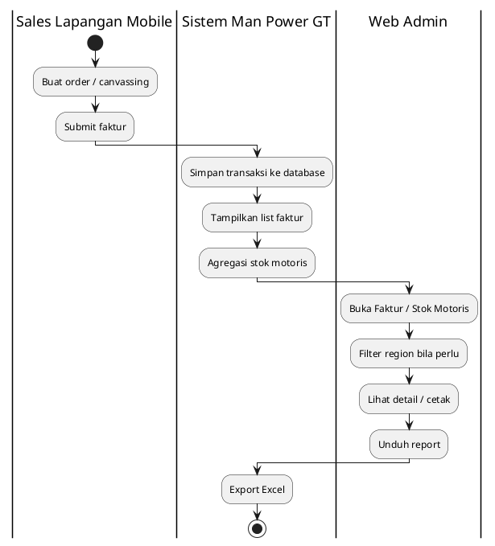
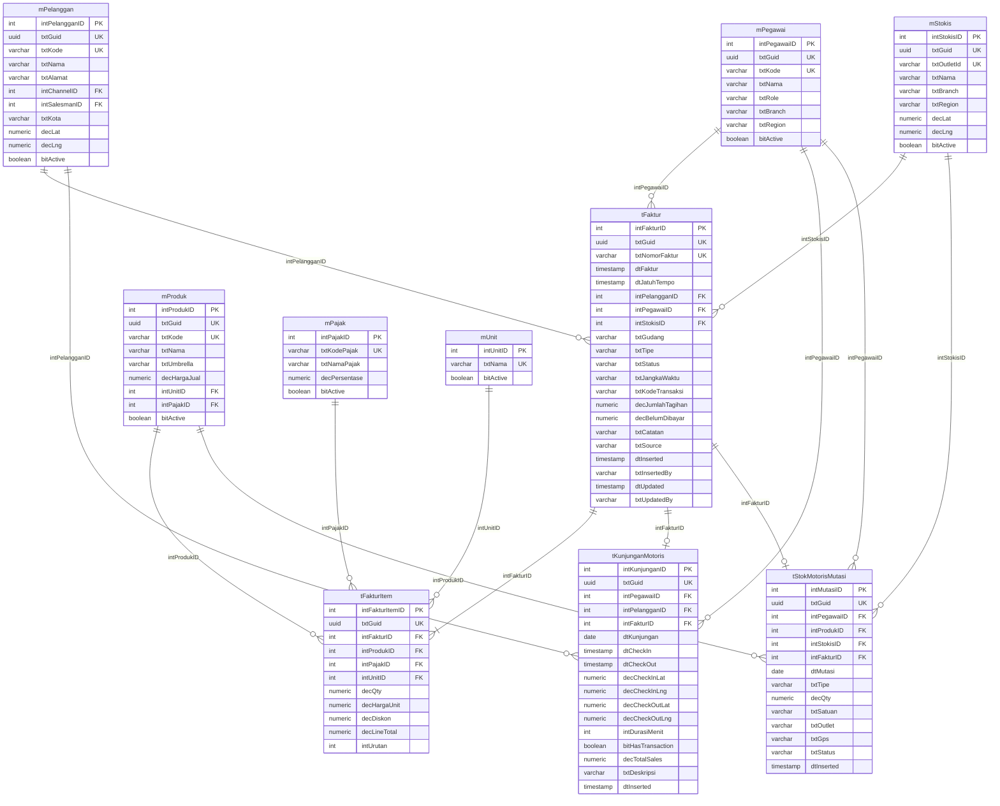

# FUNCTIONAL SPECIFICATION DOCUMENT (FSD)
## Modul: Man Power GT — Penjualan (Web Admin)
### Sistem: Man Power GT
### Versi Dokumen: 1.4

---

| Atribut | Keterangan |
|---------|------------|
| **Nama Dokumen** | FSD Modul Penjualan — Web Admin Man Power GT |
| **Versi** | 1.4 |
| **Tanggal** | 4 Agustus 2026 |
| **Divisi** | IT / Business – Man Power GT |
| **Status** | Draft |
| **Dibuat oleh** | Tim IT – Man Power GT |

---

## Riwayat Revisi

| Versi | Tanggal | Diubah Oleh | Keterangan |
|-------|---------|-------------|------------|
| 1.0 | 17 Juli 2026 | Tim IT | Initial draft – Faktur + Stok Motoris; RBAC; spesifikasi kolom report Excel |
| 1.1 | 17 Juli 2026 | Tim IT | Tambah bab **Skalabilitas & Tuning** (Fase A): agregasi SQL, batas filter/export, seed UAT 6 bulan Cash/Lunas, script `008`–`010` |
| 1.2 | 21 Juli 2026 | Tim IT | Rename sistem ke **Man Power GT**; tambah business rule Filter & Pop-up dashboard **(+screenshot & narasi)**; hapus cuplikan SQL; wording **Produksi → Database** |
| 1.3 | 4 Agustus 2026 | Tim IT | Screenshot ulang Faktur + Stok Motoris (dashboard, filter, popup, tombol aksi) |
| **1.4** | **4 Agustus 2026** | **Tim IT** | Swimlane Bab 2 diganti ke **PlantUML** kolom role (standar FSD Engine) |

---

## Persetujuan Dokumen (Document Approval)

| Full Name | Job Title | Signature | Signature Date |
|-----------|-----------|-----------|----------------|
| Muhammad Rafi | SHP Channel & Customer Development |  |  |
| Silvester Mario Nian Destrada | SHP Channel & Customer Development |  |  |
| Aldira Rahmania | SHP Channel & Customer Development |  |  |
| Ageng Kurniawan Sugianto | IT Product |  |  |
| Albet | IT Product |  |  |

---

## 1. Pendahuluan

### 1.1 Latar Belakang

**Man Power GT** (*Man Power General Trade*) adalah sistem internal PT Kalbe
Nutritionals untuk mengelola tenaga lapangan General Trade (motoris / canvasser),
administrasi data master terkait, monitoring penjualan lapangan, dan pelacakan
kunjungan sales. Dokumen ini memfokuskan lingkup pada **modul Penjualan** Web Admin
— monitoring faktur dari Mobile SFA dan dashboard stok motoris.

Prototipe Web Portal berupa *high-fidelity interactive prototype* berbasis HTML
statis (MPA) bertema Vuexy/Bootstrap yang menggunakan **localStorage** dan file
JSON seed di `wwwroot/data/` sebagai lapisan persistensi sisi klien. Implementasi
database berada di **MAVEN** (ASP.NET Core + PostgreSQL) dengan route
`/Transaction/SalesOrder` dan `/Dashboard/MotorisStock`.

### 1.2 Tujuan Dokumen

1. Mendeskripsikan fungsionalitas **per halaman dan per komponen UI** modul Penjualan.
2. Menjadi acuan pengembangan backend/API dan UAT untuk monitoring penjualan Man Power GT.
3. Mendokumentasikan business rules, pola akses (RBAC + scope region), dan **spesifikasi kolom report Excel**.
4. Menyelaraskan format dokumentasi dengan standar **FSD Generator Engine** (Kalbe Nutritionals).
5. Mendokumentasikan **strategi skalabilitas & tuning dashboard Stok Motoris (Fase A)** termasuk seed data UAT dan index SQL.

### 1.3 Ruang Lingkup

| Dalam lingkup | Di luar lingkup |
|---------------|-----------------|
| Faktur Penjualan (list, detail, print) | Modul Canvassing (belum ada UI aktif) |
| Monitoring Stok Motoris (dashboard + export Excel) | Create/Edit/Hapus faktur di Web Admin |
| Persistensi prototipe (`fprs_faktur`, `md_stok_motoris`) + seed MAVEN | Mobile SFA (sumber order — disebut sebagai integrasi) |
| RBAC Super Admin / Sales Manager / RSM | Approval multi-level transaksi |
| Spesifikasi kolom report Excel/CSV | Modul Master Data & Kunjungan (dokumen terpisah) |
| Tuning Fase A (agregasi SQL, index, seed 6 bulan) | Tuning Fase B (tabel agregat harian / partition — roadmap) |

### 1.4 Stakeholder

| Peran | Tim/Divisi | Keterlibatan |
|-------|------------|--------------|
| Super Admin | IT | Akses seluruh menu & data nasional |
| Sales Manager | Sales | Monitoring nasional + filter regional |
| RSM | Sales regional | Monitoring region sendiri |
| Finance | Finance | Monitoring faktur / tagihan (read) |
| Developer | IT | Implementasi API & UI database (MAVEN) |

---

## 2. Arsitektur & Alur Penjualan

### 2.1 Ringkasan Teknis

| Aspek | Prototipe | Database (MAVEN) |
|-------|-----------|------------------|
| Arsitektur | Static MPA — satu `.html` per halaman | ASP.NET Core MVC + service layer |
| UI Framework | Bootstrap 5.3, Vuexy Admin Theme | Vuexy + Razor Views |
| JavaScript | jQuery, DataTables, Select2, SweetAlert2, Chart.js, Leaflet, SheetJS | Sama / setara (Chart.js 2.9 lokal) |
| Persistensi | `fprs_faktur`, `md_stok_motoris` + seed JSON | PostgreSQL: `tPenjualanFaktur`, `tKunjunganHarian`, `tStokMotorisSaldo`, `tStokMotorisMutasi` |
| Auth / Menu | Tidak ada login | KNGlobal SSO + `mMenu` / `mRoleAccess` (`TSO`, `DMS`) |
| Navigasi | `wwwroot/js/layout.js` | Menu dinamis dari KNGlobal |
| Folder kode | `Views/FPRS/Penjualan/` | `Controllers/PowerGT/...`, `Views/PowerGT/...` |

### 2.2 Pola Modul Penjualan

| Pola | Modul | Cara kelola |
|------|-------|-------------|
| View-only + cetak | Faktur / Sales Order | List → detail → print; order dari Mobile |
| Dashboard monitoring + export | Stok Motoris | KPI + chart + saldo + audit; Export Excel 2 sheet |

### 2.3 Business Flow (Swimlane)

Alur konseptual database: order dari Mobile → faktur terbaca di Web; stok motoris diagregasi untuk monitoring.

**Lane (urutan kiri → kanan):**

| # | Lane ID | Label | Tipe | Sumber |
|---|---------|-------|------|--------|
| 1 | L1 | Sales Lapangan (Mobile) | User | Mobile SFA canvassing |
| 2 | L2 | Sistem Man Power GT | System | Transaksi Sales Order / stok |
| 3 | L3 | Web Admin | User | Sales Manager / RSM |

Hand-off Mobile → Sistem: submit faktur menulis transaksi ke database. Hand-off Web Admin → Sistem: monitoring list/agregasi dan export Excel.

**Gambar 2.1 — Business Flow Penjualan (Web Admin)**

---

## 3. Modul Penjualan

Bab ini mendeskripsikan modul **Faktur** dan **Stok Motoris**: dashboard list / monitoring, halaman detail (jika ada), tombol aksi, business rules, pola CRUD/akses, dan **spesifikasi kolom report**.

### 3.1 Faktur

Modul **Faktur** merupakan bagian dari Web Portal **Man Power GT**. Tipe UI: **page**. Sumber prototipe: `Views/FPRS/Penjualan/Faktur/index.html`; database: `/Transaction/SalesOrder`.

Halaman dashboard list menampilkan **KPI cards** (Total, Paid, Unpaid/nilai) dan DataTable `#tblFaktur` dengan filter tanggal, pelanggan, sales, dan status. Data faktur bersumber dari aktivitas **Mobile SFA** (`localStorage` key `fprs_faktur`, seed `faktur.json`). Web Admin bersifat **view-only**: aksi baris adalah **lihat detail** dan **cetak**; tidak ada Tambah/Edit/Hapus di web. Halaman `detail.html` menampilkan header pelanggan, item line, ringkasan pembayaran, dan tombol Cetak menuju `print.html`.

| Aspek | Keterangan |
|-------|------------|
| **Tujuan Form** | Memantau dan mencetak faktur penjualan yang dihasilkan dari order Mobile SFA. Web Admin bersifat view-only (list, detail, print); tidak membuat/mengubah faktur di portal. |
| **Pengguna** | Super Admin, Sales Manager, RSM (lihat sesuai cakupan region); Finance (monitoring). |

> **Integrasi API (rencana):** `/api/v1/Invoice`

> **localStorage key:** `fprs_faktur`

#### 3.1.1 Kolom DataTable Dashboard List

| Kolom | Field Key | Render | Sortable | Keterangan |
|-------|-----------|--------|----------|------------|
| NO | `No` | Text | Ya | Kolom grid dashboard list |
| TANGGAL FAKTUR | `TanggalFaktur` | Text | Ya | Kolom grid dashboard list |
| NOMOR FAKTUR | `NomorFaktur` | Text | Ya | Kolom grid dashboard list |
| PELANGGAN | `Pelanggan` | Text | Ya | Kolom grid dashboard list |
| SALES | `Sales` | Text | Ya | Kolom grid dashboard list |
| JATUH TEMPO | `JatuhTempo` | Text | Ya | Kolom grid dashboard list |
| JUMLAH TAGIHAN | `JumlahTagihan` | Text | Ya | Kolom grid dashboard list |
| BELUM DIBAYAR | `BelumDibayar` | Text | Ya | Kolom grid dashboard list |
| STATUS | `Status` | Text | Ya | Kolom grid dashboard list |

#### 3.1.2 Tombol Aksi — Dashboard List

| Tampilan | Tombol | ID / Handler | Warna/Style | Fungsi |
|----------|--------|--------------|-------------|--------|
|  | Ekspor | `#btnEkspor` | btn-outline-secondary | Mengekspor daftar faktur (prototipe: mock Swal; database: Excel header-level mengikuti filter). |
|  | Lihat Detail | `a.btn-action-view` → `detail.html?id=…` | btn-action (ikon mata) | Membuka halaman detail faktur terpilih. |
|  | Cetak Faktur (list) | `cetakFaktur(id)` | btn-action (ikon printer) | Mencetak faktur dari baris DataTable. |
|  | Cetak Faktur (detail) | `#btnCetak` | btn-cetak-faktur | Mencetak faktur dari halaman detail (`print.html`). |
|  | Reset | `#btnResetFilter` | btn-reset-filter | Mengembalikan seluruh filter list faktur ke kondisi awal. |

#### 3.1.3 CRUD

| Operasi | Cara | Role | Keterangan |
|---------|------|------|------------|
| **Read** | dashboard list + `detail.html` + `print.html` | Super Admin, Sales Manager, RSM | View-only; cakupan region sesuai RBAC |
| **Export** | Tombol Ekspor (rencana Excel) | Super Admin, Sales Manager, RSM | Prototipe: mock Swal; database: file Excel header-level |

#### Report / Ekspor Faktur

Tombol **Ekspor** pada dashboard list. Di prototipe masih **mock** (konfirmasi Swal tanpa file).
Target database: Excel `.xlsx`, **1 baris = 1 faktur** (header-level), mengikuti filter list + scope RBAC region.

> **Sumber database:** query atas `tFaktur` dengan join `mPelanggan`, `mPegawai` (dan opsional `mStokis` untuk gudang).
> **Prototipe saat ini:** field denormalized di `fprs_faktur` / `faktur.json` (belum persist ke MAVEN).

| # | Nama kolom (rencana) | Keterangan | Tabel sumber | Kolom database |
|---|----------------------|------------|--------------|----------------|
| 1 | Tanggal Faktur | Tanggal dokumen | `tFaktur` | `dtFaktur` |
| 2 | Nomor Faktur | ID / nomor faktur | `tFaktur` | `txtNomorFaktur` |
| 3 | Kode Pelanggan | Kode outlet | `mPelanggan` | `txtKode` (FK `tFaktur.intPelangganID`) |
| 4 | Nama Pelanggan | Nama outlet | `mPelanggan` | `txtNama` |
| 5 | Sales | Nama / kode sales / motoris | `mPegawai` | `txtNama` atau `txtKode` (FK `tFaktur.intPegawaiID`) |
| 6 | Jatuh Tempo | Tanggal jatuh tempo | `tFaktur` | `dtJatuhTempo` |
| 7 | Jumlah Tagihan | Total tagihan | `tFaktur` | `decJumlahTagihan` |
| 8 | Belum Dibayar | Sisa piutang | `tFaktur` | `decBelumDibayar` |
| 9 | Status | Paid / Unpaid / Draft / dll. | `tFaktur` | `txtStatus` |

Kolom opsional (belum di sheet v1, tersedia di DB): `tFaktur.txtGudang`, `tFaktur.txtTipe`, `tFaktur.txtJangkaWaktu`, `tFaktur.txtCatatan`.

### 3.2 Stok Motoris

Modul **Stok Motoris** merupakan bagian dari Web Portal **Man Power GT**. Tipe UI: **page**. Sumber prototipe: `Views/FPRS/Penjualan/StokMotoris/index.html`; database: `/Dashboard/MotorisStock`.

Halaman **Monitoring Stok Motoris** adalah dashboard agregat (bukan CRUD): KPI cards, flow stok, Chart.js, peta Leaflet, grid saldo, dan audit trail. Snapshot disimpan di `md_stok_motoris` dan dibangun dari master (`md_pegawai`, `md_produk`, `md_stokis`, `md_pelanggan`) plus faktur `fprs_faktur`. Tombol **Export Excel** menghasilkan file dua sheet (`SalesInvoices`, `DailyVisits`); **Refresh** memuat ulang data master dan meregenerasi dashboard.

| Aspek | Keterangan |
|-------|------------|
| **Tujuan Form** | Memantau stok & aktivitas motoris (KPI, saldo, kunjungan, audit) serta mengekspor report Excel SalesInvoices / DailyVisits untuk analisis operasional. |
| **Pengguna** | Super Admin, Sales Manager, RSM (lihat sesuai cakupan region); Admin Operations. |

> **localStorage key:** `md_stok_motoris`

#### 3.2.1 Filter Dashboard

Panel filter di atas KPI/chart membatasi seluruh komponen dashboard (KPI, chart, grid saldo, audit trail, export). Perubahan nilai filter langsung memuat ulang data (tanpa tombol "Terapkan" terpisah).

**Narasi UI:** Baris atas berisi dropdown **Region**, **Area**, **Motoris**, **Umbrand**, serta rentang tanggal **Dari / S/D**. Setelah user memilih nilai (contoh: Region 1 + Umbrand BENECOL), baris kedua menampilkan **Filter Aktif** sebagai chip yang bisa dihapus satu per satu, plus tombol **Reset Semua** untuk mengembalikan seluruh filter ke default.

| Filter | Control ID | Default | Business Rule |
|--------|------------|---------|---------------|
| Region | `#filterRegion` | Kosong = Seluruh Indonesia (Nasional) | Cascading: mengubah Region mengosongkan/memfilter opsi Area & Motoris yang relevan. Scope RBAC: RSM hanya melihat region sendiri. |
| Area | `#filterArea` | Kosong = Semua Area | Cascading dari Region; mengubah Area memfilter daftar Motoris. |
| Motoris | `#filterSales` | Kosong = Semua Motoris | Opsi diisi dari master pegawai role Motoris yang cocok dengan Region/Area aktif. |
| Umbrand | `#filterBrand` | Kosong = Semua Umbrand | Memfilter KPI/chart/saldo berdasarkan umbrella brand produk. Juga bisa di-toggle dari chart kontribusi brand. |
| Tanggal Mulai | `#filterDateStart` | **Hari ini − 29 hari** (30 hari kalender) | Wajib untuk query agregasi. Server menerapkan fallback 30 hari terakhir bila kosong. |
| Tanggal Akhir | `#filterDateEnd` | **Hari ini** | Harus ≥ Tanggal Mulai. |
| Reset Filter | `#btnResetFilter` / `resetAllFilters()` | — | Mengembalikan Region/Area/Motoris/Umbrand ke kosong dan tanggal ke default 30 hari terakhir, lalu reload. |

**Chip filter aktif:** sistem menampilkan chip ringkas untuk setiap filter non-kosong; klik ikon ✕ pada chip menghapus filter terkait saja.

**Aturan filter terkait export:**

| Rule | Keterangan |
|------|------------|
| BR-SM-F01 | Export Excel memakai **parameter filter yang sama** dengan dashboard (Region, Area, Motoris, Umbrand, rentang tanggal). |
| BR-SM-F02 | Rentang tanggal export maksimal **31 hari** kalender; lebih lebar → ditolak (HTTP 400 + pesan jelas). |
| BR-SM-F03 | Filter berlaku ke seluruh KPI, chart, DataTable saldo, dan audit trail — tidak ada komponen yang bypass filter. |

#### 3.2.2 Kolom DataTable Dashboard List

| Kolom | Field Key | Render | Sortable | Keterangan |
|-------|-----------|--------|----------|------------|
| Motoris | `Motoris` | Text | Ya | Kolom grid dashboard list |
| Wilayah | `Wilayah` | Text | Ya | Kolom grid dashboard list |
| Nilai Kulakan | `NilaiKulakan` | Text | Ya | Kolom grid dashboard list |
| Nilai Penjualan | `NilaiPenjualan` | Text | Ya | Kolom grid dashboard list |
| Nilai Saldo | `NilaiSaldo` | Text | Ya | Kolom grid dashboard list |

#### 3.2.3 Tombol Aksi — Dashboard List

| Tampilan | Tombol | ID / Handler | Warna/Style | Fungsi |
|----------|--------|--------------|-------------|--------|
|  | Export Excel | `exportToExcel()` / `#btnEkspor` | btn-outline-secondary | Unduh Excel 2 sheet (`SalesInvoices` + `DailyVisits`) mengikuti filter aktif. |
|  | Refresh | `refreshDashboard()` / `#btnRefresh` | btn-success | Muat ulang seluruh data dashboard sesuai filter; tampilkan Swal sukses singkat. |
|  | Reset Semua | `resetAllFilters()` | filter-reset-btn | Reset filter ke default (lihat §3.2.1). |
|  | Cetak PDF | `printAuditPopup()` | btn (di header pop-up audit) | Cetak isi pop-up **ID Transaksi & Pergerakan Stok** (hanya aktif saat pop-up audit terbuka). |

#### 3.2.4 Pop-up Dashboard

Dashboard memiliki dua pop-up utama (SweetAlert2) untuk drill-down operasional: **detail motoris** (termasuk sebaran outlet) dan **audit transaksi** (ID & pergerakan stok).

##### A. Pop-up Detail Motoris — *Sebaran Outlet Dikunjungi*

**Pemicu:** klik nama motoris pada grid saldo (handler `showMotorisDetail`).

**Endpoint database:** `GET /Dashboard/MotorisStock/GetMotorisDetail`

**Narasi UI:** Pop-up menampilkan profil motoris (nama, kode, area, region) di header hijau. Di kiri, tabel **Stok per SKU** menampilkan nilai saldo berjalan per produk plus baris TOTAL. Di kanan atas, mini chart **Penjualan 7 Hari Terakhir** (line Chart.js) dan kartu **Info Kulakan Terakhir** (tanggal, stokis, nilai, status GPS Valid/Invalid). Bagian bawah **Sebaran Outlet Dikunjungi** menampilkan peta Leaflet dengan marker bernomor untuk outlet yang dikunjungi pada periode terkait; caption di bawah peta menuliskan jumlah outlet (contoh: *10 outlet dalam 30 hari terakhir*). Scroll ke bawah pada pop-up (jika ada) menampilkan **History Penjualan Terakhir** hingga 10 transaksi.

**Isi pop-up:**

| Bagian | Keterangan |
|--------|------------|
| Header | Nama motoris, kode, area, region |
| Stok per SKU | Tabel produk + nilai Rp (saldo berjalan) + baris TOTAL |
| Penjualan 7 Hari Terakhir | Mini chart line Chart.js (Rp per hari) |
| Info Kulakan Terakhir | Tanggal, nama stokis, nilai Rp, status GPS Valid/Invalid |
| **Sebaran Outlet Dikunjungi** | Peta Leaflet: marker bernomor outlet dikunjungi; circle marker oranye untuk stokis kulakan terakhir; tooltip outlet; klik nama outlet di history mem-focus marker (`focusMotorisMapMarker`) |
| History Penjualan Terakhir | Tabel hingga **10 transaksi** terakhir: #, Tanggal, Outlet, Produk, Nilai (Rp) |

**Business rule pop-up:**

| Rule ID | Aturan |
|---------|--------|
| BR-SM-P01 | Data detail mengikuti filter dashboard yang aktif (region/area/umbrand/tanggal). |
| BR-SM-P02 | Marker peta hanya digambar jika outlet punya koordinat `lat`/`lng`; outlet tanpa GPS tetap tampil di tabel tanpa link peta. |
| BR-SM-P03 | Pop-up **read-only** — tidak ada aksi ubah data; tutup via tombol close (✕). |

##### B. Pop-up Audit — *ID Transaksi & Pergerakan Stok*

**Pemicu:** klik ikon mata / aksi detail pada DataTable **Audit Trail** (handler `showAuditDetail`).

**Endpoint database:** `GET /Dashboard/MotorisStock/GetAuditDetail?id=…`

**Judul header:** **ID Transaksi & Pergerakan Stok** + nomor transaksi (`txId`, contoh `TX-OUT-260628-053`) + tombol **Cetak PDF**.

**Narasi UI:** Header menampilkan ID transaksi dan tombol **Cetak PDF**. Stepper tiga langkah (**Input Motoris → Validasi GPS → HO Synced**) menandai progres validasi. Panel kiri **Profil Sales & Informasi Lokasi** merinci motoris, wilayah, jenis transaksi (badge Kulakan Inbound / Penjualan Outbound), partner tujuan, dan waktu unggah. Panel kanan **Pemantauan Jarak & Akurasi GPS** menampilkan badge GPS Match/Deviation, jarak ke target, mock-map, dan koordinat. Di bawahnya, **Stock Ledger** menampilkan mutasi fisik (Sebelum / Mutasi / Sesudah) per SKU; panel **Dokumen Pendukung** menampilkan nota (jika ada) atau placeholder *Tidak Ada Bukti* untuk outbound warung. Tombol **Tutup** menutup pop-up.

**Isi pop-up:**

| Bagian | Keterangan |
|--------|------------|
| Stepper status | 3 langkah: **Input Motoris** → **Validasi GPS** → **HO Synced** (aktif/warning sesuai hasil GPS & status verified) |
| Profil Sales & Lokasi | Motoris (kode), wilayah kerja (region–area), jenis transaksi (Kulakan Inbound / Penjualan Outbound), partner tujuan (outlet/stokis), waktu unggah |
| Pemantauan Jarak & GPS | Badge GPS Match / GPS Deviation, ringkasan jarak vs toleransi, mock-map pin motoris vs target outlet, koordinat |
| Stock Ledger | Tabel mutasi fisik: Nama SKU, Sebelum, Mutasi (+/−), Sesudah |
| Dokumen Pendukung | Kartu nota belanja (jika ada) atau placeholder “Tidak Ada Bukti” (umum untuk outbound warung) |

**Business rule pop-up:**

| Rule ID | Aturan |
|---------|--------|
| BR-SM-P04 | Satu pop-up = satu mutasi (`tStokMotorisMutasi`); raw detail di-paging di grid, detail penuh hanya saat dibuka. |
| BR-SM-P05 | Tipe **inbound** = Kulakan (stok masuk dari stokis); **outbound** = Penjualan (stok keluar ke outlet). |
| BR-SM-P06 | GPS Valid / Match jika jarak check-in dalam toleransi sistem; Deviation menandai potensi mismatch lokasi. |
| BR-SM-P07 | **Cetak PDF** (`printAuditPopup`) mencetak konten pop-up yang sedang terbuka ke jendela print browser; tidak menyimpan file di server. |

#### 3.2.5 CRUD

| Operasi | Cara | Role | Keterangan |
|---------|------|------|------------|
| **Read** | Buka dashboard monitoring | Super Admin, Sales Manager, RSM | Dashboard/monitoring read-only |
| **Export** | Export Excel → `SalesInvoices` + `DailyVisits` | Super Admin, Sales Manager, RSM | Filter UI + scope region berlaku |

#### Report Excel — Stok Motoris

Tombol **Export Excel** memanggil `exportToExcel()` (SheetJS / endpoint MAVEN). File: `StokMotoris_Export_YYYY-MM-DD.xlsx`.
Baris mengikuti filter dashboard + motoris terfilter (scope region RBAC berlaku di database).

> **Sumber database:** join `tFaktur` + `tFakturItem` + master (`mPelanggan`, `mPegawai`, `mProduk`, `mPajak`, `mUnit`, `mStokis`) untuk sheet **SalesInvoices**;
> sheet **DailyVisits** dari `tKunjunganMotoris` + `mPegawai` + `mPelanggan`.
> **Prototipe:** `buildSalesInvoiceExportRows` / `buildDailyVisitExportRows` di `StokMotoris/index.html` membaca `fprs_faktur`, `md_pelanggan`, snapshot `md_stok_motoris.visitHistory`.

##### Sheet `SalesInvoices` (29 kolom — 1 baris per item faktur)

| # | Kolom | Keterangan | Tabel sumber | Kolom database |
|---|-------|------------|--------------|----------------|
| 1 | Date | Tanggal faktur (`YYYY-MM-DD`) | `tFaktur` | `dtFaktur` (date) |
| 2 | SalesInvoiceNo | Nomor / ID faktur | `tFaktur` | `txtNomorFaktur` |
| 3 | InvoiceStatus | Status faktur | `tFaktur` | `txtStatus` |
| 4 | InvoiceDocType | Tipe dokumen export | — | Konstanta `MobileCanvass` (belum kolom DB v1) |
| 5 | InvoiceGenerateFrom | Asal generate | `tFaktur` | `txtTipe` (mis. Canvass → Canvassing) |
| 6 | IsInvoiceReturn | Flag retur | — | Konstanta `false` (belum kolom DB v1) |
| 7 | EmployeeCode | Kode motoris / sales | `mPegawai` | `txtKode` (FK `tFaktur.intPegawaiID`) |
| 8 | EmployeeName | Nama motoris / sales | `mPegawai` | `txtNama` |
| 9 | CustomerCode | Kode pelanggan | `mPelanggan` | `txtKode` (FK `tFaktur.intPelangganID`) |
| 10 | CustomerName | Nama pelanggan | `mPelanggan` | `txtNama` |
| 11 | CustomerAddress | Alamat pelanggan | `mPelanggan` | `txtAlamat` |
| 12 | OrderLatitude | Latitude outlet | `mPelanggan` | `decLat` |
| 13 | OrderLongitude | Longitude outlet | `mPelanggan` | `decLng` |
| 14 | WarehouseCode | Kode gudang | `tFaktur` / `mStokis` | Derivasi dari `txtGudang` atau `mStokis.txtOutletId` |
| 15 | WarehouseName | Nama gudang | `tFaktur` / `mStokis` | `txtGudang` atau `mStokis.txtNama` |
| 16 | PaymentTermName | Jangka waktu pembayaran | `tFaktur` | `txtJangkaWaktu` |
| 17 | ProductCode | Kode produk (line) | `mProduk` | `txtKode` (FK `tFakturItem.intProdukID`) |
| 18 | ProductName | Nama produk | `mProduk` | `txtNama` |
| 19 | QuantityL | Qty unit besar (Karton) | — | Kosong v1 (konversi UOM belum di DB) |
| 20 | UnitL | Satuan L | — | Konstanta `KARTON` |
| 21 | QuantityM | Qty unit menengah | — | Kosong v1 |
| 22 | UnitM | Satuan M | — | Konstanta `RENCENG` |
| 23 | QuantityS | Qty unit kecil (PCS) | `tFakturItem` | `decQty` |
| 24 | UnitS | Satuan S | `mUnit` | `txtNama` (FK `tFakturItem.intUnitID`; fallback PCS) |
| 25 | TotalQuantity | Total qty | `tFakturItem` | `decQty` (prototipe = QuantityS) |
| 26 | SellPrice | Harga jual per unit | `tFakturItem` | `decHargaUnit` |
| 27 | TaxCode | Kode pajak line | `mPajak` | `txtKodePajak` (FK `tFakturItem.intPajakID`) |
| 28 | LineTotal | Nilai baris | `tFakturItem` | `decLineTotal` (atau hitung `decQty × decHargaUnit − decDiskon`) |
| 29 | InvoiceNotes | Catatan header faktur | `tFaktur` | `txtCatatan` |

##### Sheet `DailyVisits` (28 kolom — 1 baris per kunjungan)

| # | Kolom | Keterangan | Tabel sumber | Kolom database |
|---|-------|------------|--------------|----------------|
| 1 | EmployeeCode | Kode motoris | `mPegawai` | `txtKode` (FK `tKunjunganMotoris.intPegawaiID`) |
| 2 | EmployeeName | Nama motoris | `mPegawai` | `txtNama` |
| 3 | Role | Peran lapangan | `mPegawai` | `txtRole` (prototipe: hardcode `Canvasser`) |
| 4 | Date | Tanggal kunjungan | `tKunjunganMotoris` | `dtKunjungan` |
| 5 | Planned | Kunjungan terencana | — | Kosong v1 (belum kolom planned) |
| 6 | UnPlaned | Kunjungan tidak terencana | — | Derivasi export (prototipe: `1`) |
| 7 | Visited | Sudah dikunjungi | `tKunjunganMotoris` | Ada baris kunjungan (prototipe: `1`) |
| 8 | CustomerCode | Kode outlet | `mPelanggan` | `txtKode` (FK `tKunjunganMotoris.intPelangganID`) |
| 9 | CustomerName | Nama outlet | `mPelanggan` | `txtNama` |
| 10 | CustomerAddress | Alamat outlet | `mPelanggan` | `txtAlamat` |
| 11 | CustomerLatitude | Lat master outlet | `mPelanggan` | `decLat` |
| 12 | CustomerLongitude | Lng master outlet | `mPelanggan` | `decLng` |
| 13 | CheckInTime | Waktu check-in (ISO) | `tKunjunganMotoris` | `dtCheckIn` |
| 14 | CheckOutTime | Waktu check-out (ISO) | `tKunjunganMotoris` | `dtCheckOut` |
| 15 | Duration | Durasi `HH:MM:SS` | `tKunjunganMotoris` | Hitung dari `dtCheckIn`–`dtCheckOut` atau `intDurasiMenit` |
| 16 | Distance in Meter Check in | Jarak GPS check-in ke outlet (m) | `tKunjunganMotoris` + `mPelanggan` | Hitung Haversine(`decCheckInLat/Lng`, `mPelanggan.decLat/decLng`) |
| 17 | CheckInLatitude | Lat check-in | `tKunjunganMotoris` | `decCheckInLat` |
| 18 | CheckInLongitude | Lng check-in | `tKunjunganMotoris` | `decCheckInLng` |
| 19 | CheckOutLatitude | Lat check-out | `tKunjunganMotoris` | `decCheckOutLat` |
| 20 | CheckOutLongitude | Lng check-out | `tKunjunganMotoris` | `decCheckOutLng` |
| 21 | Distance in Meter Check out | Jarak GPS check-out ke outlet (m) | `tKunjunganMotoris` + `mPelanggan` | Hitung Haversine(`decCheckOutLat/Lng`, `mPelanggan.decLat/decLng`) |
| 22 | Pseq | Urutan planned | — | Kosong v1 |
| 23 | Aseq | Urutan aktual kunjungan | `tKunjunganMotoris` | Urutan baris / `intKunjunganID` (belum kolom `intUrutan` v1) |
| 24 | TotalSales | Nilai penjualan kunjungan | `tKunjunganMotoris` | `decTotalSales` (atau agregat `tFaktur` via `intFakturID`) |
| 25 | Description | Ringkasan aktivitas | `tKunjunganMotoris` | `txtDeskripsi` |
| 26 | Unvisited | Flag tidak dikunjungi | — | Derivasi export (prototipe: `0` jika ada kunjungan) |
| 27 | TargetCall | Target call | — | KPI / konfig (prototipe: `1`) |
| 28 | EffCall | Effective call (ada transaksi) | `tKunjunganMotoris` | `bitHasTransaction` → `1` / `0` |

## 4. Aturan Bisnis (Rekap)

### 4.1 Aturan dari Validasi UI Prototipe

Rule ID memakai prefix `BR-PJ`. Sumber: pesan validasi / SweetAlert di HTML.

| Rule ID | Aturan |
|---------|--------|
| — | *(Tidak ada validasi UI eksplisit yang terdeteksi)* |

### 4.2 Aturan Database (di luar / pelengkap prototipe)

| Rule ID | Modul | Aturan |
|---------|-------|--------|
| BR-PR-PJ01 | Semua | Akses halaman membutuhkan `bitView` pada `mRoleAccess`; tanpa hak → HTTP 403. |
| BR-PR-PJ02 | Semua | **Tidak ada create/update/delete faktur** dari Web Admin v1 — sumber order adalah Mobile SFA. |
| BR-PR-PJ03 | Semua | Super Admin melihat semua region; Sales Manager nasional + filter region; RSM hanya region sendiri. |
| BR-PR-PJ04 | Faktur | Export Excel mengikuti filter list + scope region user. |
| BR-PR-PJ05 | Stok Motoris | Export `SalesInvoices` / `DailyVisits` mengikuti filter dashboard + scope region. |
| BR-PR-PJ06 | Semua | Tidak ada approval workflow untuk monitoring penjualan Web Admin v1. |
| BR-PR-PJ07 | Faktur / Stok Motoris | Skenario GT canvassing Web Admin: faktur yang dimonitor berstatus **Paid (lunas)**, pembayaran **Cash**, `decBelumDibayar = 0`. Tidak merepresentasikan hutang / unpaid / draft. |
| BR-PR-PJ08 | Stok Motoris | Default filter tanggal dashboard = **30 hari terakhir**; server menerapkan fallback yang sama bila rentang kosong. |
| BR-PR-PJ09 | Stok Motoris | Export Excel dibatasi maksimal **31 hari** kalender; rentang lebih lebar ditolak dengan pesan jelas. |
| BR-PR-PJ10 | Stok Motoris | KPI/chart/balance memakai **agregasi SQL** (`SUM`/`COUNT`/`GROUP BY`); raw mutasi hanya untuk audit trail berpaginasi. |
| BR-SM-F01–F03 | Stok Motoris | Aturan filter dashboard — lihat §3.2.1. |
| BR-SM-P01–P07 | Stok Motoris | Aturan pop-up Detail Motoris & Audit — lihat §3.2.4. |

---

## 5. Hak Akses & RBAC

### 5.1 Prototipe vs Database

| Aspek | Prototipe | Database (MAVEN) |
|-------|-----------|------------------|
| Login | Tidak ada | KNGlobal SSO |
| Menu | Hardcoded `layout.js` | `KNGlobalDB.dbo.mMenu` |
| Role Man Power GT | Belum di-enforce (`role-manager.js` legacy) | Super Admin / Sales Manager / RSM |
| Enforcement data | Tidak ada | Filter query by region + `mRoleAccess` |

### 5.2 Matriks Role Target

| Role | Menu Penjualan | Cakupan data (Faktur & Stok Motoris) | Operasi |
|------|----------------|--------------------------------------|---------|
| **Super Admin** | Semua menu portal | Semua region (nasional) | Lihat, cetak, export |
| **Sales Manager** | Faktur, Stok Motoris | Semua region; dapat **filter per region** | Lihat, cetak, export |
| **RSM** | Faktur, Stok Motoris | **Hanya region user** | Lihat, cetak, export |

### 5.3 Approval

Monitoring penjualan Web Admin **tidak** memakai antrian approval. Kontrol = RBAC + scope region + audit trail transaksi di sumber Mobile/backend.

---

## 6. Data Layer & Integrasi

### 6.1 Integrasi API (Rencana Database)

| Item | Nilai |
|------|-------|
| Endpoint Faktur | `/api/v1/Invoice` (rencana) |
| Arah | Inbound ke Web Admin (read / list / detail / export) |
| Sumber order | Mobile SFA / canvassing lapangan |
| Stok Motoris | Service MAVEN `MotorisStockService` membaca tabel saldo/mutasi/kunjungan + agregasi faktur |

### 6.2 Persistensi Prototipe

| Key / file | Penggunaan |
|------------|------------|
| `fprs_faktur` | List/detail/print Faktur; input sheet SalesInvoices |
| `md_stok_motoris` | Snapshot dashboard Stok Motoris + visitHistory |
| `wwwroot/data/faktur.json` | Seed faktur |
| `pegawai.json`, `produk.json`, `stokis.json`, `pelanggan.json` | Master untuk generate dashboard (nama asli motoris) |

### 6.3 Persistensi Database (MAVEN)

| Lapisan | Teknologi / objek |
|---------|-------------------|
| DB transaksi | PostgreSQL: `tPenjualanFaktur`, `tPenjualanFakturItem`, `tKunjunganHarian`, `tStokMotorisSaldo`, `tStokMotorisMutasi` |
| Master | `mPegawai`, `mPelanggan`, `mProduk`, `mStokis`, `mChannel` |
| Menu / RBAC | SQL Server `KNGlobalDB` (`mMenu` kode `TSO` / `DMS`, `mRoleAccess`) |
| Scope region | Hook `ApplyRegionScope` + filter `txtRegion` |

Seed & index UAT skala didokumentasikan di **Bab 8**.

---

## 7. Struktur Data & ERD

Cara baca bab ini:

1. **7.1** — ERD konseptual: master Data Master + transaksi Penjualan / kunjungan / mutasi stok.
2. **7.2** — daftar FK selaras diagram.
3. **7.3** — pemetaan prototipe → kolom database.

> **Status implementasi MAVEN (v1.2):** tabel database memakai nama `tPenjualanFaktur`, `tPenjualanFakturItem`, `tKunjunganHarian`, `tStokMotorisSaldo`, `tStokMotorisMutasi` (DDL di `MAVEN.DAL/Scripts/004_*`, `006_*`).
> Diagram 7.1 tetap memakai nama konseptual FSD (`tFaktur`, …) agar selaras spesifikasi report; mapping nama ada di Bab 6 & Bab 8.
> Seed UAT + index Fase A: script `008`–`010` — lihat **Bab 8 Skalabilitas & Tuning**.
> DDL lengkap tidak dicantumkan di FSD; referensi ke file script di repository MAVEN.

### 7.1 ERD Penjualan (1 halaman)

**Gambar 7.1 — ERD Modul Penjualan**

### 7.2 Daftar Relasi FK

| # | Table Turunan/Child Table | Kolom FK | Tabel Induk | Kardinalitas | Wajib terisi? |
|---|---------------------------|----------|-------------|--------------|---------------|
| 1 | `tFaktur` | `intPelangganID` | `mPelanggan` | many-to-one | Ya |
| 2 | `tFaktur` | `intPegawaiID` | `mPegawai` | many-to-one | Ya (sales / motoris) |
| 3 | `tFaktur` | `intStokisID` | `mStokis` | many-to-one | Opsional (jika gudang = stokis) |
| 4 | `tFakturItem` | `intFakturID` | `tFaktur` | many-to-one | Ya |
| 5 | `tFakturItem` | `intProdukID` | `mProduk` | many-to-one | Ya |
| 6 | `tFakturItem` | `intPajakID` | `mPajak` | many-to-one | Opsional (line tax) |
| 7 | `tFakturItem` | `intUnitID` | `mUnit` | many-to-one | Disarankan (default PCS) |
| 8 | `tKunjunganMotoris` | `intPegawaiID` | `mPegawai` | many-to-one | Ya |
| 9 | `tKunjunganMotoris` | `intPelangganID` | `mPelanggan` | many-to-one | Ya |
| 10 | `tKunjunganMotoris` | `intFakturID` | `tFaktur` | many-to-one | Opsional (kunjungan tanpa transaksi) |
| 11 | `tStokMotorisMutasi` | `intPegawaiID` | `mPegawai` | many-to-one | Ya |
| 12 | `tStokMotorisMutasi` | `intProdukID` | `mProduk` | many-to-one | Ya |
| 13 | `tStokMotorisMutasi` | `intStokisID` | `mStokis` | many-to-one | Opsional (kulakan) |
| 14 | `tStokMotorisMutasi` | `intFakturID` | `tFaktur` | many-to-one | Opsional (mutasi dari penjualan) |

**Catatan agregasi:** dashboard Stok Motoris dan sheet Excel `SalesInvoices` / `DailyVisits` adalah **view / query** atas tabel di atas — bukan tabel fisik terpisah di v1.

### 7.3 Pemetaan Prototipe → Database

| Prototipe (`faktur.json` / UI) | Database |
|--------------------------------|----------|
| `id` (mis. `SI-2606146101`) | `tFaktur.txtNomorFaktur` (+ `intFakturID` PK) |
| `tanggalFaktur` | `tFaktur.dtFaktur` |
| `tanggalJatuhTempo` | `tFaktur.dtJatuhTempo` |
| `pelangganKode` / `pelangganNama` | FK `intPelangganID` → `mPelanggan` |
| `salesNama` | FK `intPegawaiID` → `mPegawai` (match `txtKode` / nama) |
| `gudang` | `txtGudang` dan/atau `intStokisID` → `mStokis` |
| `status` (Paid/Unpaid/Draft/…) | `tFaktur.txtStatus` |
| `tipe` (Canvass) | `tFaktur.txtTipe` |
| `jumlahTagihan` / `belumDibayar` | `decJumlahTagihan` / `decBelumDibayar` |
| `items[].kode` | FK `intProdukID` → `mProduk.txtKode` |
| `items[].qty` / `hargaUnit` / `diskon` | `decQty` / `decHargaUnit` / `decDiskon` |
| `items[].pajak` | FK `intPajakID` atau kode di join `mPajak` |
| `items[].satuan` | FK `intUnitID` → `mUnit` |
| `visitHistory` (Stok Motoris) | `tKunjunganMotoris` |
| Audit stok / kulakan (dashboard) | `tStokMotorisMutasi` (`txtTipe`: Kulakan / Penjualan / Adjust) |
| `md_stok_motoris` snapshot | **Tidak** dipersist sebagai tabel — dihitung dari mutasi + faktur |

**Scope RBAC region:** filter database memakai `mPegawai.txtRegion` dan/atau `mStokis.txtRegion` (Sales Manager filter; RSM hard-filter).

### 7.4 Referensi DDL

DDL lengkap **tidak** dicantumkan di FSD. Lihat file script di repository MAVEN:

| File | Isi |
|------|-----|
| `MAVEN.DAL/Scripts/004_tPenjualanFaktur.sql` | Header & item faktur |
| `MAVEN.DAL/Scripts/006_penjualan_kunjungan_stok_fase2.sql` | Kunjungan harian, saldo & mutasi stok motoris |
| `MAVEN.DAL/Scripts/002_*.sql` / `011_*.sql` | Master terkait (pegawai, stokis, history) |

---

## 8. Skalabilitas & Tuning Dashboard Stok Motoris

Bab ini menjelaskan mengapa dashboard perlu dituning, apa yang sudah diterapkan di **Fase A**,
bagaimana data UAT disiapkan, serta ringkasan script SQL `008`–`010` di repository MAVEN (tanpa cuplikan SQL).

### 8.1 Mengapa perlu tuning?

Dashboard Monitoring Stok Motoris menampilkan KPI, empat chart, dua DataTable, dan export Excel.
Jika setiap request **memuat seluruh baris mutasi ke memori aplikasi** lalu menghitung di C#/JS,
performa akan turun cepat seiring tumbuhnya transaksi lapangan.

| Parameter desain | Estimasi |
|------------------|----------|
| Motoris aktif | ~300 orang |
| Transaksi outbound / motoris / hari | ~30 |
| Volume mutasi nasional / hari | ~9.000 baris |
| Volume / bulan (≈26 hari kerja) | ~230.000 baris |
| Volume / tahun | ~2–3 juta baris |

Dengan beban tersebut, pendekatan “load all lalu agregasi di app” cocok hanya untuk prototipe/UAT kecil.
Di database MAVEN, dashboard harus **membaca hasil agregasi dari database**, membatasi rentang tanggal,
dan memisahkan **audit detail** (paging) dari **KPI/chart** (summary).

### 8.2 Prinsip desain

> **Dashboard = baca agregat. Transaksi detail = baca raw dengan paging ketat.**

| Lapisan | Peran |
|---------|--------|
| `tStokMotorisSaldo` | Snapshot stok berjalan per motoris × SKU (tidak dihitung ulang dari seluruh history setiap buka page) |
| `tStokMotorisMutasi` | Ledger inbound/outbound — sumber audit trail & agregasi outbound per periode |
| `tKunjunganHarian` | Kunjungan + effective call |
| `tPenjualanFaktur` (+ item) | Faktur Paid/Cash untuk KPI jumlah faktur & sheet export |

### 8.3 Kebijakan data bisnis (Cash & Lunas)

Untuk skenario **GT canvassing** yang dimonitor di Web Admin:

| Field | Nilai yang dipakai |
|-------|--------------------|
| `txtStatus` | `Paid` (= lunas) |
| `txtJangkaWaktuPembayaran` | `Cash` |
| `decBelumDibayar` | `0` |

Sistem **tidak** menampilkan skenario hutang, unpaid, atau draft pada seed/monitoring modul ini.
Hal ini menyederhanakan KPI dan menjaga konsistensi UAT dengan aturan operasional lapangan.

### 8.4 Fase A — yang sudah diterapkan di MAVEN

| Kontrol | Spesifikasi |
|---------|-------------|
| Agregasi KPI / chart / balance | Dilakukan di SQL via EF (`SumAsync`, `CountAsync`, `GroupBy`) — bukan `ToList` seluruh mutasi lalu hitung di memory |
| Audit trail | Server-side paging (`Skip` / `Take`) |
| Default filter tanggal | **30 hari terakhir** (UI + fallback server) |
| Export Excel | Maksimal **31 hari**; rentang lebih lebar → HTTP 400 + pesan jelas |
| KPI faktur | Hanya menghitung status `Paid` |
| Index composite | Script `010_dashboard_indexes_faseA.sql` |
| Master UAT | Pegawai & stokis diganti data prototype (nama asli) via `008` |
| Volume UAT | Seed ~6 bulan weekday via `009` |

**Kode utama:** `MAVEN.Services/Penjualan/MotorisStockService.cs`  
**UI:** `Views/PowerGT/Dashboard/MotorisStock/Index.cshtml` + `wwwroot/js/powergt/dashboard/MotorisStock/MotorisStock.js`

### 8.5 Urutan eksekusi script UAT

Jalankan di PostgreSQL database `maven` (DBeaver / pgAdmin), **berurutan**:

| # | File | Tujuan |
|---|------|--------|
| 1 | `MAVEN.DAL/Scripts/008_reset_seed_pegawai_stokis_prototype.sql` | Reset master pegawai/stokis + hapus transaksi lama; inject data prototype |
| 2 | `MAVEN.DAL/Scripts/009_seed_6bulan_cash_lunas.sql` | Generate transaksi 6 bulan (Cash/Paid) + saldo + kunjungan |
| 3 | `MAVEN.DAL/Scripts/010_dashboard_indexes_faseA.sql` | Buat index composite untuk pola query dashboard |

Prasyarat DDL: `004_tPenjualanFaktur.sql`, `006_penjualan_kunjungan_stok_fase2.sql` sudah dijalankan.

### 8.6 Script 008 — Reset & seed master dari prototype

#### Deskripsi

Script ini memastikan environment UAT memakai **data pegawai yang sama dengan prototipe**
(`wwwroot/data/pegawai.json`) — termasuk **nama asli motoris** — serta stokis dari
`stokis.json`. Karena `pegawai.json` tidak selalu mengisi `region`/`branch`, script
mengisi wilayah secara **round-robin** dari pasangan branch–region stokis agar filter
Region/Area di dashboard tetap berfungsi.

#### Apa yang dilakukan (langkah)

1. Melepas FK salesman di `mPelanggan` (`intSalesmanID = NULL`).
2. Menghapus seluruh transaksi terkait: item faktur, faktur, mutasi, saldo, kunjungan.
3. Menghapus histori & master `mPegawai` / `mStokis`.
4. Menyisipkan ulang **84 stokis** dan **163 pegawai** (Motoris + SPG GT) dari prototype.
5. Menampilkan ringkasan `COUNT(*)` untuk verifikasi.

> **Referensi:** isi lengkap ada di `MAVEN.DAL/Scripts/008_reset_seed_pegawai_stokis_prototype.sql` (tidak dicantumkan cuplikan SQL di FSD).

### 8.7 Script 009 — Seed 6 bulan Cash + Lunas

#### Deskripsi

Script procedural (`DO $$ ... $$`) menghasilkan data dummy realistis untuk **stress-test Fase A**:

- Periode: **6 bulan** berakhir pada `CURRENT_DATE`.
- Hanya **hari kerja** (Senin–Jumat).
- Densitas: sekitar **8 outbound / motoris / hari kerja** (+ inbound kulakan tiap Senin + kunjungan non-efektif).
- Semua faktur: `Paid` + `Cash` + `decBelumDibayar = 0`.
- Juga mengisi: `tPenjualanFakturItem`, `tStokMotorisMutasi`, `tKunjunganHarian`, `tStokMotorisSaldo`.
- Memastikan produk umbrella & outlet Cash pendukung tersedia.

Densitas seed (~8 trx/hari) **lebih rendah** dari target operasional lapangan (~30 trx/hari) agar runtime seed tetap wajar,
tetapi volume 6 bulan sudah cukup untuk menguji agregasi SQL, index, dan filter tanggal.

> **Referensi:** `MAVEN.DAL/Scripts/009_seed_6bulan_cash_lunas.sql` (tanpa cuplikan SQL di FSD).

### 8.8 Script 010 — Index composite Fase A

#### Deskripsi

Index mengikuti **pola filter dashboard** yang paling sering dipakai:
tanggal + tipe mutasi, pegawai + tanggal, umbrella, region, kunjungan efektif, dan faktur by pegawai/status.

Semua index memakai `IF NOT EXISTS` sehingga aman dijalankan berulang.

| Index (nama) | Tabel | Pola kolom |
|--------------|-------|------------|
| `tStokMotorisMutasi_tanggal_tipe_idx` | `tStokMotorisMutasi` | `dtTanggal`, `txtTipe` |
| `tStokMotorisMutasi_pegawai_tanggal_tipe_idx` | `tStokMotorisMutasi` | `intPegawaiID`, `dtTanggal`, `txtTipe` |
| `tStokMotorisMutasi_umbrella_tanggal_idx` | `tStokMotorisMutasi` | `txtUmbrella`, `dtTanggal` |
| `tStokMotorisMutasi_region_tanggal_idx` | `tStokMotorisMutasi` | `txtRegion`, `dtTanggal` |
| `tKunjunganHarian_pegawai_tanggal_eff_idx` | `tKunjunganHarian` | `intPegawaiID`, `dtTanggal`, `intEffCall` |
| `tPenjualanFaktur_pegawai_tanggal_idx` | `tPenjualanFaktur` | `intPegawaiID`, `dtTanggalFaktur` |
| `tPenjualanFaktur_status_tanggal_idx` | `tPenjualanFaktur` | `txtStatus`, `dtTanggalFaktur` |
| `tStokMotorisSaldo_pegawai_umbrella_idx` | `tStokMotorisSaldo` | `intPegawaiID`, `txtUmbrella` |
| `mPegawai_role_active_region_idx` | `mPegawai` | `txtRole`, `bitActive`, `txtRegion` |

> **Referensi:** `MAVEN.DAL/Scripts/010_dashboard_indexes_faseA.sql` (tanpa cuplikan SQL di FSD).

### 8.9 Fase B (roadmap — belum diimplementasi)

| Item | Tujuan |
|------|--------|
| Tabel agregat harian (`tStokMotorisAggDaily`) | KPI/chart membaca ringkasan harian, bukan raw mutasi |
| Job malam / trigger | Mengisi agregat dari mutasi & kunjungan |
| Partition bulanan | Menjaga performa tabel hot path |
| Payload JSON terpisah | `txtPayloadJson` audit detail on-demand |

### 8.10 Referensi dokumen terkait

| Dokumen | Path |
|---------|------|
| Page note prototype | `docs/web/pages/penjualan_stok_motoris.md` |
| Scalability note | `docs/web/pages/penjualan_stok_motoris_scalability.md` |
| Design spec | `docs/superpowers/specs/2026-07-17-fsd-penjualan-design.md` §13 |
| Migration MAVEN | `MAVEN/docs/fprs-penjualan-migration.md` |

---
